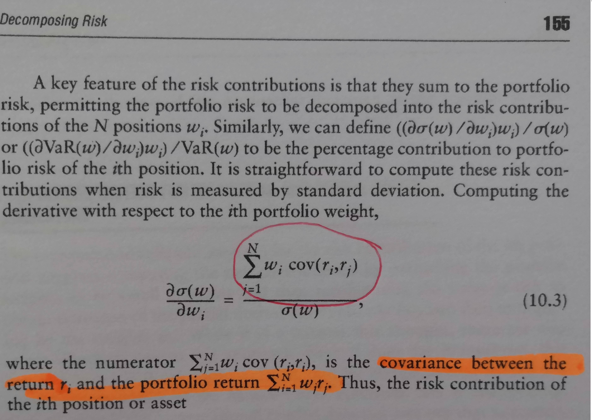

## Table of Contents

## What is covariance and how is it calculated?

Covariance is a measure that shows how two variables change together. If one variable tends to increase when the other increases, they have a positive covariance. If one tends to increase when the other decreases, they have a negative covariance. It helps us understand the relationship between two variables, but it doesn't tell us about the strength of the relationship or how much one variable might predict the other.

To calculate covariance, you start by finding the mean (average) of each variable. Then, for each pair of data points, you subtract the mean of the first variable from its value and the mean of the second variable from its value. You multiply these differences together. After doing this for all pairs, you add up all these products and divide by the number of data points minus one. This gives you the covariance. The formula looks like this: Cov(X,Y) = Σ((X_i - X_mean) * (Y_i - Y_mean)) / (n - 1), where X and Y are the variables, X_i and Y_i are individual data points, X_mean and Y_mean are the means, and n is the number of data points.

## How does covariance relate to the risk of a portfolio?

Covariance is important when we talk about the risk of a portfolio. A portfolio is just a collection of investments like stocks or bonds. When we mix different investments together, how they move together, or their covariance, affects the overall risk of the portfolio. If two investments tend to go up and down together, they have a high positive covariance. This means if one goes down, the other likely will too, which can make the portfolio riskier because both can lose value at the same time.

On the other hand, if two investments move in opposite ways, they have a negative covariance. This can actually help lower the risk of the portfolio. For example, if one investment goes down, the other might go up, which can balance out the losses. By choosing investments with different or negative covariances, investors can create a portfolio that is less risky overall. This is a key part of what's called diversification, where the goal is to spread out the risk so that the whole portfolio isn't as affected by the ups and downs of any single investment.

## Can you explain the difference between covariance and correlation?

Covariance and correlation both tell us about how two variables move together, but they do it in slightly different ways. Covariance measures how much two variables change together. If one goes up and the other goes up too, the covariance is positive. If one goes up and the other goes down, the covariance is negative. The problem with covariance is that its size depends on the scale of the variables, so it's hard to compare the covariance of different pairs of variables directly.

Correlation, on the other hand, is a standardized version of covariance. It's calculated by dividing the covariance by the product of the standard deviations of the two variables. This makes the correlation always fall between -1 and 1, no matter the scale of the variables. A correlation of 1 means the variables move perfectly together in the same direction, -1 means they move perfectly together but in opposite directions, and 0 means there's no linear relationship between them. Because of this, correlation is easier to interpret and compare across different sets of data.

In simple terms, if you want to know how two variables move together but don't care about the scale, you use correlation. If you're okay with dealing with the scale and just want a raw measure of how variables change together, you use covariance. Both are useful, but they give us slightly different pieces of information about the relationship between two variables.

## What role does covariance play in portfolio diversification?

Covariance is super important when it comes to making a diverse portfolio. A diverse portfolio means having different investments that don't all go up and down at the same time. Covariance tells us how two investments move together. If two investments have a high positive covariance, it means they tend to go up or down together. This can make a portfolio riskier because if one investment drops, the other one probably will too. On the other hand, if two investments have a negative covariance, it means when one goes up, the other might go down. This can help reduce the risk of the portfolio because the gains from one can help offset the losses from the other.

By looking at the covariance between different investments, investors can pick ones that don't move in the same way. This helps spread out the risk so that the whole portfolio isn't affected too much by the ups and downs of any single investment. For example, if you have stocks that go up when the economy is doing well and bonds that go up when the economy is doing poorly, these might have a negative covariance. By mixing them in your portfolio, you can create a more stable set of investments. So, understanding covariance helps investors build a portfolio that can handle different market conditions better.

## How can covariance be used to optimize a portfolio's risk-return profile?

Covariance is key when you want to make your portfolio's risk and return better. It helps you understand how different investments move together. If you have two investments that go up and down at the same time, they have a high positive covariance. This means your portfolio could be riskier because if one investment loses value, the other probably will too. But if you can find investments that move in opposite ways, they have a negative covariance. This can help reduce the risk in your portfolio because when one investment goes down, the other might go up, balancing out the losses.

To use covariance to optimize your portfolio, you look at the covariance between all your investments. You try to pick a mix of investments that don't all move in the same way. This means choosing some that might have a positive covariance with each other, but also some that have a negative covariance with others. By doing this, you can lower the overall risk of your portfolio while still aiming for good returns. It's like putting together a puzzle where you want the pieces to fit in a way that makes the whole picture more stable and less likely to fall apart if one piece moves.

## What are the limitations of using covariance in portfolio management?

Covariance is a useful tool for looking at how investments move together, but it has some limits. One big problem is that it doesn't tell you how strong the relationship between two investments is. Just because two investments have a high covariance doesn't mean they always move together in a big way. It's also hard to compare the covariance of different pairs of investments because it depends on the scale of the numbers. This makes it tricky to use covariance to make decisions across different types of investments.

Another limitation is that covariance only looks at how two investments move together at one point in time. It doesn't tell you how that relationship might change in the future. Markets can be unpredictable, and what worked in the past might not work in the future. So, relying too much on past covariance can lead to surprises if the relationships between investments change. It's important to keep checking and updating your understanding of how your investments move together.

## How does covariance affect the efficient frontier in portfolio theory?

Covariance plays a big role in figuring out the efficient frontier in portfolio theory. The efficient frontier is a line that shows all the possible portfolios that give you the best return for the amount of risk you're taking. When you're trying to find this line, you look at how all the different investments in your portfolio move together. Covariance tells you if two investments tend to go up and down at the same time or if they move in opposite ways. By choosing investments that don't all move in the same direction, you can lower the overall risk of your portfolio while still aiming for good returns. This helps you find the portfolios that sit on the efficient frontier, giving you the best balance of risk and return.

But, covariance has its limits when you're using it to find the efficient frontier. It only tells you how investments moved together in the past, not how they might move in the future. This means you need to keep checking and updating your information because the relationships between investments can change over time. Also, covariance doesn't tell you how strong the relationship between two investments is, just that there is a relationship. This can make it hard to compare different pairs of investments and figure out the best mix for your portfolio. So, while covariance is helpful, it's just one part of the puzzle when you're trying to find the efficient frontier.

## Can you discuss the impact of negative covariance on portfolio performance?

Negative covariance is really helpful when you're trying to make your investment portfolio better. It means that when one investment goes down, another one might go up. This can help balance out the ups and downs in your portfolio. For example, if you have stocks that do well when the economy is good and bonds that do well when the economy is bad, these might have a negative covariance. By mixing these kinds of investments, you can make your portfolio less risky because the gains from one can help cover the losses from the other.

But, even though negative covariance can help lower risk, it's not a perfect solution. It's based on how investments moved together in the past, and the future can be different. If the relationships between your investments change, what worked before might not work anymore. Also, negative covariance doesn't tell you how strong the relationship is, just that it exists. So, while it's a good tool to use, you need to keep an eye on how your investments are doing and be ready to make changes if things shift.

## How do changes in market conditions influence the covariance between assets?

Changes in market conditions can really shake up the covariance between assets. Imagine the market as a big party where all the assets are guests. If the music changes or the vibe shifts, how these guests interact with each other can change too. For example, if the economy goes into a recession, stocks might start moving more closely together because everyone is worried about the same things. On the other hand, if there's a lot of good news and the economy is booming, different types of investments might start to move more independently because there's less fear and more opportunity for growth in different areas.

It's important to keep an eye on these changes because what worked for your portfolio in the past might not work in the future. If you've been relying on certain investments to balance each other out because they had a negative covariance before, a big shift in the market could make them start moving together more. This means you might need to rethink your mix of investments to keep your portfolio balanced and on track with your goals. So, staying flexible and ready to adjust your strategy as the market changes is key to managing your investments well.

## What advanced statistical methods can be used to estimate covariance more accurately?

To estimate covariance more accurately, you can use something called shrinkage estimation. This method mixes the sample covariance (which is what you get from just looking at your data) with a target covariance (which could be a simpler model like assuming all assets move independently). By blending these, you get a more stable estimate that doesn't swing too much with the ups and downs of the market. It's like smoothing out the bumps in the road, making your estimate less likely to be thrown off by random changes in your data.

Another advanced method is using [factor](/wiki/factor-investing) models. These models look at how different factors, like interest rates or economic growth, affect the returns of your assets. By understanding these factors, you can better estimate how assets will move together. It's like looking at the big picture instead of just focusing on the details. This can help you see patterns and relationships that might be hard to spot otherwise, leading to a more accurate estimate of covariance.

## How does the choice of time period affect the estimation of covariance in portfolio analysis?

The time period you choose to look at can really change how you see the covariance between assets in your portfolio. If you only look at a short time, like a few months, you might see a lot of ups and downs that don't really show the bigger picture. For example, if the market was going through a rough patch during that time, you might think some assets move together more than they usually do. But if you look at a longer time, like several years, you get a smoother view that shows more of the normal patterns of how assets move together. This can give you a better idea of what to expect in the future.

On the other hand, using a longer time period can also have its downsides. The world changes, and what was true five years ago might not be true today. If you use a long time period, you might include times when the market was very different from now, which could lead to a less accurate estimate of how assets will move together in the current environment. So, it's important to pick a time period that's long enough to give you a good sense of the normal patterns but recent enough to reflect the current market conditions. This balance helps you make better decisions about your portfolio.

## Can you explain the use of covariance matrices in multi-asset portfolio optimization?

In multi-asset portfolio optimization, a covariance matrix is a super helpful tool. It's like a table that shows how each pair of assets in your portfolio moves together. Each number in the matrix tells you the covariance between two specific assets. By looking at this matrix, you can see which assets tend to go up and down together and which ones move in opposite ways. This information is key because it helps you figure out how to mix your investments to get the best balance of risk and return. If you want to lower the risk in your portfolio, you'd look for assets with a negative covariance so that when one goes down, another might go up, balancing things out.

Using a covariance matrix in portfolio optimization can make your portfolio better, but it's not perfect. The numbers in the matrix are based on how assets moved together in the past, and the future might be different. So, you need to keep checking and updating your matrix as the market changes. Also, the matrix doesn't tell you how strong the relationship between two assets is, just that there is a relationship. This means you have to be careful when you're using it to make decisions about your portfolio. But overall, a covariance matrix is a great tool to help you understand how your investments work together and make smart choices about how to mix them.

## What is Understanding Investment Return?

Investment return is an important metric used to quantify the financial performance of an investment, representing either a gain or a loss relative to the initial cost. The understanding of various types of investment returns is crucial for evaluating both individual investments and entire portfolios.

Absolute return refers to the simple difference between the ending value and the beginning value of an investment, expressed in absolute terms or as a percentage. It is calculated using the formula:

$$
\text{Absolute Return} = \frac{\text{Ending Value} - \text{Beginning Value}}{\text{Beginning Value}} \times 100\%
$$

For instance, if an initial investment of $10,000 grows to $12,000, the absolute return is:

$$
\frac{12,000 - 10,000}{10,000} \times 100\% = 20\%
$$

Annualized return, also known as the compound annual growth rate (CAGR), provides a smoothed annual rate of return over a specified period. It allows for the comparison of returns across investments with different lengths of time. The formula for CAGR is:

$$
\text{CAGR} = \left( \frac{\text{Ending Value}}{\text{Beginning Value}} \right)^{\frac{1}{n}} - 1
$$

Where $n$ is the number of years. For the previous example, if the 20% return occurred over three years, the CAGR would be:

$$
\text{CAGR} = \left( \frac{12,000}{10,000} \right)^{\frac{1}{3}} - 1 \approx 0.0631 \text{ or } 6.31\%
$$

Risk-adjusted return considers the level of risk involved in generating returns, providing a more precise measure of investment performance. Common risk-adjusted metrics include the Sharpe Ratio and the Sortino Ratio. The Sharpe Ratio is calculated as:

$$
\text{Sharpe Ratio} = \frac{\text{Average Return} - \text{Risk-Free Rate}}{\text{Standard Deviation of Return}}
$$

This ratio helps in determining how much excess return is received for the extra [volatility](/wiki/volatility-trading-strategies) endured by holding a riskier asset. A higher Sharpe Ratio suggests more efficient risk-adjusted performance.

These return metrics are integral in assessing the performance of investments, enabling investors to compare different assets or portfolios, gauge potential future performance, and make informed decisions. Understanding these evaluations helps in optimizing investment strategies by not only considering raw returns but adjusting for the time and risk involved.

## What is the Role of Covariance in Portfolio Management?

Covariance is a statistical measure used in finance to evaluate the directional movement between two asset returns. This metric is pivotal in understanding how different assets interact within a portfolio, enabling investors to create diversified portfolios aimed at minimizing risk while optimizing potential returns.

### Role of Covariance in Diversification

In portfolio management, diversification is a strategy used to reduce risk by allocating investments among various financial instruments, industries, and other categories. Covariance plays a crucial role in this process by helping to identify assets that do not move in tandem. The formula for covariance between two assets $A$ and $B$ is:

$$
\text{Cov}(A, B) = \frac{\sum (A_i - \bar{A})(B_i - \bar{B})}{n-1}
$$

where $A_i$ and $B_i$ are the return of asset A and B at time $i$, $\bar{A}$ and $\bar{B}$ are the mean returns of assets A and B, respectively, and $n$ is the number of data points.

A positive covariance indicates that the returns of the two assets tend to move in the same direction, while a negative covariance suggests they move inversely. By selecting assets with low or negative covariance, investors can design a portfolio with a reduced overall risk profile. 

### Real-World Application

To illustrate the practical application of covariance in reducing portfolio risk, assume a portfolio consists of two stocks, Stock X and Stock Y. If these stocks exhibit negative covariance, when the return of Stock X decreases, the return of Stock Y is likely to increase, thereby balancing the portfolio's performance. This inverse relationship can be visually represented by a covariance matrix derived from historical returns. A sample calculation in Python could be:

```python
import numpy as np

returns_x = np.array([0.05, 0.10, 0.15])
returns_y = np.array([0.02, -0.05, -0.03])

cov_matrix = np.cov(returns_x, returns_y)
print(cov_matrix[0][1])  # Extracting the covariance between Stock X and Stock Y
```

### Portfolio Volatility Reduction

By incorporating assets with negative or low positive covariance, investors can achieve lower portfolio volatility. This concept is fundamental in the construction of an efficient frontier, a key principle in Modern Portfolio Theory (MPT), which aims to create a portfolio offering the maximum expected return for a given level of risk. The role of covariance here is to refine the selection of asset combinations that contribute to the optimal risk-return balance.

In conclusion, understanding and applying covariance in portfolio management can significantly enhance an investor's ability to minimize risk through diversification. By carefully selecting assets with complementary covariance relationships, it is possible to achieve a more stable and potentially more profitable portfolio.

## References & Further Reading

[1]: Malkiel, B. G. (2016). ["A Random Walk Down Wall Street: The Time-Tested Strategy for Successful Investing."](https://yourknowledgedigest.org/wp-content/uploads/2020/04/a-random-walk-down-wall-street.pdf) W. W. Norton & Company.

[2]: Fabozzi, F. J., & Markowitz, H. M. (2011). ["The Theory and Practice of Investment Management: Asset Allocation, Valuation, Portfolio Construction, and Strategies."](https://onlinelibrary.wiley.com/doi/book/10.1002/9781118267028) Wiley.

[3]: Hull, J. C. (2018). ["Risk Management and Financial Institutions."](https://www.amazon.com/Management-Financial-Institutions-Wiley-Finance/dp/1119448115) Wiley.

[4]: Chan, E. P. (2008). ["Quantitative Trading: How to Build Your Own Algorithmic Trading Business."](https://github.com/egorpe/EPChan-QuantitativeTrading/blob/master/example7_6.m) Wiley.

[5]: Lopez de Prado, M. (2018). ["Advances in Financial Machine Learning."](https://www.amazon.com/Advances-Financial-Machine-Learning-Marcos/dp/1119482089) Wiley.

[6]: Black, F., & Scholes, M. (1973). ["The Pricing of Options and Corporate Liabilities."](https://www.cs.princeton.edu/courses/archive/fall09/cos323/papers/black_scholes73.pdf) Journal of Political Economy, 81(3), 637-654.

[7]: Jansen, S. (2020). ["Machine Learning for Algorithmic Trading: Predictive Models to Extract Signals from Market and Alternative Data for Systematic Trading Strategies."](https://www.amazon.com/Machine-Learning-Algorithmic-Trading-alternative/dp/1839217715) Packt Publishing.

[8]: Bodie, Z., Kane, A., & Marcus, A. J. (2014). ["Investments."](https://books.google.com/books/about/EBOOK_Investments_Global_edition.html?id=BMsvEAAAQBAJ) McGraw-Hill Education.