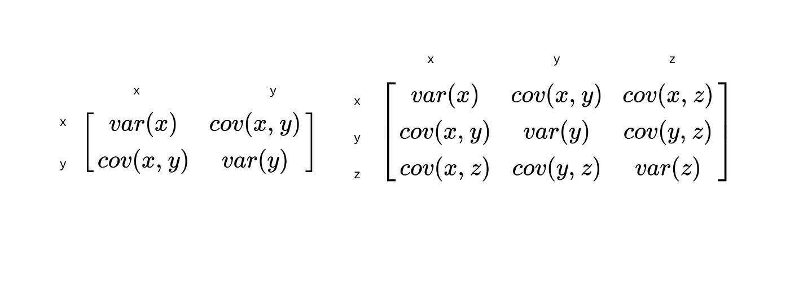

## Table of Contents

## What is a covariance matrix?

A covariance matrix is a square table that shows how different variables in a dataset relate to each other. Each entry in the matrix tells you how much two variables change together. If the number is positive, it means that when one variable goes up, the other tends to go up too. If it's negative, one goes up while the other goes down. The diagonal of the matrix shows how much each variable changes on its own, which is called variance.

This matrix is really useful in many areas, like finance and statistics. In finance, it helps to understand how different stocks move together, which can be important for making investment decisions. In statistics, it's used in techniques like Principal Component Analysis to simplify complex data. By looking at the covariance matrix, you can see patterns and relationships that might not be obvious just by looking at the raw data.

## How is a covariance matrix calculated?

To calculate a covariance matrix, you start by finding the mean (average) of each variable in your dataset. Then, for each pair of variables, you calculate how much they change together compared to their means. This is done by taking the difference between each data point and the mean for both variables, multiplying these differences together, and then averaging the result over all the data points. This gives you the covariance between the two variables. You do this for every possible pair of variables, including each variable with itself, which gives you the variance.

Once you have all these covariances, you arrange them into a square matrix. The rows and columns of the matrix represent the variables. The entry in the i-th row and j-th column is the covariance between the i-th and j-th variables. The diagonal entries, where the row and column numbers are the same, are the variances of the individual variables. This matrix is symmetric because the covariance between variable A and variable B is the same as the covariance between B and A. By looking at this matrix, you can see at a glance how all the variables in your dataset relate to each other.

## What does the diagonal of a covariance matrix represent?

The diagonal of a covariance matrix shows the variance of each variable. Variance is a measure of how spread out the numbers in a dataset are. If the numbers are all close to the average, the variance is small. If the numbers are spread out a lot, the variance is big. Each number on the diagonal tells you the variance for one specific variable.

This is important because it gives you a quick way to see how much each variable changes on its own. By looking at the diagonal, you can understand the stability or variability of each variable without having to look at the rest of the matrix. This can help you make decisions or understand patterns in your data more easily.

## What do the off-diagonal elements of a covariance matrix indicate?

The off-diagonal elements of a covariance matrix show how two different variables change together. If the number is positive, it means that when one variable goes up, the other variable tends to go up too. If the number is negative, it means that when one variable goes up, the other variable tends to go down. This helps you see relationships between different variables in your data.

For example, in a dataset about weather, if temperature and ice cream sales have a positive number in the off-diagonal element, it means that as the temperature goes up, ice cream sales also tend to go up. If temperature and heating costs have a negative number, it means that as the temperature goes up, heating costs tend to go down. By looking at these off-diagonal elements, you can understand how different parts of your data are connected.

## Why is the covariance matrix symmetric?

The covariance matrix is symmetric because the covariance between two variables is the same no matter which variable you look at first. For example, if you want to know how temperature and ice cream sales change together, it doesn't matter if you start with temperature and then look at ice cream sales, or if you start with ice cream sales and then look at temperature. The result will be the same.

This symmetry makes the covariance matrix easier to work with. When you look at the matrix, the number in the top left corner and the bottom right corner are the same, and the number in the top right corner is the same as the number in the bottom left corner. This pattern helps you quickly see how all the variables in your data relate to each other.

## How is the covariance matrix used in statistics?

In [statistics](/wiki/bayesian-statistics), the covariance matrix is a useful tool to understand how different pieces of data relate to each other. It helps statisticians see patterns and relationships that might not be obvious just by looking at the numbers. For example, if you are studying the relationship between different stocks in the stock market, the covariance matrix can show you which stocks tend to go up or down together. This information is very important for making smart investment decisions because it helps you understand the risk and potential reward of different investments.

Another way the covariance matrix is used is in techniques like Principal Component Analysis (PCA). PCA is a method to simplify complex data by finding the main patterns or trends. The covariance matrix is the starting point for PCA because it shows how all the variables in the data change together. By looking at this matrix, you can figure out which variables are most important and how to combine them to make the data easier to understand. This is really helpful in fields like biology or social sciences where there might be a lot of data to sort through.

## What is the relationship between the covariance matrix and the correlation matrix?

The covariance matrix and the correlation matrix both show how variables in a dataset relate to each other, but they do it in different ways. The covariance matrix tells you how much two variables change together. If the number is big, it means the variables change a lot together. If it's small, they don't change much together. The problem with the covariance matrix is that the numbers can be hard to compare because they depend on the units of the variables. For example, if you're measuring temperature in Celsius and ice cream sales in dollars, the numbers in the covariance matrix will be different just because of the units.

The correlation matrix solves this problem by turning the covariance numbers into a scale that always goes from -1 to 1. This makes it easier to compare how different pairs of variables relate to each other, no matter what units they're measured in. To get the correlation matrix, you take the covariance matrix and divide each number by the square root of the variances of the two variables involved. This process, called standardization, makes the correlation matrix easier to understand and interpret. So, while the covariance matrix gives you raw information about how variables change together, the correlation matrix gives you a clearer picture of the strength and direction of these relationships.

## How can the covariance matrix be used in portfolio optimization?

In portfolio optimization, the covariance matrix helps investors figure out how different investments, like stocks, move together. By looking at the covariance matrix, investors can see which stocks go up or down at the same time. This is important because if all the stocks in a portfolio go down together, it's a big risk. But if some stocks go up when others go down, it can balance things out and make the portfolio safer. Using the covariance matrix, investors can choose a mix of stocks that reduces risk and might give better returns.

For example, if two stocks have a high positive covariance, it means they tend to move in the same direction. An investor might not want to put all their money in these two stocks because if one goes down, the other will likely go down too. On the other hand, if two stocks have a negative covariance, they move in opposite directions. This can be good for balancing the portfolio because when one stock goes down, the other might go up. By using the covariance matrix to understand these relationships, investors can build a portfolio that is less risky and more likely to perform well over time.

## What are the properties of a covariance matrix?

A covariance matrix is a square table that shows how different variables in a dataset relate to each other. It's always symmetric, which means if you flip it over the main diagonal, it looks the same. This is because the way one variable changes with another is the same no matter which one you look at first. The numbers on the main diagonal of the covariance matrix show how much each variable changes on its own, which is called variance. If the numbers on the diagonal are big, it means the variables change a lot. If they're small, it means the variables don't change much.

The off-diagonal numbers in the covariance matrix show how two different variables change together. A positive number means that when one variable goes up, the other tends to go up too. A negative number means that when one variable goes up, the other tends to go down. The size of the number tells you how strong the relationship is. The covariance matrix is also always positive semi-definite, which is a fancy way of saying that the way the variables change together makes sense mathematically. This property is important for using the covariance matrix in things like statistics and finance.

## How do you interpret the eigenvalues and eigenvectors of a covariance matrix?

Eigenvalues and eigenvectors of a covariance matrix help us understand the main patterns in our data. When you look at the eigenvalues, you're seeing how much each pattern, or direction, in the data matters. A big eigenvalue means that the pattern it represents is important and explains a lot of how the data changes. A small eigenvalue means the pattern isn't as important. So, by looking at the eigenvalues, you can see which directions in your data have the most impact.

Eigenvectors, on the other hand, show you the directions of these patterns. Each eigenvector points in a direction where the data stretches out the most. If an eigenvector has a big eigenvalue, it means the data stretches a lot in that direction. For example, in a dataset about people's heights and weights, an eigenvector might point in a direction that shows how height and weight change together. By looking at the eigenvectors and their eigenvalues, you can understand the main ways your data changes and what's most important about it.

## What is the role of the covariance matrix in principal component analysis (PCA)?

In principal component analysis (PCA), the covariance matrix is really important because it helps us find the main patterns in our data. When we do PCA, we start by looking at the covariance matrix to see how all the variables in our data change together. This matrix shows us which variables move in the same way and which ones move differently. By understanding these relationships, we can figure out the directions in which the data spreads out the most. These directions are called principal components, and they help us simplify our data by focusing on what's most important.

Once we have the covariance matrix, we use it to find the eigenvalues and eigenvectors. The eigenvalues tell us how important each principal component is, and the eigenvectors show us the direction of these components. A big eigenvalue means that the direction it represents is a big part of how the data changes. The eigenvector with the biggest eigenvalue points in the direction where the data stretches out the most. By using the covariance matrix in this way, PCA helps us see the main patterns in our data and make it easier to understand and work with.

## How can you estimate a covariance matrix from sample data, and what are the challenges involved?

To estimate a covariance matrix from sample data, you start by calculating the mean of each variable in your dataset. Then, for each pair of variables, you figure out how much they change together compared to their means. You do this by taking the difference between each data point and the mean for both variables, multiplying these differences together, and then averaging the result over all the data points. This gives you the covariance between the two variables. You repeat this process for every possible pair of variables, including each variable with itself, which gives you the variance. Once you have all these covariances, you arrange them into a square matrix, where the rows and columns represent the variables, and the numbers inside show how they relate to each other.

Estimating a covariance matrix from sample data can be tricky because the numbers you get depend a lot on the data you have. If your sample is small, the estimates might not be very accurate because they might not represent the whole population well. This is called sampling error. Also, if your data has outliers or mistakes, it can mess up your estimates and make the covariance matrix less reliable. Another challenge is that the covariance matrix assumes that the relationships between variables stay the same, but in real life, these relationships can change over time or in different situations. So, you have to be careful when using a covariance matrix to make sure it's a good fit for your data and your goals.

## What is the Understanding of the Covariance Matrix?

A covariance matrix is a fundamental tool in statistics and finance, specifically in the analysis of multivariate data sets such as financial returns. It is a square matrix that encapsulates the covariance between multiple variables or features in a dataset. Each element of the covariance matrix provides insight into how two variables change in relation to each other, a critical component for risk assessment in trading portfolios.

In trading, these variables often represent the returns of various financial assets. The structure and elements of the covariance matrix deliver crucial information:

1. **Diagonal Elements**: Each diagonal element of the covariance matrix denotes the variance of a single asset. Variance indicates how much the asset's returns deviate from its mean over a given period. Mathematically, the variance $\sigma^2$ of a variable $X$ is calculated as:
$$
   \sigma^2 = \frac{1}{n} \sum_{i=1}^{n} (X_i - \bar{X})^2

$$

   where $n$ is the number of observations, $X_i$ is each individual observation, and $\bar{X}$ is the mean of these observations.

2. **Off-Diagonal Elements**: The off-diagonal elements capture the covariance between different pairs of assets. Covariance is a measure that reflects the degree to which two variables vary together. A positive covariance indicates that the asset returns tend to move together in the same direction, while a negative covariance suggests they move inversely. It is calculated as:
$$
   \text{Cov}(X, Y) = \frac{1}{n} \sum_{i=1}^{n} (X_i - \bar{X})(Y_i - \bar{Y})

$$

   where $X$ and $Y$ are two different asset return series, and $\bar{X}$ and $\bar{Y}$ are their respective means.

The covariance matrix provides a comprehensive view of how asset returns move together, which is crucial for understanding and managing portfolio risk. By analyzing the covariance between asset returns, traders can gauge the extent of shared risks and dependencies among assets, facilitating more informed decisions about diversification and risk mitigation.

Overall, the covariance matrix serves as a backbone for more advanced portfolio analyses, paving the way for more sophisticated risk management and optimization strategies in [algorithmic trading](/wiki/algorithmic-trading).

## What is the importance of covariance in algorithmic trading?

Understanding the relationships between asset returns is critical for constructing diversified portfolios that aim to minimize risk. A key tool in this context is the covariance matrix, an essential component that enables traders to identify how different assets move relative to each other. 

Covariance matrices are instrumental in recognizing assets that exhibit positive covariance, meaning they tend to move in tandem, as well as those with negative or zero covariance, indicating an independent or inverse relationship. This knowledge provides valuable insights for diversification strategies. When assets that demonstrate low or negative covariance are combined, the overall risk of the portfolio can be reduced due to the less synchronized movement of asset prices, offering a potential buffer against market [volatility](/wiki/volatility-trading-strategies).

For instance, suppose the returns of two assets, $R_1$ and $R_2$, are under examination. The covariance, $\text{Cov}(R_1, R_2)$, is computed as:

$$
\text{Cov}(R_1, R_2) = \frac{\sum_{i=1}^{n} (R_{1i} - \bar{R_1})(R_{2i} - \bar{R_2})}{n - 1}
$$

where $R_{1i}$ and $R_{2i}$ are the returns of the assets at time $i$, and $\bar{R_1}$ and $\bar{R_2}$ denote their respective mean returns. A positive covariance indicates that the assets generally move together, whereas a negative covariance suggests they move independently or inversely.

Traders exploit these insights by devising strategies that take advantage of assets with less correlated or uncorrelated returns. This approach can enhance the portfolio's risk-return profile. By selecting assets that do not move in unison, traders can construct portfolios that are potentially more stable and have balanced exposure to different market conditions. Ultimately, the covariance matrix serves a pivotal role in shaping strategies that are robust and less susceptible to market shocks, thereby maximizing the potential for achieving desired investment outcomes.

## How is the Covariance Matrix used in Portfolio Optimization?

Portfolio optimization techniques, particularly those based on the Markowitz Efficient Frontier, heavily utilize the covariance matrix to balance returns against risk. The Markowitz Efficient Frontier is a staple of modern portfolio theory, a framework that assists investors in constructing portfolios that offer the maximum expected return for a defined level of risk or, conversely, the minimum risk for a given level of expected return.

The covariance matrix, by capturing how asset returns co-move, provides essential data for calculating portfolio risk. Specifically, in the context of the Efficient Frontier, it allows investors to determine the optimal asset weights in a portfolio. Optimal weights are those that achieve a target balance between maximizing returns and minimizing risk. This involves mathematical optimization where expected portfolio returns (E[R]) is calculated as:

$$
E[R] = \sum_{i=1}^{n} w_i \cdot E[r_i]
$$

where $w_i$ represents the proportion of the portfolio invested in asset $i$, and $E[r_i]$ is the expected return of asset $i$.

The risk or variance of the portfolio ($\sigma^2$) is assessed as:

$$
\sigma^2 = \sum_{i=1}^{n} \sum_{j=1}^{n} w_i \cdot w_j \cdot \text{Cov}(r_i, r_j)
$$

where $\text{Cov}(r_i, r_j)$ is the covariance between returns on asset $i$ and asset $j$.

Through the optimization process, traders solve for weights $w_i$ that provide the most efficient tradeoff between risk, as measured by portfolio variance, and return. This process often involves quadratic programming techniques to solve the optimization problem, typically aided by computational tools and software.

Implementing these optimizations leads to more informed and strategic allocation of capital within trading strategies, allowing traders to align their portfolios closely with their risk-return objectives. This optimization functionally determines how assets are weighted in a portfolio, directly impacting expected portfolio returns and variances. Consequently, the covariance matrix becomes a foundational element in specifying these weights and constructing a portfolio that achieves desired financial outcomes.

Using programming languages like Python, traders can easily calculate these matrices and optimize portfolios. Libraries such as NumPy and Pandas are invaluable for handling large datasets and performing the necessary mathematical computations to exploit historical return data effectively for these optimizations.

## What is the role of the Covariance Matrix in Risk Management?

Risk management is an essential component of algorithmic trading, and the covariance matrix is a fundamental tool within this domain. By employing the covariance matrix, traders can estimate key risk metrics that inform strategic decisions, enhancing the robustness of trading models.

At the heart of risk appraisal is the estimation of Value at Risk (VaR), which quantifies the potential loss in value of an asset or portfolio over a specified period, given a predetermined confidence interval. The covariance matrix is crucial in this process, as it provides the necessary historical correlations between asset returns that underpin the statistical estimation of VaR. By considering both variances and covariances, traders can construct a more detailed risk profile, accommodating the interaction of asset returns over time.

For instance, the VaR at a $95\%$ confidence level can be derived from a portfolio's return distribution, which is informed by historical data encapsulated within the covariance matrix. Mathematically, if $R$ is the return of a portfolio, the VaR can be calculated as follows:

$$
\text{VaR}_{95\%} = \mu - z_{\alpha} \cdot \sigma
$$

where $\mu$ is the expected portfolio return, $z_{\alpha}$ is the z-score corresponding to the $95\%$ confidence level, and $\sigma$ is the portfolio's standard deviation derived from the covariance matrix.

In addition to VaR, other risk metrics such as Conditional Value at Risk (CVaR) can also be analyzed using the information embedded in the covariance matrix. These assessments allow traders to make informed adjustments to their strategies, potentially reallocating investments to reduce exposure to correlated risks.

Utilizing Python, analysts can efficiently compute these risk metrics using libraries like NumPy and Pandas. For example, calculating a covariance matrix in Python could involve:

```python
import numpy as np
import pandas as pd

# Assume 'returns' is a dataframe with historical asset returns
cov_matrix = returns.cov()

# Portfolio standard deviation calculation
weights = np.array([0.2, 0.3, 0.5])  # Hypothetical portfolio weights
portfolio_variance = np.dot(weights.T, np.dot(cov_matrix, weights))
portfolio_std_dev = np.sqrt(portfolio_variance)
```

This provides the foundational data necessary for performing deeper risk assessments like VaR estimation.

Despite its utility, the reliance on historical data encapsulated in the covariance matrix requires caution. Market dynamics are not static, and correlations between assets can shift, challenging period-based risk assessments. Therefore, while the covariance matrix is an invaluable tool, traders must continuously update their models to reflect current market conditions, avoiding over-reliance on historical patterns alone.

## References & Further Reading

[1]: ["Risk and Asset Allocation"](https://link.springer.com/book/10.1007/978-3-540-27904-4) by Attilio Meucci

[2]: ["Portfolio Management Formulas: Mathematical Trading Methods for the Futures, Options, and Stock Markets"](https://www.wiley.com/en-us/Portfolio+Management+Formulas%3A+Mathematical+Trading+Methods+for+the+Futures%2C+Options%2C+and+Stock+Markets-p-9780471527565) by Ralph Vince

[3]: DeMiguel, V., Garlappi, L., & Uppal, R. (2009). ["Optimal versus Naive Diversification: How Inefficient is the 1/N Portfolio Strategy?"](https://www.jstor.org/stable/30226017) The Review of Financial Studies, 22(5), 1915-1953.

[4]: Fabozzi, F. J., Kolm, P. N., Pachamanova, D. A., & Focardi, S. M. (2007). ["Robust Portfolio Optimization and Management"](https://onlinelibrary.wiley.com/doi/book/10.1002/9781119202172) (Vol. 10). John Wiley & Sons.

[5]: Markowitz, H. (1952). ["Portfolio Selection."](https://onlinelibrary.wiley.com/doi/abs/10.1111/j.1540-6261.1952.tb01525.x) The Journal of Finance, 7(1), 77-91.

[6]: ["Python for Finance: Mastering Data-Driven Finance"](https://books.google.com/books/about/Python_for_Finance.html?id=2qd9DwAAQBAJ) by Yves Hilpisch

[7]: ["Quantitative Financial Risk Management: Theory and Practice"](https://onlinelibrary.wiley.com/doi/book/10.1002/9781119080305) by C. W. Oosterlee and S. Mehreen

[8]: Ledoit, O., & Wolf, M. (2004). ["A Well-Conditioned Estimator for Large-Dimensional Covariance Matrices."](https://www.sciencedirect.com/science/article/pii/S0047259X03000964) Journal of Multivariate Analysis, 88(2), 365-411.