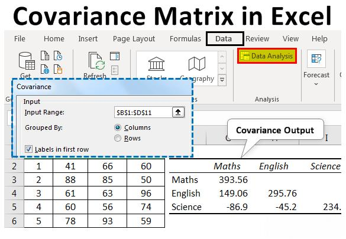

Algorithmic trading is a sophisticated field that incorporates various quantitative techniques to enhance financial market strategies. At the heart of these techniques lies the covariance matrix, a fundamental concept that plays a pivotal role in multiple facets of trading. The covariance matrix is essential for understanding asset interaction, offering a quantitative framework to assess how different financial assets correlate with one another. Recognizing these relationships is crucial not only for risk assessment but also for devising strategies to manage and mitigate potential risks.

In the context of algorithmic trading, the covariance matrix aids in optimal portfolio construction—this is done by facilitating the selection of a mix of assets that minimize risk while achieving desired returns. The practical use of the covariance matrix allows traders to develop dynamic strategies that can adapt to changing market conditions, highlighting its importance in strategy development. Consequently, a comprehensive understanding of the covariance matrix's role is vital for developing robust and effective algorithmic trading models. Through this article, we will study the significance of the covariance matrix across various dimensions of algorithmic trading, emphasizing its value in risk management, portfolio optimization, and strategic algorithm development.



## Table of Contents

## Understanding the Covariance Matrix

A covariance matrix is a fundamental tool in statistics and finance, specifically in the analysis of multivariate data sets such as financial returns. It is a square matrix that encapsulates the covariance between multiple variables or features in a dataset. Each element of the covariance matrix provides insight into how two variables change in relation to each other, a critical component for risk assessment in trading portfolios.

In trading, these variables often represent the returns of various financial assets. The structure and elements of the covariance matrix deliver crucial information:

1. **Diagonal Elements**: Each diagonal element of the covariance matrix denotes the variance of a single asset. Variance indicates how much the asset's returns deviate from its mean over a given period. Mathematically, the variance $\sigma^2$ of a variable $X$ is calculated as:
$$
   \sigma^2 = \frac{1}{n} \sum_{i=1}^{n} (X_i - \bar{X})^2

$$

   where $n$ is the number of observations, $X_i$ is each individual observation, and $\bar{X}$ is the mean of these observations.

2. **Off-Diagonal Elements**: The off-diagonal elements capture the covariance between different pairs of assets. Covariance is a measure that reflects the degree to which two variables vary together. A positive covariance indicates that the asset returns tend to move together in the same direction, while a negative covariance suggests they move inversely. It is calculated as:
$$
   \text{Cov}(X, Y) = \frac{1}{n} \sum_{i=1}^{n} (X_i - \bar{X})(Y_i - \bar{Y})

$$

   where $X$ and $Y$ are two different asset return series, and $\bar{X}$ and $\bar{Y}$ are their respective means.

The covariance matrix provides a comprehensive view of how asset returns move together, which is crucial for understanding and managing portfolio risk. By analyzing the covariance between asset returns, traders can gauge the extent of shared risks and dependencies among assets, facilitating more informed decisions about diversification and risk mitigation.

Overall, the covariance matrix serves as a backbone for more advanced portfolio analyses, paving the way for more sophisticated risk management and optimization strategies in [algorithmic trading](/wiki/algorithmic-trading).

## Importance of Covariance in Algo Trading

Understanding the relationships between asset returns is critical for constructing diversified portfolios that aim to minimize risk. A key tool in this context is the covariance matrix, an essential component that enables traders to identify how different assets move relative to each other. 

Covariance matrices are instrumental in recognizing assets that exhibit positive covariance, meaning they tend to move in tandem, as well as those with negative or zero covariance, indicating an independent or inverse relationship. This knowledge provides valuable insights for diversification strategies. When assets that demonstrate low or negative covariance are combined, the overall risk of the portfolio can be reduced due to the less synchronized movement of asset prices, offering a potential buffer against market [volatility](/wiki/volatility-trading-strategies).

For instance, suppose the returns of two assets, $R_1$ and $R_2$, are under examination. The covariance, $\text{Cov}(R_1, R_2)$, is computed as:

$$
\text{Cov}(R_1, R_2) = \frac{\sum_{i=1}^{n} (R_{1i} - \bar{R_1})(R_{2i} - \bar{R_2})}{n - 1}
$$

where $R_{1i}$ and $R_{2i}$ are the returns of the assets at time $i$, and $\bar{R_1}$ and $\bar{R_2}$ denote their respective mean returns. A positive covariance indicates that the assets generally move together, whereas a negative covariance suggests they move independently or inversely.

Traders exploit these insights by devising strategies that take advantage of assets with less correlated or uncorrelated returns. This approach can enhance the portfolio's risk-return profile. By selecting assets that do not move in unison, traders can construct portfolios that are potentially more stable and have balanced exposure to different market conditions. Ultimately, the covariance matrix serves a pivotal role in shaping strategies that are robust and less susceptible to market shocks, thereby maximizing the potential for achieving desired investment outcomes.

## Use of Covariance Matrix in Portfolio Optimization

Portfolio optimization techniques, particularly those based on the Markowitz Efficient Frontier, heavily utilize the covariance matrix to balance returns against risk. The Markowitz Efficient Frontier is a staple of modern portfolio theory, a framework that assists investors in constructing portfolios that offer the maximum expected return for a defined level of risk or, conversely, the minimum risk for a given level of expected return.

The covariance matrix, by capturing how asset returns co-move, provides essential data for calculating portfolio risk. Specifically, in the context of the Efficient Frontier, it allows investors to determine the optimal asset weights in a portfolio. Optimal weights are those that achieve a target balance between maximizing returns and minimizing risk. This involves mathematical optimization where expected portfolio returns (E[R]) is calculated as:

$$
E[R] = \sum_{i=1}^{n} w_i \cdot E[r_i]
$$

where $w_i$ represents the proportion of the portfolio invested in asset $i$, and $E[r_i]$ is the expected return of asset $i$.

The risk or variance of the portfolio ($\sigma^2$) is assessed as:

$$
\sigma^2 = \sum_{i=1}^{n} \sum_{j=1}^{n} w_i \cdot w_j \cdot \text{Cov}(r_i, r_j)
$$

where $\text{Cov}(r_i, r_j)$ is the covariance between returns on asset $i$ and asset $j$.

Through the optimization process, traders solve for weights $w_i$ that provide the most efficient tradeoff between risk, as measured by portfolio variance, and return. This process often involves quadratic programming techniques to solve the optimization problem, typically aided by computational tools and software.

Implementing these optimizations leads to more informed and strategic allocation of capital within trading strategies, allowing traders to align their portfolios closely with their risk-return objectives. This optimization functionally determines how assets are weighted in a portfolio, directly impacting expected portfolio returns and variances. Consequently, the covariance matrix becomes a foundational element in specifying these weights and constructing a portfolio that achieves desired financial outcomes.

Using programming languages like Python, traders can easily calculate these matrices and optimize portfolios. Libraries such as NumPy and Pandas are invaluable for handling large datasets and performing the necessary mathematical computations to exploit historical return data effectively for these optimizations.

## Covariance Matrix in Risk Management

Risk management is an essential component of algorithmic trading, and the covariance matrix is a fundamental tool within this domain. By employing the covariance matrix, traders can estimate key risk metrics that inform strategic decisions, enhancing the robustness of trading models.

At the heart of risk appraisal is the estimation of Value at Risk (VaR), which quantifies the potential loss in value of an asset or portfolio over a specified period, given a predetermined confidence interval. The covariance matrix is crucial in this process, as it provides the necessary historical correlations between asset returns that underpin the statistical estimation of VaR. By considering both variances and covariances, traders can construct a more detailed risk profile, accommodating the interaction of asset returns over time.

For instance, the VaR at a $95\%$ confidence level can be derived from a portfolio's return distribution, which is informed by historical data encapsulated within the covariance matrix. Mathematically, if $R$ is the return of a portfolio, the VaR can be calculated as follows:

$$
\text{VaR}_{95\%} = \mu - z_{\alpha} \cdot \sigma
$$

where $\mu$ is the expected portfolio return, $z_{\alpha}$ is the z-score corresponding to the $95\%$ confidence level, and $\sigma$ is the portfolio's standard deviation derived from the covariance matrix.

In addition to VaR, other risk metrics such as Conditional Value at Risk (CVaR) can also be analyzed using the information embedded in the covariance matrix. These assessments allow traders to make informed adjustments to their strategies, potentially reallocating investments to reduce exposure to correlated risks.

Utilizing Python, analysts can efficiently compute these risk metrics using libraries like NumPy and Pandas. For example, calculating a covariance matrix in Python could involve:

```python
import numpy as np
import pandas as pd

# Assume 'returns' is a dataframe with historical asset returns
cov_matrix = returns.cov()

# Portfolio standard deviation calculation
weights = np.array([0.2, 0.3, 0.5])  # Hypothetical portfolio weights
portfolio_variance = np.dot(weights.T, np.dot(cov_matrix, weights))
portfolio_std_dev = np.sqrt(portfolio_variance)
```

This provides the foundational data necessary for performing deeper risk assessments like VaR estimation.

Despite its utility, the reliance on historical data encapsulated in the covariance matrix requires caution. Market dynamics are not static, and correlations between assets can shift, challenging period-based risk assessments. Therefore, while the covariance matrix is an invaluable tool, traders must continuously update their models to reflect current market conditions, avoiding over-reliance on historical patterns alone.

## Technical Implementation with Python

Python is a widely used programming language in algorithmic trading, particularly due to its robust libraries that simplify complex mathematical computations. Key among these are NumPy and Pandas, which facilitate the analysis and computation of covariance matrices necessary for trading strategies.

NumPy provides a flexible and efficient array object, ndarrays, which can be used to perform a variety of operations on large datasets. To compute a covariance matrix using NumPy, the function `numpy.cov()` is typically employed. This function requires an array of historical return data, where each row represents observations of different assets, and each column corresponds to individual time points.

Here is an example of how to use NumPy to calculate a covariance matrix:

```python
import numpy as np

# Example historical returns data for three assets
returns_data = np.array([
    [0.05, 0.02, 0.03],
    [0.10, 0.01, 0.06],
    [0.02, 0.02, 0.02],
    [0.07, 0.03, 0.05]
])

# Calculate the covariance matrix
cov_matrix = np.cov(returns_data, rowvar=False)
print(cov_matrix)
```

In this example, `returns_data` is a 2D NumPy array where each column contains return data for a particular asset. The `np.cov()` function calculates the covariance matrix, assuming that each observation (row) is a unique entry, which is why `rowvar=False`.

Pandas, another powerful library, is ideal for handling time series data often used in financial analyses. With its `DataFrame` structure, Pandas simplifies the computation and manipulation of datasets. The `DataFrame.cov()` function allows for easy computation of covariance matrices directly from the data stored in a DataFrame.

Here's a simple example using Pandas:

```python
import pandas as pd

# Example historical returns data for three assets with Pandas
data = {
    'Asset1': [0.05, 0.10, 0.02, 0.07],
    'Asset2': [0.02, 0.01, 0.02, 0.03],
    'Asset3': [0.03, 0.06, 0.02, 0.05]
}

df = pd.DataFrame(data)

# Calculate the covariance matrix
cov_matrix_pandas = df.cov()
print(cov_matrix_pandas)
```

Pandas’ `DataFrame` makes it straightforward to compute the covariance matrix by invoking `df.cov()`, streamlining the process of preparing and analyzing the data.

Understanding how to leverage these Python libraries for calculating covariance matrices equips quantitative analysts and algorithmic traders with powerful tools to enhance their trading strategies efficiently.

## Challenges and Limitations

Covariance matrices are a crucial tool in algorithmic trading, but they come with inherent challenges and limitations. One primary concern is their reliance on historical data, which can lead to inaccurate predictions of future asset relationships. Since covariance measures how two variables change together, a covariance matrix constructed from past asset returns might not fully capture future market dynamics.

Financial markets are inherently dynamic, influenced by a multitude of factors such as economic policy changes, geopolitical events, and technological advancements. These factors can cause significant shifts in correlations between asset returns. For instance, assets that historically exhibited low correlation might begin to move together under new market conditions, rendering past covariance estimates less reliable.

This limitation poses a risk to traders who rely heavily on covariance matrices for portfolio construction and risk management. Over-reliance on historical covariance data can result in suboptimal asset allocations, potentially increasing exposure to unforeseen risks. Traders must recognize this vulnerability and adopt strategies to mitigate it.

Adaptive techniques, such as dynamically updating covariance estimates with rolling time windows or employing exponential weighting to give more significance to recent data, can help address these issues. Additionally, it may be beneficial to complement covariance analysis with other risk assessment tools and qualitative insights, ensuring a more robust decision-making process.

In Python, implementing adaptive covariance estimation can be achieved using libraries like NumPy and Pandas. For example, the exponentially weighted moving average (EWMA) is a popular technique that can be applied for a more responsive covariance matrix:

```python
import pandas as pd

# Assuming 'returns' is a DataFrame with historical return data
ewma_cov = returns.ewm(span=halflife).cov(pairwise=True)
```

Overall, while covariance matrices provide valuable insights, a comprehensive understanding of their limitations is essential for effective risk management and trading strategy development.

## Conclusion

The covariance matrix stands as a fundamental element in algorithmic trading, providing traders with critical insights into the relationships among asset returns. By analyzing these relationships, traders can effectively construct optimized portfolios that balance risk and return, thereby enhancing the efficacy of their trading strategies. The use of covariance matrices in portfolio optimization, such as through methods like the Markowitz Efficient Frontier, exemplifies their role in determining the most advantageous allocation of assets for targeted financial outcomes.

Furthermore, in risk management, the covariance matrix is pivotal, enabling traders to estimate risk metrics, such as Value at Risk (VaR), to anticipate and mitigate potential losses. These applications underscore its integral role in fostering informed decision-making processes within trading contexts.

Despite its significant advantages, the covariance matrix does have limitations, primarily due to its reliance on historical data which may not always predict future market conditions accurately. Changes in market dynamics can affect correlations amongst assets, necessitating a cautious approach in the matrix's application.

Continuous learning and adaptation are essential for traders to harness the full potential of the covariance matrix. As markets evolve, so too must the strategies and tools traders employ. By maintaining an up-to-date understanding of both market trends and quantitative methods, traders can continue to leverage the covariance matrix effectively, ensuring it remains a vital component of their analytical toolkit.

## References & Further Reading

[1]: ["Risk and Asset Allocation"](https://link.springer.com/book/10.1007/978-3-540-27904-4) by Attilio Meucci

[2]: ["Portfolio Management Formulas: Mathematical Trading Methods for the Futures, Options, and Stock Markets"](https://www.wiley.com/en-us/Portfolio+Management+Formulas%3A+Mathematical+Trading+Methods+for+the+Futures%2C+Options%2C+and+Stock+Markets-p-9780471527565) by Ralph Vince

[3]: DeMiguel, V., Garlappi, L., & Uppal, R. (2009). ["Optimal versus Naive Diversification: How Inefficient is the 1/N Portfolio Strategy?"](https://www.jstor.org/stable/30226017) The Review of Financial Studies, 22(5), 1915-1953.

[4]: Fabozzi, F. J., Kolm, P. N., Pachamanova, D. A., & Focardi, S. M. (2007). ["Robust Portfolio Optimization and Management"](https://onlinelibrary.wiley.com/doi/book/10.1002/9781119202172) (Vol. 10). John Wiley & Sons.

[5]: Markowitz, H. (1952). ["Portfolio Selection."](https://onlinelibrary.wiley.com/doi/abs/10.1111/j.1540-6261.1952.tb01525.x) The Journal of Finance, 7(1), 77-91.

[6]: ["Python for Finance: Mastering Data-Driven Finance"](https://books.google.com/books/about/Python_for_Finance.html?id=2qd9DwAAQBAJ) by Yves Hilpisch

[7]: ["Quantitative Financial Risk Management: Theory and Practice"](https://onlinelibrary.wiley.com/doi/book/10.1002/9781119080305) by C. W. Oosterlee and S. Mehreen

[8]: Ledoit, O., & Wolf, M. (2004). ["A Well-Conditioned Estimator for Large-Dimensional Covariance Matrices."](https://www.sciencedirect.com/science/article/pii/S0047259X03000964) Journal of Multivariate Analysis, 88(2), 365-411.