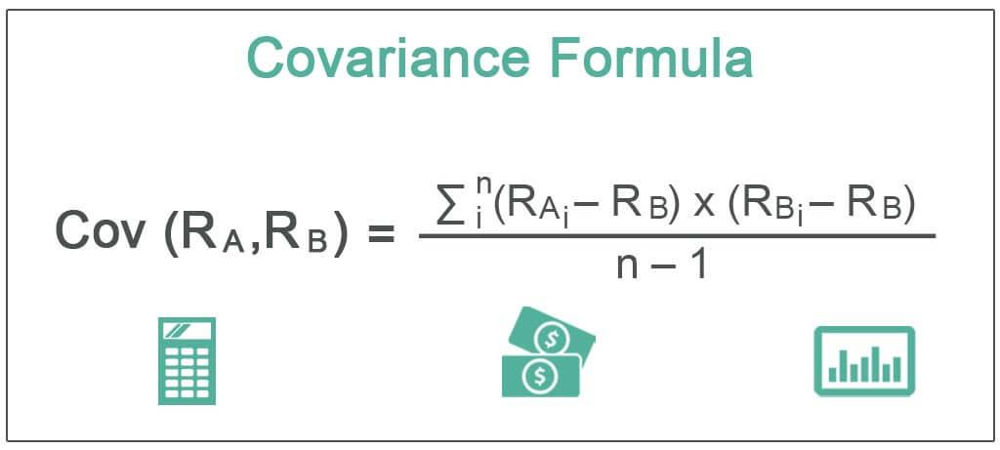

## Table of Contents

## What is covariance in the context of portfolio theory?

In portfolio theory, covariance is a measure that shows how two different investments move together. It tells us if the prices of two assets tend to go up or down at the same time. If the covariance is positive, it means that when one investment goes up, the other one tends to go up too. If it's negative, it means that when one investment goes up, the other one tends to go down. This information is important because it helps investors understand how their investments might behave together.

Understanding covariance helps in building a diversified portfolio. A diversified portfolio is one where the investments don't all move in the same way. By including assets with low or negative covariance, investors can reduce the overall risk of their portfolio. For example, if you have one stock that tends to go up when another goes down, the ups and downs can balance each other out. This way, even if one investment performs poorly, the others might still do well, making the overall portfolio more stable.

## How is covariance calculated between two assets?

Covariance between two assets is calculated by looking at how their returns move together over time. First, you need to find the average return for each asset. Then, for each period (like a day, month, or year), you subtract the average return from the actual return for both assets. You multiply these differences together for each period. After that, you add up all these products and divide by the number of periods minus one. This gives you the covariance.

For example, let's say you have two stocks, Stock A and Stock B. You have their returns for five days. You calculate the average return for each stock over these five days. Then, for each day, you find the difference between the actual return and the average return for both stocks. You multiply these differences together for each day. You add up these five products and divide by four (which is five minus one). The result is the covariance between Stock A and Stock B.

## Why is covariance important in portfolio diversification?

Covariance is important in portfolio diversification because it helps investors understand how different investments move together. When you put money into different things, like stocks or bonds, you want them to not all go up or down at the same time. Covariance tells you if two investments tend to move in the same direction or opposite directions. If two investments have a high positive covariance, it means they often go up or down together. This can be risky because if one investment goes down, the other is likely to go down too.

On the other hand, if two investments have a low or negative covariance, it means they don't move in the same way. This is good for diversification because it can help balance out your portfolio. For example, if one investment goes down, the other might go up, which can help protect your overall investment. By choosing investments with low or negative covariance, you can spread out your risk and make your portfolio more stable. This way, even if some investments don't do well, others might still perform okay, helping to keep your overall portfolio safer.

## Can you explain the difference between covariance and correlation?

Covariance and correlation both tell us about how two things move together, but they do it in different ways. Covariance is a measure that shows if two investments tend to go up or down together. If the covariance is positive, it means that when one investment goes up, the other one tends to go up too. If it's negative, it means that when one goes up, the other tends to go down. But covariance has a problem: its value depends on the scale of the data, so it's hard to compare covariance from different sets of data.

Correlation fixes this problem. Correlation is like covariance, but it's scaled to always be between -1 and 1. This makes it easier to understand and compare. If the correlation is 1, it means the two investments move perfectly together. If it's -1, they move perfectly opposite each other. And if it's 0, there's no relationship between how they move. Because correlation is standardized, it's easier to use when you want to see how strongly two things are related, no matter what the scale of the data is.

In simple terms, covariance tells you the direction of the relationship between two investments, but its value can be hard to interpret because it's not standardized. Correlation, on the other hand, not only tells you the direction but also the strength of the relationship in a way that's easy to understand and compare across different data sets. So, if you want to know how two investments move together and compare that relationship to others, correlation is usually a better choice.

## How does covariance affect the risk of a portfolio?

Covariance affects the risk of a portfolio by showing how different investments move together. If two investments have a high positive covariance, it means they tend to go up or down at the same time. This can make your portfolio riskier because if one investment goes down, the other one is likely to go down too. For example, if you have two stocks that both go down during a market crash, your whole portfolio could lose a lot of value.

On the other hand, if you choose investments with low or negative covariance, it can help reduce the risk of your portfolio. Low or negative covariance means that the investments don't move in the same way. So, if one investment goes down, the other might go up or stay the same, which can balance out the losses. This is why investors look at covariance when they want to diversify their portfolio and make it more stable. By [picking](/wiki/asset-class-picking) investments that don't all move together, you can protect your money better.

## What is the role of covariance in the efficient frontier concept?

Covariance plays a big role in the efficient frontier concept, which is all about finding the best mix of investments. The efficient frontier is a line on a graph that shows the highest possible return you can get for a certain level of risk. Covariance helps figure out this line by showing how different investments move together. If two investments have a high positive covariance, it means they tend to go up or down at the same time. This can make a portfolio riskier because if one goes down, the other one is likely to go down too. So, the efficient frontier helps you see how to balance these investments to get the best return for the least risk.

To create the efficient frontier, you need to look at the covariance between all the investments in your portfolio. By choosing investments with low or negative covariance, you can spread out the risk. This means that if one investment goes down, another might go up or stay the same, which can help balance out your portfolio. The efficient frontier shows you different combinations of investments that give you the highest return for each level of risk. By understanding covariance, you can pick the right mix of investments to sit on this frontier and make your portfolio as efficient as possible.

## How can negative covariance be used to reduce portfolio risk?

Negative covariance between two investments means that when one goes up, the other tends to go down. This can be really helpful for reducing the risk in your portfolio. If you have some investments that don't move in the same way, it can balance out the ups and downs. For example, if you own a stock that goes down when the economy is bad, you might also want to own another investment that goes up during those times, like a bond. This way, even if your stock loses value, your bond might gain value, helping to protect your overall investment.

By including investments with negative covariance in your portfolio, you can make it more stable. This is because the gains from one investment can offset the losses from another. When you're building your portfolio, looking at the covariance between different investments helps you pick a mix that will work well together. This way, you can enjoy the benefits of different types of investments while keeping your risk lower. So, negative covariance is a powerful tool for making your portfolio safer and more balanced.

## What are the limitations of using covariance in portfolio management?

Covariance helps us see how investments move together, but it has some problems. One big problem is that it depends on the scale of the data. This means that the numbers you get for covariance can be hard to compare if you're looking at different sets of data. For example, if you're comparing the covariance between two stocks with the covariance between two bonds, the numbers might look very different just because of how the data is measured, not because of how the investments actually move together.

Another limitation is that covariance only tells us about the direction of the relationship between two investments, not how strong it is. This can make it tricky to understand how much one investment might affect another. Also, covariance can change over time. What worked well in the past might not work the same way in the future. So, relying only on past covariance might not give you the best picture of how your investments will behave going forward. Because of these issues, it's often better to use correlation, which is like covariance but easier to understand and compare.

## How does covariance influence the choice of assets in a portfolio?

Covariance helps you pick the right mix of investments for your portfolio by showing how different investments move together. If two investments have a high positive covariance, it means they tend to go up or down at the same time. This can be risky because if one investment goes down, the other one is likely to go down too. For example, if you have two stocks that both drop during a market crash, your whole portfolio could lose a lot of value. So, you might want to avoid putting too much money into investments that move in the same way.

On the other hand, if you find investments with low or negative covariance, it can help make your portfolio safer. Low or negative covariance means that when one investment goes up, the other might go down or stay the same. This can balance out the ups and downs in your portfolio. For instance, if you own a stock that goes down when the economy is bad, you could also own a bond that goes up during those times. This way, even if your stock loses value, your bond might gain value, helping to protect your overall investment. By understanding covariance, you can choose a mix of investments that work well together to reduce risk and improve your portfolio's performance.

## Can you discuss the impact of time horizons on covariance estimates?

The time horizon you choose can really change how you see covariance between investments. If you look at a short time, like a few days or weeks, the covariance might be different than if you look at a longer time, like years. Short-term changes in the market can make it seem like two investments move together a lot, but over a longer time, you might see they don't move the same way as much. So, if you're planning to keep your investments for a long time, it's a good idea to look at covariance over a long period too.

On the other hand, if you're thinking about your investments for just a short time, then looking at short-term covariance can be more useful. But remember, short-term data can be noisy and might not show the true relationship between investments. That's why it's important to think about how long you plan to keep your money in the investments when you're figuring out covariance. This way, you can make better choices about which investments to put in your portfolio based on how long you'll hold them.

## How do modern portfolio theory models incorporate covariance matrices?

Modern portfolio theory uses covariance matrices to help figure out how to mix different investments in the best way. A covariance matrix shows how all the investments in a portfolio move together. By looking at this matrix, investors can see which investments go up or down at the same time and which ones move in opposite ways. This information is important because it helps them pick a mix of investments that can reduce risk. For example, if two investments always go up and down together, adding both to a portfolio might be risky. But if one goes up when the other goes down, it can balance out the portfolio and make it safer.

In modern portfolio theory, the covariance matrix is used to find the efficient frontier. The efficient frontier is a line on a graph that shows the best possible return for each level of risk. To find this line, the theory uses the covariance between all the investments to calculate the overall risk of different combinations. By choosing investments with low or negative covariance, investors can create a portfolio that sits on the efficient frontier, meaning it gives the highest return for the least risk. This way, they can make their money work better and keep it safer at the same time.

## What advanced statistical methods can improve covariance estimation in complex portfolios?

To get better at estimating covariance in complex portfolios, you can use something called shrinkage estimators. These methods mix the actual data you have with a simpler model, like assuming all investments move the same way. This helps because sometimes the data you have can be noisy or not enough to give a clear picture. By blending it with a simpler model, you can get a more stable and reliable estimate of how your investments move together. This is really helpful when you're dealing with a lot of different investments and don't have enough past data to be sure about the numbers.

Another way to improve covariance estimation is by using [factor](/wiki/factor-investing) models. These models look at big things that affect all investments, like the economy or interest rates, and use them to figure out how investments move together. By focusing on these big factors, factor models can give you a clearer picture of covariance, especially when you're dealing with a lot of investments. This can make your portfolio more stable and help you make better decisions about which investments to pick.

## What is Understanding Finance Portfolio Theory?

Finance Portfolio Theory, primarily developed by Harry Markowitz, is a cornerstone of modern investment practices. It fundamentally underscores the significance of diversification, risk management, and the strategic allocation of assets to maximize returns while minimizing risk. This theory posits that an investor can construct an "efficient" portfolio—one that offers the highest expected return for a given level of risk or the lowest risk for a given level of expected return.

One of the critical innovations introduced by Markowitz is the concept of the "efficient frontier." This is a graph representing optimal portfolios that offer the highest expected return for a defined level of risk. The efficient frontier is a key visual used by investors to determine the most suitable asset allocation according to their risk appetite. Mathematically, if $\sigma$ represents risk (standard deviation) and $\mu$ denotes expected return, the efficient frontier can be described as:

$$

f(\sigma) = \max (\mu) 
$$

subject to:

$$

\sum w_i = 1 
$$

where $w_i$ represents the weight of the asset in the portfolio.

Another essential element of finance portfolio theory is the risk-return trade-off, which highlights the principle that potential return rises with an increase in risk. Investors must evaluate how much risk they are willing to tolerate to achieve desired returns. This balance is at the heart of portfolio theory and is often visualized through the capital market line (CML), a tangent line from the risk-free rate to the efficient frontier, indicating optimal portfolios that combine risk-free assets with a risky portfolio.

The capital market line is expressed as:

$$

E(R_p) = R_f + \frac{\sigma_p}{\sigma_m}(E(R_m) - R_f) 
$$

where $E(R_p)$ is the expected return of the portfolio, $R_f$ is the risk-free rate, $\sigma_p$ is the standard deviation of the portfolio returns, and $E(R_m)$ is the expected return of the market portfolio with $\sigma_m$ its standard deviation. 

Understanding these concepts is paramount for integrating advanced technologies such as [algorithmic trading](/wiki/algorithmic-trading) into portfolio management. By grasping the foundations of portfolio theory, traders and financial analysts can leverage automation to enhance the precision and effectiveness of asset allocation and diversification strategies, aligning their portfolios more closely with the efficient frontier. This sets the scene for more sophisticated and data-driven approaches to investing that combine traditional methodologies with modern technological innovations.

## What is the role of covariance in portfolio theory?

Covariance is a measure that quantifies the extent to which the returns on two assets move together. In financial portfolio theory, it plays a vital role in the construction and optimization of asset portfolios, specifically in terms of risk assessment and diversification strategies. Understanding covariance helps investors anticipate how different securities interact, allowing for better management of portfolio risk.

Mathematically, the covariance between two asset returns X and Y can be calculated as:

$$
\text{Cov}(X, Y) = \frac{1}{n-1} \sum_{i=1}^{n} (X_i - \bar{X})(Y_i - \bar{Y})
$$

where $X_i$ and $Y_i$ are the returns of the assets, and $\bar{X}$ and $\bar{Y}$ are their respective mean returns. A positive covariance suggests that the asset returns move in the same direction, whereas a negative covariance indicates they move inversely. When two asset returns are positively correlated, they tend to increase and decrease together, implying that combining such assets offers limited diversification benefits. Conversely, assets with negative covariance provide diversification advantages by reducing overall portfolio risk, as the positive performance of one asset offsets the negative performance of another.

Covariance is often used to construct covariance matrices, which are essential tools in portfolio optimization. These matrices encapsulate all pairwise covariances between asset returns in a portfolio, providing a comprehensive view of how the entire portfolio behaves in concert. They form the backbone of many optimization techniques, such as the mean-variance optimization pioneered by Harry Markowitz, which seeks to allocate asset weights to minimize risk for a given level of expected return.

In the context of portfolio optimization, investors employ covariance matrices to calculate optimal asset weightings. By incorporating covariance figures, investors can identify combinations of assets that minimize the overall portfolio [volatility](/wiki/volatility-trading-strategies), consistent with their desired risk-return profile. This is typically represented in mathematical models, such as:

```python
import numpy as np
from scipy.optimize import minimize

def portfolio_volatility(weights, covariance_matrix):
    return np.sqrt(np.dot(weights.T, np.dot(covariance_matrix, weights)))

def optimize_portfolio(expected_returns, covariance_matrix, risk_free_rate):
    num_assets = len(expected_returns)
    args = (covariance_matrix,)

    constraints = ({'type': 'eq', 'fun': lambda x: np.sum(x) - 1})
    bounds = tuple((0, 1) for asset in range(num_assets))

    result = minimize(portfolio_volatility, num_assets*[1./num_assets,], args=args,
                      method='SLSQP', bounds=bounds, constraints=constraints)
    return result.x
```

This Python code provides a basic framework to optimize a portfolio's asset weights by minimizing its volatility, given its covariance matrix. It ensures the weights sum up to one and each weight lies between zero and one, reflecting realistic constraints on asset fractional holdings in a portfolio.

In essence, covariance is integral to the risk management process in finance portfolio theory. By assessing the relationships between asset movements, it allows investors to craft portfolios that are more adept at withstanding market fluctuations, ultimately contributing to more resilient investment strategies.

 to Algorithmic Trading

Algorithmic trading, commonly referred to as algo trading, represents a sophisticated approach in the financial markets where computer algorithms automatically execute trades based on a set of predefined criteria. This innovation in trading technology allows for enhanced speed and precision, enabling traders to capitalize on fleeting market opportunities with an efficiency far beyond the capabilities of manual trading.

Algo trading leverages computational power to process vast volumes of market data, identify patterns and trends, and execute trades within milliseconds. This rapid processing offers traders a significant edge over traditional trading methodologies, which involve slower, often more error-prone human decision-making processes. The ability to react and adjust positions in real-time is particularly advantageous in volatile markets where timing is critical.

The increasing complexity and dynamism of financial markets have cemented algorithmic trading as a pivotal element within the portfolio management toolkit. Algorithmic systems are designed to handle the intricacies of modern markets, which include high-frequency trading, dark pools, and fragmented markets, where speed and data analysis capability are paramount.

One of the key advantages of algorithmic trading is its ability to facilitate complex trading strategies that incorporate elements of financial theories such as portfolio theory. By using sophisticated algorithms, traders can implement strategies that consider risk diversification, expected returns, and variance as part of their decision-making process. This enables a more nuanced approach to risk management and investment strategy optimization.

Finally, algorithmic trading not only enhances efficiency but also opens up new avenues for integrating advanced financial theories into practical trading strategies. This technological evolution is reshaping the landscape of financial trading, offering novel opportunities for traders and analysts to develop more robust and adaptive investment strategies. As algorithmic systems continue to evolve with advances in [artificial intelligence](/wiki/ai-artificial-intelligence) and [machine learning](/wiki/machine-learning), their role in the financial markets is set to expand even further, heralding a new era of trading innovation.

## How can we link covariance and algorithmic trading?

Algorithmic trading seamlessly integrates covariance and financial portfolio theory to enhance the investment process. Covariance, which measures the degree to which two asset prices move in relation to each other, plays a pivotal role in understanding and exploiting market dynamics through algorithmic trading systems.

Algorithmic systems automate the processing of vast datasets, focusing on price movements and asset correlations. By leveraging real-time data analysis, these systems continuously recalibrate portfolios to maintain optimal risk-return balances. This automation is achieved through sophisticated algorithms that assess the changing covariance structure of assets, enabling dynamic portfolio adjustments.

The calculation of covariance is fundamental in constructing a covariance matrix, which is indispensable in portfolio optimization. It allows for the identification of asset pairings that contribute to reducing overall portfolio risk. For instance, in a portfolio $P$ containing two assets $A$ and $B$, the covariance between these assets $\text{Cov}(A, B)$, is computed as:

$$
\text{Cov}(A,B) = \frac{\sum (A_i - \bar{A})(B_i - \bar{B})}{n-1}
$$

where $A_i$ and $B_i$ are the individual returns of assets $A$ and $B$, $\bar{A}$ and $\bar{B}$ are the mean returns, and $n$ represents the number of observations.

Algorithmic trading strategies, such as mean-variance optimization, rely heavily on covariance data to determine the best asset weights that minimize risk for a given level of expected return. Using covariance inputs, these algorithms compute the portfolio variance and explore various allocations to find an optimal configuration along the efficient frontier. Python libraries like NumPy and pandas can facilitate these calculations, optimizing the computational efficiency of trading systems.

Here is an example of how Python can be used for covariance calculation and portfolio optimization:

```python
import numpy as np
import pandas as pd

# Sample returns data
returns_df = pd.DataFrame({
    'Asset_A': [0.12, 0.10, 0.05, 0.08],
    'Asset_B': [0.06, 0.07, 0.02, 0.03]
})

# Calculate the covariance matrix
cov_matrix = returns_df.cov()

# Display the covariance matrix
print(cov_matrix)
```

Algorithmic trading also incorporates dynamic hedging strategies that adapt to shifts in covariance among assets. By nimbly responding to changing correlations, such strategies ensure that the portfolio continues to align with predefined financial objectives, such as risk minimization or achieving a target return.

In essence, integrating covariance analysis into algorithmic trading enables financial practitioners to develop more insightful, data-driven investment strategies. These strategies optimize asset allocation and illustrate the profound impact of statistical techniques on effective portfolio management. By automating the recalibration of portfolios in response to evolving market conditions, algorithmic trading systems significantly advance traditional investment paradigms, providing investors with a robust framework for navigating complex financial landscapes.

## References & Further Reading

[1]: Markowitz, H. (1952). ["Portfolio Selection"](https://onlinelibrary.wiley.com/doi/abs/10.1111/j.1540-6261.1952.tb01525.x). The Journal of Finance, 7(1), 77-91.

[2]: Black, F., & Litterman, R. (1992). ["Global Portfolio Optimization"](https://people.duke.edu/~charvey/Teaching/BA453_2006/Black_Litterman_Global_Portfolio_Optimization_1992.pdf). Financial Analysts Journal, 48(5), 28-43.

[3]: Chan, E. P. (2009). ["Quantitative Trading: How to Build Your Own Algorithmic Trading Business"](https://github.com/ftvision/quant_trading_echan_book). Wiley.

[4]: Lopez de Prado, M. (2018). ["Advances in Financial Machine Learning"](https://www.amazon.com/Advances-Financial-Machine-Learning-Marcos/dp/1119482089). Wiley.

[5]: Jansen, S. (2020). ["Machine Learning for Algorithmic Trading"](https://github.com/stefan-jansen/machine-learning-for-trading). Packt Publishing.

[6]: Bodie, Z., Kane, A., & Marcus, A. J. (2013). ["Investments"](https://www.mheducation.com/highered/product/Investments-Bodie.html). McGraw-Hill Education.