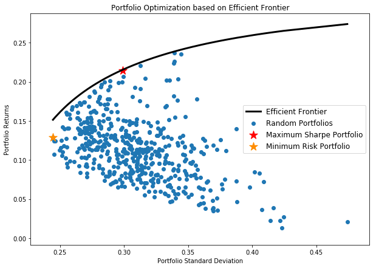

In the ever-evolving world of finance, the integration of traditional investment theories with modern technological advancements is crucial for maintaining a competitive edge. One of the most significant blends of these elements is the combination of Portfolio Theory and Algorithmic Trading. This article investigates into the role of covariance within finance portfolio theory and its leverage through algorithmic trading to enhance investment strategies.

Finance Portfolio Theory, pioneered by Harry Markowitz, introduces several key principles aimed at maximizing returns while managing risk. Central to this theory is the concept of covariance, which measures the degree to which the returns of two assets move in relation to each other. This measure is essential for assessing the correlation between different securities, ultimately aiding in risk assessment and portfolio diversification. Understanding how these correlations impact overall portfolio risk is fundamental for constructing resilient investment portfolios.



Algorithmic trading, meanwhile, incorporates the use of sophisticated computer algorithms to execute trades based on pre-defined criteria, with minimal human intervention. This method offers unparalleled speed and precision, capitalizing on market opportunities and processing large volumes of data to identify patterns and execute trades within milliseconds. The integration of algorithmic trading with financial theories like portfolio theory can provide enhanced trading strategies through the utilization of covariance and other statistical measures.

This article explores the intersection of these concepts, providing a comprehensive understanding of their synergies. By examining how algorithmic trading systems utilize covariance information, we aim to shed light on the optimization of performance in investment strategies. This understanding not only benefits traders and financial analysts in maximizing returns and managing risks, but also offers valuable insights for both seasoned traders and new entrants looking to enhance their portfolio management skills.

In summary, the combination of Portfolio Theory and Algorithmic Trading represents a fusion of traditional methodologies and modern technology, presenting opportunities for innovation, improvement, and competitive advancement in the financial sector.

## Table of Contents

## Understanding Finance Portfolio Theory

Finance Portfolio Theory, primarily developed by Harry Markowitz, is a cornerstone of modern investment practices. It fundamentally underscores the significance of diversification, risk management, and the strategic allocation of assets to maximize returns while minimizing risk. This theory posits that an investor can construct an "efficient" portfolio—one that offers the highest expected return for a given level of risk or the lowest risk for a given level of expected return.

One of the critical innovations introduced by Markowitz is the concept of the "efficient frontier." This is a graph representing optimal portfolios that offer the highest expected return for a defined level of risk. The efficient frontier is a key visual used by investors to determine the most suitable asset allocation according to their risk appetite. Mathematically, if $\sigma$ represents risk (standard deviation) and $\mu$ denotes expected return, the efficient frontier can be described as:

$$

f(\sigma) = \max (\mu) 
$$

subject to:

$$

\sum w_i = 1 
$$

where $w_i$ represents the weight of the asset in the portfolio.

Another essential element of finance portfolio theory is the risk-return trade-off, which highlights the principle that potential return rises with an increase in risk. Investors must evaluate how much risk they are willing to tolerate to achieve desired returns. This balance is at the heart of portfolio theory and is often visualized through the capital market line (CML), a tangent line from the risk-free rate to the efficient frontier, indicating optimal portfolios that combine risk-free assets with a risky portfolio.

The capital market line is expressed as:

$$

E(R_p) = R_f + \frac{\sigma_p}{\sigma_m}(E(R_m) - R_f) 
$$

where $E(R_p)$ is the expected return of the portfolio, $R_f$ is the risk-free rate, $\sigma_p$ is the standard deviation of the portfolio returns, and $E(R_m)$ is the expected return of the market portfolio with $\sigma_m$ its standard deviation. 

Understanding these concepts is paramount for integrating advanced technologies such as [algorithmic trading](/wiki/algorithmic-trading) into portfolio management. By grasping the foundations of portfolio theory, traders and financial analysts can leverage automation to enhance the precision and effectiveness of asset allocation and diversification strategies, aligning their portfolios more closely with the efficient frontier. This sets the scene for more sophisticated and data-driven approaches to investing that combine traditional methodologies with modern technological innovations.

## The Role of Covariance in Portfolio Theory

Covariance is a measure that quantifies the extent to which the returns on two assets move together. In financial portfolio theory, it plays a vital role in the construction and optimization of asset portfolios, specifically in terms of risk assessment and diversification strategies. Understanding covariance helps investors anticipate how different securities interact, allowing for better management of portfolio risk.

Mathematically, the covariance between two asset returns X and Y can be calculated as:

$$
\text{Cov}(X, Y) = \frac{1}{n-1} \sum_{i=1}^{n} (X_i - \bar{X})(Y_i - \bar{Y})
$$

where $X_i$ and $Y_i$ are the returns of the assets, and $\bar{X}$ and $\bar{Y}$ are their respective mean returns. A positive covariance suggests that the asset returns move in the same direction, whereas a negative covariance indicates they move inversely. When two asset returns are positively correlated, they tend to increase and decrease together, implying that combining such assets offers limited diversification benefits. Conversely, assets with negative covariance provide diversification advantages by reducing overall portfolio risk, as the positive performance of one asset offsets the negative performance of another.

Covariance is often used to construct covariance matrices, which are essential tools in portfolio optimization. These matrices encapsulate all pairwise covariances between asset returns in a portfolio, providing a comprehensive view of how the entire portfolio behaves in concert. They form the backbone of many optimization techniques, such as the mean-variance optimization pioneered by Harry Markowitz, which seeks to allocate asset weights to minimize risk for a given level of expected return.

In the context of portfolio optimization, investors employ covariance matrices to calculate optimal asset weightings. By incorporating covariance figures, investors can identify combinations of assets that minimize the overall portfolio [volatility](/wiki/volatility-trading-strategies), consistent with their desired risk-return profile. This is typically represented in mathematical models, such as:

```python
import numpy as np
from scipy.optimize import minimize

def portfolio_volatility(weights, covariance_matrix):
    return np.sqrt(np.dot(weights.T, np.dot(covariance_matrix, weights)))

def optimize_portfolio(expected_returns, covariance_matrix, risk_free_rate):
    num_assets = len(expected_returns)
    args = (covariance_matrix,)

    constraints = ({'type': 'eq', 'fun': lambda x: np.sum(x) - 1})
    bounds = tuple((0, 1) for asset in range(num_assets))

    result = minimize(portfolio_volatility, num_assets*[1./num_assets,], args=args,
                      method='SLSQP', bounds=bounds, constraints=constraints)
    return result.x
```

This Python code provides a basic framework to optimize a portfolio's asset weights by minimizing its volatility, given its covariance matrix. It ensures the weights sum up to one and each weight lies between zero and one, reflecting realistic constraints on asset fractional holdings in a portfolio.

In essence, covariance is integral to the risk management process in finance portfolio theory. By assessing the relationships between asset movements, it allows investors to craft portfolios that are more adept at withstanding market fluctuations, ultimately contributing to more resilient investment strategies.

 to Algorithmic Trading

Algorithmic trading, commonly referred to as algo trading, represents a sophisticated approach in the financial markets where computer algorithms automatically execute trades based on a set of predefined criteria. This innovation in trading technology allows for enhanced speed and precision, enabling traders to capitalize on fleeting market opportunities with an efficiency far beyond the capabilities of manual trading.

Algo trading leverages computational power to process vast volumes of market data, identify patterns and trends, and execute trades within milliseconds. This rapid processing offers traders a significant edge over traditional trading methodologies, which involve slower, often more error-prone human decision-making processes. The ability to react and adjust positions in real-time is particularly advantageous in volatile markets where timing is critical.

The increasing complexity and dynamism of financial markets have cemented algorithmic trading as a pivotal element within the portfolio management toolkit. Algorithmic systems are designed to handle the intricacies of modern markets, which include high-frequency trading, dark pools, and fragmented markets, where speed and data analysis capability are paramount.

One of the key advantages of algorithmic trading is its ability to facilitate complex trading strategies that incorporate elements of financial theories such as portfolio theory. By using sophisticated algorithms, traders can implement strategies that consider risk diversification, expected returns, and variance as part of their decision-making process. This enables a more nuanced approach to risk management and investment strategy optimization.

Finally, algorithmic trading not only enhances efficiency but also opens up new avenues for integrating advanced financial theories into practical trading strategies. This technological evolution is reshaping the landscape of financial trading, offering novel opportunities for traders and analysts to develop more robust and adaptive investment strategies. As algorithmic systems continue to evolve with advances in [artificial intelligence](/wiki/ai-artificial-intelligence) and [machine learning](/wiki/machine-learning), their role in the financial markets is set to expand even further, heralding a new era of trading innovation.

## Linking Covariance and Algo Trading

Algorithmic trading seamlessly integrates covariance and financial portfolio theory to enhance the investment process. Covariance, which measures the degree to which two asset prices move in relation to each other, plays a pivotal role in understanding and exploiting market dynamics through algorithmic trading systems.

Algorithmic systems automate the processing of vast datasets, focusing on price movements and asset correlations. By leveraging real-time data analysis, these systems continuously recalibrate portfolios to maintain optimal risk-return balances. This automation is achieved through sophisticated algorithms that assess the changing covariance structure of assets, enabling dynamic portfolio adjustments.

The calculation of covariance is fundamental in constructing a covariance matrix, which is indispensable in portfolio optimization. It allows for the identification of asset pairings that contribute to reducing overall portfolio risk. For instance, in a portfolio $P$ containing two assets $A$ and $B$, the covariance between these assets $\text{Cov}(A, B)$, is computed as:

$$
\text{Cov}(A,B) = \frac{\sum (A_i - \bar{A})(B_i - \bar{B})}{n-1}
$$

where $A_i$ and $B_i$ are the individual returns of assets $A$ and $B$, $\bar{A}$ and $\bar{B}$ are the mean returns, and $n$ represents the number of observations.

Algorithmic trading strategies, such as mean-variance optimization, rely heavily on covariance data to determine the best asset weights that minimize risk for a given level of expected return. Using covariance inputs, these algorithms compute the portfolio variance and explore various allocations to find an optimal configuration along the efficient frontier. Python libraries like NumPy and pandas can facilitate these calculations, optimizing the computational efficiency of trading systems.

Here is an example of how Python can be used for covariance calculation and portfolio optimization:

```python
import numpy as np
import pandas as pd

# Sample returns data
returns_df = pd.DataFrame({
    'Asset_A': [0.12, 0.10, 0.05, 0.08],
    'Asset_B': [0.06, 0.07, 0.02, 0.03]
})

# Calculate the covariance matrix
cov_matrix = returns_df.cov()

# Display the covariance matrix
print(cov_matrix)
```

Algorithmic trading also incorporates dynamic hedging strategies that adapt to shifts in covariance among assets. By nimbly responding to changing correlations, such strategies ensure that the portfolio continues to align with predefined financial objectives, such as risk minimization or achieving a target return.

In essence, integrating covariance analysis into algorithmic trading enables financial practitioners to develop more insightful, data-driven investment strategies. These strategies optimize asset allocation and illustrate the profound impact of statistical techniques on effective portfolio management. By automating the recalibration of portfolios in response to evolving market conditions, algorithmic trading systems significantly advance traditional investment paradigms, providing investors with a robust framework for navigating complex financial landscapes.

## Case Studies and Real-World Applications

In the competitive landscape of modern finance, integrating portfolio theory with algorithmic trading has become an effective strategy for enhancing returns and managing risks. Several leading financial institutions and hedge funds have successfully implemented these concepts through the use of covariance matrices and advanced quantitative techniques.

One prominent example is the adoption of risk-parity portfolios by major investment firms. Risk-parity strategies allocate capital based on risk contribution, typically using covariance matrices to assess the correlations between different asset classes. This approach aims to balance risk rather than capital, enabling portfolios to achieve more stable returns across varying market conditions. For instance, Bridgewater Associates, one of the largest hedge funds globally, utilizes a risk-parity framework to diversify investments across asset classes such as equities, bonds, and commodities. By analyzing the covariance of asset returns, they effectively manage the diversification and risk exposure in their portfolios.

In addition to risk-parity, quantitative [hedge fund](/wiki/hedge-fund-trading-strategies) strategies have been instrumental in revolutionizing modern investment practices. These funds rely heavily on algorithmic trading systems that incorporate portfolio theory principles, particularly the calculation of covariance matrices, to optimize trading decisions. For example, Renaissance Technologies, known for its Medallion Fund, employs sophisticated mathematical models to analyze market data. By leveraging insights from covariance matrices, the fund is able to identify patterns and correlations, enabling precise predictions about asset price movements and enhancing the performance of their algorithms.

These case studies underscore the methodologies and tools used to harness portfolio theory for algorithmic trading. Advanced analytical techniques, such as mean-variance optimization, rely on covariance data to determine asset weights that minimize portfolio risk while maximizing expected returns. Utilizing these strategies within an algorithmic framework allows for automated, real-time adjustments to portfolio compositions, accommodating evolving market dynamics more swiftly than manual management could allow.

The analysis of these strategies illuminates potential challenges and best practices for integrating portfolio theory with algorithmic trading. Challenges often stem from data accuracy and computational demands required for real-time processing. Moreover, the need for algorithms to adapt to fluctuating market conditions and unexpected economic events is imperative. Moving forward, advancements in artificial intelligence and machine learning could further enhance these strategies, providing more sophisticated models to predict asset movements and manage risks effectively.

Overall, these real-world applications highlight the synergy between theoretical finance constructs and cutting-edge technology, offering valuable insights into optimizing investment strategies within the highly dynamic financial markets.

## Challenges and Future Directions

Combining finance portfolio theory with algorithmic trading has facilitated more dynamic and efficient investment strategies, yet it also presents several challenges and opportunities for future enhancement. Among the primary challenges is ensuring high data quality, which is crucial as the accuracy of algorithmic trading relies heavily on reliable data inputs. Insufficient or incorrect data can lead to suboptimal trading decisions, mispricing, and an increased risk of significant financial loss.

Another challenge is adapting algorithms to swiftly changing market conditions and varying regulatory environments. Financial markets are inherently volatile, and algorithms must be designed to adjust to market fluctuations while adhering to regulatory constraints. This involves developing adaptable algorithms capable of learning and evolving in response to new data, a task that requires a robust understanding of both market mechanics and regulatory requirements.

Unprecedented events, such as geopolitical tensions or financial crises, can also disrupt market conditions and alter asset covariances in unexpected ways. These disruptions may result in algorithms making decisions based on correlations that no longer hold, potentially compromising portfolio performance. Thus, algorithms need to be equipped with mechanisms to detect and respond to such anomalies effectively.

Looking forward, advancements in artificial intelligence (AI) and machine learning offer promising avenues to address these challenges. These technologies can enhance algorithmic trading by improving data analysis capabilities, enabling more accurate predictive modeling, and facilitating adaptive learning algorithms. Machine learning models, especially those utilizing techniques like [reinforcement learning](/wiki/reinforcement-learning), can help create systems that learn from past market behavior and adapt to new patterns, enhancing their resilience to market volatility.

Furthermore, incorporating AI can automate the process of data cleansing and validation, thereby enhancing data quality. AI-driven analytics can provide deeper insights into complex data sets, identifying hidden patterns that traditional methods might overlook and allowing for more informed trading decisions.

In conclusion, while the integration of finance portfolio theory and algorithmic trading presents certain challenges, it also offers significant potential for refinement and advancement. As AI and machine learning technologies continue to evolve, they promise to streamline algorithm development, enhance data processing, and improve adaptability to changing markets. Exploring these future directions is crucial for maintaining a competitive edge in the financial sector and fully realizing the potential of algorithmic trading in portfolio management.

## Conclusion

The integration of finance portfolio theory and algorithmic trading signifies a compelling synergy between traditional investment strategies and state-of-the-art technology. This merger facilitates the transformation of theoretical knowledge, such as covariance, into actionable strategies that enhance portfolio management. Covariance, which measures how two assets move in relation to each other, is an essential concept for traders and analysts focused on building robust, risk-adjusted portfolios. By leveraging algorithmic trading, traders can automate the processing of covariance data, allowing rapid adaptation to market dynamics and ensuring portfolios are consistently aligned with risk-return objectives.

As the finance industry evolves, professionals must remain cognizant of these technological integrations to maintain a competitive edge. Algorithmic trading not only increases the efficiency of implementing finance portfolio theory but also opens avenues for innovation. The ongoing advancements in artificial intelligence and machine learning further augment these strategies, providing improved accuracy and predictive capabilities even amid market volatility. 

Ultimately, the fusion of finance portfolio theory and algorithmic trading not only deepens our comprehension of investment principles but also generates opportunities for evolving investment strategies. Embracing this integration will be crucial for those who wish to harness the full potential of both traditional and modern financial methodologies to optimize returns while effectively managing risks.

## References & Further Reading

[1]: Markowitz, H. (1952). ["Portfolio Selection"](https://onlinelibrary.wiley.com/doi/abs/10.1111/j.1540-6261.1952.tb01525.x). The Journal of Finance, 7(1), 77-91.

[2]: Black, F., & Litterman, R. (1992). ["Global Portfolio Optimization"](https://people.duke.edu/~charvey/Teaching/BA453_2006/Black_Litterman_Global_Portfolio_Optimization_1992.pdf). Financial Analysts Journal, 48(5), 28-43.

[3]: Chan, E. P. (2009). ["Quantitative Trading: How to Build Your Own Algorithmic Trading Business"](https://github.com/ftvision/quant_trading_echan_book). Wiley.

[4]: Lopez de Prado, M. (2018). ["Advances in Financial Machine Learning"](https://www.amazon.com/Advances-Financial-Machine-Learning-Marcos/dp/1119482089). Wiley.

[5]: Jansen, S. (2020). ["Machine Learning for Algorithmic Trading"](https://github.com/stefan-jansen/machine-learning-for-trading). Packt Publishing.

[6]: Bodie, Z., Kane, A., & Marcus, A. J. (2013). ["Investments"](https://www.mheducation.com/highered/product/Investments-Bodie.html). McGraw-Hill Education.