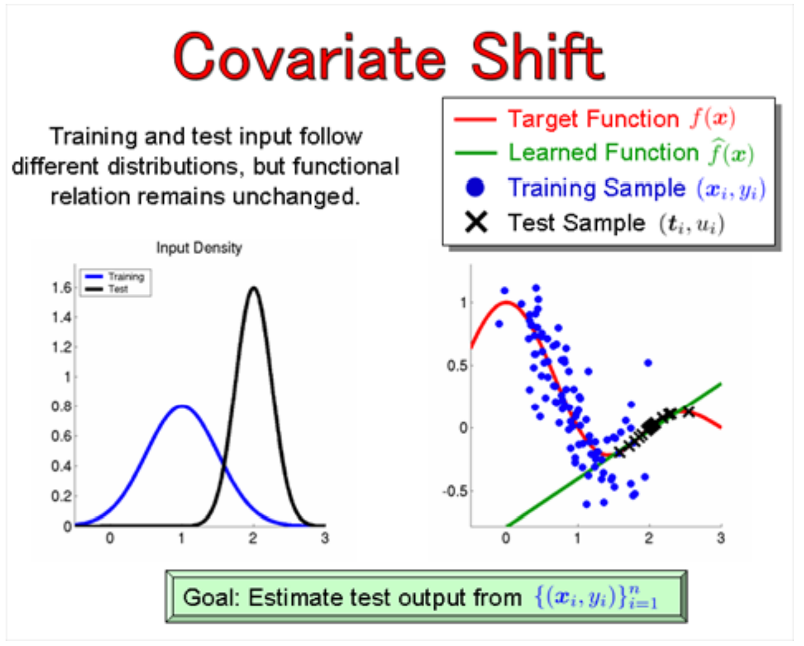

## Table of Contents

## What is covariate shift?

Covariate shift is a problem that can happen in machine learning when the data used to train a model is different from the data the model sees when it's being used. Imagine you trained a model to recognize cats using pictures taken during the day. If you then use this model at night, the model might not work well because the lighting is different. This difference between the training data and the real-world data is called covariate shift.

To deal with covariate shift, you need to make sure the data your model sees during training is similar to the data it will see when it's used. One way to do this is by collecting more data that matches the real-world conditions. Another way is to use techniques that adjust the model to handle the differences between the training and real-world data. By doing this, you can make your model more reliable and accurate, even when the conditions change.

## How does covariate shift differ from other types of data distribution shifts?

Covariate shift is just one type of data distribution shift. It happens when the input data (the "X" part in machine learning) changes between training and when you use the model, but the relationship between the input and the output (the "Y" part) stays the same. For example, if you trained a model to predict house prices using data from one city, and then you use it in another city where the houses look different but the pricing logic is the same, that's covariate shift.

Other types of data distribution shifts include concept drift and label shift. Concept drift is when the relationship between the input and output changes over time. For example, if fashion trends change and your model for predicting what clothes will be popular needs to adapt, that's concept drift. Label shift, on the other hand, is when the distribution of the output (the "Y" part) changes, but the input data stays the same. For instance, if you're predicting flu outbreaks and the rate of flu cases changes from year to year, but the symptoms you're looking at stay the same, that's label shift. Each type of shift requires different strategies to handle it effectively.

## What are common causes of covariate shift in machine learning?

Covariate shift often happens when the data you use to train your model is different from the data it sees when you use it. This can happen for many reasons. One common reason is changes in the environment. For example, if you trained a model to recognize traffic signs in sunny weather, it might not work well on rainy days because the images look different. Another reason is changes in how data is collected. If you trained a model using data from one source, like a specific camera, and then you use it with data from a different source, like a different camera, the model might not work as well because the new images are different.

Another cause of covariate shift is when the population you're studying changes over time. For example, if you trained a model to predict customer behavior using data from last year, and this year's customers are different, the model might not work as well. This can happen if new types of customers start using your service or if existing customers change their behavior. Also, if you're using data from different regions or countries, the model might not work well if the data from one place is very different from the data from another place. Understanding these causes can help you take steps to make your model more reliable and accurate.

## Can you explain how covariate shift impacts model performance?

Covariate shift can make a model perform worse because the data it sees when it's used is different from the data it was trained on. Imagine you trained a model to recognize apples using pictures taken in a sunny orchard. If you then use this model in a dark room, it might not recognize the apples well because the lighting is different. The model was trained to look for certain features that are clear in sunlight, but those features might not be as clear in the dark. This difference in the data can cause the model to make more mistakes.

To fix this, you need to make sure the model sees data during training that is similar to what it will see when it's used. This can be done by collecting more data that matches the real-world conditions or by using special techniques to help the model adjust to the new data. By doing this, you can make the model more reliable and accurate, even when the conditions change. If you don't address covariate shift, the model's performance will keep getting worse as the difference between the training data and the real-world data grows.

## What are some methods to detect covariate shift in a dataset?

To detect covariate shift, you can compare the training data to the data you're using the model on. One way to do this is by looking at the distribution of the input features. If the distribution of the features in the new data is very different from the distribution in the training data, it could mean there's covariate shift. You can use statistical tests like the Kolmogorov-Smirnov test to see if the distributions are different. Another way is to use visualizations, like histograms or scatter plots, to see if the new data looks different from the training data.

Another method to detect covariate shift is by using machine learning models themselves. You can train a model to predict whether a data point came from the training set or the new data set. If the model can tell the difference easily, it means there's likely covariate shift. This method is called a two-sample test. You can also use techniques like importance weighting, where you assign weights to the data points based on how different they are from the training data. If the weights are very different, it could be a sign of covariate shift.

## How can one adapt a model to handle covariate shift?

To handle covariate shift, you can retrain your model with new data that matches the real-world conditions. For example, if your model was trained on sunny day pictures and now it's used at night, you can add night-time pictures to your training data. This helps the model learn to recognize things in different lighting. Another way is to use a technique called importance weighting. This means you give more importance to the new data that is different from your training data. By doing this, the model learns to focus more on the new conditions.

You can also use domain adaptation methods to help your model handle covariate shift. Domain adaptation is like teaching your model to understand different "languages" of data. For instance, if your model was trained on data from one city and now it's used in another city, domain adaptation can help the model adjust to the new city's data. Another approach is to use online learning, where the model keeps learning and updating itself as it sees new data. This way, the model can adapt to changes over time and keep performing well even when the data shifts.

## What role does importance weighting play in addressing covariate shift?

Importance weighting helps fix covariate shift by making sure the model pays more attention to the new data that's different from the training data. Imagine you trained a model to recognize dogs using pictures taken in a park, but now you're using it in a city where the backgrounds are different. With importance weighting, you can tell the model to focus more on the city pictures by giving them higher weights. This way, the model learns to recognize dogs in the new environment better.

Using importance weighting is like telling the model which data points are more important to learn from. By doing this, the model can adjust to the new conditions without needing to collect a whole new set of training data. This method helps the model stay accurate and reliable even when the data it sees changes over time.

## Can you discuss a real-world example where covariate shift was a significant issue?

A real-world example where covariate shift was a big problem happened in healthcare. Imagine a hospital that used a machine learning model to predict whether a patient would get a certain disease. The model was trained using data from one hospital, where most patients were older and had similar backgrounds. But then, the hospital started using the model at another location where the patients were younger and from different backgrounds. The model started making a lot of mistakes because the new patients' data was very different from the training data. This is covariate shift.

To fix this problem, the hospital had to collect new data from the second location and retrain the model. They also used importance weighting to help the model focus more on the new data. By doing this, they made the model work better for the new group of patients. This example shows how important it is to make sure your model's training data matches the real-world data it will see, and how techniques like importance weighting can help when the data changes.

## How does domain adaptation relate to covariate shift?

Domain adaptation is a way to help a model handle covariate shift. It's like teaching the model to understand different "languages" of data. If you trained a model using data from one place, like a sunny beach, and then you use it in a different place, like a snowy mountain, the model might not work well because the data looks different. Domain adaptation helps the model adjust to the new place's data, so it can still do a good job even when the environment changes.

For example, if you have a model that predicts traffic patterns in one city and you want to use it in another city, domain adaptation can help the model learn the new city's traffic patterns. By using techniques like importance weighting or collecting new data from the new city, the model can adapt to the changes and keep working well. This is important because it helps the model stay accurate and reliable even when the data it sees changes over time.

## What advanced techniques are used to mitigate covariate shift in deep learning models?

In deep learning, one advanced technique to handle covariate shift is called domain adversarial training. This method helps the model learn to ignore the differences between the training data and the new data it sees. Imagine you're teaching a model to recognize cats, and it was trained with pictures from one place but now it's used in a different place where the backgrounds are different. Domain adversarial training makes the model focus on the important parts, like the shape of the cat, and not the changing backgrounds. This way, the model can still recognize cats no matter where the pictures come from.

Another technique is transfer learning, where you use a model that was trained on one type of data and then fine-tune it with new data. For example, if you trained a model to recognize objects in daytime photos and now you want it to work at night, you can start with the daytime model and then show it lots of night-time photos. The model learns to adjust to the new lighting conditions without forgetting what it already knows. This helps the model adapt to covariate shift by using what it learned before and updating it with new information.

## How can one evaluate the effectiveness of a method used to correct for covariate shift?

To evaluate how well a method works to fix covariate shift, you need to test the model's performance on new data that is different from the training data. Imagine you trained a model to recognize dogs in a park and now you want to see if it can recognize dogs in a city. You would use the method to adjust the model and then see how well it does on city pictures. If the model makes fewer mistakes on the new data after using the method, it means the method is working well. You can measure this by looking at things like accuracy, how many false alarms the model gives, and how many correct predictions it misses.

Another way to check if the method is effective is by comparing the model's performance before and after using the method. For example, if the model's accuracy on the new data goes up a lot after you use importance weighting or domain adaptation, it shows that the method helped the model handle the covariate shift. You can also use special tests, like statistical tests, to see if the improvement is real and not just by chance. By doing these checks, you can be sure that the method you used really helps the model work better with new, different data.

## What are the current research trends and future directions in managing covariate shift?

Researchers are working on new ways to handle covariate shift. One big trend is using more advanced domain adaptation methods. These methods help models adjust to new data without needing to start from scratch. For example, some researchers are looking into how to use multiple sources of data to make models more flexible. They are also trying to make models learn faster by using what they already know and adding new information. Another trend is using unsupervised learning, where models can learn from new data without being told what each piece of data means. This can help models adapt to changes in data more easily.

In the future, managing covariate shift might get even easier. One direction is making models that can learn on their own without much help from people. These models could keep updating themselves as they see new data, which would help them stay accurate even when things change. Another direction is using more real-time data to train models. This means models could be updated with new information all the time, making them better at handling changes in data. Overall, the goal is to make models more reliable and able to work well in different situations, no matter how the data changes.

## How can we detect covariate shift?

Detecting covariate shift in financial data is crucial for maintaining the robustness of algorithmic trading models. Various tools and techniques have been developed to identify such shifts, leveraging both statistical methods and machine learning approaches.

### Statistical Methods for Identifying Covariate Shift

Statistical methods provide a foundational approach for detecting shifts in data distributions. One common technique is the Kolmogorov-Smirnov (K-S) test, which is used to compare the distributions of two datasets. It measures the maximum distance between the empirical distribution functions of the two samples:

$$
D = \sup_x |F_1(x) - F_2(x)|
$$

where $D$ is the K-S statistic, and $F_1(x)$ and $F_2(x)$ are the empirical cumulative distribution functions of the two samples. A significant K-S statistic suggests a difference in distributions, indicating a potential covariate shift.

Another statistical approach is the Chi-square test, applied to categorical data to determine if there is a significant difference between the expected and observed frequencies across categories. This method can be helpful when dealing with categorical financial indicators or segmented trading data.

### Machine Learning Approaches

Machine learning techniques are increasingly being utilized to identify patterns and shifts in data that might not be apparent through traditional methods. A prevalent method is domain adaptation, where a model trained on a source domain is adjusted for a target domain. This is particularly useful when historical training data may not be entirely representative of current market conditions.

One effective machine learning-based technique involves training a classifier to distinguish between data from different time periods. If the classifier performs well, this indicates a potential covariate shift. The following Python code snippet demonstrates a basic approach to implementing this:

```python
from sklearn.model_selection import train_test_split
from sklearn.ensemble import RandomForestClassifier
from sklearn.metrics import accuracy_score

# Assume X_old and X_new are feature matrices for old and new data, respectively
X = np.vstack((X_old, X_new))
y = np.hstack((np.zeros(X_old.shape[0]), np.ones(X_new.shape[0])))

X_train, X_test, y_train, y_test = train_test_split(X, y, test_size=0.3, random_state=42)
clf = RandomForestClassifier()
clf.fit(X_train, y_train)
y_pred = clf.predict(X_test)

accuracy = accuracy_score(y_test, y_pred)
if accuracy > 0.5:
    print("Potential covariate shift detected.")
else:
    print("No significant covariate shift detected.")
```

In this snippet, a Random Forest Classifier is used to discriminate between the old and new datasets. The intuition is that if the classifier can predict the origin of data samples with significantly higher accuracy than random guessing (i.e., 0.5), there is likely a covariate shift.

Incorporating machine learning techniques like these allows traders to dynamically adapt to changing market conditions, enhancing the resilience of algorithmic strategies. While statistical methods provide a solid starting point, machine learning offers more sophisticated tools for identifying nuanced shifts in financial data. Detecting these shifts enables prompt adaptation of models, thus managing risk better and maintaining profitability in the ever-evolving financial markets.

## How can one adjust for covariate shift?

Adjusting for covariate shift in algorithmic trading involves implementing strategies that ensure trading models remain accurate and effective despite changes in the input data distribution. The phenomenon of covariate shift occurs when the distribution of input variables changes but the conditional distribution of the target variable given the inputs remains constant. This can significantly affect the performance of trading models if not properly addressed.

One fundamental approach to handling covariate shift is through bias correction techniques. These methods involve adjusting the models to accommodate shifts in data distributions, thus preventing bias in the predictions. One common approach is to use importance weighting, where the training data is re-weighted to reflect the new input distribution. The importance weight $\omega(x)$ is computed as the ratio of the probability of the new distribution $P_{\text{new}}(x)$ to the original distribution $P_{\text{orig}}(x)$:

$$
\omega(x) = \frac{P_{\text{new}}(x)}{P_{\text{orig}}(x)}
$$

This correction ensures that the model maintains relevance under the new data distribution.

Domain adaptation is another vital technique, where models are adjusted to perform optimally in a new domain with different data characteristics. One method within this category is the use of transfer learning, which leverages knowledge from one or more domains to improve the performance in a target domain. Another approach is feature transformation, which involves finding a representation of data that minimizes the distribution difference between domains.

While effective, these strategies come with challenges and limitations. For instance, accurately estimating the probability distributions needed for importance weighting requires a large sample size, which may not always be available. Additionally, domain adaptation techniques can be computationally intensive and complex, sometimes requiring significant architectural changes to existing models.

Another challenge is the dynamic nature of financial markets, which can lead to situations where models need continuous updating and monitoring to remain effective. This constant need for adaptation can strain resources and require advanced infrastructure to handle real-time data and model updates.

To summarize, adjusting for covariate shift in algorithmic trading requires a blend of sophisticated statistical techniques and computational approaches. Despite challenges such as high computational demands and the need for large datasets, properly addressing covariate shift is crucial to maintaining the accuracy and profitability of trading models in a dynamic market environment.

## References & Further Reading

[1]: Sugiyama, M., Krauledat, M., & Müller, K.-R. (2007). ["Covariate Shift Adaptation by Importance Weighted Cross Validation"](https://jmlr.csail.mit.edu/papers/volume8/sugiyama07a/sugiyama07a.pdf). Journal of Machine Learning Research, 8, 985–1005.

[2]: Shimodaira, H. (2000). ["Improving Predictive Inference under Covariate Shift by Weighting the Log-Likelihood Function"](https://www.sciencedirect.com/science/article/pii/S0378375800001154). Journal of Statistical Planning and Inference, 90(2), 227-244.

[3]: Gretton, A., Borgwardt, K. M., Rasch, M. J., Schölkopf, B., & Smola, A. (2012). ["A Kernel Two-Sample Test"](https://jmlr.csail.mit.edu/papers/v13/gretton12a.html). Journal of Machine Learning Research, 13, 723–773.

[4]: Chan, E. (2009). ["Algorithmic Trading: Winning Strategies and Their Rationale"](https://github.com/ftvision/quant_trading_echan_book) by Ernest P. Chan

[5]: López de Prado, M. (2018). ["Advances in Financial Machine Learning"](https://www.amazon.com/Advances-Financial-Machine-Learning-Marcos/dp/1119482089) by Marcos López de Prado

[6]: Elkan, C. (2001). ["The Foundations of Cost-Sensitive Learning"](https://www.researchgate.net/publication/2365611_The_Foundations_of_Cost-Sensitive_Learning). Proceedings of the Seventeenth International Joint Conference on Artificial Intelligence, 973-978.

[7]: Pearson, K. (1900). ["On the Criterion that a Given System of Deviations from the Probable in the Case of a Correlated System of Variables is Such that it Can be Reasonably Supposed to Have Arisen from Random Sampling"](https://www.scirp.org/reference/ReferencesPapers?ReferenceID=1968657). Philosophical Magazine Series 5, 50(302), 157-175.

[8]: Jansen, S. (2020). ["Machine Learning for Algorithmic Trading"](https://github.com/stefan-jansen/machine-learning-for-trading) by Stefan Jansen