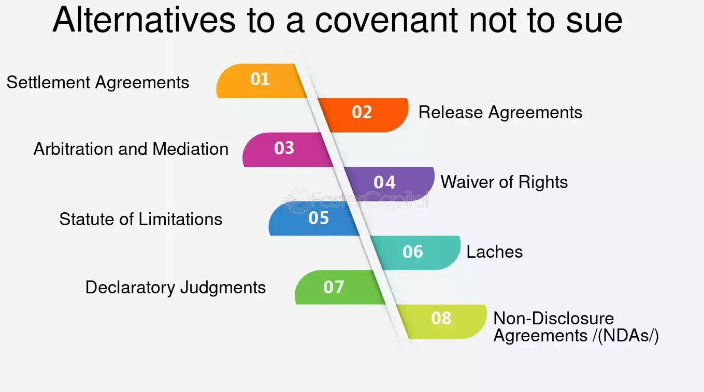

## Table of Contents

## What is a covenant not to sue?

A covenant not to sue is a legal agreement where one person or company promises not to take another person or company to court over a specific issue. This agreement is often used to settle disputes without going through a long and costly legal process. For example, if two businesses have a disagreement about a contract, they might agree that one will not sue the other in exchange for some form of compensation or a change in the contract terms.

This type of agreement can be beneficial because it helps both parties avoid the time, expense, and uncertainty of a lawsuit. However, it's important for the person or company giving up the right to sue to carefully consider the terms of the covenant. They need to make sure that the agreement fully resolves the issue and that they are comfortable with not being able to take legal action in the future. If the covenant is breached, the other party could still face legal consequences.

## How does a covenant not to sue differ from a release?

A covenant not to sue and a release are both legal agreements that help avoid lawsuits, but they work a bit differently. A covenant not to sue is a promise by one party not to sue another party over a specific issue. It's like saying, "I won't take you to court about this problem." This agreement can be useful for settling disputes without going to court, but it doesn't mean the right to sue is completely gone. If the other party doesn't follow the terms of the covenant, the person who made the promise might still be able to sue.

On the other hand, a release is more final. When someone signs a release, they are giving up their right to sue over a particular issue forever. It's like saying, "I will never take you to court about this, no matter what happens." Releases are often used in situations like settling personal injury claims or ending employment disputes. Once a release is signed, it's very hard to go back and sue about the same thing later.

## What are the common uses of a covenant not to sue?

A covenant not to sue is often used in business to settle disagreements without going to court. For example, if two companies have a problem with a contract, they might use a covenant not to sue to fix it. One company might agree not to sue the other if they get some money or if the contract is changed. This helps both companies avoid the time and cost of a lawsuit. It's a way to solve the problem and move on without a big legal fight.

Another common use is in real estate. When someone buys a piece of property, there might be issues like old liens or disputes with neighbors. A covenant not to sue can help clear up these problems. The buyer might agree not to sue the seller about these issues in exchange for a lower price or some other benefit. This way, the buyer can move forward with the purchase without worrying about future lawsuits, and the seller can sell the property more easily.

## Who are the typical parties involved in a covenant not to sue?

The typical parties involved in a covenant not to sue are usually businesses or individuals who have a disagreement they want to settle without going to court. For example, two companies might have a problem with a contract. One company might promise not to sue the other if they get some money or if the contract is changed. This helps both companies avoid a long and costly legal battle.

In real estate, the parties are often the buyer and the seller of a property. There might be issues like old debts on the property or disagreements with neighbors. The buyer might agree not to sue the seller about these problems in exchange for a lower price or some other benefit. This way, the buyer can buy the property without worrying about future lawsuits, and the seller can sell the property more easily.

## What are the key elements that should be included in a covenant not to sue?

A covenant not to sue should clearly state who is involved. This means naming the person or company promising not to sue and the person or company they are promising not to sue. It should also describe the specific issue or problem that the agreement covers. This helps make sure that everyone knows exactly what the agreement is about and there's no confusion later.

The agreement should also say what each side is getting out of the deal. For example, one side might get money or a change in a contract, while the other side gets the promise not to be sued. It's important to write down exactly what each side is giving and getting. This makes the agreement fair and clear. Finally, the covenant should be signed and dated by everyone involved to make it official and legally binding.

## How is a covenant not to sue legally enforceable?

A covenant not to sue is legally enforceable because it's a contract between two parties. When people or companies agree to it, they are making a promise that they will not take each other to court over a specific problem. This promise is written down in the covenant, which includes the names of the people involved, the exact issue they are agreeing not to sue about, and what each side is getting in return. By signing the covenant, both sides show that they agree to the terms, making it a legally binding document.

If one side breaks the covenant and decides to sue anyway, the other side can go to court to stop them. They can ask the court to enforce the covenant and prevent the lawsuit from moving forward. Courts usually respect these agreements because they help people settle disputes without long, expensive legal battles. But, if the covenant was made under unfair conditions or if it doesn't clearly state what it covers, a court might not enforce it. So, it's important to make sure the covenant is clear and fair to both sides.

## What are the potential risks and limitations of a covenant not to sue?

A covenant not to sue can have some risks. One big risk is that you might give up your right to sue without getting enough in return. If you agree not to sue someone and then find out later that you could have gotten more money or a better deal, you can't go back and change your mind. Another risk is that the other person might not keep their part of the deal. If they don't give you what they promised, you might still be able to sue them, but it can be hard to prove they broke the covenant.

There are also some limits to covenants not to sue. They only cover the specific issue written in the agreement. If a new problem comes up later, the covenant might not stop you from suing about that new problem. Also, courts might not always enforce a covenant if it was made unfairly or if it's not clear what it covers. So, it's important to make sure the covenant is fair and clear before you sign it.

## Can a covenant not to sue be revoked or terminated? If so, how?

A covenant not to sue can be revoked or terminated, but it's not easy. If both sides agree, they can cancel the covenant. They might decide to do this if they find a better way to solve their problem or if they want to go back to court. To make it official, they need to write down that they are canceling the covenant and both need to sign it. This shows that they both agree to end the agreement.

If one side wants to cancel the covenant but the other side doesn't, it's harder. The person who wants to cancel might need to go to court and prove that the covenant was made unfairly or that the other side didn't keep their part of the deal. For example, if the other side promised to pay money but didn't, a court might let the covenant be canceled. But, courts usually like to keep agreements in place, so it can be a tough fight.

## How does a covenant not to sue impact future legal actions?

A covenant not to sue stops one side from taking the other to court over the specific issue mentioned in the agreement. If you sign a covenant not to sue, you can't go back later and sue about that same problem. This helps both sides avoid long, costly legal battles by settling their disagreement without going to court. But, it only covers the exact issue written in the covenant. If a new problem comes up later, the covenant might not stop you from suing about that new issue.

If someone breaks the covenant and tries to sue anyway, the other side can go to court to stop them. They can ask the court to enforce the covenant and prevent the lawsuit from moving forward. Courts usually respect these agreements because they help people solve problems without fighting in court. But, if the covenant was made unfairly or if it's not clear what it covers, a court might not enforce it. So, it's important to make sure the covenant is fair and clear to both sides.

## What are the tax implications of entering into a covenant not to sue?

When you enter into a covenant not to sue, it can have tax implications depending on what you get in return. If you receive money or something else of value, you might have to pay taxes on it. For example, if you agree not to sue someone and they pay you money, that money could be considered income and you might have to pay income tax on it. It's important to talk to a tax professional to understand how this might affect your taxes.

The tax treatment can also depend on the reason for the covenant. If the covenant is part of a settlement for a business dispute, the tax implications might be different than if it's related to a personal injury claim. In some cases, payments received from a covenant not to sue might be tax-free, especially if they are for physical injuries or sickness. Always check with a tax advisor to make sure you understand the tax rules that apply to your specific situation.

## How should a covenant not to sue be drafted to ensure clarity and effectiveness?

When drafting a covenant not to sue, it's important to be very clear and specific. Start by naming the people or companies involved. Then, describe the exact problem or issue that the covenant covers. This helps everyone understand what the agreement is about and avoids confusion later. Also, write down what each side is getting out of the deal. For example, one side might get money or a change in a contract, while the other side gets the promise not to be sued. Make sure all these details are clear and easy to understand.

Once you have all the details, make sure the covenant is signed and dated by everyone involved. This makes the agreement official and legally binding. It's a good idea to have a lawyer look over the covenant to make sure it's fair and covers everything it needs to. A well-drafted covenant not to sue can help both sides avoid a long and costly legal battle by settling their disagreement without going to court.

## What are some notable case studies or examples where covenants not to sue played a significant role?

In a famous case between Microsoft and Sun Microsystems in the early 2000s, a covenant not to sue helped settle a big disagreement. Microsoft and Sun were fighting over how Microsoft used Sun's technology in its software. They finally agreed that Microsoft would pay Sun a lot of money, and in return, Sun promised not to sue Microsoft about this problem. This covenant not to sue helped both companies avoid a long court battle and move on with their businesses.

Another example is the settlement between Google and the Authors Guild in 2012. The Authors Guild had sued Google for scanning and showing parts of books online without permission. They settled the case with Google agreeing to pay money to a fund for authors, and the Authors Guild promising not to sue Google about this issue again. This covenant not to sue allowed Google to keep its book scanning project going without worrying about more lawsuits from the Authors Guild.

## References & Further Reading

[1]: ["Algorithmic Trading: Winning Strategies and Their Rationale"](https://www.wiley.com/en-us/Algorithmic+Trading%3A+Winning+Strategies+and+Their+Rationale-p-9781118460146) by Ernest P. Chan

[2]: ["Financial Markets and Trading: An Introduction to Market Microstructure and Trading Strategies"](https://archive.org/details/financialmarkets0000schm) by Anatoly B. Schmidt

[3]: Kat, H. M., & Palaro, H. P. (2005). ["Who Needs Hedge Funds? A Copula-Based Approach to Hedge Fund Return Replication."](https://papers.ssrn.com/sol3/papers.cfm?abstract_id=855424) Cass Business School Research Paper.

[4]: Lin, C., MacKinlay, A. C., & Pastor, L. (2001). ["Competition Among Mutual Funds."](https://www.nber.org/papers/w7162) Journal of Financial Economics.

[5]: ["Derivatives Law and Regulation"](https://cap-press.com/books/isbn/9781531021108/Derivatives-Law-and-Regulation-Third-Edition) by J. Vedder Price, P.C.

[6]: Oster, J. (2012). ["Algorithmic Trading and Artificial Intelligence: Technology, Regulation, and Reconstruction in Capital Markets."](https://www.naturalhealthresearch.org/the-effect-of-matcha-green-tea-on-cognitive-function-and-sleep-quality-in-older-adults-with-cognitive-decline/) Public Money & Management.

[7]: Hull, J. C. (2015). ["Options, Futures, and Other Derivatives"](https://www.semanticscholar.org/paper/Options%2C-Futures%2C-and-Other-Derivatives-Hull/89bdee500c8623864fc9eb7a471546aa713acc44) by John C. Hull.