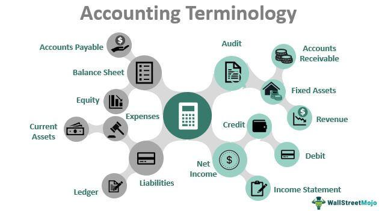

Algorithmic trading, often referred to as algo trading, involves the use of computer programs to execute trading strategies at high speed and volume. These programs are engineered to follow predefined instructions for trading, which may involve timings, prices, or quantities, allowing them to operate seamlessly across various asset classes. This article will explore the concept of algorithmic trading, discuss its numerous applications, and outline some of the leading platforms and software utilized in this domain. Furthermore, we will examine the pros and cons of algo trading and offer guidance on selecting the right platform tailored to different trading needs. By the conclusion of this article, you will have gained a comprehensive understanding of how algorithmic trading functions and how it can be effectively leveraged for investment purposes.

## Table of Contents

## What is Algorithmic Trading?

Algorithmic trading, commonly known as algo trading, involves the use of computer-driven algorithms to execute trading strategies automatically. These algorithms rely on predefined criteria to determine the specifics of trades, including timing, price, and quantity. One of the defining characteristics of algorithmic trading is its capacity for high-speed execution coupled with efficiency, allowing for the trading of large volumes with remarkable precision. 

At its core, algorithmic trading systems are designed to enact trading strategies without direct human intervention. A basic algorithm might involve straightforward instructions, such as executing a purchase order for 100 shares when a stock price falls below a certain threshold (e.g., $X). More advanced strategies can integrate complex operations, including technical indicators and market signals that adapt to changing conditions in real-time.

The ultimate aim of algorithmic trading is to mitigate human error, curtail emotional biases in decision-making, and enhance the overall effectiveness of trading activities. By automating routine trading processes, algo trading systems can operate continuously and consistently, regardless of the time of day or fluctuations in trader availability. This automation contributes significantly to improved risk management, as trades can be executed and adjusted with split-second accuracy based on current market data.

In essence, algorithmic trading not only increases the speed and efficiency of trades but also enhances decision-making by relying on data-driven input, ensuring that trading strategies are executed with unwavering discipline.

## Applications of Algorithmic Trading

Algorithmic trading has become a cornerstone for various market participants due to its ability to efficiently execute trades and leverage computational power. Its applications span a range of functions, each vital to both institutional and retail trading landscapes.

Financial institutions heavily rely on [algorithmic trading](/wiki/algorithmic-trading) for [market making](/wiki/market-making), a process where [liquidity](/wiki/liquidity-risk-premium) is provided to the market. By using algorithms, these institutions can continuously quote buy and sell prices, adjusting dynamically to market conditions with unparalleled speed and accuracy. This automation ensures tighter spreads and more efficient markets, serving customers while capturing small profits from bid-ask spreads.

Arbitrage opportunities, albeit fleeting, are another key application. Algorithms can detect price discrepancies between different markets or financial instruments faster than any human could. For example, if a stock is priced lower on one exchange than on another, an algorithm can buy the undervalued stock and sell it where it is overpriced, pocketing the difference. This swift action is crucial, as [arbitrage](/wiki/arbitrage) opportunities are often small and short-lived, necessitating the speed and precision of algorithms.

In addition to institutional use, retail traders also benefit from algorithmic trading by implementing personal strategies automatically. Platforms provide tools that allow traders to set specific criteria, such as technical indicators or price thresholds, enabling trades to occur without constant oversight. This automation frees the trader from having to monitor markets continuously, thus allowing for more disciplined and emotion-free trading.

High-frequency trading ([HFT](/wiki/high-frequency-trading-strategies)) is another domain dominated by algorithms. HFT strategies execute a large number of orders at extremely high speeds, often completed in microseconds or fractions of a second. This type of trading requires substantial investment in technology and infrastructure to minimize latency as every microsecond can impact trading outcomes. HFT is used to not only capture arbitrage opportunities but also to engage in other strategies, such as rapid [momentum](/wiki/momentum) trading, where the aim is to capitalize on market trends as they emerge.

In summary, algorithmic trading encompasses a variety of applications critical to modern financial markets. From facilitating market efficiency and exploiting arbitrage opportunities to enabling advanced trading strategies for both institutional and retail participants, its role continues to expand as technology progresses.

## Top Algorithmic Trading Platforms

TradeStation is a prominent platform in algorithmic trading, renowned for its user-friendly syntax known as EasyLanguage. This makes it accessible to beginners while still catering to the needs of advanced traders. TradeStation provides users with comprehensive analytical tools, real-time data, and the ability to backtest strategies, ensuring a robust framework for developing and executing complex trading models.

[Interactive Brokers](/wiki/interactive-brokers-api) is another key player, offering extensive API access for custom algorithm development. This platform is particularly favored by tech-savvy users who seek flexibility in integrating their bespoke algorithms. Its Trader Workstation (TWS) is sophisticated, providing advanced charting capabilities and real-time global market data, making it suitable for those looking to engage in high-frequency trading (HFT).

TrendSpider focuses on providing exhaustive U.S. market coverage, complemented by unique tools that facilitate both automated and manual trading strategies. Equipped with features such as automated technical analysis and dynamic alerts, TrendSpider is designed to empower traders with the ability to streamline their decision-making process and enhance their market timing.

Coinrule stands out in the domain of [cryptocurrency](/wiki/cryptocurrency) trading. It is tailored for users who wish to automate their trading strategies without needing advanced programming skills. Its user-friendly interface enables beginners to create trading bots through a simple drag-and-drop feature, giving them a competitive edge in the volatile crypto market.

## Pros and Cons of Algorithmic Trading

Algorithmic trading offers several advantages that contribute to its widespread adoption in the financial markets. One of the primary benefits is efficiency, as computer algorithms can process vast amounts of market data with speed and precision. This allows for high-frequency trading, where execution occurs in milliseconds, far exceeding human capabilities. The speed at which algo trading operates can lead to improved price formation, as algorithms respond to market conditions faster than manual traders.

Another significant advantage is the ability to backtest strategies. Before deploying algorithms in live markets, traders can test their strategies against historical data to evaluate performance and optimize parameters. This process helps identify potential flaws and enhances the algorithm's reliability. Algorithms also promote objective decision-making, reducing emotional bias that can negatively impact trading decisions.

Risk management is enhanced through algorithmic trading as well. Algorithms can quickly react to pre-established risk thresholds and market conditions, automatically executing trades to mitigate potential losses. This rapid response capability can protect investments in volatile markets or during unexpected events.

However, these advantages come with several drawbacks. Dependence on technology means that algorithmic trading is vulnerable to technical glitches or software errors, which may lead to significant financial losses. Additionally, while algorithms are effective at executing trades, they require rigorous monitoring to ensure they function as intended. Unforeseen market conditions, such as flash crashes, may pose a risk, necessitating human oversight.

Despite streamlining trading processes, the success of algorithmic trading hinges on the quality of input rules and continuous market analysis. Poorly designed algorithms or outdated data can lead to suboptimal results. Maintaining and updating trading algorithms requires expertise and continuous research to adapt to changing market dynamics, emphasizing the need for experienced personnel to oversee operations and make necessary adjustments.

## Selecting the Best Algorithmic Trading Software

When selecting the best algorithmic trading software, several crucial factors should be considered to ensure alignment with your trading strategies and goals. These factors include ease of use, cost, execution speed, data access, and the availability of risk management tools.

Ease of use is essential, especially for beginners who might not be familiar with complex trading interfaces. User-friendly platforms can significantly enhance the trading experience by allowing users to focus on strategy development rather than struggling with technical hurdles. Look for platforms that offer intuitive interfaces and streamlined workflows.

Cost is another critical [factor](/wiki/factor-investing) in choosing a trading platform. It's important to assess whether the platform's pricing aligns with your budget and trading frequency. Some platforms offer tiered pricing models based on trading [volume](/wiki/volume-trading-strategy), while others may charge a flat fee or a monthly subscription. Understanding the cost structure helps in making an informed decision that suits your financial plan.

Execution speed is paramount, particularly in algorithmic trading that relies on precise market timing. Faster execution can lead to better trading outcomes, especially in volatile markets. It’s recommended to choose a platform with low latency to ensure that trading strategies are executed swiftly and effectively.

Data access is vital for informed decision-making. Ensure the platform provides comprehensive access to historical and real-time market data. Quality data is the backbone of successful algorithmic trading strategies, enabling thorough [backtesting](/wiki/backtesting) and robust strategy formulation.

Risk management tools are necessary to safeguard investments. Look for platforms offering features like stop-loss orders, position sizing, and other risk mitigation strategies. Effective risk management tools can help minimize potential losses and protect capital in uncertain market conditions.

The reliability of a platform's backtesting features is also critical. Backtesting allows traders to simulate their strategies against historical data to evaluate performance without financial risk. Particularly if high-frequency trading is part of your approach, ensure the platform provides rigorous and accurate backtesting capabilities.

For beginners, selecting a platform that offers educational resources and strong customer support can be highly beneficial. Some platforms include tutorials, webinars, and community forums to help users learn and refine their trading strategies. Reliable customer support ensures that assistance is readily available, should technical issues or questions arise.

By carefully considering these factors, traders can select an algorithmic trading platform that not only complements their skill level and trading style but also supports their long-term investment objectives.

## Conclusion

Algorithmic trading has become a transformative force in the financial markets, altering the traditional methods of trading by leveraging advanced technological solutions. This mode of trading allows both institutional and retail investors to enhance their trading strategies through the use of sophisticated algorithms. These algorithms make it possible to execute trades with impressive speed and precision, thereby optimizing investment decisions and improving market efficiency.

As technological innovations continue, the accessibility and functionality of algorithmic trading platforms have significantly advanced. Improved computational power, enhanced data analytics, and innovative algorithmic strategies offer more adaptive and robust trading solutions. The development of user-friendly interfaces and educational resources has made algorithmic trading more accessible to a wider audience, including those who may not have a background in technology or finance.

For investors contemplating the use of algorithmic trading, it is crucial to balance the potential benefits with the inherent challenges. While algorithmic trading can offer increased efficiency, reduce human error, and allow for complex strategies to be implemented effortlessly, it also comes with risks such as technological dependency and the possibility of substantial losses due to unforeseen market [volatility](/wiki/volatility-trading-strategies) or software glitches. Therefore, selecting a trading platform that aligns with one's trading goals and expertise is essential. Considerations such as ease of use, cost, execution speed, data access, and risk management tools should be prioritized.

Investors are advised to conduct thorough research on the available platforms to ensure that they choose one that offers the features necessary to effectively execute their trading strategies while also providing ample support and educational resources. By making informed choices, traders can harness the full potential of algorithmic trading to achieve their investment objectives.

## References & Further Reading

[1]: ["Advances in Financial Machine Learning"](https://www.amazon.com/Advances-Financial-Machine-Learning-Marcos/dp/1119482089) by Marcos Lopez de Prado

[2]: ["Evidence-Based Technical Analysis: Applying the Scientific Method and Statistical Inference to Trading Signals"](https://www.amazon.com/Evidence-Based-Technical-Analysis-Scientific-Statistical/dp/0470008741) by David Aronson

[3]: ["Machine Learning for Algorithmic Trading"](https://github.com/stefan-jansen/machine-learning-for-trading) by Stefan Jansen

[4]: ["Quantitative Trading: How to Build Your Own Algorithmic Trading Business"](https://www.amazon.com/Quantitative-Trading-Build-Algorithmic-Business/dp/1119800064) by Ernest P. Chan

[5]: Bergstra, J., Bardenet, R., Bengio, Y., & Kégl, B. (2011). ["Algorithms for Hyper-Parameter Optimization."](https://proceedings.neurips.cc/paper/2011/file/86e8f7ab32cfd12577bc2619bc635690-Paper.pdf) Advances in Neural Information Processing Systems 24.