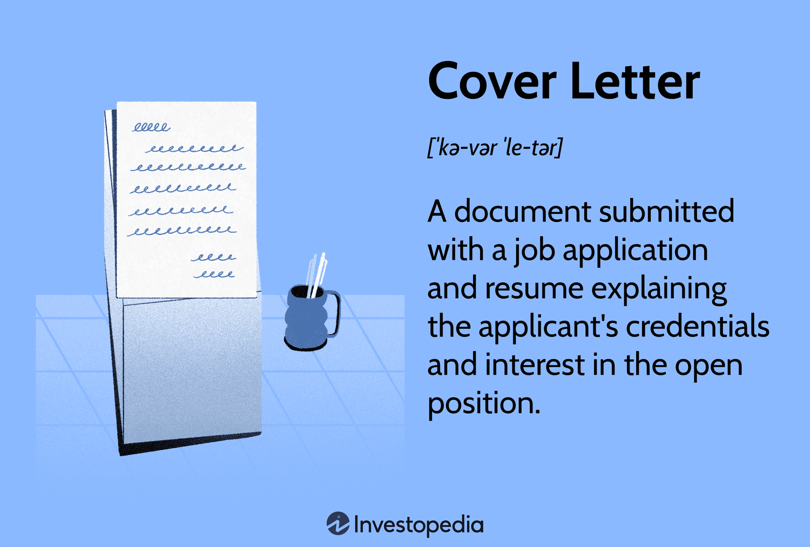

## Table of Contents

## What is a cover in general terms?

A cover is something that goes over or around another thing to protect it or hide it. It can be like a lid on a box, a jacket you wear to stay warm, or even a sheet you put over furniture to keep it clean. Covers can be made from many different materials, like cloth, plastic, or metal, and they come in all shapes and sizes depending on what they need to cover.

In everyday life, we use covers for many reasons. For example, we use a book cover to keep the pages safe and make the book look nice. We also use covers on our phones to protect them from getting scratched or broken. Covers help keep things safe and can make them last longer, which is why they are so useful in many situations.

## How is the concept of a cover used in different fields?

In music, a cover is when a band or singer performs a song that was originally done by someone else. They might sing it the same way or change it to sound different. This can introduce the song to new listeners or give it a fresh feel. In insurance, a cover means the protection or financial help you get if something bad happens, like if your house burns down or you get sick. It's like a safety net that helps you when you need it.

In cooking, a cover can be a lid that you put on a pot to keep the heat and steam inside, which helps cook the food faster and keep it moist. In sports, especially baseball, a cover can refer to the material that goes over the ball, like the leather on a baseball. This cover can affect how the ball moves through the air or how it feels when you catch it. Each field uses the idea of a cover in its own special way, but they all have to do with protecting, hiding, or changing something.

## What is a cover in the context of mathematics, specifically topology?

In topology, a cover is a collection of sets that together include all the points in a larger set. Imagine you have a big blanket, and you want to cover it completely with smaller blankets. Each smaller blanket is like one of the sets in the cover, and together, they cover the entire big blanket without leaving any part of it uncovered. This idea helps mathematicians study the properties of spaces and how they connect.

For example, if you think of the Earth as a big set, you could cover it with many small circles, like using many small pieces of paper to cover a globe. Each circle would be part of the cover, and if you put them all together, they would cover the whole Earth. This concept is useful in topology because it helps us understand the structure of spaces and how different parts relate to each other.

## What are the basic types of covers in topology?

In topology, there are two main types of covers: open covers and closed covers. An open cover is a collection of open sets that together cover the entire space. Think of it like using pieces of a net to cover a ball; each piece of the net is open, and you need enough pieces to cover the whole ball. A closed cover, on the other hand, is made of closed sets. It's like using solid puzzle pieces to cover a picture; each piece is closed, and they fit together to cover everything.

These types of covers help mathematicians study spaces in different ways. Open covers are important because they help define important concepts like compactness. If you can always find a smaller group of open sets that still covers the space, the space is called compact. Closed covers are useful for understanding how spaces can be broken down into smaller parts and put back together. Both types of covers are tools that help us see and understand the properties of spaces in topology.

## How does the concept of a cover apply to graph theory?

In graph theory, a cover is a way to choose some parts of a graph so that they include all the important things you want to cover. Think of a graph like a map with dots (called vertices) and lines (called edges) connecting the dots. A vertex cover is when you pick some of the dots so that every line on the map touches at least one of the chosen dots. It's like putting stickers on some of the dots to make sure every line is covered by at least one sticker.

An edge cover is a bit different. Instead of choosing dots, you choose some of the lines so that every dot on the map is touched by at least one of the chosen lines. Imagine drawing lines on a map to make sure every dot is touched by at least one line. Both types of covers help us understand how the parts of a graph connect and how we can use the least amount of parts to cover everything we need.

## What is a covering map and how is it used in algebraic topology?

A covering map is like a way to stretch a simple shape over a more complicated one without tearing or folding the simple shape. Think of it like pulling a rubber sheet over a bumpy surface. The rubber sheet is the simple shape, and the bumpy surface is the more complicated one. In algebraic topology, this helps us study the complicated shape by looking at the simpler one. It's like using a map to understand a city; the map is simpler, but it helps us see how everything connects in the city.

In algebraic topology, covering maps are used to understand the structure of spaces. They help us break down a complicated space into simpler pieces that are easier to study. By looking at how the simple shape covers the complicated one, we can learn about the holes, tunnels, and other features of the complicated space. This is really useful because it lets us use the tools of algebra to study shapes and spaces, which can be hard to understand just by looking at them.

## Can you explain the use of covers in computer science, particularly in data structures?

In computer science, covers are used in data structures to help organize and manage data efficiently. Think of a cover like a blanket that you use to cover a bed. In data structures, a cover can be a way to group together different pieces of data so that you can work with them more easily. For example, in a database, a cover index is a type of index that includes all the columns needed for a query. This means you can get all the information you need from the index without having to look at the main data, which can make your computer work faster.

Another way covers are used in computer science is in algorithms that need to search through data. Imagine you have a big list of names, and you want to find all the names that start with the letter "A". A cover in this case could be a smaller list that only includes names starting with "A". By using this smaller list, or cover, you can find the names you need more quickly than if you had to search through the entire big list. This helps make computer programs run more efficiently and can save a lot of time when dealing with large amounts of data.

## What role do covers play in coding theory and error correction?

In coding theory, covers are used to help make sure messages sent over the internet or through other ways stay correct, even if something goes wrong during sending. Imagine you're sending a secret code to a friend, but some of the numbers might get mixed up along the way. A cover in coding theory is like an extra set of numbers that you add to your message. These extra numbers help figure out if any part of your message got messed up and can even fix it. This is really important for things like sending emails or making phone calls, where you want to make sure the message gets through right.

Error correction codes use covers to make sure the message stays the same from start to finish. When you send a message, you add some extra bits, like adding extra letters to a word to make sure it can be read correctly even if some letters get smudged. These extra bits form a cover that helps spot and fix errors. By using covers, we can make sure that even if a few bits get changed during sending, the message can still be understood correctly. This is how we keep our internet and phone calls working smoothly, even when things go wrong.

## How are covers utilized in the field of insurance?

In insurance, a cover means the protection or help you get if something bad happens. It's like a safety net that catches you if you fall. When you buy insurance, you pay money to the insurance company, and in return, they promise to help you if you have a problem, like if your house burns down or if you get sick. This help can be money to fix things or pay for medical bills, and it can make a big difference when things go wrong.

The type of cover you get depends on the kind of insurance you buy. For example, health insurance covers medical costs, while car insurance can help pay for repairs if you have an accident. Insurance companies look at how likely it is for something bad to happen and how much it might cost to fix it. They use this information to decide how much you need to pay for your insurance and how much help you can get if you need it. This way, people can feel safer knowing they have a plan in place for when things don't go as expected.

## What advanced applications of covers exist in network security?

In network security, covers are used to protect information as it travels across the internet. Think of a cover like a secret code that keeps your messages safe from people who might try to read them. When you send an email or use a website, your computer adds a special cover to the information. This cover, called encryption, makes sure that only the person you're sending it to can read it. If someone else tries to look at your message, all they see is a bunch of scrambled letters and numbers that don't make sense.

Another way covers are used in network security is to check if the information you receive is correct and hasn't been changed by someone else. This is called a digital signature, which is like a special stamp that shows the message is from the right person and hasn't been messed with. The cover in this case is a kind of math problem that only the sender can solve correctly. If the cover doesn't match up, you know something might be wrong, and you can be careful about trusting the message. This helps keep your computer and your information safe from hackers and other bad guys.

## How do covers contribute to the field of machine learning, specifically in model ensembling?

In [machine learning](/wiki/machine-learning), covers are used in model ensembling to make predictions more accurate. Imagine you have a bunch of friends who are good at guessing the weather. Instead of just asking one friend, you ask all of them and then take a vote on what they think. The "cover" here is like using all their guesses together to cover all the possible weather outcomes. By combining the predictions of many different models, or "covering" the problem with multiple approaches, you can get a better overall guess than if you used just one model. This is because different models might be good at different things, and by covering all these different strengths, you can make a more reliable prediction.

This idea of using covers in model ensembling helps in making machine learning systems more robust and less likely to make big mistakes. For example, if one model makes a wrong guess, the other models can help correct it. It's like having a team of doctors look at your health instead of just one; they can cover more possibilities and give you a better diagnosis. By using covers in this way, machine learning can handle complex problems better and give more trustworthy results.

## What are the current research trends and future directions in the study of covers across various disciplines?

In many fields, researchers are finding new ways to use covers to solve problems and make things better. In topology, people are working on understanding how covers can help study the shapes and spaces around us. They are trying to find new kinds of covers that can make it easier to see how different parts of a space connect. In computer science, covers are being used to make data searches faster and more efficient. Scientists are looking at how to use covers in big data to quickly find what they need without going through all the information. In machine learning, the focus is on using covers to make models work together better, so they can make more accurate predictions.

Looking ahead, the future of covers in different fields looks exciting. In network security, researchers are working on new kinds of covers that can make online information even safer. They want to create covers that can change and adapt to new threats, keeping our data protected no matter what happens. In coding theory, the goal is to use covers to make error correction even better, so messages can be sent and received without any mistakes. And in insurance, the trend is toward using covers to create more personalized plans that fit people's needs better, helping them feel safer and more secure. As these fields keep growing, covers will play an even bigger role in making our world work better and more safely.

## References & Further Reading

[1]: ["Advances in Financial Machine Learning"](https://www.amazon.com/Advances-Financial-Machine-Learning-Marcos/dp/1119482089) by Marcos Lopez de Prado

[2]: ["Evidence-Based Technical Analysis: Applying the Scientific Method and Statistical Inference to Trading Signals"](https://www.amazon.com/Evidence-Based-Technical-Analysis-Scientific-Statistical/dp/0470008741) by David Aronson

[3]: ["Machine Learning for Algorithmic Trading"](https://github.com/stefan-jansen/machine-learning-for-trading) by Stefan Jansen

[4]: ["Quantitative Trading: How to Build Your Own Algorithmic Trading Business"](https://www.amazon.com/Quantitative-Trading-Build-Algorithmic-Business/dp/1119800064) by Ernest P. Chan

[5]: Bergstra, J., Bardenet, R., Bengio, Y., & Kégl, B. (2011). ["Algorithms for Hyper-Parameter Optimization."](https://proceedings.neurips.cc/paper/2011/file/86e8f7ab32cfd12577bc2619bc635690-Paper.pdf) Advances in Neural Information Processing Systems 24.