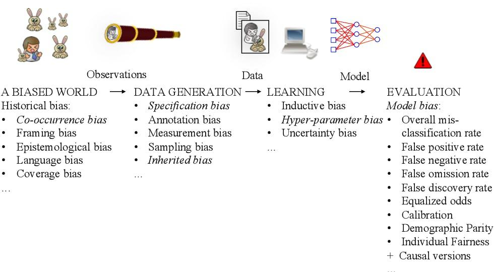

## Table of Contents

## What is coverage bias in the context of machine learning?

Coverage bias in machine learning happens when the data used to train a model does not represent all the different kinds of people or situations the model will encounter in the real world. Imagine you are making a model to predict if someone will like a movie. If your data only includes people from one age group or one country, your model might not work well for people from other age groups or countries. This is because the model has not "seen" enough variety in the training data to make good predictions for everyone.

To fix coverage bias, you need to make sure your training data includes a wide range of examples that reflect the real world. For example, if you are building a model to recognize different kinds of animals, you should include pictures of animals from different places, in different lighting, and at different times of the day. By doing this, your model will be better at recognizing animals no matter where or when the picture was taken. Addressing coverage bias helps make sure your model is fair and works well for everyone.

## How does coverage bias affect the performance of machine learning models?

Coverage bias can make machine learning models perform poorly because they are not trained on data that represents all the situations they will face in the real world. If a model is trained only on data from a specific group of people or a narrow set of conditions, it might work well for that group but struggle with others. For example, if a facial recognition system is trained mostly on images of people with light skin, it might not recognize faces of people with darker skin tones as well. This happens because the model has not learned enough about the variety of faces it needs to recognize.

This kind of bias can lead to unfair outcomes and lower the overall accuracy of the model. When a model fails to perform well across different groups or situations, it can cause problems in real-world applications. For instance, if a loan approval model is biased because it was trained on data from only wealthy neighborhoods, it might unfairly reject applications from people in less wealthy areas. To improve model performance and fairness, it's important to use training data that covers a wide range of examples, reflecting the diversity of the real world.

## Can you explain the difference between coverage bias and other types of bias in machine learning?

Coverage bias is when the data used to train a machine learning model doesn't include enough variety to represent all the different kinds of people or situations the model will see in the real world. For example, if you're building a model to predict house prices and your data only includes houses from one city, your model might not work well for houses in other cities. This happens because the model hasn't learned about the different factors that affect house prices in various places. To fix coverage bias, you need to make sure your training data includes a wide range of examples that reflect the real world.

Another type of bias is selection bias, which happens when the way you collect data means some groups are more likely to be included than others. For instance, if you're doing a survey about internet use and you only ask people who visit a certain website, you might miss out on people who don't use that site. This can make your data not represent everyone equally. Unlike coverage bias, which is about the variety within the data, selection bias is about how the data is gathered in the first place.

There's also measurement bias, which occurs when the way you measure something leads to different results for different groups. For example, if you're using a scale that's not accurate for people of different weights, your measurements might be biased. Measurement bias is different from coverage bias because it's about the accuracy of the data you collect, not the variety of the data. Understanding these different types of bias helps you build better, fairer machine learning models.

## What are common causes of coverage bias in datasets?

Coverage bias often happens because the data collected for training a machine learning model does not include enough variety. For example, if a company only collects data from their customers in one country, the model might not work well for people in other countries. This can happen because it's easier or cheaper to collect data from one place or group of people. Sometimes, people don't realize that their data is missing important parts of the population until they see the model making mistakes.

Another common cause of coverage bias is when the data collection process itself limits the variety of data. For instance, if a survey about health is only sent to people who visit a certain website, it might miss out on people who don't use that site. This means the data won't represent everyone equally. To avoid coverage bias, it's important to think carefully about where the data comes from and make sure it includes a wide range of examples that reflect the real world.

## How can coverage bias be identified in a machine learning dataset?

To identify coverage bias in a machine learning dataset, you need to check if the data includes a wide variety of examples that reflect the real world. Start by looking at the data and asking if it covers all the different kinds of people or situations the model will see. For example, if you're building a model to predict if someone will like a movie, make sure your data includes people of different ages, from different countries, and with different tastes in movies. You can use statistics to help you see if some groups are missing or underrepresented in your data.

Another way to find coverage bias is by testing your model with new data that it hasn't seen before. If the model works well for some groups but not for others, that's a sign of coverage bias. For instance, if a facial recognition system works well for people with light skin but struggles with people with darker skin, it means the training data likely did not include enough variety in skin tones. By carefully examining your data and the performance of your model across different groups, you can spot and address coverage bias to make your model fairer and more accurate.

## What are the potential impacts of coverage bias on model fairness and equity?

Coverage bias can have big effects on how fair and equal a machine learning model is. When a model is trained on data that doesn't include enough variety, it might work well for some people but not for others. For example, if a model to approve loans is trained only on data from rich neighborhoods, it might unfairly reject people from poorer areas. This happens because the model hasn't learned about the different situations that affect people in various places. As a result, the model can make decisions that seem unfair and can hurt certain groups of people more than others.

To make sure a model is fair and equal, it's important to use training data that covers a wide range of examples, reflecting the real world. If a model is not trained on diverse data, it can lead to biased outcomes that do not treat everyone the same way. For instance, if a healthcare model is trained mostly on data from one age group, it might not work well for older or younger patients. By checking the data carefully and making sure it includes all kinds of people and situations, we can help the model make fair decisions for everyone.

## What techniques can be used to mitigate coverage bias during data collection?

To reduce coverage bias when collecting data, it's important to make sure the data includes a wide variety of examples. One way to do this is by using stratified sampling. This means dividing the population into different groups based on important characteristics, like age, gender, or location, and then collecting data from each group in a way that matches their proportion in the real world. For example, if you're studying movie preferences and you know that 30% of movie-goers are teenagers, you should make sure 30% of your data comes from teenagers. This helps make sure your data covers all kinds of people and situations.

Another technique is to use multiple sources of data. Instead of just collecting data from one place or group, gather information from different places and groups. This can help you get a more complete picture of the real world. For instance, if you're building a model to predict house prices, you could collect data from different cities and neighborhoods to make sure your model works well everywhere. By combining data from various sources, you can reduce the chances of missing out on important parts of the population and make your model fairer and more accurate.

## How can data preprocessing help in reducing coverage bias?

Data preprocessing can help reduce coverage bias by making sure the data used to train a machine learning model is more balanced and representative of the real world. One way to do this is by cleaning the data to remove any duplicates or errors that might make some groups overrepresented. For example, if you have a dataset with many entries from one city and few from others, you can remove extra entries from the overrepresented city to make the data more even. This helps the model learn from a wider variety of examples, making it fairer and more accurate.

Another way data preprocessing can help is by using techniques like data augmentation and synthetic data generation. Data augmentation involves creating new data points by slightly changing existing ones, like rotating images or adding noise to audio files. This can help increase the variety in the dataset, making sure the model sees different kinds of examples. Synthetic data generation, on the other hand, involves creating entirely new data points that match the characteristics of underrepresented groups. By adding these new examples to the dataset, you can make sure the model learns about all kinds of people and situations, reducing coverage bias and improving the model's performance and fairness.

## What role do model selection and algorithm choice play in addressing coverage bias?

Model selection and algorithm choice are important for dealing with coverage bias because they affect how well a model can handle different kinds of data. Some algorithms are better at learning from varied data than others. For example, decision trees and random forests can work well with different kinds of data because they can split the data in many ways. On the other hand, models like linear regression might struggle if the data is not evenly spread out. By choosing the right model, you can make sure it can learn from all the different examples in your dataset, helping to reduce coverage bias.

Another way model selection and algorithm choice help is by allowing you to use techniques like ensemble methods. Ensemble methods combine the predictions of several models to make a final decision. This can help because different models might be good at different parts of the data. For instance, one model might be good at predicting outcomes for one group of people, while another model is better for a different group. By using ensemble methods, you can take advantage of the strengths of each model, making the final prediction more fair and accurate for everyone.

## Can you discuss any real-world examples where coverage bias significantly influenced machine learning outcomes?

One real-world example of coverage bias affecting machine learning outcomes is in the case of facial recognition technology. A study by Joy Buolamwini and Timnit Gebru found that some popular facial recognition systems had higher error rates for people with darker skin tones, especially for women. The reason was that these systems were mostly trained on images of people with lighter skin. Because the training data didn't include enough variety in skin tones, the models performed poorly for people who looked different from the majority in the dataset. This showed how important it is to have diverse data to make sure technology works fairly for everyone.

Another example is in the healthcare industry, where machine learning models are used to predict patient outcomes and help with treatment decisions. A study by Ziad Obermeyer and Sendhil Mullainathan found that an algorithm used to predict health risks was biased against Black patients. The algorithm was trained on data that included healthcare costs, which are often lower for Black patients due to less access to care. As a result, the model underestimated the health risks for Black patients, leading to less care being recommended for them. This example highlights how coverage bias in training data can lead to unfair and harmful outcomes in real-world applications.

## How can ongoing monitoring and evaluation help manage coverage bias in deployed models?

Ongoing monitoring and evaluation are important for managing coverage bias in deployed machine learning models. When a model is used in the real world, it's helpful to keep checking if it's working well for all kinds of people and situations. By looking at the model's performance over time, you can see if it's making mistakes for certain groups. For example, if a model to predict loan approvals is rejecting more applications from one group than others, that's a sign of coverage bias. By catching these issues early, you can fix the model to make it fairer and more accurate for everyone.

To do this, you can use tools and methods to keep track of the model's performance. One way is to regularly test the model with new data that includes a wide variety of examples. If the model works well for some groups but not for others, you know there's a problem with coverage bias. Another way is to use fairness metrics, which help you see if the model is treating all groups the same way. By monitoring these metrics and making changes to the model when needed, you can make sure it stays fair and works well for everyone, even as the world changes.

## What are the advanced statistical methods used to quantify and correct for coverage bias in machine learning research?

Advanced statistical methods help researchers understand and fix coverage bias in machine learning. One common method is propensity score matching, which tries to balance the data so that different groups are represented fairly. This method uses a score called the propensity score, which shows how likely someone is to be included in the data based on their characteristics. By matching people with similar propensity scores, researchers can create a more balanced dataset. This helps the model learn from a wider variety of examples, reducing coverage bias. Another method is inverse probability weighting, where each data point is given a weight based on how likely it was to be included in the dataset. This can help correct for underrepresented groups by giving them more importance in the model's training.

Another advanced method is the use of causal inference techniques, which help understand how different factors affect the outcomes the model is trying to predict. By using these techniques, researchers can see if the model's predictions are biased because of missing data or other issues. For example, they might use a technique called doubly robust estimation, which combines both outcome regression and propensity score methods to get a more accurate estimate of the model's performance across different groups. This helps identify where coverage bias might be affecting the model and suggests ways to fix it. By using these advanced statistical methods, researchers can make their models fairer and more accurate, ensuring they work well for everyone.