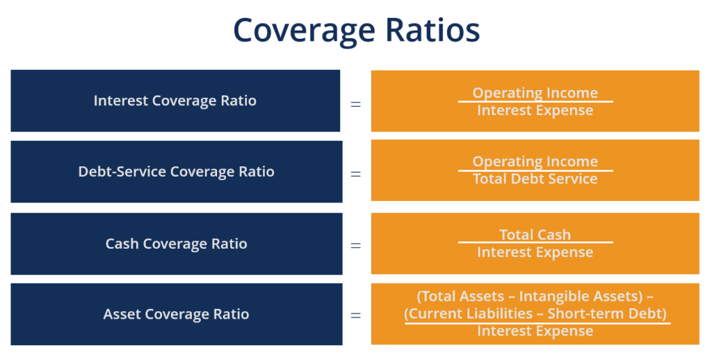

In the evolving landscape of financial analysis and investment strategies, the integration of financial ratios, coverage ratios, and algorithmic trading has become increasingly important. Financial ratios serve as a cornerstone in evaluating a company's economic health, allowing investors and analysts to assess various dimensions such as profitability, liquidity, and solvency. These ratios offer a quantitative foundation critical for comparing different companies, thereby aiding in informed investment decisions.

Among financial ratios, coverage ratios, such as the interest coverage ratio, provide key insights into a company’s ability to meet its financial obligations. The interest coverage ratio, for example, is defined by the formula:



$$
\text{Interest Coverage Ratio} = \frac{\text{EBIT}}{\text{Interest Expense}}
$$

where EBIT represents earnings before interest and taxes. A higher ratio typically indicates that a company is more capable of covering its interest obligations, suggesting lower financial risk.

Algorithmic trading, or algo trading, enhances trading strategies by leveraging computer algorithms for high-speed, data-driven decision-making. These systems utilize real-time data and quantitative analysis to make swift and precise trades, minimizing human error and inefficiencies that could arise from manual trading. The integration of financial ratios into algorithmic trading systems allows traders to make more informed decisions, as these metrics can be dynamically assessed and incorporated into trading logic.

This article explores the synergistic use of these concepts in financial analysis and trading, illustrating how the integration of financial ratios, coverage ratios, and algorithmic trading can optimize investment strategies. By understanding and applying these tools, investors can gain a competitive edge in dynamic markets, enhancing both decision-making processes and investment outcomes.

## Table of Contents

## Understanding Financial Ratios in Investment Analysis

Financial ratios are essential tools in evaluating a company’s financial condition by analyzing various dimensions such as [liquidity](/wiki/liquidity-risk-premium), profitability, and coverage. These ratios offer a quantitative foundation that facilitates the comparison of financial health among different companies, thus playing a critical role in investment decision-making processes.

### Liquidity Ratios

Liquidity ratios assess a firm’s ability to meet its short-term obligations. Two key liquidity ratios are the current ratio and the quick ratio. The current ratio is computed by dividing current assets by current liabilities:

$$
\text{Current Ratio} = \frac{\text{Current Assets}}{\text{Current Liabilities}}
$$

The quick ratio, or acid-test ratio, refines this measure by excluding inventory from current assets, providing a stricter indication of liquidity. It is calculated as follows:

$$
\text{Quick Ratio} = \frac{\text{Current Assets} - \text{Inventory}}{\text{Current Liabilities}}
$$

### Profitability Ratios

Profitability ratios evaluate a firm’s ability to generate profit relative to revenue, assets, or equity. Two significant profitability ratios are the net profit margin and return on equity (ROE). The net profit margin is expressed as:

$$
\text{Net Profit Margin} = \left( \frac{\text{Net Income}}{\text{Revenue}} \right) \times 100
$$

This ratio measures the percentage of revenue converted into profit after all expenses. Return on equity measures profitability in relation to shareholders' equity:

$$
\text{ROE} = \frac{\text{Net Income}}{\text{Shareholders' Equity}}
$$

### Coverage Ratios

Coverage ratios are critical for assessing a company’s financial stability by gauging its ability to meet debt-related obligations. The interest coverage ratio is a prime example, calculated by dividing earnings before interest and taxes (EBIT) by interest expenses:

$$
\text{Interest Coverage Ratio} = \frac{\text{EBIT}}{\text{Interest Expenses}}
$$

These financial ratios collectively aid investors and analysts in determining a company’s operational efficiency and long-term viability. By delivering insights into a company's liquidity position, profit-generating capacity, and debt repayment ability, these ratios form an indispensable part of comprehensive financial analysis.

## The Coverage Ratio: A Measure of Financial Stability

Coverage ratios serve as critical indicators of a company's financial capacity to meet its debt obligations. A pivotal metric in this domain is the interest coverage ratio, which measures how easily a company can cover its interest expenses with its earnings before interest and taxes (EBIT). The formula for the interest coverage ratio is:

$$
\text{Interest Coverage Ratio} = \frac{\text{EBIT}}{\text{Interest Expense}}
$$

A higher interest coverage ratio indicates that a company comfortably meets its interest obligations, thereby posing lower financial risk. This metric is crucial for investors and creditors as it reflects the safety and reliability of their investments.

Beyond the interest coverage ratio, the debt service coverage ratio (DSCR) is another important metric. It assesses a company's ability to meet all debt-related payments, including principal and interest. The DSCR is typically calculated as:

$$
\text{DSCR} = \frac{\text{Net Operating Income}}{\text{Total Debt Service}}
$$

A DSCR greater than 1 suggests that a company generates sufficient income to cover its debt payments, indicating financial stability. Finally, the asset coverage ratio offers insights into a company’s ability to cover its debts with its total assets. This ratio is defined as:

$$
\text{Asset Coverage Ratio} = \frac{\text{Total Assets} - \text{Intangible Assets} - \text{Current Liabilities}}{\text{Total Debt}}
$$

These coverage ratios collectively provide a comprehensive view of a company's financial resilience. A high ratio serves as an indicator of an entity's enhanced capacity to withstand economic downturns, ensuring sustained operations over time. They thus play a crucial role in financial analysis, aiding stakeholders in assessing the long-term viability of a corporation’s fiscal policies.

## Algorithmic Trading and Its Role in Modern Investment Strategies

Algorithmic trading uses advanced algorithms to execute trades based on pre-defined parameters, significantly reducing human error and boosting transactional efficiency. This trading approach involves employing sophisticated mathematical models and statistical analysis to predict market trends and execute trades at optimal times. The automation inherent in [algorithmic trading](/wiki/algorithmic-trading) allows for trades to occur at [high frequency](/wiki/high-frequency-trading) and precision, leveraging computational power to process vast datasets.

Integrating financial metrics into algorithmic trading systems enhances decision-making by utilizing real-time data and quantitative analysis. These systems rely on sophisticated algorithms to identify and act on emerging trading opportunities quickly. For example, if a specific stock exhibits favorable financial ratios indicating strong cash flow or profitable operations, trading algorithms can prioritize these stocks for potential investment.

Incorporating financial ratios into these trading algorithms creates a direct link between strategic decisions and a company's financial health. For instance, the Price-Earnings (P/E) ratio, a common financial metric, can be programmed into an algorithm to flag potential investment targets when the ratio falls within a certain range, suggesting undervaluation or a good buy opportunity. Including the Debt-to-Equity ratio might help assess a company's financial leverage and risk level, providing further insight into its financial stability.

Here is an example of how such an algorithm might be structured in Python:

```python
import pandas as pd

# Sample data
data = {
    'Company': ['A', 'B', 'C'],
    'P/E Ratio': [12.5, 22.3, 15.7],
    'D/E Ratio': [0.5, 1.2, 0.7],
    'Current Price': [100, 150, 120]
}

df = pd.DataFrame(data)

# Define criteria for selection
pe_criteria = 16.0
de_criteria = 1.0

# Algorithm to select stocks based on criteria
def select_stocks(dataframe, pe_thresh, de_thresh):
    return dataframe[(dataframe['P/E Ratio'] < pe_thresh) & (dataframe['D/E Ratio'] < de_thresh)]

selected_stocks = select_stocks(df, pe_criteria, de_criteria)

print("Selected Stocks:\n", selected_stocks)
```

This script selects stocks from a list, considering the P/E and D/E ratios as criteria. Stocks meeting the conditions could be queued for purchase, demonstrating how algorithmic trading transforms financial ratio analysis into actionable market strategies.

Moreover, algorithmic trading can exploit various market conditions with strategies like [arbitrage](/wiki/arbitrage), pairs trading, or [trend following](/wiki/trend-following). Each strategy utilizes the rapid decision-making capabilities of computers to optimize returns.

Ultimately, the integration of algorithmic trading with financial ratios allows investors to make informed, rapid decisions, thus enhancing the precision and effectiveness of their trading strategies.

## Integrating Financial Ratios, Coverage Ratios, and Algo Trading

The integration of financial ratios, coverage ratios, and algorithmic trading represents a sophisticated approach to investment management. Financial ratios provide essential metrics that evaluate a company's financial health, while algorithmic trading capitalizes on speed and precision in executing investment strategies. By embedding financial ratios into trading algorithms, particularly coverage ratios like the interest coverage ratio, traders can enhance decision-making processes by incorporating insights into a company’s capacity to service its debt. This sophistication facilitates the prioritization of investments that are statistically healthier and potentially more profitable.

Python, a powerful programming language renowned for its versatility and efficiency, is often used in finance for automating analyses and adapting trading strategies dynamically. A basic algorithm might use Python's capabilities to automate the retrieval and analysis of financial ratios. For instance, using libraries such as `Pandas` for data manipulation and `NumPy` for numerical operations, an algorithm can be developed to calculate and analyze ratios such as the interest coverage ratio:

```python
import pandas as pd

def calculate_interest_coverage(earnings, interest_expense):
    return earnings / interest_expense

# Example data
data = {'Earnings': [100000, 150000, 200000], 'Interest Expense': [25000, 30000, 40000]}
df = pd.DataFrame(data)

# Calculate interest coverage ratio
df['Interest Coverage Ratio'] = calculate_interest_coverage(df['Earnings'], df['Interest Expense'])

print(df)
```

This simple illustration shows how Python can be leveraged to analyze financial ratios efficiently, which can be directly fed into algorithmic trading systems. By integrating these financial metrics, algorithms can continuously monitor and adjust trading positions in response to changes in a company’s fundamentals, thereby optimizing portfolio returns and minimizing associated risks.

Furthermore, automating these processes allows for real-time decision-making capabilities, which are crucial in the fast-paced environment of financial markets. This synergy between data analysis and automated trading leads to superior investment outcomes by ensuring that every trade is backed by thorough financial analysis. By prioritizing investments with strong financial health indicators, traders can reduce exposure to high-risk assets, thus maintaining a competitive edge in market strategies.

## Conclusion

Financial ratios, coverage ratios, and algorithmic trading collectively establish a comprehensive framework for financial analysis and investment strategy. Financial ratios provide a detailed quantitative assessment of a company's health by evaluating various dimensions such as liquidity, profitability, and solvency. These ratios offer essential insights into operational efficiency, enabling investors to make informed decisions based on measurable performance indicators.

Coverage ratios, a subset of financial ratios, offer specific insights into a company's ability to service its debt. They focus on the relationship between earnings and debt obligations, effectively highlighting potential financial risks. For instance, the interest coverage ratio, calculated as $\text{Interest Coverage Ratio} = \frac{\text{EBIT}}{\text{Interest Expenses}}$, is crucial in assessing a company's financial resilience. A higher ratio suggests robust financial health, indicating that a company can comfortably meet its interest obligations, thus lowering investment risk.

Algorithmic trading brings a transformative edge to investment strategies through the rapid, data-driven execution of trades. By incorporating financial ratios into algorithmic frameworks, these systems not only leverage quantitative analysis and real-time data but also align trading actions with a company’s financial status. This digital sophistication enables traders to act with heightened speed and precision, ensuring that decisions are both timely and strategically sound.

The synergy between these elements enhances investment decision-making significantly. The integration of financial and coverage ratios into algorithmic strategies aids in filtering and prioritizing investments based on solid financial health metrics. This fusion not only optimizes portfolio performance but also mitigates risks, providing investors with a competitive advantage in fast-paced, ever-changing markets. Through these mechanisms, contemporary financial analysis achieves a new level of sophistication and efficacy.

## References & Further Reading

1. **Lopez de Prado, M. (2018). Advances in Financial Machine Learning**  
   This book provides a comprehensive overview of sophisticated [machine learning](/wiki/machine-learning) techniques applicable to financial markets. It discusses how these methods can be used to develop advanced trading strategies and implement them effectively in algorithmic trading systems. The focus on adaptability, robustness, and fairness in machine learning applications makes it an essential resource for both practitioners and researchers interested in the intersection of finance and technology.

2. **Aronson, D. (2007). Evidence-Based Technical Analysis: Applying the Scientific Method and Statistical Inference to Trading Signals**  
   Aronson's book advocates for a scientific approach to technical analysis, stressing the importance of statistical validation and empirical evidence in developing trading systems. The methods outlined in this book are crucial for traders looking to establish reliable trading signals grounded in research rather than intuition, which aligns with the principles of algorithmic trading.

3. **Chan, E. (2017). Quantitative Trading: How to Build Your Own Algorithmic Trading Business**  
   Ernest Chan offers a practical guide to starting a [quantitative trading](/wiki/quantitative-trading) business, delving into strategies that can be employed to exploit the inefficiencies in markets. The book covers back-testing strategies, implementing trading algorithms, and managing the operational aspects of a trading business. It's an invaluable resource for traders aspiring to harness algorithmic trading for sustained success.

4. **Damodaran, A. (2012). Investment Valuation: Tools and Techniques for Determining the Value of any Asset**  
   Damodaran's work is fundamental in understanding valuation techniques across various asset classes. The book investigates into the quantitative aspects of valuation and equips investors with tools to assess the intrinsic value of assets, complementing the use of financial ratios and metrics in formulating investment strategies.

5. **Fabozzi, F. J., & Focardi, S. M. (2007). The Mathematics of Financial Modeling and Investment Management**  
   This book integrates mathematical finance methods with investment management practices, offering a deep dive into financial modeling. It is particularly relevant for those looking to engage with quantitative approaches in portfolio construction and risk management, areas that are crucial in algorithmic trading and investment analysis.

These references provide a solid foundation for anyone looking to enhance their understanding of financial analysis, valuation, and algorithmic trading. They collectively cover the theoretical underpinnings and practical implementations of these concepts, offering readers a thorough understanding of the dynamic and complex landscape of modern finance.

