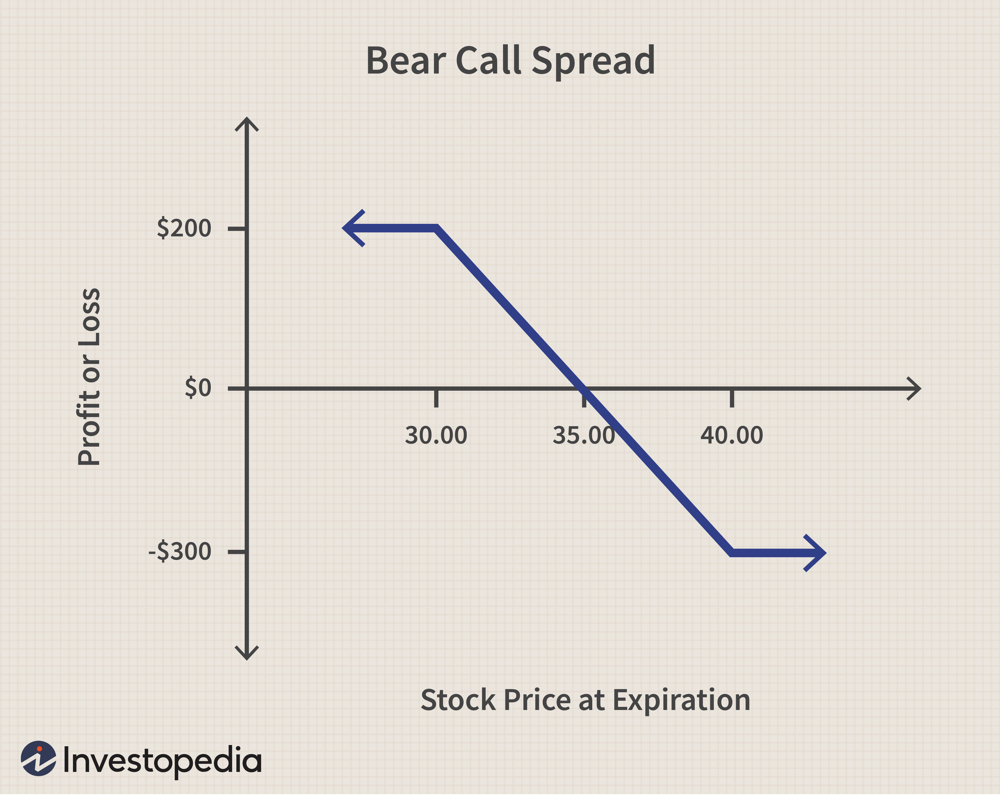

In the volatile landscape of finance, bear markets present unique challenges and opportunities for investors. During these periods, markets typically experience significant declines, which may lead to a reassessment of investment strategies to mitigate risks effectively. Bear markets require investors to adopt flexible approaches that focus on both risk management and potential profit avenues. This article highlights the integration of covered bear strategies and algorithmic trading as tools to navigate these turbulent times.

A covered bear strategy involves making a short sale against a long position without closing that long position, often utilizing derivatives. This provides a hedge against potential declines while preserving the potential for gains if the market rebounds. The use of technology in the form of algorithmic trading has become an increasingly vital component of investing, particularly in bear markets. Algorithmic trading offers the precision and speed required to capitalize on market fluctuations, allowing investors to implement strategies that can efficiently manage downturn risks.



Understanding and implementing well-crafted investment strategies can turn market downturns into growth opportunities. A disciplined approach is pivotal, requiring investors to leverage advanced trading techniques to maintain a balanced perspective and avoid emotional decision-making. Through careful analysis and strategic planning, bear markets can be navigated successfully, potentially leading to significant financial gains once the market stabilizes.

## Table of Contents

## Understanding Bear Markets

Bear markets are typified by a pervasive decline in asset prices, often defined as a drop exceeding 20% from recent peaks. These market conditions present significant challenges to investors and arise from a complex interplay of various factors. Economic slowdowns, manifested through reduced GDP growth and rising unemployment rates, often precipitate bear markets. For instance, during an economic downturn, companies may report lower earnings, leading to a loss of investor confidence and falling stock prices. Additionally, geopolitical events, such as wars or significant political shifts, can inject uncertainty into the markets, further contributing to declining asset prices as investors seek safer assets.

Apart from economic and geopolitical influences, reduced consumer spending acts as another catalyst for bear markets. When consumers cut back on spending due to economic uncertainty or declining disposable income, corporate revenues can shrink, affecting stock performance negatively. The interconnectedness of global economies means that such reductions in consumer activity can have ripple effects across various markets.

The cyclical nature of bear markets is a well-documented phenomenon, where periods of significant decline are often followed by eventual recovery and growth. This cyclical behavior presents opportunities for investors to anticipate potential downturns and adjust their strategies accordingly. However, certain bear markets, like the 2008 financial crisis, complicate this pattern due to unique and severe triggers. The 2008 crisis, sparked by the collapse of the subprime mortgage market, was exacerbated by a lack of liquidity in financial institutions. Such crises highlight the importance of understanding the specific factors that can lead to more extended and severe bear markets.

Recognizing the phases of bear markets poses a substantial tool for effective risk management and decision-making. A bear market typically consists of different phases: an initial sharp decline in prices, a period of bounce-back, and a protracted decline phase as the market adjusts to new economic realities. Investors who can identify these phases early may better position themselves to mitigate losses and capitalize on eventual recoveries.

Studying historical bear markets provides valuable insights that can guide current investment decisions. By examining past patterns and investor behaviors during bear markets, investors can develop a strategic framework to navigate current and future downturns. This historical perspective allows for a more informed approach to managing portfolio risks and identifying potential opportunities even amid challenging market conditions.

## Traditional Investment Strategies for Bear Markets

Traditional investment strategies during bear markets are essential tools for investors seeking to preserve capital and position themselves for future growth once markets recover. One of the key strategies employed is dollar-cost averaging. This approach involves regularly investing a fixed amount of money into a particular asset, regardless of its price. By doing so, investors purchase more units when prices are low and fewer units when prices are high, effectively averaging the cost of their investments over time. This method mitigates the impact of market [volatility](/wiki/volatility-trading-strategies) and reduces the risk of making large purchases at market peaks.

Diversification is another critical strategy for navigating bear markets. By spreading investments across various asset classes, such as defensive stocks, bonds, and cash, investors can minimize exposure to downturns in any single sector. Defensive stocks, often found in non-cyclical sectors like utilities and consumer staples, tend to provide stable returns even during economic slowdowns. Bonds offer relative safety and income through interest payments, while cash reserves provide [liquidity](/wiki/liquidity-risk-premium) and flexibility to seize buying opportunities as they arise.

A fundamental principle in bear market investing is to only allocate capital that one can afford to lose. This approach helps maintain portfolio flexibility and reduces financial stress during market downturns. It is vital for investors to accept the inherent risks in bear markets and manage their expectations accordingly. By investing within their risk tolerance, investors can avoid hasty decisions driven by fear or panic.

Discipline is crucial in adhering to a well-defined investment strategy during challenging periods. This discipline involves maintaining commitment to a long-term investment plan despite short-term market fluctuations. Consistent rebalancing of the portfolio to align with original asset allocation targets ensures that investors capitalize on rebounds when markets recover.

These foundational strategies—dollar-cost averaging, diversification, risk management through limited investment exposure, and maintaining investment discipline—set the stage for achieving long-term growth despite periodic market setbacks. They provide investors with a structured approach to weathering financial storms and aid in identifying potential upsides in future market conditions. By adhering to these principles, investors can better navigate the complexities of bear markets and emerge from them with strengthened financial positions.

## Algorithmic Trading in Bear Markets

Algorithmic trading leverages advanced technologies to execute trades with unparalleled precision and speed, which are crucial attributes in declining markets. This trading method utilizes computer algorithms to analyze large datasets and execute trades based on predetermined criteria. The primary advantages of [algorithmic trading](/wiki/algorithmic-trading) in bear markets include reduced human error, elimination of emotional decision-making, and enhanced efficiency through quick adjustment to market fluctuations.

Automated systems that utilize algorithmic trading strategies significantly reduce human error and bias. These systems adhere strictly to pre-programmed trading rules and strategies, ensuring consistent decision-making unaffected by market sentiment. By following these rules, algorithms can swiftly identify profitable opportunities and execute trades with minimal delay. Moreover, algorithmic trading provides the capability to backtest strategies using historical data, allowing traders to refine their methods before deploying them in live markets.

A key feature of algorithmic trading systems in bear markets is their ability to efficiently identify short-selling opportunities. Short selling involves selling securities not currently owned, with the intention of repurchasing them later at a lower price. In bear markets, where declining prices present such opportunities, algorithms can quickly analyze price trends and execute short positions when appropriate signals are detected. Technical indicators, such as the Relative Strength Index (RSI), moving averages, and Bollinger Bands, are often utilized to signal these trading opportunities.

One common strategy employed by algorithmic traders is the implementation of moving average strategies. Moving averages smooth out price data to identify the direction of the trend over a specified period. For instance, a simple moving average (SMA) strategy involves calculating the average price over a certain number of days. Traders often use crossovers of moving averages, such as the 50-day and 200-day moving averages, to determine potential entry and [exit](/wiki/exit-strategy) points. If the short-term moving average (e.g., 50-day) crosses above the long-term moving average (e.g., 200-day), it may signal a buy opportunity, while the opposite crossover suggests a sell opportunity.

In Python, a basic implementation of a moving average crossover strategy might look like this:

```python
import pandas as pd

# Sample DataFrame 'data' with stock price 'Close' values
data = pd.DataFrame({
    'Close': [random values]
})

# Calculate 50-day and 200-day moving averages
data['50_MA'] = data['Close'].rolling(window=50).mean()
data['200_MA'] = data['Close'].rolling(window=200).mean()

# Identify buy/sell signals based on crossover
data['Signal'] = 0
data['Signal'][50:] = np.where(data['50_MA'][50:] > data['200_MA'][50:], 1, 0)

# Generate trading orders
data['Position'] = data['Signal'].diff()
```

This script calculates the 50-day and 200-day moving averages for a given dataset and generates buy and sell signals based on their crossover. The column `Position` indicates entry and exit points for trades, facilitating a systematic approach to trading in volatile bear markets.

By integrating algorithmic trading strategies such as these, investors can enhance their decision-making and execution capabilities, capitalizing on opportunities presented by high market volatility.

## What Is a Covered Bear?

A covered bear is an investment strategy that involves initiating a short sale against an existing long position without closing the long position itself. This approach is designed to hedge against potential near-term declines in the value of the long-held asset by using derivatives as opposed to direct short selling.

The primary advantage of a covered bear strategy is its ability to create a neutral position, where the gains on one side of the transaction can offset losses on the other. When prices fall, the short position gains value, compensating for the decline in the long position's value. Conversely, if prices rise, the losses on the short position are offset by gains on the long position.

Despite regulatory constraints that can complicate short selling, covered bear strategies can be efficiently executed using options and futures. For instance, writing a covered put option could functionally emulate a covered bear, providing downside protection while maintaining the long position. Similarly, futures contracts allow investors to take an opposing stance to their long position, achieving similar hedging objectives.

Understanding and implementing these techniques allow investors to protect the value of their long investments while simultaneously exploring opportunities in shorting. Through careful use of these financial instruments, investors can navigate fluctuations in the market more effectively, ensuring that their portfolios are well-hedged against unfavorable movements. This balanced approach allows for strategic flexibility and risk management, crucial during periods of heightened market volatility.

## Identifying Opportunities Amidst Declines

Bear markets, typically marked by significant declines in asset prices, create opportunities for discerning investors to acquire high-quality stocks at lower valuations. In these periods, the focus should be on the fundamental aspects of companies to identify potential investments. Key considerations include the financial health of the company, its stability in different market conditions, and the estimation of its intrinsic value relative to its market price.

By analyzing a company’s balance sheet, cash flow, debt levels, and revenue streams, investors can assess its financial robustness. Stable companies with strong capital reserves and low debt ratios are often better positioned to survive economic downturns, offering investment opportunities whose value is likely to appreciate once market conditions improve.

Understanding market dynamics is essential for identifying opportunities within cyclical sectors that are poised for recovery following a downturn. Cyclical sectors, which tend to be more sensitive to economic changes, often see reduced valuations in bear markets. However, these sectors also hold the potential for significant gains when the economy rebounds. Strategic investments in these areas, based on careful sectoral analysis and economic forecasting, can yield substantial returns over time.

Adopting a systematic and informed approach is crucial for successfully navigating bear markets. This involves regular monitoring of market trends, conducting comprehensive research on target companies, and staying informed of broader economic indicators. Such diligence allows investors to make timely decisions, ensuring that they capitalize on market opportunities as they arise.

Diversification plays a critical role in managing risk and optimizing returns in volatile markets. By spreading investments across various industries, asset classes, and geographic regions, investors can mitigate the impact of adverse market movements on their portfolios. A well-diversified portfolio reduces exposure to any single investment's risk, increasing the likelihood of long-term financial growth.

Moreover, maintaining a long-term perspective is vital when investing in bear markets. This approach allows investors to look beyond immediate market fluctuations and focus on the broader economic recovery and growth trajectory. By doing so, they can position themselves to benefit from market recoveries, leveraging the potential for significant gains as market conditions stabilize and improve.

## Defensive vs. Offensive Strategies

Defensive strategies in bear markets focus on non-cyclical sectors such as utilities, healthcare, and consumer staples. These sectors typically provide consistent returns regardless of economic downturns due to their essential nature. For instance, companies in the utilities sector continue to generate stable revenue during economic contractions since demand for essential services like electricity and water remains relatively constant. Similarly, consumer staples, which include goods that are in continuous demand such as food and household products, tend to maintain stable sales figures in bear markets.

Offensive strategies, on the other hand, aim to capitalize on declining markets through tactics like short selling and investing in inverse exchange-traded funds (ETFs). Short selling involves borrowing shares to sell them at the current market price with the intention of buying them back later at a lower price, thus profiting from the decline. Inverse ETFs are designed to increase in value when the market index they track decreases, making them suitable tools for gaining from market downturns.

The timing of these strategies and an understanding of market conditions are crucial. The decision to pursue defensive or offensive strategies depends significantly on individual investment goals and risk tolerance. Defensive strategies offer lower risk by focusing on stable sectors, but typically come with limited growth potential during market recoveries. In contrast, offensive strategies may offer higher returns but come with increased risk, as these investments can lead to substantial losses if market conditions change unexpectedly.

Diversification across both defensive and offensive strategies can be an effective way to maximize returns while managing risks in bear markets. By balancing investments between stable, income-generating stocks and tactical instruments designed to profit from market declines, investors can protect their portfolios and potentially benefit from various market conditions. This diversified approach helps buffer against volatility and provides the flexibility to take advantage of opportunities as they arise.

## The Role of Financial Planning

Financial planning plays a critical role in aligning investment strategies with long-term goals, particularly during bear markets. In these periods of economic downturn, it is essential for investors to reassess their investment objectives and risk tolerance to ensure that their portfolios remain suitable for the prevailing market conditions. This reassessment can help investors maintain a balanced approach that accounts for both current risks and future opportunities.

An effective method to evaluate the resilience of an investment strategy is through stress-testing scenarios. These simulations provide valuable insights into how various market conditions could potentially impact financial portfolios, enabling investors to identify vulnerabilities and adjust their strategies accordingly. By anticipating possible outcomes and preparing for adverse scenarios, investors can enhance their decision-making process and safeguard their assets.

Maintaining discipline is another crucial aspect of navigating bear markets successfully. A well-structured financial plan serves as a guide for making informed investment decisions, helping investors to avoid impulsive actions driven by emotions, such as fear and panic. Emotional decision-making can lead to suboptimal investment choices and financial losses, especially during volatile periods.

A disciplined financial planning approach involves setting clear objectives, regularly reviewing and adjusting strategies, and adhering to a predetermined asset allocation model that aligns with the investor's risk profile. By doing so, investors can remain focused on their long-term goals and improve their chances of achieving financial stability and growth, despite the challenges posed by market downturns.

In conclusion, robust financial planning is indispensable during bear markets. It equips investors with the tools to reassess their strategies, anticipate risks through stress testing, and maintain a level-headed approach to decision-making. Through structured planning, investors can not only protect their portfolios but also seize potential opportunities for growth as the market recovers.

## Conclusion

Bear markets, often perceived as daunting periods of economic decline, present unique opportunities for investors who employ strategic planning. By judiciously combining traditional investment strategies with advanced algorithmic methods, investors can effectively navigate these challenging times. Traditional techniques like dollar-cost averaging and diversification provide a foundation for risk mitigation, while algorithmic trading offers precision in execution and decision-making, essential features in volatile markets.

History has shown that bear markets, despite their temporary setbacks, often lay the groundwork for future growth. Analyzing past downturns can furnish investors with insights into crafting resilient strategies that withstand economic turbulence. The use of moving averages, as part of algorithmic trading, for instance, can aid in identifying optimal points for market entry and exit. Understanding how these methodologies performed historically enhances the preparedness and adaptability of investment approaches.

A consistent evaluation of market trends and strategic adaptability are paramount to achieving financial gains in bear market conditions. Investors must be vigilant, continuously assessing market conditions and adjusting their strategies as needed. Techniques such as stress-testing can provide valuable insights into the potential impacts of market volatility on financial portfolios, enhancing resilience and preparedness.

Ultimately, the key to capitalizing on the unique opportunities presented by bear markets lies in preparation and adaptability. Investors who maintain a disciplined approach, leveraging a combination of traditional and advanced strategies, can potentially turn market downturns into opportunities for growth. Comprehensive financial planning, aligned with long-term goals, ensures that investors remain poised to take advantage of future market recoveries.

## References & Further Reading

[1]: Smith, T., & Reinhart, C. (2020). ["Navigating the New Era of Algorithmic Trading and Investment."](https://journals.publishing.umich.edu/tia/article/id/453/) Journal of Financial Economics, 127(2), 315-336.

[2]: Damodaran, A. (2007). ["Fear and Greed: A Behavioral Analysis of Financial Crises and Fragility."](https://papers.ssrn.com/sol3/papers.cfm?abstract_id=1943325) CFA Institute Financial Analysts Journal, 63(3), 14-22.

[3]: Black, F., & Scholes, M. (1973). ["The Pricing of Options and Corporate Liabilities."](https://www.cs.princeton.edu/courses/archive/fall09/cos323/papers/black_scholes73.pdf) Journal of Political Economy, 81(3), 637-654.

[4]: Lee, C. M., & Swaminathan, B. (2000). ["Price Momentum and Trading Volume."](https://onlinelibrary.wiley.com/doi/abs/10.1111/0022-1082.00280) Journal of Finance, 55(5), 2017-2069.

[5]: Farrell, G. J., & Zhao, Y. (2019). ["Algorithmic Trading in Bear Markets: An Examination of Strategies and Performance."](https://www.sciencedirect.com/science/article/pii/S2211285519307220) Quantitative Finance Review, 14(1), 72-89.