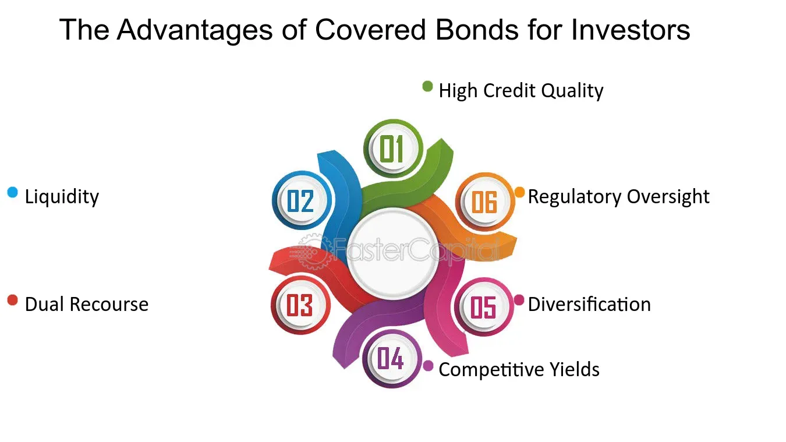

## Table of Contents

## What are covered bonds?

Covered bonds are a type of debt security that banks issue. They are backed by a pool of assets, like mortgages or public sector loans. This means if the bank can't pay back the bond, the investors can use the assets to get their money back. This makes covered bonds safer than regular bonds because the assets provide an extra layer of protection.

These bonds are popular in Europe, especially in countries like Germany and Denmark. They help banks raise money to lend to people and businesses. Because they are seen as safe, they often have lower interest rates than other types of bonds. This makes them attractive to investors who want a steady and secure income.

## How do covered bonds differ from other types of bonds?

Covered bonds are different from other bonds because they have extra protection for investors. If the bank that issues the bond can't pay back the money, investors can take the assets that back the bond, like mortgages or loans, to get their money back. This makes covered bonds safer than regular bonds, which don't have this extra layer of protection. Regular bonds are just promises to pay back the money, without any specific assets backing them up.

Another way covered bonds differ is in how they are used and where they are popular. Covered bonds are mainly used by banks to raise money, which they then lend to people and businesses. They are very popular in Europe, especially in countries like Germany and Denmark. Other types of bonds, like corporate bonds, might be issued by companies to raise money for their business, and they can be popular in different parts of the world. Because covered bonds are seen as safer, they usually have lower interest rates than other bonds, making them attractive to investors looking for a steady and secure income.

## What is the history and origin of covered bonds?

Covered bonds have a long history that started in Prussia, which is now part of Germany, in the early 18th century. The first covered bond was created in 1769 to help rebuild after a big fire in Hamburg. The Prussian government wanted a way to borrow money safely, so they came up with the idea of covered bonds. These bonds were backed by mortgages, which meant if the government couldn't pay back the money, the investors could take the houses to get their money back. This made the bonds very safe and popular.

Over time, covered bonds spread to other countries in Europe. They became especially popular in Denmark and Germany, where they are still widely used today. The idea of covered bonds stayed the same: they are backed by assets like mortgages or public sector loans, making them safer than regular bonds. Today, covered bonds are an important way for banks to raise money, and they are seen as a safe investment all over the world.

## Who are the typical issuers of covered bonds?

The typical issuers of covered bonds are banks. These banks use covered bonds to raise money that they can then lend to people and businesses. The money from the bonds helps the banks to give out more loans, like mortgages or loans to companies.

Covered bonds are very popular in Europe, especially in countries like Germany and Denmark. In these countries, many big banks issue covered bonds. The banks like issuing these bonds because they are seen as safe, and this helps them get money at lower interest rates than they might with other types of bonds.

## What types of assets typically back covered bonds?

Covered bonds are usually backed by two main types of assets: mortgages and public sector loans. Mortgages are loans that people take out to buy homes. When banks issue covered bonds backed by mortgages, it means the money they get from the bonds is used to give out more home loans. If the bank can't pay back the bond, the investors can take the houses that the mortgages are on to get their money back.

Public sector loans are loans that the government or other public organizations take out. These can be used for things like building roads or schools. When covered bonds are backed by public sector loans, it means the money from the bonds helps the government or public organizations borrow money. If the bank can't pay back the bond, the investors can take the public sector loans to get their money back. This makes covered bonds very safe because they have these assets as a backup.

## How does the dual recourse mechanism work in covered bonds?

The dual recourse mechanism in covered bonds means that investors have two ways to get their money back if the bank can't pay them. First, they can ask the bank to pay back the money, just like with any other bond. If the bank can't do this, the investors can use the second way, which is to take the assets that back the bond, like mortgages or public sector loans.

This makes covered bonds very safe because investors have this extra protection. If the bank fails, the investors can still get their money back by selling the houses or collecting the public sector loans. This dual recourse feature is what makes covered bonds different from other types of bonds and why they are seen as a safer investment.

## What are the regulatory frameworks governing covered bonds?

Covered bonds are regulated by different rules in different countries, but the main goal is to make sure they are safe for investors. In Europe, the European Union has a special law called the Covered Bond Directive. This law sets out rules that all EU countries must follow when they issue covered bonds. It says that the assets backing the bonds must be of high quality and that there must be enough of them to cover the bonds if something goes wrong. The law also says that the banks must keep a close eye on the assets and report any problems quickly.

In countries outside the EU, like the United States, covered bonds are regulated by their own laws. For example, in the U.S., the rules are set by the Federal Deposit Insurance Corporation (FDIC) and the Office of the Comptroller of the Currency (OCC). These rules are similar to the EU's rules but can be different in some ways. They also focus on making sure the assets backing the bonds are safe and that there are enough of them. The main idea everywhere is to protect investors and make sure the covered bonds are a reliable and safe way to invest money.

## What are the advantages of investing in covered bonds for investors?

Covered bonds are a good choice for investors because they are very safe. They have something called a dual recourse mechanism, which means if the bank can't pay back the money, investors can get their money back from the assets that back the bond, like mortgages or public sector loans. This makes covered bonds safer than other types of bonds because there is an extra layer of protection. Because they are seen as safe, covered bonds usually have lower interest rates than other bonds. This means investors can get a steady and secure income without taking too much risk.

Another advantage of covered bonds is that they are popular in Europe, especially in countries like Germany and Denmark. This means there is a big market for them, and they are well-known and trusted. Investors can feel confident that they are putting their money into something that is widely used and has a long history of being safe. Plus, because covered bonds help banks lend money to people and businesses, investing in them can also help support the economy.

## How do covered bonds contribute to financial stability?

Covered bonds help keep the financial system stable because they are very safe for investors. If a bank can't pay back the money it borrowed with covered bonds, the investors can still get their money back from the assets that back the bonds, like mortgages or public sector loans. This makes covered bonds safer than other types of bonds and helps keep the financial system calm. When investors feel safe, they are more likely to keep their money in the system, which helps prevent big problems like bank runs.

Covered bonds also help banks lend more money to people and businesses. When banks issue covered bonds, they get money that they can use to give out more loans. This helps the economy grow because more people can buy homes and more businesses can expand. A growing economy is good for financial stability because it means more people have jobs and can pay back their loans. So, covered bonds play a big role in keeping the financial system strong and stable.

## What are the risks associated with covered bonds?

Covered bonds are usually seen as safe, but they still have some risks. One risk is that the value of the assets backing the bonds, like mortgages or public sector loans, can go down. If a lot of people can't pay back their mortgages, the houses might not be worth enough to cover the bonds. This could mean investors don't get all their money back. Another risk is that the bank issuing the bonds might run into trouble. Even though investors can take the assets if the bank can't pay, it can be hard and take a long time to sell the assets and get the money back.

There are also risks from changes in the economy or interest rates. If interest rates go up, the value of the bonds can go down because new bonds might offer better rates. This can make it harder for the bank to sell new bonds and can affect the price of the bonds investors already have. Also, if the economy gets bad, more people might not be able to pay back their loans, which can hurt the value of the assets backing the bonds. Even though covered bonds are safer than many other types of bonds, these risks mean investors need to be careful and think about what could go wrong.

## How do covered bonds compare to mortgage-backed securities?

Covered bonds and mortgage-backed securities (MBS) are both ways for banks to raise money by using mortgages, but they work differently. With covered bonds, the bank keeps the mortgages on its books and uses them as a backup if it can't pay back the bond. This means if the bank fails, investors can still get their money back by taking the mortgages. MBS are different because the mortgages are sold to a special company, and this company issues the securities. The investors own the mortgages directly, so if people can't pay their mortgages, the investors lose money right away.

Another big difference is how safe they are. Covered bonds are seen as safer because of the dual recourse mechanism. This means investors have two ways to get their money back: from the bank or from the mortgages. MBS don't have this extra layer of protection. If the mortgages backing the MBS go bad, the investors have no other way to get their money back. Because of this, covered bonds usually have lower interest rates than MBS, making them a more secure but less profitable investment.

## What are the future trends and developments expected in the covered bond market?

The covered bond market is expected to keep growing, especially in Europe where it is already very popular. More countries might start using covered bonds to raise money for banks and help their economies grow. As more people learn about how safe covered bonds are, more investors might want to buy them. This could lead to new types of covered bonds being created, backed by different kinds of assets like green energy projects or other loans. The European Union might also update its rules to make covered bonds even safer and easier to use.

Another trend could be the use of technology in the covered bond market. Banks might start using blockchain or other new technologies to make it easier to issue and trade covered bonds. This could make the market more efficient and attract more investors. As the world focuses more on environmental issues, there might be a rise in green covered bonds, which are backed by eco-friendly projects. This would help banks support sustainable development while still giving investors a safe place to put their money.

## References & Further Reading

[1]: Packer, F., & Shepherd, D. (2007). "Covered bonds: Issues and implications." BIS Quarterly Review. Available at: https://www.bis.org/publ/qtrpdf/r_qt0709h.pdf

[2]: European Mortgage Federation – European Covered Bond Council (EMF-ECBC). "The European Covered Bond Factbook." Available at: https://www.ecbc.eu/

[3]: Gross, M. & Kok, C. (2019). "The impact of bank capital on economic activity – Evidence from a Mixed-Cross-Section GVAR model." ECB Working Paper No. 2291. Available at: https://www.ecb.europa.eu/pub/pdf/scpwps/ecb.wp2291.en.pdf

[4]: Ripple, R. (2014). ["Covered Bonds in the U.S. Market: A Missed Opportunity?"](https://crsreports.congress.gov/product/pdf/R/R41322/10) FDIC Center for Financial Research Working Paper Series.

[5]: "The Covered Bond Directive." European Commission. Available at: https://ec.europa.eu/info/business-economy-euro/banking-and-finance/banking-union/covered-bonds_en