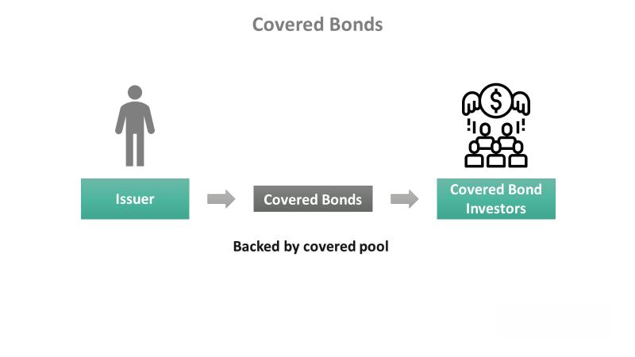

Covered bonds offer a unique intersection of financial security and attractive returns for investors. Originating as a safe investment avenue, these senior secured debt instruments provide a dual layer of protection. Investors benefit from recourse against both the issuer and the underlying pool of assets, typically comprising mortgages or public sector loans. This structural safety has made covered bonds an integral part of Europe's financial markets, with increasing interest from U.S. financial institutions as well.

This article aims to provide a comprehensive overview of covered bonds, highlighting their inherent benefits and the significant role they play in modern finance. Notable examples from global markets, including prominent issuers, will be examined to illustrate their widespread adoption and utilization. Furthermore, the impact of algorithmic trading on the trading dynamics of covered bonds will be addressed, showcasing how technological advancements are enhancing market efficiency and liquidity.



Covered bonds stand out in the financial landscape due to their robust frameworks and investor protection mechanisms. They are particularly favored by conservative investors seeking stability without compromising on potential returns. By exploring covered bonds and their growing influence, readers will gain insights into these pivotal financial instruments and their relevance in today's economy.

## Table of Contents

## What Are Covered Bonds?

Covered bonds are a type of senior secured debt instrument that are collateralized by a pool of assets, typically high-quality loans such as residential mortgages or public-sector loans. These financial instruments are unique in that they offer a dual recourse mechanism, providing an added layer of security for investors. In a covered bond issuance, investors have the right to claim against both the issuer and the cover pool of assets, ensuring repayment even in cases where the issuer may face financial difficulties.

This dual recourse feature distinguishes covered bonds from other types of secured debt, such as asset-backed securities, where investors only have a claim on the underlying pool of assets. Consequently, covered bonds tend to maintain high levels of credit quality, often receiving AAA ratings from credit rating agencies, which reflects their low credit risk profile. Higher ratings are generally associated with lower perceived risk, thereby attracting investors who prioritize security and stability in their investment choices.

The popularity of covered bonds is most pronounced in Europe, where they have been a staple in financial markets for decades. This is largely due to the well-established regulatory frameworks and structured issuance processes that support their safety and appeal. Recently, covered bonds have started to gain traction in the United States as well, as financial institutions and investors look for secure investment options in a landscape characterized by heightened economic uncertainties.

The concept of covered bonds dates back to the 18th century, with origins attributed to Frederick the Great of Prussia. During his reign, they were introduced as a means of financing infrastructure projects, particularly those aimed at rebuilding the country's economy after the Seven Years' War. The structured nature of these bonds allowed for significant investment in public infrastructure, which facilitated economic development and stability.

In modern financial markets, covered bonds continue to play a critical role in enabling financial institutions to manage their balance sheets more effectively. By pooling and securitizing assets, institutions can raise funds for additional lending activities, thus promoting economic growth. Moreover, the presence of robust regulatory frameworks ensures that the issuance and management of covered bonds are conducted with stringent oversight, further bolstering their safety as an investment vehicle.

In summary, covered bonds represent a secure, structured, and historical financial instrument, offering investors protection through dual recourse mechanisms while supporting financial institutions in economic growth initiatives.

## Financial Benefits of Covered Bonds

Covered bonds offer significant financial advantages for both issuing institutions and investors. These debt instruments enable financial institutions to free up balance sheet resources, allowing them to engage in further lending activities. This is achieved by transferring assets such as mortgages into the covered bond's cover pool. Consequently, the institution can mobilize additional resources for lending while maintaining financial stability.

For investors, covered bonds are attractive due to their high [liquidity](/wiki/liquidity-risk-premium) and security. These bonds often enjoy high credit ratings, frequently achieving ratings such as AAA. This high credit profile reflects the low-risk nature of the bonds, ensuring that investors are protected even in adverse financial situations. The dual recourse mechanism — where investors can claim against both the issuing institution and the underlying cover pool assets in case of default — provides an extra layer of security. 

Covered bonds play a vital role in expanding mortgage lending. By using the proceeds from covered bonds, financial institutions can boost their lending capabilities. This, in turn, can stimulate economic activity as increased lending promotes household spending, investment in real estate, and broader economic growth. The structured and predictable nature of these bonds makes them a reliable tool for fostering economic development and stability.

In summary, covered bonds offer a strategic advantage to financial institutions by optimizing their balance sheets for further lending, while providing investors with secure, highly liquid investment options that possess high credit ratings. This dual benefit supports not only the growth and stability of financial markets but also contributes to broader economic prosperity through enhanced lending capabilities.

## Examples and Notable Issuers in the Market

European banks are leading players in the covered bond market, with prominent institutions such as Deutsche Bank regularly issuing these financial instruments. Covered bonds are deeply rooted in the European financial landscape, particularly in countries like Germany and Denmark, where they have historically been employed to fund real estate and infrastructure projects. These bonds offer a unique funding opportunity by utilizing a pool of loans, thus providing security to investors through a dual recourse mechanism. 

In recent years, the appeal of covered bonds has transcended European borders, capturing the attention of U.S. financial institutions. Notable American entities such as JPMorgan Chase and Wells Fargo have begun participating in the issuance of these bonds. This emerging trend in the U.S. market signifies a growing recognition of the benefits outlined by covered bonds, such as enhanced safety and liquidity. The adoption by major U.S. banks demonstrates their potential in broadening funding strategies and optimizing asset management in financial institutions.

Covered bonds are typically employed in projects with a public or infrastructural focus. The funds raised through these instruments allow issuers to leverage substantial projects, providing the capital necessary for comprehensive initiatives. This aspect not only extends the utility of covered bonds beyond mere real estate but also positions them as critical financing tools for broader economic development activities.

The emergence of covered bonds within infrastructure financing speaks to their versatility and reliability as funding instruments. The evolution in their application denotes a significant step towards fully utilizing these secure investment vehicles for public benefit, signifying an advancement from traditional funding avenues. As a result, covered bonds continue to secure their position as a vital financial instrument, enhancing the scope and efficiency of project financing across diverse markets globally.

## Algorithmic Trading and Covered Bonds

Algorithmic trading is significantly transforming the way covered bonds are traded, offering enhancements in both speed and precision. This advanced form of trading employs computer algorithms to execute trades automatically, based on pre-determined criteria such as timing, price, or [volume](/wiki/volume-trading-strategy). This automation significantly reduces human intervention, which can minimize cases of manual errors and biases.

Algorithmic strategies in the covered bond market are utilized primarily to manage risks and optimize returns. By employing sophisticated models, investors can quickly respond to market changes, adjusting their portfolio allocations to align with the optimal risk-return profile. For instance, quantitative models analyze large datasets to identify patterns and predict price movements, enabling traders to execute large orders with minimal impact on the market. This agility allows investors to capitalize on small price discrepancies that would be unnoticeable using traditional trading methods.

The integration of [algorithmic trading](/wiki/algorithmic-trading) in the covered bond market also enhances market efficiency and liquidity. By facilitating a higher volume of trades at a faster pace, algorithmic trading contributes to narrowing bid-ask spreads—making markets more liquid. This increased liquidity is particularly beneficial for covered bonds, where issuers look for large, institutional investors with substantial capital requirements.

In mathematical terms, the algorithms deployed might use models like the Black-Scholes for options pricing or Monte Carlo simulations for risk assessment. These models optimize decision-making by calculating probabilities and expected returns with high precision. For example, a simple Python implementation might involve:

```python
import numpy as np

# A Monte Carlo simulation function to assess bond price risk
def monte_carlo_simulation(start_price, interest_rate, volatility, days=252, simulations=1000):
    results = []
    for _ in range(simulations):
        prices = [start_price]
        for _ in range(days):
            prices.append(prices[-1] * np.exp((interest_rate - 0.5 * volatility ** 2) / 365 + volatility * np.random.normal()))
        results.append(prices[-1])
    return np.mean(results), np.std(results)

# Example use
start_price = 100  # Initial price of the covered bond
interest_rate = 0.01  # Annual interest rate
volatility = 0.05  # Annual volatility

mean_price, std_dev = monte_carlo_simulation(start_price, interest_rate, volatility)
print(f"Expected Future Price: {mean_price}, Standard Deviation: {std_dev}")
```

Through such models, algorithmic trading provides a robust framework that facilitates the execution of complex trading strategies. These strategies are essential in maintaining the stability and efficiency of the covered bonds market and ensuring that securities are accurately priced. As algorithmic trading continues to evolve, it will likely further fortify the robustness and appeal of covered bonds as a strategic investment choice.

## The Safety and Security of Covered Bonds

Covered bonds are structured to prioritize safety through secured interests in their cover pools. This dual protection arises from the bondholder's claims against both the issuing entity and the specific pool of assets, which distinctly sets them apart from other debt securities. In insolvency situations involving the issuing institution, covered bondholders maintain precedence in their claims against the segregated asset pool, often comprising high-quality loans such as residential mortgages.

A key aspect of their safety is the strict regulatory frameworks that govern covered bonds. These frameworks, especially prominent in Europe, subject covered bonds to rigorous legal standards and oversight, ensuring that the cover pool assets remain of high quality and are replenished as needed to maintain debt coverage. For instance, the European Covered Bond Directive establishes minimum harmonizing rules for covered bonds across EU member states, reinforcing investor confidence by ensuring a high level of transparency and security.

Moreover, issuers are typically required to maintain overcollateralization within the cover pool, meaning the total value of the assets surpasses the nominal amount of the covered bonds. This additional layer of protection enhances the bond's creditworthiness, often leading to favorable credit ratings. The combination of regulatory oversight, structured asset backing, and performance monitoring contributes to the perception of covered bonds as a secure investment channel.

## Trends and Future Outlook

The covered bond market is witnessing significant growth and transformation, driven by innovative issuance and trading practices. Traditional methods are being complemented by advanced techniques, enhancing the efficiency and attractiveness of these bonds. Among the key drivers of this evolution is the regulatory landscape, with significant contributions from legislation like the EU Covered Bond Directive. This directive, which establishes a harmonized framework for covered bonds across European Union member states, enhances market transparency and investor protection by setting clear definitions and standardized structural features. Consequently, it fosters an environment conducive to increased cross-border investments and harmonization within the covered bond markets.

Beyond regulatory influences, the geographical expansion of the covered bond market is noteworthy. There is a growing interest in regions outside its traditional stronghold of Europe, such as Asia and North America. In Asia, countries like Singapore and South Korea have started to explore covered bond frameworks, attracted by their stability and potential to support housing finance. In North America, the market is slowly gaining [momentum](/wiki/momentum), with increasing recognition of the benefits covered bonds offer in terms of security and liquidity. This global expansion is expected to bolster market depth and diversification, providing investors with more opportunities and choices.

Furthermore, technological advancements are shaping the future of covered bonds. The integration of algorithmic trading systems is revolutionizing the way these securities are bought and sold, enhancing both the speed and accuracy of transactions. This ensures greater market liquidity and more precise pricing mechanisms. Investors are now able to deploy advanced trading strategies that optimize returns while managing risks effectively.

In summary, the future of covered bonds appears promising, characterized by regulatory support, geographical diversification, and technological innovations. As the market continues to evolve, it offers robust opportunities for investors seeking stability, transparency, and attractive returns in their fixed-income portfolios.

## Conclusion

Covered bonds represent a significant investment option for conservative investors seeking safety and consistent returns. These financial instruments provide a dual layer of protection through their structure: the assets in the cover pool offer security, and there is recourse to the issuer. This dual recourse system reduces the risk typically associated with other investment types, ensuring that investors have a reliable claim on their assets, even in adverse economic conditions.

As algorithmic trading gains traction, the dynamics of trading covered bonds are evolving. Algorithmic trading introduces speed and precision, allowing investors to efficiently implement complex trading strategies. This development enhances market liquidity and efficiency, making covered bonds more accessible and attractive. Investors leveraging algorithms can fine-tune risk management and optimize their returns, thus increasing the appeal of covered bonds in today's fast-paced financial markets.

Comprehending the structures and benefits of covered bonds is vital for investors looking to capitalize on their potential. These instruments not only offer security but are also supported by a well-established regulatory framework, which further reduces risk. The transparency and oversight ensure that investors can have confidence in the investment's stability.

Investors should regard covered bonds as a strategic component of a diversified portfolio, focusing on stability and gradual growth. Their secured nature makes them suitable for balancing high-risk ventures, while their reliable performance supports long-term financial planning. By incorporating covered bonds into a diversified investment strategy, investors can enhance their portfolio's resilience against market [volatility](/wiki/volatility-trading-strategies), aligning with conservative investment goals.

## References & Further Reading

[1]: Packer, F., & Shepherd, D. (2007). "Covered bonds: Issues and implications." BIS Quarterly Review. Available at: https://www.bis.org/publ/qtrpdf/r_qt0709h.pdf

[2]: European Mortgage Federation – European Covered Bond Council (EMF-ECBC). "The European Covered Bond Factbook." Available at: https://www.ecbc.eu/

[3]: Gross, M. & Kok, C. (2019). "The impact of bank capital on economic activity – Evidence from a Mixed-Cross-Section GVAR model." ECB Working Paper No. 2291. Available at: https://www.ecb.europa.eu/pub/pdf/scpwps/ecb.wp2291.en.pdf

[4]: Ripple, R. (2014). ["Covered Bonds in the U.S. Market: A Missed Opportunity?"](https://crsreports.congress.gov/product/pdf/R/R41322/10) FDIC Center for Financial Research Working Paper Series.

[5]: "The Covered Bond Directive." European Commission. Available at: https://ec.europa.eu/info/business-economy-euro/banking-and-finance/banking-union/covered-bonds_en