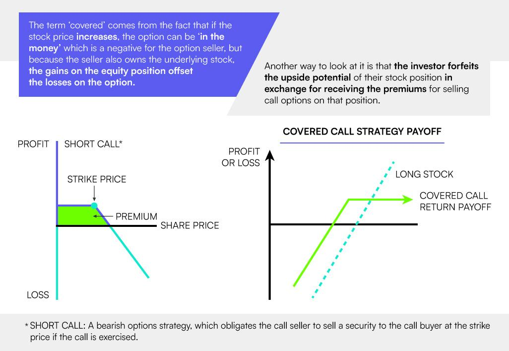

## Table of Contents

## What is a covered call ETF?

A covered call ETF is a type of exchange-traded fund that uses a strategy called "covered call writing" to generate income. In this strategy, the ETF holds a portfolio of stocks and then sells call options on those stocks. When you sell a call option, you give someone else the right to buy the stock from you at a certain price by a certain date. In return, you get a payment, which is called the option premium. The ETF uses this premium to provide income to its investors.

This strategy can be attractive because it can offer higher income than just holding the stocks alone. However, it also means that the ETF might not gain as much if the stock prices go up a lot. This is because the ETF has to sell the stocks at the price set in the call option if the buyer decides to use it. So, while covered call ETFs can provide a steady income, they might limit the potential for big gains if the market does really well.

## How does a covered call strategy work?

A covered call strategy involves owning a stock and then selling a call option on that same stock. When you sell a call option, you're giving someone else the right to buy your stock at a set price, called the strike price, before a certain date. In return, you get a payment called the option premium. This premium is your income from the strategy. The stock you own "covers" the call option, meaning if the buyer decides to use the option, you can just give them the stock you already own.

The main benefit of this strategy is that it can provide you with extra income from the option premiums. This can be especially useful if you think the stock price won't go up much or will stay the same. However, there's a trade-off. If the stock price goes up a lot, you might miss out on some of those gains. That's because you have to sell the stock at the strike price if the buyer uses the option, even if the stock is now worth more. So, while covered calls can give you steady income, they can also limit your potential profits if the stock does really well.

## What are the potential benefits of investing in covered call ETFs?

Covered call ETFs can be a good choice for people who want to earn more income from their investments. These ETFs own stocks and then sell call options on those stocks. When they sell the options, they get money called the option premium. This extra money can give investors a higher income than if they just owned the stocks by themselves. This can be really helpful for people who want to get regular payments from their investments.

However, there's a catch. If the stock prices go up a lot, the [ETF](/wiki/etf-trading-strategies) might not make as much money as it could. That's because the ETF has to sell the stocks at the price set in the call option if the buyer decides to use it. So, while covered call ETFs can give you steady income, they might not do as well if the market does really well. This makes them a good choice for people who care more about getting regular income than making big gains from rising stock prices.

## What are the risks associated with covered call ETFs?

Covered call ETFs come with some risks that you should know about. One big risk is that they might not make as much money as regular ETFs if the stock market goes up a lot. This is because the ETF has to sell the stocks at a set price if the buyer uses the call option. So, if the stock price goes way up, the ETF can't take advantage of that increase as much as it could if it just owned the stocks.

Another risk is that the income from the option premiums might not be enough to make up for losses if the stock prices go down. While the premiums can give you extra income, they won't protect you if the stock market falls. So, if the stocks in the ETF go down in value, you could lose money even with the extra income from the options.

Lastly, there's also the risk that comes with the fees and costs of the ETF. These ETFs might have higher fees because of the extra work involved in managing the call options. Over time, these fees can eat into your returns, so it's important to think about them when deciding if a covered call ETF is right for you.

## How do covered call ETFs generate income for investors?

Covered call ETFs make money for investors by using a special strategy. They own a bunch of stocks and then sell call options on those stocks. When they sell a call option, they get a payment called the option premium. This premium is like extra money that the ETF can give to its investors. So, even if the stock prices don't go up, the ETF can still give you some income from these premiums.

But there's a catch. If the stock prices go up a lot, the ETF might not make as much money as it could. That's because the ETF has to sell the stocks at the price set in the call option if the buyer decides to use it. So, while covered call ETFs can give you steady income, they might not do as well if the market does really well. This makes them a good choice for people who care more about getting regular income than making big gains from rising stock prices.

## What is the typical performance of covered call ETFs compared to the broader market?

Covered call ETFs usually don't do as well as the broader market when stock prices go up a lot. This is because they have to sell their stocks at a set price if someone uses the call option they sold. So, if the market goes way up, the ETF can't take full advantage of that increase. Instead, it makes money from the option premiums, which is like extra income that can help if the market stays the same or goes up a little.

On the other hand, covered call ETFs can be a good choice if you want to get regular income from your investments. The option premiums they get from selling call options can give you more income than just owning the stocks by themselves. But, if the stock market goes down, the income from the premiums might not be enough to make up for the losses. So, while these ETFs can provide steady income, they might not protect you as well if the market drops.

## How does the choice of underlying assets affect the performance of a covered call ETF?

The choice of underlying assets in a covered call ETF can really change how well it does. If the ETF picks stocks that go up a lot, it might not make as much money as it could because it has to sell those stocks at a set price if someone uses the call option. But if the ETF picks stocks that don't change much in price, the extra money from the option premiums can be a big help. So, the kind of stocks the ETF chooses can make a big difference in how much income it can give you and how it does compared to the overall market.

Also, the risk of the underlying assets matters. If the ETF picks stocks that are more likely to go down in value, the income from the option premiums might not be enough to cover the losses if the market drops. On the other hand, if the ETF picks safer stocks, it might not make as much from the premiums, but it could lose less if the market goes down. So, the choice of assets can affect both the income you get and how safe your investment is.

## What are the tax implications of investing in covered call ETFs?

When you invest in covered call ETFs, you need to think about taxes. The money you get from the option premiums is usually seen as ordinary income by the tax people. This means it's taxed at your regular income tax rate, which can be higher than the tax rate for long-term capital gains. Also, if the ETF sells stocks at a profit, you might have to pay capital gains tax on that. If the stocks were held for less than a year, it's a short-term capital gain, which is taxed at your regular income tax rate. If they were held for more than a year, it's a long-term capital gain, which has a lower tax rate.

Another thing to know is that covered call ETFs might do something called "constructive sales." This happens if the call options you sell are "in the money" by a lot, meaning the stock price is way above the strike price. If this happens, the tax people might say you've sold the stock for tax purposes, even if you haven't really sold it. This can make things more complicated because you might have to pay taxes on gains you haven't actually gotten yet. So, it's a good idea to talk to a tax advisor to understand all the tax rules and how they might affect your investment in covered call ETFs.

## How do market conditions influence the effectiveness of a covered call strategy?

Market conditions can really change how well a covered call strategy works. If the market is going up a lot, a covered call strategy might not do as well as just owning the stocks. That's because you have to sell the stocks at the price you set in the call option if someone decides to use it. So, if the stock price goes way up, you miss out on some of those big gains. But, if the market stays the same or goes up just a little, the money you get from selling the call options can be a big help. This extra money, called the option premium, can give you more income than just holding the stocks.

On the other hand, if the market goes down, the covered call strategy can still be useful. The money from the option premiums can help make up for some of the losses if the stock prices drop. But, it might not be enough to cover all the losses if the market falls a lot. So, in a down market, the strategy can give you some income, but it won't protect you completely from losing money. Overall, the covered call strategy works best in markets that are stable or going up slowly, where the extra income from the premiums can really make a difference.

## What are the key metrics to consider when evaluating a covered call ETF's performance?

When you want to see how well a covered call ETF is doing, you should look at a few important things. One key metric is the total return, which tells you how much money the ETF made from both the stock prices going up and the option premiums. You should also check the dividend yield, which shows how much income the ETF gives you from the option premiums. Another thing to consider is the expense ratio, which is how much it costs to run the ETF. A lower expense ratio means more money stays in your pocket.

Another important metric is the beta, which tells you how much the ETF moves with the market. A lower beta can mean the ETF is less risky, but it might also mean it won't gain as much when the market goes up. You should also look at the ETF's historical performance to see how it has done in the past, but remember that past results don't guarantee future success. Lastly, consider the underlying assets of the ETF, because the type of stocks it holds can affect how well it does and how much income it can give you.

## How can covered call ETFs be used as part of a broader investment strategy?

Covered call ETFs can be a helpful part of a bigger investment plan, especially if you want to get regular income from your investments. These ETFs own stocks and then sell call options on those stocks to earn extra money called option premiums. This extra money can give you more income than just holding the stocks by themselves. So, if you're someone who cares more about getting steady payments than making big gains from rising stock prices, adding a covered call ETF to your portfolio can be a good idea. It can help balance out other investments that might be riskier or more focused on growth.

However, it's important to think about how covered call ETFs fit with the rest of your investments. Since these ETFs might not do as well as the market when stock prices go up a lot, they can be a good choice if you want to make your portfolio less risky. You could use them to balance out other investments that might go up and down a lot. For example, if you have some stocks that you think will grow a lot, adding a covered call ETF can help you get some income while still keeping some room for growth in your portfolio. Just remember to keep an eye on the fees and taxes, because they can affect how much money you actually keep from your investments.

## What advanced techniques can be used to optimize returns from covered call ETFs?

One way to get more out of covered call ETFs is to use a strategy called "laddering." This means you buy different covered call ETFs that have different times until the call options expire. Some might expire in a month, others in three months, and so on. By doing this, you can get option premiums more often because the options are always expiring at different times. This can help you get a steady stream of income. Also, if the market goes up a lot, you might be able to take advantage of that because not all your options will expire at the same time.

Another technique is to keep an eye on the stocks the ETF owns and the call options it sells. If you think the stocks are going to go up a lot, you might want to switch to a different ETF that owns stocks you think will do better. Or, if you think the market is going to stay the same or go down a little, you might want to stay with the covered call ETF because the option premiums can help you make money even if the stock prices don't go up. By choosing the right ETF based on what you think the market will do, you can make the most of the covered call strategy.

## What are Covered Call ETFs and how do they work?

Covered call ETFs utilize the covered call strategy, a well-known options trading technique, to augment income for investors. The strategy involves holding a long position in an asset while simultaneously selling call options on the same asset. This approach aims to capitalize on the premiums received from selling the call options, providing additional income on top of potential asset appreciation.

A call option gives the buyer the right, but not the obligation, to purchase the underlying asset at a pre-determined price, known as the strike price, before the option expires. When an investor sells a call option, they receive a premium from the buyer. If the market price of the asset remains below the strike price, the option expires worthless, allowing the seller to retain the premium as profit. However, if the asset price exceeds the strike price, the seller may need to sell the asset at the lower strike price, thereby capping the upside potential.

Covered call ETFs package this options strategy within an exchange-traded fund structure. The fund holds a portfolio of securities and systematically writes covered calls on its holdings. Investors in these ETFs can thus gain exposure to the covered call strategy without having to manage the options themselves. This approach simplifies access to sophisticated options trading strategies, making them available to a broader range of investors who might not have the expertise or inclination to engage in direct options trading.

The primary objective of covered call ETFs is to provide consistent income streams through options premiums. This can be particularly attractive in volatile or sideways markets, where asset price gains might be limited. While the income generated from call premiums can help cushion the effects of market [volatility](/wiki/volatility-trading-strategies), it is essential to recognize that this strategy may also limit the potential appreciation of the underlying assets if their prices rise substantially.

In mathematical terms, if $S$ represents the stock price at expiration, $K$ the strike price, and $P$ the premium received, the profit $\pi$ from a covered call can be expressed as:

$$
\pi = 
\begin{cases} 
S - K + P, & \text{if } S > K \\
P, & \text{if } S \leq K
\end{cases}
$$

This formula captures the dual nature of the strategy: profiting from premiums when the asset doesn't surpass the strike price, and capping gains when it does.

Through the utilization of covered call strategies, these ETFs aim to achieve a balance; they offer an opportunity for regular income generation, while strategically mitigating some of the market risks associated with direct equity investment.

## References & Further Reading

[1]: Whaley, R. E. (2002). ["Return and Risk of CBOE BuyWrite Monthly Index"](https://archive.org/download/wikipedia-scholarly-sources-corpus/10.3905.zip/10.3905%252Fjod.2002.319194.pdf). The Journal of Derivatives, 10(2), 35-42.

[2]: Callan, D. (2009). ["An Evaluation of Option Writing for Portfolio Management"](https://www.optionseducation.org/getmedia/aca1b468-cca1-4e36-be63-38ca8375b7d0/wwc-obpms-may-2009.pdf). CFA Institute Research Foundation.

[3]: ["Options as a Strategic Investment"](https://www.amazon.com/Options-Strategic-Investment-Lawrence-McMillan/dp/0735201978) by Lawrence G. McMillan

[4]: Gross, D. A. (2007). ["Option Writing Strategies: A Call for Action?"](https://www.investopedia.com/trading/options-strategies/). The Journal of Wealth Management, 9(4), 63-72.

[5]: ["Algorithmic Trading and DMA: An introduction to direct access trading strategies"](https://www.semanticscholar.org/paper/Algorithmic-trading-%26-DMA-%3A-an-introduction-to-Johnson/aa5de1ab883d5e23b6651faa7c1807586d688e4b) by Barry Johnson

[6]: "The Merton Model as a Credit Risk Model" — For analysis on using mathematical models similar to financial derivatives, such as the Merton model in assessing financial instruments.

[7]: Fabozzi, F. J., & Focardi, S. M. (2004). ["The Mathematics of Financial Modeling and Investment Management"](https://www.semanticscholar.org/paper/The-Mathematics-of-Financial-Modeling-and-Focardi-Fabozzi/9ef7cbeee77cf22e2ee62cfef22f466a27aec6c8). Wiley Finance.