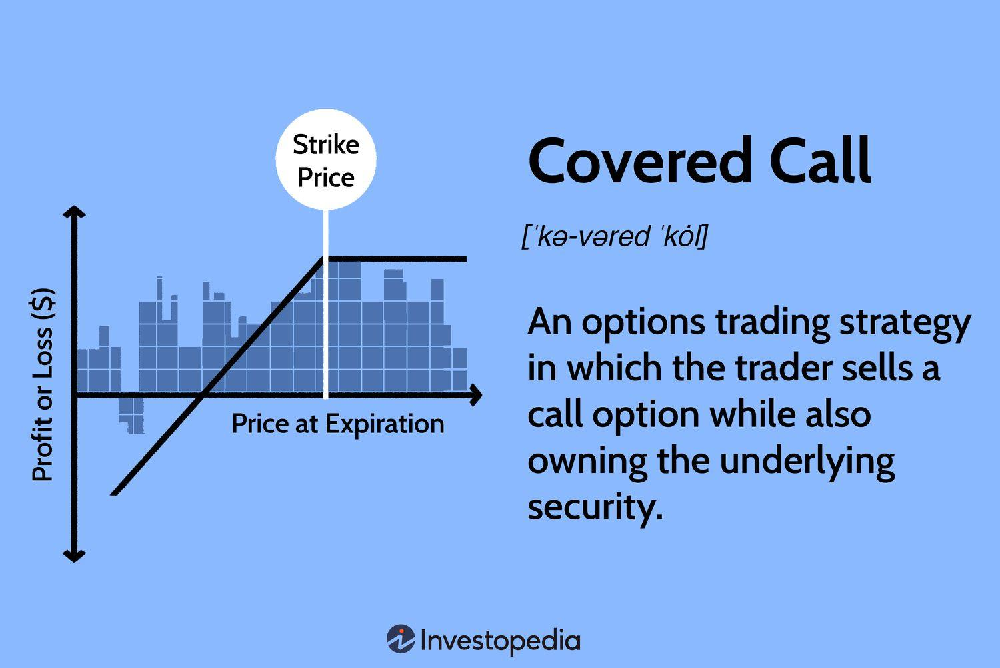

## Table of Contents

## What is a covered call option?

A covered call option is a strategy used in stock trading where an investor owns shares of a stock and then sells call options on those same shares. The call option gives the buyer the right, but not the obligation, to buy the stock at a specific price, known as the strike price, before the option expires. By selling the call option, the investor earns a premium, which is money paid by the buyer of the option. This strategy is called "covered" because the investor already owns the stock that could be sold if the option is exercised.

The main reason investors use covered calls is to generate extra income from their stock holdings. The premium received from selling the call option adds to the investor's returns. However, there's a trade-off: if the stock price rises above the strike price, the investor might have to sell the stock at the lower strike price, missing out on potential gains. On the other hand, if the stock price stays below the strike price, the option will likely expire worthless, and the investor keeps the premium and the stock. This strategy can be a good way to earn some extra income, but it also limits the upside potential of the stock.

## How does a covered call work?

A covered call is a strategy where you own a stock and then sell a call option on that stock. A call option is like a contract that gives someone else the right to buy your stock at a certain price, called the strike price, before a certain date. When you sell this call option, you get money called a premium. This premium is yours to keep no matter what happens next.

If the stock price stays below the strike price by the time the option expires, the person who bought the option probably won't use it. The option will expire worthless, and you get to keep both your stock and the premium you received. But if the stock price goes above the strike price, the buyer might decide to use the option and buy your stock at the lower strike price. You have to sell your stock at that price, but you still get to keep the premium. This can limit how much money you make if the stock goes up a lot, but it also gives you extra income from the premium.

## What are the benefits of using covered calls?

Using covered calls can give you extra money from your stocks. When you sell a call option, you get a premium right away. This is like getting paid to wait and see what happens with your stock. If the stock price doesn't go up much, you keep the premium and your stock. It's like getting a little bonus on top of your stock investment.

Another good thing about covered calls is that they can help you feel more secure about your stocks. If the stock price goes down a bit, the premium you got can help make up for some of the loss. It's like having a small safety net. But remember, if the stock price goes way up, you might have to sell it at a lower price than it's worth. So, covered calls can help you earn more and feel safer, but they also mean you might miss out on big gains.

## What are the risks associated with covered calls?

One big risk with covered calls is that you might miss out on big gains. If the stock price goes way up, you have to sell it at the strike price, which could be lower than what it's worth. So, you could make less money than if you had just kept the stock. This is called capping your upside potential. You get the premium, but you might wish you hadn't sold the call if the stock goes up a lot.

Another risk is that you could lose money if the stock price drops a lot. The premium you get from selling the call option might not be enough to cover the loss if the stock falls. While the premium can act like a cushion, it's not a guarantee against losses. So, even though covered calls can give you extra income, they don't protect you completely from the stock market going down.

## How do you set up a covered call?

To set up a covered call, you first need to own the stock you want to use for the strategy. Let's say you own 100 shares of a company. Next, you go to your brokerage account and look for the options trading section. There, you'll find the call options for your stock. You choose a call option with a strike price and expiration date that you like. Then, you sell that call option. When you do this, you get paid a premium right away. This is the money the buyer of the option pays you.

Once you've sold the call option, you wait until the expiration date. If the stock price stays below the strike price by the time the option expires, the option will likely expire worthless, and you keep both your stock and the premium. But if the stock price goes above the strike price, the buyer of the option might decide to use it and buy your stock at the lower strike price. In that case, you have to sell your stock at the strike price, but you still get to keep the premium you received when you sold the option.

## What are the key factors to consider before writing a covered call?

Before you write a covered call, you need to think about how much you want to make from the premium and how much risk you're okay with. The premium is the money you get right away for selling the call option. If you want a bigger premium, you might pick a call option with a shorter time until it expires or one with a strike price closer to the current stock price. But, a bigger premium often means more risk. If the stock price goes up a lot, you might have to sell your stock at a lower price than it's worth. So, you need to decide how much you're willing to risk missing out on bigger gains for the extra money from the premium.

You also need to think about what you want to do with your stock. If you're okay with selling your stock at the strike price, then writing a covered call can be a good way to earn extra money. But if you really want to keep your stock and think it might go up a lot, you might not want to write a covered call. You should also look at how the stock has been doing and what's happening in the market. All these things can help you decide if writing a covered call is a good idea for you.

## How does the choice of strike price and expiration date affect a covered call strategy?

The strike price you pick for your covered call can really change how much money you make and how much risk you take. If you choose a strike price that's close to what the stock is worth right now, you'll get a bigger premium. That's good because it's like getting more money upfront. But it's also riskier. If the stock price goes up even a little bit, you might have to sell it at the strike price, which could be less than what it's worth. If you pick a strike price that's higher than the current stock price, you'll get a smaller premium, but it's less risky because the stock has more room to go up before you have to sell it.

The expiration date also matters a lot. If you choose a call option that expires soon, you'll get a bigger premium because the buyer has less time to wait for the stock to go up. But this is riskier because the stock doesn't have much time to move. If you pick a call option with a longer time until it expires, you'll get a smaller premium, but it's less risky because the stock has more time to go up or stay the same. So, when you're setting up a covered call, you need to think about how much money you want upfront and how much risk you're okay with, and then pick your strike price and expiration date based on that.

## What is the impact of dividends on a covered call?

When you own a stock that pays dividends and you've written a covered call on it, the dividends can affect your strategy. If the stock pays a dividend, you still get to keep that dividend as long as you own the stock. But, dividends can make the stock more attractive to people who bought the call option. If the dividend is big enough, it might make the stock price go down right before the dividend is paid out. This is because the stock price often drops by the amount of the dividend on the ex-dividend date. If the stock price drops below the strike price because of the dividend, the person who bought the call option might not want to use it.

On the other hand, if the stock price stays above the strike price even after the dividend, the person who bought the call option might still want to use it. If they do, you have to sell your stock at the strike price, but you still get to keep the dividend and the premium from selling the call option. So, dividends can add a little more money to your covered call strategy, but they can also make things a bit trickier because they can affect the stock price and the decisions of the person who bought the call option.

## How can covered calls be used as part of an income-generating strategy?

Covered calls can help you make more money from your stocks. When you own a stock and sell a call option on it, you get paid a premium right away. This premium is like extra income on top of any dividends you might get from the stock. If the stock price doesn't go up much by the time the option expires, you keep the premium and your stock. This means you've made some extra money without selling your stock. It's like getting paid to wait and see what happens with your stock.

But you need to be careful because covered calls also have risks. If the stock price goes up a lot, you might have to sell your stock at the strike price, which could be lower than what it's worth. This means you could miss out on bigger gains. Still, if you're okay with that risk and you're looking for a way to earn some extra income from your stocks, covered calls can be a good strategy. You just need to pick the right strike price and expiration date to balance the extra income you get with the risk of missing out on bigger gains.

## What are the tax implications of trading covered calls?

When you trade covered calls, you need to think about taxes. The money you get from selling the call option, called the premium, is usually seen as regular income by the tax people. This means you'll pay taxes on it at your normal income tax rate. If you have to sell your stock because someone uses the call option, you might also have to pay capital gains tax on the profit you made from the stock. The tax rate for this depends on how long you owned the stock. If you owned it for less than a year, it's a short-term capital gain, and you pay your regular income tax rate on it. If you owned it for more than a year, it's a long-term capital gain, and you pay a lower tax rate.

If the call option expires and you keep your stock, the premium you got is still taxed as regular income. But if you sell your stock later, you'll pay capital gains tax on any profit you make from selling the stock. It's a good idea to keep good records of when you bought the stock, when you sold the call option, and when you sold the stock if you had to. This helps you figure out your taxes correctly. Talking to a tax advisor can also help you understand all the tax rules and make sure you're doing everything right.

## How do market conditions influence the effectiveness of a covered call strategy?

Market conditions can really affect how well a covered call strategy works. When the market is going up slowly or staying the same, covered calls can be a good way to make extra money. You get the premium from selling the call option, and if the stock price doesn't go up much, you keep your stock and the premium. This is great because you're making money without having to sell your stock. But if the market is going up a lot, covered calls might not be as good. If the stock price goes way up, you might have to sell it at the strike price, which could be lower than what it's worth. So, you could miss out on bigger gains.

In a market that's going down or is really unpredictable, covered calls can be trickier. The premium you get can help cushion some of the losses if the stock price drops, but it might not be enough if the stock falls a lot. Also, if the market is very volatile, it's harder to pick the right strike price and expiration date. If you pick a strike price that's too low or an expiration date that's too soon, you might have to sell your stock at a bad time. So, you need to think carefully about the market conditions and how they might affect your stock before you decide to use a covered call strategy.

## What advanced techniques can be used to optimize returns from covered calls?

One way to make more money from covered calls is by rolling the options. This means if the stock price goes up a lot and it looks like the person who bought your call option will use it, you can buy back that call option before it expires. Then, you sell a new call option with a higher strike price or a later expiration date. This can help you keep your stock longer and maybe get a bigger premium. But it costs money to buy back the old option and sell a new one, so you need to make sure it's worth it.

Another technique is to use a strategy called the "collar." With a collar, you buy a put option to protect your stock if the price goes down a lot. You pay for this put option with the premium you get from selling the call option. This way, you can make some extra money from the call option and still have some protection if the stock price falls. It's like having a safety net while you try to make more money. But remember, the put option also costs money, so it might cut into the extra money you make from the covered call.

## References & Further Reading

[1]: Bergstra, J., Bardenet, R., Bengio, Y., & Kégl, B. (2011). ["Algorithms for Hyper-Parameter Optimization."](https://papers.nips.cc/paper/4443-algorithms-for-hyper-parameter-optimization) Advances in Neural Information Processing Systems 24.

[2]: ["Advances in Financial Machine Learning"](https://www.amazon.com/Advances-Financial-Machine-Learning-Marcos/dp/1119482089) by Marcos Lopez de Prado

[3]: ["Evidence-Based Technical Analysis: Applying the Scientific Method and Statistical Inference to Trading Signals"](https://www.amazon.com/Evidence-Based-Technical-Analysis-Scientific-Statistical/dp/0470008741) by David Aronson

[4]: ["Machine Learning for Algorithmic Trading"](https://github.com/stefan-jansen/machine-learning-for-trading) by Stefan Jansen

[5]: ["Quantitative Trading: How to Build Your Own Algorithmic Trading Business"](https://books.google.com/books/about/Quantitative_Trading.html?id=j70yEAAAQBAJ) by Ernest P. Chan