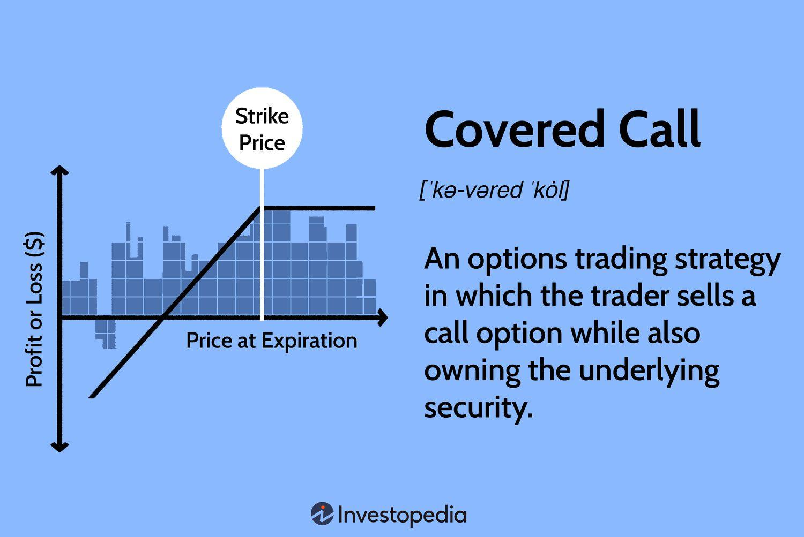

## Table of Contents

## What is a covered call strategy?

A covered call strategy is a way to make money from stocks you already own. You do this by selling someone else the right to buy your stock at a certain price before a certain date. This is called selling a call option. The money you get from selling the call option is called the premium. You keep this money no matter what happens with the stock price.

If the stock price stays the same or goes down, you keep the premium and your stock. This can help you earn some extra money even if the stock isn't doing well. But if the stock price goes up a lot, the person who bought the call option might want to buy your stock at the lower price you agreed on. You have to sell it to them, but you still get to keep the premium. This means you might miss out on some extra profit from the stock going up, but you still make money from the premium and the sale of the stock.

This strategy can be a good way to make some extra income from stocks you own, but it also has risks. If the stock price drops a lot, you could lose money on the stock itself, even though you have the premium. It's important to think carefully about the stock and the price you set for the call option to make sure this strategy works for you.

## How does a covered call work in a declining market?

In a declining market, a covered call can still be useful. When you sell a call option, you get money right away, called the premium. This money can help cushion the fall if the stock price goes down. For example, if you own a stock that drops from $50 to $45, but you got $3 from selling the call option, you're only down $2 overall because the premium helps make up for the loss.

However, there's a catch. If the stock price falls below the price you paid for it, you could lose money even with the premium. Let's say you bought the stock at $50 and it drops to $40, but you got $3 from the call option. You're still down $7 because the stock lost more value than the premium you received. So, while the covered call can help in a declining market, it doesn't protect you completely from losses if the stock price falls a lot.

## What are the benefits of using covered calls during market downturns?

Using covered calls during market downturns can help you make some money even when stock prices are falling. When you sell a call option, you get paid right away. This money, called the premium, can help make up for some of the losses if the stock price goes down. For example, if your stock drops by $5 but you got $2 from selling the call option, you're only down $3 overall. This can make it easier to handle a market that's going down.

Another benefit is that covered calls can give you a bit of peace of mind. Knowing that you have some extra money from the premium can make you feel better about holding onto your stocks during tough times. It's like having a safety net that can help you stick with your investments even when things look bad. While it won't stop all your losses, it can make a market downturn a bit less scary.

## What are the risks associated with covered calls in declining markets?

Using covered calls in a declining market has some risks. One big risk is that if the stock price falls a lot, the money you get from selling the call option might not be enough to cover your losses. For example, if you bought a stock at $50 and it drops to $40, but you only got $3 from the call option, you're still down $7. The premium helps, but it doesn't protect you completely if the stock price keeps falling.

Another risk is that you might miss out on a quick recovery. If the market suddenly goes back up after you sold the call option, you could lose the chance to make more money. If the stock price goes above the price you set for the call option, the person who bought the option might want to buy your stock at the lower price. You have to sell it to them, and you'll miss out on any extra profit if the stock keeps going up. So, while covered calls can help in a downturn, they also mean you might not benefit as much from a quick market recovery.

## How do you select the right stocks for covered calls in a bearish market?

When [picking](/wiki/asset-class-picking) stocks for covered calls in a bearish market, it's important to choose stocks that you think won't fall too much in value. Look for companies that are strong and have a good chance of staying stable even when the market is going down. These might be companies with solid finances, a history of steady performance, or ones that provide essential services that people will still need even during tough times. By choosing these kinds of stocks, you can feel more confident that the premium you get from selling the call option will help cover any small drops in the stock price.

Another thing to consider is the stock's [volatility](/wiki/volatility-trading-strategies). In a bearish market, you want to pick stocks that don't swing up and down too much. If a stock is very volatile, it could drop a lot, and the premium might not be enough to make up for your losses. On the other hand, if the stock is too stable, the premium you get from selling the call option might be small. So, finding a balance is key. You want a stock that's stable enough to not lose too much value but still gives you a good premium to help cushion any small declines in the stock price during a bearish market.

## What strike price and expiration date should be chosen for covered calls in declining markets?

When choosing a strike price for covered calls in a declining market, you want to pick a price that's higher than where the stock is trading now. This way, you can still make some money if the stock goes up a bit, but you won't have to sell your stock unless it goes up a lot. A good rule of thumb is to choose a strike price that's about 5% to 10% above the current stock price. This gives you a chance to keep your stock and the premium if the market stays down or only goes up a little.

For the expiration date, you should think about how long you're willing to wait to see if the stock price goes up. In a declining market, shorter expiration dates, like one to two months, can be safer. This is because the stock won't have as much time to fall a lot, and you can collect the premium more often. If you pick a longer expiration date, like three to six months, you might get a bigger premium, but you also take on more risk because the stock has more time to drop in value. So, shorter expiration dates are usually better in a bearish market to help manage your risk.

## How does the timing of entering a covered call position affect its outcome in a declining market?

The timing of when you start a covered call in a declining market can really change how things turn out. If you start your covered call when the market is just starting to go down, you might get a bigger premium because people are still willing to pay more for options. This bigger premium can help cushion your losses if the stock keeps falling. But, if you wait too long and the market is already deep in a downturn, the premiums might be smaller because fewer people want to buy call options. So, getting in early can give you more money to help protect against losses.

On the other hand, starting a covered call too early in a declining market can mean you miss out on a quick recovery. If the market suddenly goes back up right after you sell the call option, and the stock price goes above your strike price, you'll have to sell your stock at the lower strike price. This means you won't get to enjoy the full benefit of the stock going up. So, while getting in early can give you a bigger premium, you need to be careful about timing it just right to balance the risk of missing out on a recovery with the benefit of a higher premium.

## What is the impact of dividend payments on covered call strategies during market declines?

When you own a stock that pays dividends, those dividends can play a big role in your covered call strategy, especially during a market downturn. If you sell a call option on a stock that pays dividends, you get to keep the dividend as long as you still own the stock when the dividend is paid. This extra money from the dividend can help make up for some of the losses if the stock price goes down. So, choosing stocks that pay good dividends can give you a bit more cushion during tough times in the market.

However, there's a catch. If the stock price goes above the strike price of your call option before the expiration date, and the buyer of the option decides to buy your stock, you might have to sell it to them. If this happens right before the dividend is paid, you'll lose out on that dividend. This means you need to be careful about when you sell the call option, especially if a dividend payment is coming up soon. Balancing the timing of your covered call with the dividend schedule can help you get the most out of your strategy during a market decline.

## How can adjustments be made to covered call positions as the market continues to decline?

As the market keeps going down, you might want to make some changes to your covered call position to help manage your risk and maybe even make some money. One way to do this is by rolling down your call option. This means you buy back the original call option you sold and then sell a new one with a lower strike price. By doing this, you can get more money from the new premium, which can help make up for the stock losing value. But remember, if you roll down too much, you might end up selling your stock at a much lower price if it goes up again.

Another thing you can do is roll out your call option. This means you buy back the original call option and sell a new one with a later expiration date. This can give you more time for the stock price to maybe go back up, and you can get more money from the new premium. But be careful because the longer you wait, the more time the stock has to keep falling. So, rolling out can be a good move if you think the market might turn around soon, but it also comes with more risk if the market keeps going down.

## What advanced techniques can be used to enhance returns from covered calls in declining markets?

One advanced technique to boost returns from covered calls in a declining market is using a collar strategy. This involves buying a put option to go along with your covered call. The put option gives you the right to sell your stock at a certain price, which can protect you if the stock keeps falling. While the put option costs money, the premium you get from selling the call option can help pay for it. This way, you can limit how much you might lose if the market keeps going down, but you also give up some of the profit you could make if the stock goes up a lot.

Another technique is to use a dynamic delta hedging approach. This means you keep changing your call options based on how the stock price moves. If the stock price drops a lot, you might buy back your call option and sell a new one with a lower strike price to get more premium money. This can help you keep [earning](/wiki/earning-announcement) money from the premiums even as the market goes down. It takes some work to keep adjusting your options, but it can help you make the most of your covered call strategy in a tough market.

## How do implied volatility and historical volatility influence covered call strategies in bearish conditions?

Implied volatility and historical volatility can really change how you use covered calls in a bearish market. Implied volatility is what people think the stock will do in the future. When the market is going down and people are worried, implied volatility usually goes up. This means you can get more money from selling call options because people are willing to pay more for them. So, in a bearish market, higher implied volatility can help you make more money from the premiums, which can help make up for some of the losses if the stock price keeps falling.

Historical volatility looks at how much the stock price has moved around in the past. If a stock has been moving a lot, it might keep doing that even when the market is going down. This can be good and bad for covered calls. On the good side, if the stock is still moving a lot, you might be able to keep selling call options and getting good premiums. But on the bad side, if the stock keeps falling a lot, the money from the premiums might not be enough to cover your losses. So, knowing about both implied and historical volatility can help you pick the right stocks and set the right prices for your covered calls in a bearish market.

## Can covered calls be combined with other options strategies to mitigate risks in declining markets?

Yes, covered calls can be combined with other options strategies to help reduce risks in a declining market. One way to do this is by using a collar strategy. In a collar strategy, you buy a put option along with your covered call. The put option gives you the right to sell your stock at a certain price, which can protect you if the stock price keeps falling. While the put option costs money, the premium you get from selling the call option can help pay for it. This way, you can limit how much you might lose if the market keeps going down, but you also give up some of the profit you could make if the stock goes up a lot.

Another way to combine covered calls with other strategies is by using a dynamic delta hedging approach. This means you keep changing your call options based on how the stock price moves. If the stock price drops a lot, you might buy back your call option and sell a new one with a lower strike price to get more premium money. This can help you keep earning money from the premiums even as the market goes down. It takes some work to keep adjusting your options, but it can help you make the most of your covered call strategy in a tough market. By using these strategies together, you can better manage the risks of a declining market while still trying to make some money.

## References & Further Reading

[1]: Hull, J. C. (2012). ["Options, Futures, and Other Derivatives."](https://www.semanticscholar.org/paper/Options%2C-Futures%2C-and-Other-Derivatives-Hull/89bdee500c8623864fc9eb7a471546aa713acc44) 9th Edition, Pearson.

[2]: Lopez de Prado, M. (2018). ["Advances in Financial Machine Learning."](https://www.amazon.com/Advances-Financial-Machine-Learning-Marcos/dp/1119482089) Wiley.

[3]: Aronson, D. R. (2006). ["Evidence-Based Technical Analysis: Applying the Scientific Method and Statistical Inference to Trading Signals."](https://www.amazon.com/Evidence-Based-Technical-Analysis-Scientific-Statistical/dp/0470008741) Wiley.

[4]: Jansen, S. (2020). ["Machine Learning for Algorithmic Trading: Predictive Models to Extract Signals from Market and Alternative Data."](https://github.com/stefan-jansen/machine-learning-for-trading) Packt Publishing.

[5]: Chan, E. P. (2009). ["Quantitative Trading: How to Build Your Own Algorithmic Trading Business."](https://github.com/ftvision/quant_trading_echan_book) Wiley.