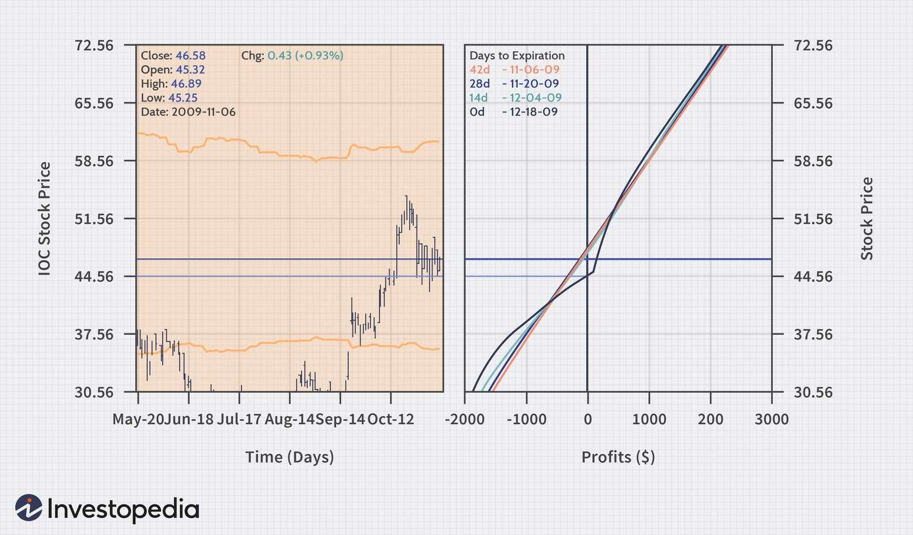

## Table of Contents

## What is a covered call and how does it work?

A covered call is a strategy used in investing where you own a stock and then sell someone else the right to buy that stock from you at a specific price, called the strike price, before a certain date. This right is called an option, specifically a call option. By selling this call option, you earn some money upfront, known as the premium. The idea is to generate extra income from stocks you already own, while potentially benefiting from any increase in the stock's price up to the strike price.

Here's how it works: Let's say you own 100 shares of a company, and the stock is currently trading at $50 per share. You decide to sell a call option with a strike price of $55 that expires in one month. Someone pays you a premium, say $2 per share, so you receive $200 (100 shares x $2). If the stock price stays below $55 by the expiration date, the option expires worthless, and you keep the $200 premium. If the stock price rises above $55, the buyer of the option can exercise it, buying your shares at $55 each. You still keep the $200 premium, but you miss out on any stock price increase above $55. If the stock price falls, you still own the shares, but the premium can help offset some of the loss.

## What is the difference between a covered call and a naked call?

A covered call and a naked call are two different ways to use call options in investing. A covered call is when you own the stock and then sell someone else the right to buy that stock from you at a certain price before a certain date. You get money upfront for selling this right, called a premium. If the stock price goes up a lot, you might have to sell your stock at the agreed price, but you keep the premium. If the stock price stays the same or goes down, you keep the stock and the premium.

A naked call is riskier because you don't own the stock when you sell the call option. You're betting that the stock price won't go up past the price you set. If it does, you have to buy the stock at the higher market price and sell it at the lower price you set, which can lead to big losses. But if the stock price stays below your set price, you keep the premium and don't have to do anything else. Naked calls can be very profitable but also very risky, so they're usually only used by experienced investors.

## How can you execute a covered call without owning the underlying stock?

You can execute a covered call without owning the underlying stock by using a strategy called a synthetic covered call. Instead of buying the actual stock, you buy a deep in-the-money call option with a lower strike price and a longer expiration date than the call option you plan to sell. This deep in-the-money call acts like owning the stock because it gives you the right to buy the stock at a much lower price than its current market value.

Then, you sell a call option against this deep in-the-money call, just like you would if you owned the stock. This way, you collect the premium from selling the call option. If the stock price goes up, the deep in-the-money call you bought will increase in value, helping to cover any potential losses from the call you sold. If the stock price stays the same or goes down, you keep the premium from the call you sold, similar to a traditional covered call. This strategy can be more complex and involves more risk, but it allows you to mimic the effects of a covered call without actually owning the stock.

## What are the risks involved in trading covered calls without owning the stock?

Trading covered calls without owning the stock, using a strategy called a synthetic covered call, can be riskier than traditional covered calls. In a synthetic covered call, you buy a deep in-the-money call option instead of the actual stock. This deep in-the-money call acts like owning the stock, but it's not the same. If the stock price drops a lot, the value of your deep in-the-money call will also drop, and you might lose money on that option. Plus, you still have to pay for the deep in-the-money call, which can be expensive.

Another risk is that the synthetic covered call involves two options: the one you buy and the one you sell. This means you're dealing with two expiration dates and two strike prices. If the stock price moves in a way you didn't expect, you could lose money on both options. For example, if the stock price goes up a lot, the call option you sold could be exercised, and you might have to buy the stock at a high price to sell it at the lower strike price. This could lead to losses if the deep in-the-money call you bought doesn't gain enough value to cover these costs.

## What are the potential benefits of using this strategy?

Using a synthetic covered call can help you make money from stocks without having to buy them. When you sell a call option, you get money upfront called a premium. This can be a good way to earn extra cash, especially if you think the stock price won't go up much or will stay the same. Since you don't need to buy the actual stock, you can use less money to start, which can be good if you don't have a lot to invest.

Another benefit is that you can still make money if the stock price goes up a little bit. The deep in-the-money call option you buy can increase in value if the stock price rises, helping to cover any losses from the call option you sold. This way, you can get the best of both worlds: earning a premium and possibly making money if the stock goes up. It's a flexible way to invest without needing to own the stock itself.

## How do margin requirements affect covered call trading without stock ownership?

When you trade covered calls without owning the stock, using a synthetic covered call, you need to think about margin requirements. Margin is like a loan from your broker that lets you make bigger trades than you could with just your own money. But, because you're not actually owning the stock and are using options instead, the margin requirements can be different and sometimes higher. This is because it's riskier for the broker, and they want to make sure you can cover any potential losses.

The margin requirements for a synthetic covered call can change based on how much the stock price moves and how close you are to the options' expiration dates. If the stock price goes up a lot, the broker might ask for more money to be put into your account to cover the risk. This can be tricky because you need to have enough money not just to start the trade but also to keep it going if things change. So, it's important to know how much margin you might need and make sure you can handle those costs before you start trading this way.

## What are the tax implications of trading covered calls without owning the stock?

When you trade covered calls without owning the stock, it can affect your taxes in a different way than if you owned the stock. In a synthetic covered call, you're buying one call option and selling another. If you make money from the premium you get for selling the call option, that money is usually taxed as ordinary income. This is because the IRS sees it as money you made from your job of trading options. If you lose money on the deep in-the-money call option you bought, you can use those losses to reduce your taxes, but you need to keep good records to show what you made and lost.

Another thing to think about is how long you hold the options. If you hold them for less than a year, any money you make is taxed as short-term capital gains, which is the same as ordinary income. If you hold them for more than a year, it's taxed as long-term capital gains, which can be lower. But, because you're dealing with options and not the actual stock, it can be hard to figure out the right tax rates. It's a good idea to talk to a tax professional to make sure you're doing everything right and not missing out on any tax benefits or getting into trouble with the IRS.

## How does the selection of strike price and expiration date impact the strategy?

Choosing the right strike price and expiration date can really change how well your synthetic covered call works. If you pick a strike price that's close to the current stock price, you'll get more money upfront from selling the call option. But, it's also riskier because the stock only needs to go up a little bit for the buyer to want to take your stock. If you pick a strike price that's higher, you'll get less money upfront, but it's safer because the stock has to go up more before the buyer wants to buy it from you. So, it's a balance between getting more money now and taking less risk.

The expiration date also matters a lot. If you choose a short expiration date, like a month, you'll get less money for selling the call option, but you'll get to do it again sooner. This can be good if you think the stock won't move much in the short term. If you pick a longer expiration date, like three months, you'll get more money upfront, but you'll have to wait longer to do it again. Plus, the longer you wait, the more time the stock has to move in a way you didn't expect, which can be riskier. So, you need to think about how long you want to be in the trade and how much risk you're okay with.

## What are some common mistakes to avoid when trading covered calls without stock?

One common mistake people make when trading synthetic covered calls is not understanding how much money they need to start and keep going. Since you're not buying the actual stock, you're using options instead, and that can mean higher margin requirements. If the stock price moves a lot, your broker might ask for more money to cover the risk. If you don't have enough money in your account, you might have to close your position at a bad time and lose money. So, it's important to know how much money you might need and make sure you have it before you start.

Another mistake is picking the wrong strike price and expiration date. If you choose a strike price that's too close to the current stock price, you'll get more money upfront, but it's riskier because the stock only needs to go up a little bit for the buyer to want to take it. If you pick a strike price that's too high, you'll get less money upfront, but it's safer. The same goes for the expiration date. A short expiration date means less money upfront but you can do it again sooner. A longer expiration date means more money upfront but more time for the stock to move in a way you didn't expect. It's all about finding the right balance between getting more money now and taking less risk.

## How can you use technical analysis to enhance your covered call strategy?

You can use technical analysis to make your covered call strategy better by looking at stock charts and patterns. Technical analysis helps you guess where the stock price might go next. You can use things like moving averages, support and resistance levels, and chart patterns to see if the stock price is likely to go up, down, or stay the same. If you think the stock price will stay the same or go up just a little bit, you might sell a call option with a strike price that's a bit higher than the current price. This way, you can get more money upfront, but it's not too risky because the stock probably won't go up enough for the buyer to want to take it.

Another way technical analysis can help is by picking the right time to sell your call option. If you see that the stock is in a strong uptrend, you might want to wait until it hits a resistance level before selling the call. This could give you a higher premium because the stock price is higher. On the other hand, if you see the stock is in a downtrend or about to break through a support level, you might want to sell the call option sooner to get some money before the stock price drops too much. By using technical analysis, you can make smarter choices about when to sell your call options and how to set your strike prices to balance risk and reward.

## What are advanced techniques for managing and adjusting covered call positions?

One advanced technique for managing covered call positions is called rolling. If the stock price goes up a lot and your call option is about to be exercised, you can buy back the call you sold and sell a new one with a higher strike price or a later expiration date. This way, you can keep getting money from the premiums without having to give up your stock. Rolling can help you stay in the trade longer and maybe make more money, but it can also cost you more if you have to keep buying back the old options.

Another technique is adjusting your position based on how the stock is moving. If the stock price starts going down, you might want to buy a put option to protect yourself. This is called a protective put, and it can help limit how much money you lose if the stock keeps dropping. On the other hand, if the stock price is going up fast, you might sell another call option at a higher strike price to get more money upfront. This is called a collar strategy, and it can help you make more money while also protecting you from big losses. Both of these techniques need careful planning and watching the market closely to work well.

## How does market volatility affect the decision to trade covered calls without owning the stock?

Market volatility can make a big difference when you're thinking about trading covered calls without owning the stock. When the market is very up and down, the options you're trading can get more expensive. This means you can get more money upfront when you sell a call option, which is good. But, it also means the stock price can move a lot more than you expect, which is bad because it's riskier. If the stock price goes up a lot, the person who bought your call option might want to take your stock, and you'll have to buy it at a high price to give it to them. So, you need to be careful and think about how much the stock might move before you decide to trade.

When the market is calm and not moving much, the options might not be as expensive, so you won't get as much money upfront. But, it's also less risky because the stock price is less likely to move a lot. This can be a good time to trade covered calls without owning the stock if you think the stock will stay the same or go up just a little bit. You can use the money you get from selling the call option to help pay for the deep in-the-money call option you bought. So, market volatility is something you always need to keep an eye on when you're trading covered calls without owning the stock.

## References & Further Reading

For individuals and professionals interested in expanding their understanding of covered call strategies and [algorithmic trading](/wiki/algorithmic-trading), a variety of resources are available to provide a thorough grounding and in-depth insights into these topics:

1. **Books on Options Trading**:
   - *"Options, Futures, and Other Derivatives"* by John C. Hull - This comprehensive text serves as a foundational reference for understanding the intricacies of derivatives markets, including options trading strategies such as covered calls.
   - *"The Options Playbook"* by Brian Overby – A practical guide focusing on basic to advanced options strategies, making it highly favorable for understanding the nuances of covered calls.

2. **Algorithmic Trading Literature**:
   - *"Algorithmic Trading: Winning Strategies and Their Rationale"* by Ernest P. Chan – This book offers insights into the design, development, and implementation of profitable algorithmic trading strategies, providing practical examples and code in Python.
   - *"Building Winning Algorithmic Trading Systems"* by Kevin J. Davey – Details the author's process for developing robust algo trading strategies, including considerations for backtesting and risk management.

3. **Research Papers and Articles**:
   - "High-Frequency Trading Strategies" by Gerhard Heßler, which explores the mechanics of implementing high-frequency trading strategies and their application in various market conditions.
   - "The Effectiveness of Covered Call Writing" by Robert M. Dammon and Chester S. Spatt, published in the Journal of Portfolio Management, analyzes the performance of covered call strategies in different market environments.

4. **Online Courses and Tutorials**:
   - Coursera and edX offer courses such as *“Algorithmic Trading and Stocks Essential Training”* and *“Trading Strategies in Emerging Markets”*, which include modules on both basic and advanced trading strategies.
   - QuantInsti’s Executive Programme in Algorithmic Trading (EPAT) provides a specialized curriculum focused on algorithmic trading, including practical sessions on strategy building.

5. **Web Resources and Communities**:
   - The official websites of exchanges such as the Chicago Board Options Exchange (CBOE) offer detailed educational material and webinars on options trading practices.
   - Online forums and communities such as the Quantitative Finance Stack Exchange and Elite Trader provide platforms for discussing covered calls and algorithmic trading strategies, sharing code snippets, and optimization techniques.

These resources collectively aid in building a robust understanding of the synergistic use of covered calls and algorithmic trading, and can significantly enhance practical and theoretical expertise in trading strategies.

