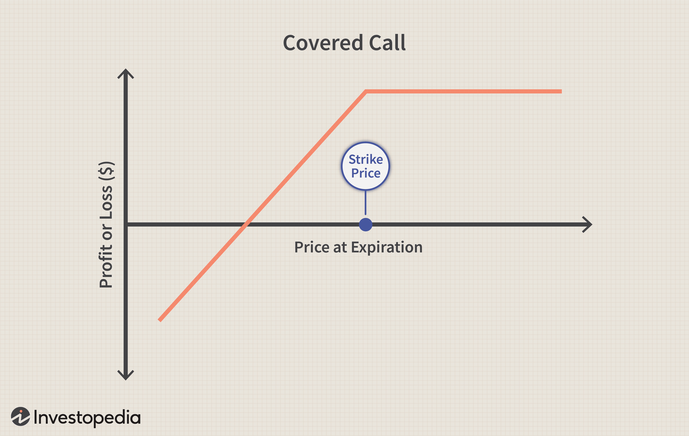

Options trading, particularly through the use of covered calls, provides investors with an effective method for generating additional income from their stock holdings. A covered call strategy involves owning shares of a stock and simultaneously selling call options on those shares. This allows investors to collect premium income, thereby supplementing the returns from the underlying equity. This approach is most beneficial in stable or slightly appreciating markets, where the likelihood of the stock being called away remains minimal. By selling call options, investors capitalize on their existing holdings, turning potential future gains into immediate cash flow.

The advent of algorithmic trading has significantly transformed traditional finance methodologies, embedding automation and enhancing precision in trade execution. Algorithms, structured on predefined criteria or complex machine learning models, autonomously execute trades based on market signals. This removes the element of human emotion, thereby fostering more objective decision-making. The increased speed and accuracy of execution afforded by algorithmic trading systems can lead to improved profitability and reduced response times to market fluctuations.



This article examines the synthesis of covered call strategies with algorithmic trading, which presents new opportunities for optimizing returns while managing associated risks in complex market environments. By integrating automation into covered calls, investors can fine-tune the timing and pricing of their trades with greater efficiency and adaptability. The utilization of algorithmic models holds promise for generating a dynamic investment strategy that is not only reactive to current market conditions but also predictive of future trends. Through such integration, investors can strive for heightened income and a balanced risk profile, offering a more sophisticated and responsive approach to lucrative market opportunities.

## Table of Contents

## Understanding Covered Calls

A covered call strategy involves holding a long position in a stock while simultaneously selling or writing call options on that same stock. This strategy is designed to generate additional income through the premiums received from the sale of the options. In essence, it serves as a way to enhance returns from a stock holding by leveraging the options market.

A covered call is particularly appealing in flat or mildly bullish market environments. These conditions are favorable because they reduce the likelihood of the stock price rising significantly above the strike price of the sold call option, minimizing the chance of the stock being "called away." When a stock is called away, the option holder exercises their right to purchase the stock at the agreed-upon strike price, potentially causing the seller to miss out on further upside potential.

The key benefits of implementing a covered call strategy include income generation and reduced portfolio volatility. By selling call options, investors collect premiums that can supplement their income, making this strategy a popular choice for income-focused investors. The additional income from premiums can also offset any declines in the stock's price, thus dampening the overall volatility of the investment portfolio.

However, adopting a covered call strategy also comes with certain limitations. Primarily, it restricts the investor's ability to capitalize on substantial gains in rapidly appreciating markets. Since the call option sets a cap, or strike price, on potential profits from a stock, any significant price increase beyond this level results in the stock being called away, limiting further profits. Thus, while the strategy provides income and stability, it does so at the expense of uncapped gains during bullish market runs.

In summary, a covered call strategy is a balanced approach leveraging both stock ownership and option selling to create a consistent income stream, albeit with the trade-off of limiting upside potential in strongly bullish markets.

## The Mechanics of Algo Trading

Algorithmic trading, commonly referred to as algo trading, employs sophisticated algorithms and computational power to execute trading decisions and strategies with minimal human intervention. These algorithms, often based on mathematical models and statistical analyses, facilitate high-frequency trading ([HFT](/wiki/high-frequency-trading-strategies)), allowing trades to be executed in fractions of a second.

One of the primary advantages of [algorithmic trading](/wiki/algorithmic-trading) is the elimination of emotional biases that often plague human traders. Emotions such as fear and greed can lead to irrational decision-making, resulting in suboptimal investment outcomes. By using predefined rules and logic, algorithms maintain consistency and discipline in executing trades, thereby reducing the impact of human emotions on trading results.

Algo trading also enables rapid response to market changes. In fast-moving markets, the ability to react swiftly to price movements, market events, or emerging patterns is crucial. Algorithms can analyze vast amounts of data in real-time, identify trading opportunities, and execute trades much faster than any human trader could. This speed advantage is particularly significant in volatile markets, where prices can fluctuate rapidly.

However, the deployment of algorithmic trading strategies necessitates a robust technological infrastructure. This includes high-performance computing systems, low-latency data feeds, and secure, reliable connectivity to financial markets. A well-maintained infrastructure ensures that algorithms can operate efficiently and without interruptions. Furthermore, continuous optimization is required to maintain the effectiveness of these trading systems. Market conditions are dynamic, and algorithms must be periodically updated and refined to adapt to changes such as shifts in market [volatility](/wiki/volatility-trading-strategies), regulatory changes, or the emergence of new trading instruments.

For example, consider a simple algorithm that trades based on moving average crossovers, a common technical analysis method. The algorithm could be described in Python as follows:

```python
def moving_average(data, period):
    return sum(data[-period:]) / period

def trade_signal(short_ma, long_ma):
    if short_ma > long_ma:
        return "Buy"
    elif short_ma < long_ma:
        return "Sell"
    else:
        return "Hold"

data = [/* historical price data */]
short_period = 50
long_period = 200

short_ma = moving_average(data, short_period)
long_ma = moving_average(data, long_period)

signal = trade_signal(short_ma, long_ma)
print(f"Trade Signal: {signal}")
```

This code calculates short-term and long-term moving averages, generating buy or sell signals based on the crossover of these averages. While simple, it illustrates the basic mechanics of an algorithmic trading strategy—automated calculations followed by rule-based decision-making.

In conclusion, while algo trading offers substantial benefits in terms of speed and bias elimination, the continual need for infrastructure investments and strategy optimization poses challenges. The effectiveness of algorithmic trading relies on ongoing refinement and adaptation to ever-evolving market conditions.

## Integrating Covered Calls with Algo Trading

Combining covered calls with algorithmic trading introduces automation into the strategy, significantly enhancing the efficiency of managing trades. This integration leverages sophisticated algorithms capable of extracting and analyzing vast amounts of market data, thus facilitating optimal decision-making regarding the timing and pricing of call options.

The primary advantage of using algorithms in this context is their ability to process complex data sets rapidly and adapt to real-time market conditions. For instance, they can continually monitor market indicators such as volatility, interest rates, and the underlying stock's price trends, adjusting the covered call strategy dynamically to maximize profitability or minimize risks. By doing so, investors can capitalize on fleeting opportunities that may not be perceptible through conventional manual trading methods.

One of the most promising developments in this area is the application of [machine learning](/wiki/machine-learning) models. These models can identify patterns and predict stock trends with considerable accuracy, allowing for a more precise adjustment of covered call positions. For example, a machine learning algorithm could be trained using historical stock price data to predict future movements. This predictive capability enables traders to set more advantageous strike prices or expiry dates for the call options, aligning them with anticipated market conditions.

A simple Python implementation of a machine learning model for such a purpose might involve using a library like scikit-learn to train a regression model on historical stock prices:

```python
import numpy as np
from sklearn.model_selection import train_test_split
from sklearn.linear_model import LinearRegression

# Sample historical data: stock_prices (features), next_day_price (target)
stock_prices = np.array([[...], [...]])  # Add real data points here
next_day_price = np.array([...])         # Add real data points here

# Splitting data into training and test sets
X_train, X_test, y_train, y_test = train_test_split(stock_prices, next_day_price, test_size=0.2)

# Training the model
model = LinearRegression()
model.fit(X_train, y_train)

# Predict future stock prices
predicted_prices = model.predict(X_test)
```

The integration of algorithms also allows for the [backtesting](/wiki/backtesting) of strategies under various hypothetical market scenarios, providing a robust framework for evaluating their potential effectiveness before live deployment. Moreover, advanced algorithms can be programmed to comply with various predefined rules, effectively reducing human error and removing emotional biases that often influence trading decisions.

Overall, the merger of covered calls with algorithmic trading not only increases the precision and speed of trade executions but also enhances the strategy's adaptability and responsiveness in a continually evolving market landscape. This synergy enables investors to harness data-driven insights, optimizing their portfolio returns while managing risks with greater efficacy.

## Challenges and Risks

Algorithmic trading of covered calls involves certain complexities, particularly in programming and maintaining effective algorithms. This complexity arises from the requirement to develop sophisticated code that can accurately assess market conditions and respond accordingly. Maintaining these algorithms requires continuous updates and troubleshooting to adapt to market changes or rectify emerging issues. As the market dynamics shift, algorithms must be recalibrated to ensure they function effectively and optimize trading strategies.

One of the main risks in this integration is increased transaction costs. Algorithmic trading often involves executing a high number of trades to capture small price movements, which can lead to significant transaction fees. These costs can erode profit margins, especially if not managed effectively. Therefore, a thorough cost analysis is critical to ensure that the expected returns justify the increased transaction costs.

Unintended market impacts also pose a risk when trading algorithms execute large volumes or influence stock prices. Large orders from algorithmic trading can lead to sudden price changes, adversely affecting market [liquidity](/wiki/liquidity-risk-premium) and stability. This necessitates robust risk management frameworks to monitor and mitigate these potential impacts, ensuring that the trading strategy does not inadvertently disrupt market dynamics.

Furthermore, tax implications are a crucial [factor](/wiki/factor-investing) to consider. The frequency of trades in algorithmic strategies, especially in covered calls, can result in complex tax scenarios. Frequent trading may lead to short-term capital gains, which are often taxed at a higher rate compared to long-term holdings. This requires meticulous planning and understanding of tax regulations to optimize tax efficiency and avoid unexpected liabilities.

In summary, while algorithmic trading of covered calls can offer optimized investment strategies, it requires a comprehensive approach addressing programming complexity, transaction costs, unintended market impacts, and tax considerations. Implementing these strategies successfully involves leveraging advanced technologies and analytical tools to navigate the challenges and risks inherent in dynamic financial markets.

## Best Practices for Covered Call Algo Trading

To effectively engage in covered call algorithmic trading, adopting a set of best practices can significantly enhance performance and ensure robust management of both strategies and associated risks. A foundational approach involves optimizing algorithmic strategies through the use of rule-based systems and advanced machine learning models. These technologies enable automatic decision-making by identifying patterns and executing trades based on predefined criteria and continuously learning from market data. For instance, a trading algorithm may use logistic regression or neural networks to predict the optimal strike price and expiration date for options contracts based on historical price movements and implied volatility.

Adaptation to changing market conditions is crucial for maintaining the efficacy of trading strategies. Volatility analysis serves as a vital tool in this context, permitting traders to assess the risk levels of their portfolios and adjust their positions accordingly. For instance, employing the CBOE Volatility Index (VIX) as a benchmark can help traders understand the underlying volatility of the market, dictating the aggressiveness of trading strategies. Scenario planning further supports this adaptive approach by simulating various market conditions and testing the strategy's performance under different scenarios, thereby informing necessary adjustments.

A rigorous risk management framework is essential for sustaining long-term success in covered call algorithmic trading. This includes careful position sizing to manage exposure risk; a common approach is using the Kelly Criterion, which helps in determining the optimal size of a series of bets. Additionally, comprehensive backtesting plays a critical role in understanding how trading algorithms would have performed under historical market conditions. This involves applying trading strategies to past data and analyzing key performance metrics to assess the strategy's effectiveness and potential drawbacks. Ensuring robustness in these models requires a sufficiently large dataset to generalize findings and prevent overfitting to historical noise.

By adhering to these best practices, traders can effectively navigate the complexities of covered call algorithmic trading, thereby enhancing their potential for profit while minimizing associated risks. Embracing technological advancements and continuously refining strategies based on empirical data and evolving market conditions remain cornerstones of achieving sustainable success in this domain.

## Conclusion

The integration of covered calls with algorithmic trading presents a sophisticated and robust approach for investors aiming to boost income while effectively managing risk. This combination leverages the income-generating potential of covered calls—where investors hold a long position in an asset and sell call options on the same—to provide an additional revenue stream. When paired with algorithmic trading, strategies become not only automated but also strategically optimized, reducing manual intervention and human error.

Despite inherent challenges such as increased complexity and the need for significant technological infrastructure, the benefits are significant. The synergy from combining these strategies allows for more dynamic and responsive investment actions, as algorithms can adjust positions in real time based on market fluctuations, enhancing overall efficacy. This responsiveness is particularly crucial in fast-paced markets where conditions can shift rapidly.

Moreover, future advancements in machine learning and [artificial intelligence](/wiki/ai-artificial-intelligence) are poised to further evolve this domain, supporting the development of more sophisticated and adaptive trading strategies. Machine learning models, for instance, could more accurately predict market trends, thus optimizing decision-making processes. As these technologies progress, they hold the potential to refine the execution of covered call strategies and maximize returns, ensuring that algorithmic models remain aligned with market realities and investor goals. Through continuous innovation, the integration of covered calls and algorithmic trading could reshape how investors approach income generation and risk management.

## References & Further Reading

For individuals and professionals interested in expanding their understanding of covered call strategies and algorithmic trading, a variety of resources are available to provide a thorough grounding and in-depth insights into these topics:

1. **Books on Options Trading**:
   - *"Options, Futures, and Other Derivatives"* by John C. Hull - This comprehensive text serves as a foundational reference for understanding the intricacies of derivatives markets, including options trading strategies such as covered calls.
   - *"The Options Playbook"* by Brian Overby – A practical guide focusing on basic to advanced options strategies, making it highly favorable for understanding the nuances of covered calls.

2. **Algorithmic Trading Literature**:
   - *"Algorithmic Trading: Winning Strategies and Their Rationale"* by Ernest P. Chan – This book offers insights into the design, development, and implementation of profitable algorithmic trading strategies, providing practical examples and code in Python.
   - *"Building Winning Algorithmic Trading Systems"* by Kevin J. Davey – Details the author's process for developing robust algo trading strategies, including considerations for backtesting and risk management.

3. **Research Papers and Articles**:
   - "High-Frequency Trading Strategies" by Gerhard Heßler, which explores the mechanics of implementing high-frequency trading strategies and their application in various market conditions.
   - "The Effectiveness of Covered Call Writing" by Robert M. Dammon and Chester S. Spatt, published in the Journal of Portfolio Management, analyzes the performance of covered call strategies in different market environments.

4. **Online Courses and Tutorials**:
   - Coursera and edX offer courses such as *“Algorithmic Trading and Stocks Essential Training”* and *“Trading Strategies in Emerging Markets”*, which include modules on both basic and advanced trading strategies.
   - QuantInsti’s Executive Programme in Algorithmic Trading (EPAT) provides a specialized curriculum focused on algorithmic trading, including practical sessions on strategy building.

5. **Web Resources and Communities**:
   - The official websites of exchanges such as the Chicago Board Options Exchange (CBOE) offer detailed educational material and webinars on options trading practices.
   - Online forums and communities such as the Quantitative Finance Stack Exchange and Elite Trader provide platforms for discussing covered calls and algorithmic trading strategies, sharing code snippets, and optimization techniques.

These resources collectively aid in building a robust understanding of the synergistic use of covered calls and algorithmic trading, and can significantly enhance practical and theoretical expertise in trading strategies.

