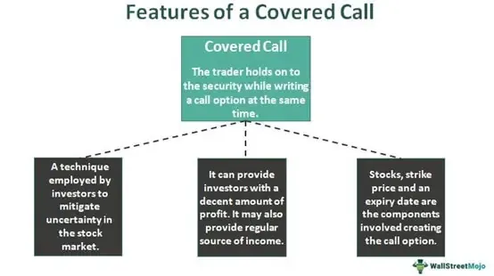

Options trading is a multifaceted domain, offering various strategies designed to balance risk while enhancing returns. Among these strategies, writing covered call options stands prominently as a technique utilized by many stock investors to generate additional income. This method involves holding a stock position while concurrently selling call options on the same stock, thereby earning premiums that can provide extra income or a degree of downside protection. While traditionally executed manually, the integration of algorithmic trading has introduced new efficiencies and automation capabilities to covered call strategies, transforming how these options are deployed and managed.

Algorithmic trading involves the use of computer programs to execute trades based on predetermined criteria, offering precision and consistency that human traders may find challenging to maintain. By applying these techniques to covered call options, investors can automate the decision-making processes involved in selecting stocks, choosing appropriate option contracts, and managing positions. This automation reduces errors, mitigates emotional biases, and enables traders to capitalize on opportunities with greater agility. The convergence of covered call strategies with algorithmic trading represents a significant advancement in the optimization of trading practices, offering investors enhanced mechanisms to systematically harness the potential of options markets. This article explores this convergence, illuminating the benefits, challenges, and nuances of joining traditional covered call strategies with modern algorithmic methodologies.



## Table of Contents

## Understanding Covered Call Options

A covered call option strategy is a trading approach that entails the simultaneous holding of a long position in a stock and the selling of a call option on the same underlying asset. This strategy is employed by investors seeking to augment their income through the premiums earned from selling call options while still participating in the potential appreciation of the stock, albeit with limited upside.

In a covered call, the investor retains ownership of the underlying stock. The call option sold grants the buyer the right, but not the obligation, to purchase the stock from the investor at a predetermined price, known as the strike price, before the option expires. The option's buyer pays a premium for this right, which serves as immediate income for the call writer.

The primary objective of writing covered calls is to capture this premium income. This strategy is most beneficial in market conditions where the investor anticipates a neutral to moderately bullish outlook on the stock, meaning they expect the stock price to remain stable or increase slightly. If the stock price rises significantly above the strike price, the investor may have to sell the stock at the lower strike price, thus capping the potential profit on the stock's appreciation beyond the strike price.

Mathematically, the maximum profit from a covered call strategy can be expressed as:

$$
\text{Maximum Profit} = (\text{Strike Price} - \text{Purchase Price of Stock}) + \text{Premium Received}
$$

The downside risk of holding the stock remains, as the stock price could decrease. However, the premium received from selling the call option provides a small buffer against potential losses if the stock's market value falls.

Covered call strategies are a popular choice for investors who wish to generate additional income from their stock holdings or seek a conservative way to invest in volatile markets. However, they must be meticulously managed to balance the trade-off between potential income from premiums and the risk of missing out on significant capital gains if the stock appreciates substantially. Proper analysis and execution are critical in selecting the appropriate strike prices and expiration dates to align with the investor's market outlook and risk tolerance.

## The Mechanics of Writing Covered Calls

A covered call strategy involves a sequence of methodical steps starting with the selection of a suitable underlying stock. Investors typically choose stocks they already own or plan to acquire, focusing on those with stable or slightly bullish market outlooks. The stock should ideally exhibit consistent price action, demonstrating stability to ensure predictability in option pricing.

Once the underlying stock is selected, the next step is choosing the appropriate call options. This involves examining several key factors, including the contract expiration date and strike price. The expiration date can range from weekly to several months out, and the choice of time frame often depends on the investor's market outlook and risk tolerance. A closer expiration date typically offers faster premium income but requires more frequent monitoring and adjustments.

Determining the strike price is a critical aspect of strategy. The strike price is set higher than the current market price of the stock to allow for potential asset appreciation. This can be expressed mathematically as:  

$$
S < K
$$

where $S$ is the stock's current price and $K$ is the strike price. The chosen strike price reflects expectations of stock performance; a strike too close to the current price limits upside potential, while one set too high may reduce the premium income.

The premium received from selling call options provides immediate income, which acts as a buffer against minor declines in stock price. This compensation is termed the option premium, and its calculation involves numerous parameters including the stock's [volatility](/wiki/volatility-trading-strategies), time until expiration, and prevailing interest rates, often derived using models such as Black-Scholes:

$$
C = S N(d_1) - Ke^{-rt} N(d_2)
$$

where $C$ is the call price, $N$ represents the cumulative distribution function, $e$ is the base of natural logarithms, $r$ is the risk-free rate, $t$ is the time to expiration, and $d_1$ and $d_2$ are statistical measures of deviation.

Understanding market conditions is pivotal in making informed decisions about strike prices and premium calculations. Market volatility, interest rates, and the underlying asset's historical performance all [factor](/wiki/factor-investing) into evaluating covered call opportunities.

In summary, the mechanics of writing covered calls involves strategic stock selection, careful choice of call options, and astute determination of the strike price, backed by thorough market condition analysis. This process not only generates additional income from premiums but also provides a slight hedge against potential stock price declines, aligning with the investor's market outlook and risk profile.

## Benefits and Risks of Covered Call Strategies

Covered call strategies are a widely used approach among investors seeking to generate additional income from their stock holdings. By selling call options against a stock they already own, investors collect premiums, which serve as an immediate cash inflow. This strategy effectively turns the position into an income-generating asset, offering the potential to enhance returns in various market conditions. 

The primary benefit of employing covered calls is the ability to earn premium income, which can be particularly advantageous in flat or slightly bullish markets. This additional income provides a small buffer against minor declines in the stock price, functioning as limited downside protection. The premium acts as a cushion; if the stock price decreases, the premium helps offset the loss, thereby reducing the overall impact on the investor's portfolio.

However, the covered call strategy is not without risks. One significant disadvantage is the potential cap on profits if the stock price surges beyond the strike price of the sold call option. In such scenarios, the investor is obligated to sell the stock at the strike price, missing out on substantial gains that could have been realized had the stock been held outright. This limitation makes covered calls less suitable for investors with a highly bullish outlook on the underlying stock.

For example, consider an investor who owns 100 shares of a stock priced at $50 per share and writes a covered call with a strike price of $55 for a premium of $2 per share. If the stock price rises to $60, the investor has to sell the shares at $55, thus foregoing the additional $5 per share ($60 - $55) profit. However, the investor still retains the $2 premium, providing some consolation for the missed opportunity.

Investors must carefully assess their risk tolerance and market perspective before implementing this strategy. A nuanced understanding of the underlying asset, market conditions, and individual financial goals is crucial. Covered call options best serve those with a neutral to moderately bullish viewpoint, as they provide a method of enhancing income while maintaining a level of participation in market movements. Properly evaluating these factors ensures that the covered call strategy aligns with the investor's overall portfolio objectives.

 to Algorithmic Trading

Algorithmic trading, often referred to as algo trading, leverages sophisticated algorithms to automate financial trading. These algorithms, operating on pre-set rules and criteria, are designed to execute trades with precision, speed, and efficiency that far surpass human capabilities. The primary advantage lies in the ability to process vast amounts of market data rapidly and execute trades at optimal conditions, minimizing human errors and emotions that can adversely affect trading decisions.

The automation introduced by [algorithmic trading](/wiki/algorithmic-trading) enhances trade execution significantly. By predefining trading strategies, traders can ensure consistent application of their trading logic, free from emotional biases like fear or greed. This consistency is crucial in maintaining the integrity of a trading strategy over time. Additionally, the speed at which algorithms operate allows them to capitalize on short-lived market opportunities that manual trading could miss.

As the demand for efficient and scalable trading solutions has grown, particularly in complex markets such as options trading, algorithmic trading has become increasingly popular. Options trading involves handling derivatives that require precise calculations and swift execution—tasks that are ideally suited for automated systems. As a result, traders can manage multiple positions and strategies simultaneously, optimizing portfolio performance while minimizing risks associated with human intervention.

Python, a popular programming language, offers tools such as libraries and APIs that facilitate the development and implementation of trading algorithms. For example, utilizing Python with broker APIs like TDAmeritrade allows traders to build and test their algorithms in a reliable and flexible environment. This interoperability ensures that even sophisticated trading models can be executed seamlessly, enhancing the overall trading experience.

## Role of Algorithmic Trading in Covered Calls

Algorithmic trading plays a pivotal role in efficiently executing covered call strategies by automating several critical processes. Algorithms are designed to methodically select suitable stocks, execute trades, and manage positions, thereby enhancing the overall efficiency of the trading strategy.

One significant advantage of employing such systems is the consistency they deliver by strictly adhering to predefined trading rules. Unlike human traders, algorithms do not succumb to emotional biases, ensuring that decisions are made purely based on predefined criteria, which can enhance the reliability of the trading strategy.

Moreover, algorithmic systems excel at processing and evaluating large datasets swiftly. This capability is crucial in identifying optimal opportunities for executing covered calls. These systems can assess various parameters like price movements, volatility, and historical performance across multiple stocks simultaneously to pinpoint the most suitable options for writing covered calls.

An example of how algorithms can be used is through the implementation of a Python-based system. Suppose you want the algorithm to automatically select stocks and execute a covered call strategy based on certain criteria:

```python
import pandas as pd

def select_stocks(df, min_price, max_price, min_volatility):
    # Filter stocks within the price and volatility range
    selected_stocks = df[(df['Price'] >= min_price) & (df['Price'] <= max_price) & (df['Volatility'] >= min_volatility)]
    return selected_stocks

def execute_covered_call(strategy, stock_data):
    # Logic for executing covered call based on strategy
    for index, stock in stock_data.iterrows():
        # Example condition to execute a trade
        if stock['Expected Return'] > strategy['Return Threshold']:
            # Execute trade (pseudo-code)
            place_order(stock['Symbol'], strategy['Strike Price'])
```

In this hypothetical code snippet, `select_stocks()` helps in filtering stocks based on price and volatility criteria, whereas `execute_covered_call()` outlines a basic structure for executing trades based on expected returns and predefined thresholds. By automating these steps, the system efficiently handles routine tasks, allowing traders to focus on strategy refinement and adjustment.

These algorithmic approaches to covered call writing not only streamline the trading process but also provide a scalable solution capable of evaluating multiple opportunities quickly, thus maximizing both performance and potential returns.

## How to Implement Covered Call Strategies Using Algorithms

Implementing covered call strategies through algorithmic trading requires meticulous planning, appropriate technology, and a solid understanding of both options trading and programming. Selecting a platform that supports algorithmic trading, such as Python integrated with brokers like TDAmeritrade, is an essential first step. 

### Steps to Automation

1. **Stock Selection Automation**: Identify a universe of stocks that align with the covered call strategy. This involves evaluating stocks based on criteria such as volatility, liquidity, and historical performance. The following Python snippet demonstrates filtering stocks based on volatility and volume:

    ```python
    import yfinance as yf  # For more datasets, visit: https://paperswithbacktest.com/datasets
    def filter_stocks_by_volatility_and_volume(tickers, vol_threshold, volume_threshold):
        selected_stocks = []
        for ticker in tickers:
            data = yf.Ticker(ticker).history(period='1y')
            if data['Volume'].mean() > volume_threshold and data['Close'].std() > vol_threshold:
                selected_stocks.append(ticker)
        return selected_stocks
    ```

2. **Defining Strike Prices and Premium Calculation**: The algorithm should select appropriate call options by evaluating various strike prices and corresponding premiums. A common approach is setting the strike price slightly above the current market price to balance premium income and potential stock appreciation.

3. **Trade Execution and Management**: Implement algorithms that execute trades once conditions align with the strategy. This includes buying the underlying stock and selling the call option. A robust system will monitor the market continuously, adjusting positions as necessary to adhere to the strategy.

4. **Market Monitoring**: Continual tracking of market conditions, including stock prices, option premiums, and volatility, is crucial. Automated alerts can assist in re-evaluating positions if pre-set market conditions change, such as a significant drop in stock price or approaching option expiration.

### Backtesting Strategies

Backtesting is a vital component to validate the efficacy of your algorithmic strategy before live deployment. It involves running the strategy against historical market data to assess performance and identify weaknesses. Python libraries such as `pandas` and `numpy` facilitate data handling, while `[backtrader](/wiki/backtrader)` provides a comprehensive framework for [backtesting](/wiki/backtesting):

```python
import backtrader as bt

class CoveredCallStrategy(bt.Strategy):
    def __init__(self):
        self.stocks = self.datas[0]
        self.calls = self.datas[1]

    def next(self):
        if not self.getposition(self.stocks).size:
            self.buy(data=self.stocks)
            self.sell(data=self.calls)

data = bt.feeds.YahooFinanceData(dataname='AAPL')
calls = bt.feeds.YahooFinanceData(dataname='AAPL_call')

cerebro = bt.Cerebro()
cerebro.adddata(data, name='stocks')
cerebro.adddata(calls, name='calls')
cerebro.addstrategy(CoveredCallStrategy)
cerebro.run()
```

### Continuous Improvement 

Optimizing algorithms to adapt to ever-changing market dynamics is essential. Regularly updating models with the latest data and insights ensures they remain effective. However, avoid overfitting, which is tailoring the strategy too closely to historical data at the expense of future performance.

In conclusion, algorithmic implementation of covered call strategies enhances precision and efficiency in trading operations, offering a systematic approach to capturing income through options. By integrating robust algorithmic frameworks with careful planning, traders can capitalize on opportunities while managing risks effectively.

## Challenges and Considerations in Automation

Over-optimization of algorithms in automated trading systems can lead to significant challenges in live market performance. This phenomenon occurs when a trading algorithm is excessively fine-tuned to historical data, capturing noise instead of genuine signals. While such an algorithm might appear highly successful in backtesting scenarios, its lack of flexibility often results in poor performance when exposed to real-time market conditions, which are inherently dynamic and unpredictable. To mitigate this risk, traders should employ techniques such as cross-validation and walk-forward analysis. Cross-validation involves dividing historical data into multiple segments to test the algorithm’s adaptability across different periods, while walk-forward analysis iteratively tests and refines the model with new data.

Technological failures pose another significant challenge for automated trading systems. Hardware malfunctions, software bugs, or network issues can cause interruptions, resulting in missed trades or erroneous transactions. To ensure resilience against such disruptions, traders should implement robust contingency plans. These plans might include backup servers, redundant internet connections, and failover strategies that automatically transition trading activities to standby systems in case of main system failure. Additionally, rigorous testing of the trading infrastructure, including stress testing and failure scenario simulations, can help identify potential vulnerabilities before they affect live trading.

It's crucial for trading algorithms to remain adaptable in response to evolving market dynamics. Market conditions are influenced by a myriad of factors, including economic indicators, geopolitical events, and investor sentiment, all of which can change rapidly. To ensure strategies remain relevant and effective, continuous monitoring and adjustment of algorithms are necessary. This involves regular performance reviews, where the algorithm’s output is analyzed against current market data, and necessary modifications are implemented. Furthermore, incorporating [machine learning](/wiki/machine-learning) techniques can allow algorithms to learn from real-time data and adjust their parameters dynamically, enhancing their ability to respond to market shifts.

Ultimately, the success of an automated trading system in executing covered call strategies hinges on its ability to balance optimization with adaptability, anticipate and mitigate potential technological failures, and continuously refine its approach to align with an ever-changing market landscape.

## Conclusion

Combining covered call strategies with algorithmic trading presents a powerful method for enhancing returns and managing risk efficiently in the financial markets. The synergy between these two practices lies in the ability to systematically capitalize on market opportunities while mitigating potential downsides.

Covered call strategies on their own offer a dual benefit by providing additional income through option premiums and offering a modest hedge against declines in the stock's price. When these strategies are automated using algorithmic trading, the process gains precision and consistency. Algorithms can efficiently scan multiple stocks, evaluate their volatility, and select optimal strike prices for call options, thereby enhancing the scalability and speed of executing trades. This ability to seamlessly process vast amounts of market data ensures that traders can exploit short-lived opportunities that may arise throughout the trading day.

Moreover, traders embracing technological advancements position themselves advantageously in an increasingly fast-paced and competitive market environment. The advancement of technology in the financial sector allows for the constant refinement and evolution of trading strategies. Automation mitigates human biases and errors, ensuring that strategies adhere to predetermined rules without emotional interference.

However, success in this endeavor hinges on thorough market knowledge and disciplined management. An understanding of both options trading and the technical nuances of implementing algorithmic solutions is essential. Traders must be vigilant in maintaining their systems, regularly assessing and tweaking algorithms to align with ongoing market dynamics. Additionally, robust risk management practices must be part of the automation framework to guard against unforeseen market shifts or technical disruptions.

In conclusion, the integration of covered call strategies with algorithmic trading represents a sophisticated financial strategy, offering a balanced approach to return enhancement and risk management. For traders keen on leveraging this methodology, the key lies in an unwavering commitment to learning, adapting, and executing with precision.

## Additional Resources

Explore platforms like QuantConnect and Alpaca for algorithmic trading tools. QuantConnect is a cloud-based platform providing a collaborative environment for developing, testing, and executing trading algorithms. With support for multiple asset classes, including options, and coding in multiple languages like Python, it offers extensive historical data and a powerful backtesting engine. This facilitates thorough analysis before implementing strategies live.

Alpaca, a commission-free trading platform, offers an API-first approach that allows for seamless integration with algorithms developed in Python. It supports real-time market data and paper trading, enabling users to fine-tune their strategies before committing capital. For developers looking to expand their algorithmic trading skills, Alpaca's robust API documentation and community resources are invaluable.

For those seeking deeper insights into options trading and derivatives, "Options, Futures, and Other Derivatives" by John C. Hull is an authoritative text. It covers a wide range of topics, from pricing and risk management to complex trading strategies, providing a comprehensive understanding essential for both novice and experienced traders.

Additionally, online courses and tutorials offer structured learning paths to master both options trading and algorithmic strategies. Websites like Coursera, edX, and Udemy feature courses from top institutions and industry professionals. These courses often include video lectures, interactive coding exercises, and opportunities to engage with peers and instructors, enhancing both theoretical knowledge and practical skills in trading and automation.

## References & Further Reading

[1]: Hull, J. C. (2020). ["Options, Futures, and Other Derivatives"](https://elibrary.pearson.de/book/99.150005/9781292410623). Pearson.

[2]: Chan, E. P. (2009). ["Quantitative Trading: How to Build Your Own Algorithmic Trading Business"](https://github.com/ftvision/quant_trading_echan_book). Wiley.

[3]: Jansen, S. (2020). ["Machine Learning for Algorithmic Trading - Second Edition: Predictive models to extract signals from market and alternative data for systematic trading strategies with Python"](https://thuvienso.hoasen.edu.vn/bitstream/handle/123456789/12260/Contents.pdf?sequence=1). Packt Publishing.

[4]: Aronson, D. R. (2006). ["Evidence-Based Technical Analysis: Applying the Scientific Method and Statistical Inference to Trading Signals"](https://www.amazon.com/Evidence-Based-Technical-Analysis-Scientific-Statistical/dp/0470008741). Wiley.

[5]: Lopez de Prado, M. (2018). ["Advances in Financial Machine Learning"](https://www.amazon.com/Advances-Financial-Machine-Learning-Marcos/dp/1119482089). Wiley.