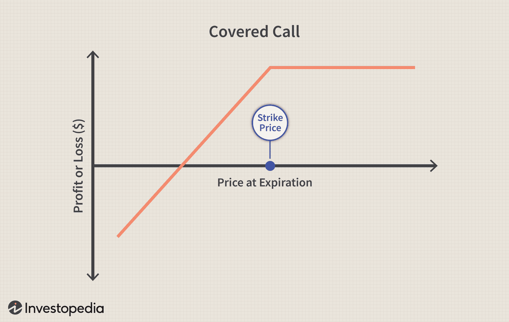

## Table of Contents

## What is a covered call?

A covered call is a strategy in investing where you own a stock and then sell someone else the right to buy that stock from you at a certain price before a certain date. This right is called an option, specifically a call option. By selling this call option, you earn some money upfront, which is called the premium. The idea is to make extra money from the stock you already own, while also being okay with selling it at the agreed price if the buyer decides to use their option.

The strategy can be good because it lets you earn more from your stock, but it also has risks. If the stock's price goes up a lot, you might miss out on those gains because you have to sell it at the lower agreed price. On the other hand, if the stock price stays the same or goes down, you keep the premium, which can help offset any losses in the stock's value. It's a balancing act between making extra income and potentially limiting your profits if the stock does really well.

## How does covered call writing work?

Covered call writing is when you own a stock and then sell a call option on that stock. A call option gives someone else the right to buy your stock at a set price, called the strike price, before a certain date. When you sell this option, you get money right away, which is called the premium. This is good because it's like getting extra money from the stock you already own. You're okay with selling the stock at the strike price if the buyer decides to use their option.

The strategy can be helpful but also has risks. If the stock's price goes up a lot, you might miss out on those extra gains because you have to sell it at the lower strike price. But if the stock price stays the same or goes down, you keep the premium, which can help make up for any loss in the stock's value. It's a way to try to make some extra money, but you have to be ready to sell your stock at the agreed price if the buyer wants it.

## What are the benefits of writing covered calls?

Writing covered calls can help you make some extra money from the stocks you already own. When you sell a call option, you get paid right away. This money, called the premium, is yours to keep no matter what happens to the stock price. If the stock price doesn't go up much or even goes down, the premium can help cover any losses you might have on the stock. This can make your investment a bit safer because you have some extra cash to cushion any drops in the stock's value.

Another benefit is that writing covered calls can give you a steady income. If you keep selling call options on the same stock, you can keep collecting premiums over time. This can be really helpful if you're looking for a way to make regular money from your investments. Plus, it can help you plan better because you know how much money you'll get from the premiums, even if the stock price doesn't move much.

## What are the risks associated with covered call writing?

One big risk of writing covered calls is that you might miss out on big gains. If the stock's price goes way up, you have to sell it at the lower strike price you agreed on. This means you won't get to enjoy all the extra money you could have made if you had just held onto the stock. It can be frustrating to see the stock keep going up after you've sold it at a lower price.

Another risk is that your stock could lose value. Even though you get the premium from selling the call option, if the stock's price drops a lot, the premium might not be enough to cover your losses. This means you could end up losing more money than you gained from the premium. It's important to think about how much the stock might fall and whether the premium is worth the risk.

## How do you select the right stock for a covered call strategy?

When [picking](/wiki/asset-class-picking) a stock for a covered call strategy, you want to look for a stock that you think will stay about the same or go up a little, but not too much. You don't want the stock to go up a lot because then you'd have to sell it at the lower strike price you set, and you'd miss out on the bigger gains. So, a good choice might be a stock that pays dividends and has a steady price. This way, you can still make money from the dividends and the premium from selling the call option, even if the stock doesn't move much.

Another thing to think about is how much the stock might go down. If the stock is very risky and could lose a lot of value, the premium you get from selling the call option might not be enough to cover your losses. So, it's a good idea to pick a stock that you think is pretty safe and won't drop too much. This way, you can feel more secure that the premium will help protect you if the stock does go down a bit.

## What factors should be considered when choosing the strike price and expiration date for a covered call?

When choosing the strike price for a covered call, you need to think about how much you think the stock will go up. If you pick a strike price that's too low, you might have to sell your stock for less than it's worth if it goes up a lot. But if you pick a strike price that's too high, you might not get as much money from the premium because people won't want to buy the option if they think it's unlikely the stock will reach that price. So, you want to find a good balance where you get a decent premium but also don't miss out on too much if the stock goes up.

The expiration date is also important. If you choose a date that's too soon, the premium might be smaller because there's less time for the stock to move. But if you pick a date that's too far away, you're locking up your stock for a longer time and might miss other chances to make money. You should think about how long you're willing to hold onto the stock and what you think will happen to its price in that time. A good rule of thumb is to pick a date that gives you enough time to collect a good premium but isn't so far out that you're stuck with the stock longer than you want.

## How can covered call writing be used to generate income?

Covered call writing can be a good way to make extra money from the stocks you already own. When you sell a call option on your stock, you get paid right away. This money is called the premium, and it's yours to keep no matter what happens to the stock's price. If the stock doesn't go up much or even goes down a bit, the premium can help cover any losses you might have. This can make your investment safer because you have some extra cash to cushion any drops in the stock's value.

Another way covered call writing helps you make money is by giving you a steady income. If you keep selling call options on the same stock, you can keep collecting premiums over time. This can be really helpful if you're looking for a way to make regular money from your investments. Plus, it can help you plan better because you know how much money you'll get from the premiums, even if the stock price doesn't move much.

## What is the tax treatment of income from covered calls?

The money you make from selling covered calls, called the premium, is usually treated as regular income for tax purposes. This means you'll have to pay taxes on it at your normal income tax rate, just like you would with money from a job. If you end up selling your stock at a profit because someone used their call option, that profit might be taxed as a capital gain. The tax rate for capital gains can be lower than your regular income tax rate, depending on how long you owned the stock before selling it.

If the stock price goes down and you lose money, you might be able to use those losses to reduce your taxes. You can use these losses to offset any capital gains you have from other investments. If your losses are more than your gains, you can even use some of the extra loss to lower your regular income, up to a certain limit each year. It's a good idea to talk to a tax professional to make sure you're handling everything correctly, as tax rules can be complicated and change over time.

## How does the performance of the underlying stock affect a covered call position?

When you write a covered call, what happens to the stock you own can change how much money you make or lose. If the stock's price stays the same or goes up a little but stays below the strike price, you get to keep the premium from selling the call option. This is good because it's like getting extra money from your stock without having to sell it. But if the stock's price goes down, you might lose money on the stock itself. The premium you got can help make up for some of that loss, but if the stock drops a lot, the premium might not be enough to cover all your losses.

If the stock's price goes up a lot and goes above the strike price, the person who bought the call option might decide to use it. This means you have to sell your stock at the strike price, even though it's worth more now. You'll miss out on the extra money you could have made if you had just kept the stock. But you still get to keep the premium, which can help make up for some of what you missed. So, while covered calls can give you extra income, they also mean you might not get as much money if the stock does really well.

## Can you explain the concept of 'early assignment' in covered calls?

Early assignment in covered calls happens when the person who bought the call option from you decides to use it before it expires. Normally, people wait until the option is about to expire to see if they want to use it. But sometimes, they might choose to use it early, especially if the stock starts paying a dividend and they want to get that dividend. When this happens, you have to sell your stock to them at the strike price you agreed on, even if the stock is worth more now.

This can be a bit tricky because you might miss out on more money if the stock keeps going up after you've sold it. But you still get to keep the premium you got from selling the call option, which can help make up for some of what you missed. It's important to be ready for early assignment, especially if the stock you own is about to pay a dividend, because that's when it's most likely to happen.

## How do market conditions influence the effectiveness of a covered call strategy?

Market conditions can really change how well a covered call strategy works. If the market is steady and the stock prices don't move too much, covered calls can be a good way to make extra money. You get to keep the premium from selling the call option, and if the stock price stays below the strike price, you can keep the stock and still make money from the premium. This can be especially good in a market where stocks are not going up or down a lot, because you can keep selling call options and collecting premiums over time.

But if the market is going up a lot, covered calls might not be as good. If the stock price goes above the strike price, you might have to sell your stock for less than it's worth now. This means you could miss out on bigger gains if you had just kept the stock. On the other hand, if the market is going down a lot, the premium you get from selling the call option might not be enough to cover your losses on the stock. So, you need to think about what the market might do and pick the right stocks and strike prices to make the most of your covered call strategy.

## What advanced techniques can be used to enhance returns from covered call writing?

One way to make more money from covered call writing is by rolling the options. If the stock price goes up a lot and you don't want to sell it at the strike price, you can buy back the call option you sold and then sell a new one with a higher strike price or a later expiration date. This can help you keep the stock longer and maybe get a bigger premium. But it costs money to buy back the old option and sell a new one, so you need to think about if it's worth it.

Another technique is to use a strategy called the "poor man's covered call." Instead of buying the stock outright, you buy a long-term call option that's cheaper. Then, you sell shorter-term call options against it. This way, you can control more stock with less money and still make money from the premiums. It's a bit riskier because if the stock price goes down a lot, you could lose your whole investment, but it can be a good way to make more money if you're careful.

## What are Covered Call Options and How Do They Work?

A covered call option strategy is a trading approach that entails the simultaneous holding of a long position in a stock and the selling of a call option on the same underlying asset. This strategy is employed by investors seeking to augment their income through the premiums earned from selling call options while still participating in the potential appreciation of the stock, albeit with limited upside.

In a covered call, the investor retains ownership of the underlying stock. The call option sold grants the buyer the right, but not the obligation, to purchase the stock from the investor at a predetermined price, known as the strike price, before the option expires. The option's buyer pays a premium for this right, which serves as immediate income for the call writer.

The primary objective of writing covered calls is to capture this premium income. This strategy is most beneficial in market conditions where the investor anticipates a neutral to moderately bullish outlook on the stock, meaning they expect the stock price to remain stable or increase slightly. If the stock price rises significantly above the strike price, the investor may have to sell the stock at the lower strike price, thus capping the potential profit on the stock's appreciation beyond the strike price.

Mathematically, the maximum profit from a covered call strategy can be expressed as:

$$
\text{Maximum Profit} = (\text{Strike Price} - \text{Purchase Price of Stock}) + \text{Premium Received}
$$

The downside risk of holding the stock remains, as the stock price could decrease. However, the premium received from selling the call option provides a small buffer against potential losses if the stock's market value falls.

Covered call strategies are a popular choice for investors who wish to generate additional income from their stock holdings or seek a conservative way to invest in volatile markets. However, they must be meticulously managed to balance the trade-off between potential income from premiums and the risk of missing out on significant capital gains if the stock appreciates substantially. Proper analysis and execution are critical in selecting the appropriate strike prices and expiration dates to align with the investor's market outlook and risk tolerance.

## What are the Mechanics of Writing Covered Calls?

A covered call strategy involves a sequence of methodical steps starting with the selection of a suitable underlying stock. Investors typically choose stocks they already own or plan to acquire, focusing on those with stable or slightly bullish market outlooks. The stock should ideally exhibit consistent price action, demonstrating stability to ensure predictability in option pricing.

Once the underlying stock is selected, the next step is choosing the appropriate call options. This involves examining several key factors, including the contract expiration date and strike price. The expiration date can range from weekly to several months out, and the choice of time frame often depends on the investor's market outlook and risk tolerance. A closer expiration date typically offers faster premium income but requires more frequent monitoring and adjustments.

Determining the strike price is a critical aspect of strategy. The strike price is set higher than the current market price of the stock to allow for potential asset appreciation. This can be expressed mathematically as:  

$$
S < K
$$

where $S$ is the stock's current price and $K$ is the strike price. The chosen strike price reflects expectations of stock performance; a strike too close to the current price limits upside potential, while one set too high may reduce the premium income.

The premium received from selling call options provides immediate income, which acts as a buffer against minor declines in stock price. This compensation is termed the option premium, and its calculation involves numerous parameters including the stock's [volatility](/wiki/volatility-trading-strategies), time until expiration, and prevailing interest rates, often derived using models such as Black-Scholes:

$$
C = S N(d_1) - Ke^{-rt} N(d_2)
$$

where $C$ is the call price, $N$ represents the cumulative distribution function, $e$ is the base of natural logarithms, $r$ is the risk-free rate, $t$ is the time to expiration, and $d_1$ and $d_2$ are statistical measures of deviation.

Understanding market conditions is pivotal in making informed decisions about strike prices and premium calculations. Market volatility, interest rates, and the underlying asset's historical performance all [factor](/wiki/factor-investing) into evaluating covered call opportunities.

In summary, the mechanics of writing covered calls involves strategic stock selection, careful choice of call options, and astute determination of the strike price, backed by thorough market condition analysis. This process not only generates additional income from premiums but also provides a slight hedge against potential stock price declines, aligning with the investor's market outlook and risk profile.

## References & Further Reading

[1]: Hull, J. C. (2020). ["Options, Futures, and Other Derivatives"](https://elibrary.pearson.de/book/99.150005/9781292410623). Pearson.

[2]: Chan, E. P. (2009). ["Quantitative Trading: How to Build Your Own Algorithmic Trading Business"](https://github.com/ftvision/quant_trading_echan_book). Wiley.

[3]: Jansen, S. (2020). ["Machine Learning for Algorithmic Trading - Second Edition: Predictive models to extract signals from market and alternative data for systematic trading strategies with Python"](https://thuvienso.hoasen.edu.vn/bitstream/handle/123456789/12260/Contents.pdf?sequence=1). Packt Publishing.

[4]: Aronson, D. R. (2006). ["Evidence-Based Technical Analysis: Applying the Scientific Method and Statistical Inference to Trading Signals"](https://www.amazon.com/Evidence-Based-Technical-Analysis-Scientific-Statistical/dp/0470008741). Wiley.

[5]: Lopez de Prado, M. (2018). ["Advances in Financial Machine Learning"](https://www.amazon.com/Advances-Financial-Machine-Learning-Marcos/dp/1119482089). Wiley.