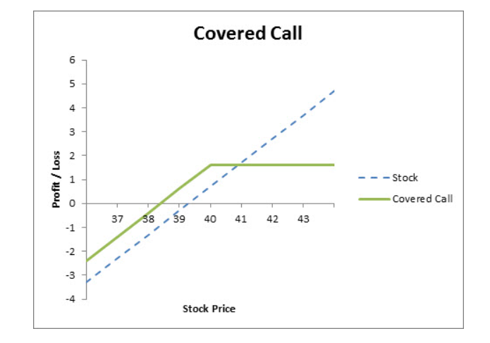

## Table of Contents

## What is a covered call?

A covered call is a popular options trading strategy where an investor owns a stock and sells a call option on that same stock. The goal is to generate extra income from the option premiums while still holding onto the stock. Here's how it works: let's say you own 100 shares of a company. You can sell one call option contract, which gives someone else the right to buy your 100 shares at a set price, called the strike price, before a certain date.

The main benefit of a covered call is that you get to keep the premium from selling the call option, which can provide a steady income stream. However, there's a trade-off. If the stock price goes above the strike price before the option expires, the buyer of the call option can choose to buy your shares at the lower strike price. This means you might have to sell your stock for less than its current market value. On the other hand, if the stock price stays below the strike price, the option will likely expire worthless, and you keep both your stock and the premium.

## What are dividend stocks?

Dividend stocks are shares in companies that regularly pay out a portion of their earnings to shareholders. These payments, called dividends, are usually given out every three months, but can sometimes be paid monthly or yearly. People like dividend stocks because they can give you a steady income, kind of like getting paid just for owning the stock.

When you invest in dividend stocks, you're not just hoping the stock price will go up. You're also looking to get those regular dividend payments. This can be really helpful, especially if you're saving for the future or want some extra money coming in. But, it's important to remember that not all companies pay dividends, and the amount can change or stop if the company isn't doing well.

## How do covered calls on dividend stocks work?

When you own dividend stocks and use a covered call strategy, you're doing two things at once. First, you're getting regular dividend payments from the company. Second, you're selling call options on those same stocks to make extra money from the option premiums. Here's how it goes: you own shares in a company that pays dividends, and you sell a call option on those shares. The person who buys the call option has the right to buy your shares at a set price before the option expires.

This strategy can be a good way to earn more money. You get the dividends, which is like a bonus for holding the stock, and you also get the premium from selling the call option. But there's a catch. If the stock price goes above the strike price of the call option before it expires, the buyer might want to buy your shares. If that happens, you'll have to sell your shares, and you might miss out on future dividends. If the stock price stays below the strike price, the option will likely expire worthless, and you keep your shares and the dividends, plus the premium you got from selling the option.

## What are the benefits of using covered calls on dividend stocks?

Using covered calls on dividend stocks can help you make more money from your investments. When you own a dividend stock, you get regular payments from the company just for holding the stock. If you sell a call option on those shares, you get extra money from the premium. This means you're [earning](/wiki/earning-announcement) from both the dividends and the option premium, which can add up over time and give you a nice steady income.

But there's a risk you need to think about. If the stock price goes above the price you set for the call option, the person who bought the option might want to buy your shares. If that happens, you'll have to sell your stock and you might miss out on future dividend payments. Still, if the stock price stays below the option price, you get to keep your shares, the dividends, and the premium from selling the option. So, it's a good way to make more money, but you need to be okay with possibly having to sell your shares.

## What are the risks associated with covered calls on dividend stocks?

Using covered calls on dividend stocks can be risky. One big risk is that you might have to sell your stocks if the price goes above the price you set for the call option. If that happens, you won't get to keep your stocks and you'll miss out on future dividend payments. This can be a problem if you were counting on those dividends for regular income.

Another risk is that the stock price might drop a lot. If it does, the money you made from selling the call option might not be enough to make up for the loss in the stock's value. Plus, if the stock price falls below the price you paid for it, you could lose money on the stock itself, even though you got the option premium and the dividends. So, while covered calls can help you make more money, they also come with risks that you need to think about carefully.

## How do you select the right dividend stocks for covered calls?

When [picking](/wiki/asset-class-picking) dividend stocks for covered calls, you want to look at how stable the company is. A good rule is to choose companies that have been paying dividends for a long time and have a history of increasing them. These are often called "dividend aristocrats." You also want to check the company's financial health. Make sure they have enough money to keep paying dividends even if things get tough. A company that's doing well and growing its earnings is more likely to keep up its dividend payments, which is important if you're planning to use covered calls.

Another thing to think about is the stock's price and how much it moves around. You want a stock that doesn't jump up and down too much, because that can make your covered call strategy riskier. If the stock price stays pretty steady, it's easier to pick a good strike price for your call option. Also, look at the dividend yield, which is how much the dividend is compared to the stock's price. A higher yield can mean more income, but be careful because a really high yield might mean the stock is risky. So, finding the right balance between a stable stock and a good dividend yield is key to making covered calls on dividend stocks work well for you.

## What factors should be considered when choosing strike prices and expiration dates for covered calls on dividend stocks?

When picking the strike price for covered calls on dividend stocks, you need to think about how much you want to make and how much risk you're okay with. If you set the strike price close to the current stock price, you'll get a bigger premium right away, but there's a bigger chance you'll have to sell your stock if the price goes up. If you set the strike price higher, the premium will be smaller, but you're less likely to have to sell your stock. It's like a trade-off: more money now versus keeping your stock longer. Also, think about when the next dividend is coming. If the stock price is likely to go up before the dividend date, you might want to set a higher strike price so you can keep the stock and get the dividend.

Choosing the right expiration date is also important. Shorter expiration dates usually give you a smaller premium but less risk because the stock has less time to move a lot. Longer expiration dates can give you a bigger premium, but there's more time for the stock price to go up, which means a bigger chance you'll have to sell your stock. You need to think about how long you're okay with possibly not owning the stock and missing out on dividends. It's all about finding the right balance between getting more money from the premium and keeping your stock for future dividends.

## How does the timing of dividend payments affect covered call strategies?

The timing of dividend payments can really change how you use covered calls. If you know when the next dividend is coming, you can pick a strike price and expiration date that help you keep your stock until after the dividend is paid. For example, if the dividend is coming soon, you might set a higher strike price so the stock is less likely to be called away before you get the dividend. This way, you can get both the dividend and the premium from selling the call option.

But if the stock price goes up a lot before the dividend date, the person who bought your call option might want to buy your shares. If that happens, you'll have to sell your stock and you'll miss out on the dividend. So, it's a bit of a balancing act. You need to think about how likely it is that the stock price will go up before the dividend, and choose your strike price and expiration date carefully to make the most of your covered call strategy.

## Can you provide an example of a covered call on a dividend stock?

Let's say you own 100 shares of a company called ABC Corp. ABC Corp pays a quarterly dividend of $0.50 per share, so you get $50 every three months just for holding the stock. You decide to sell a covered call on these shares. The stock is currently trading at $50 per share, and you sell a call option with a strike price of $55 that expires in one month. For selling this call option, you get a premium of $1 per share, which is $100 total since you're selling one contract for 100 shares.

Now, there are two main things that can happen. If the stock price stays below $55 by the time the option expires, the call option will likely expire worthless, and you keep your 100 shares, the $50 dividend, and the $100 premium from selling the call. But if the stock price goes above $55 before the option expires, the person who bought the call option might want to buy your shares at $55 each. If that happens, you have to sell your shares, but you still keep the $100 premium and the $50 dividend. So, even though you lose your shares, you made $150 extra from the covered call and dividend.

## How do taxes impact the returns from covered calls on dividend stocks?

Taxes can change how much money you keep from using covered calls on dividend stocks. When you get dividends, they are usually taxed as ordinary income, which can be at a higher rate than other types of investment income. The money you make from selling the call option, called the premium, is also taxed. If you hold the stock for less than a year before selling it because of the call option, any profit you make from selling the stock is taxed as short-term capital gains, which is the same as your regular income tax rate. But if you hold the stock for more than a year, it's taxed as long-term capital gains, which usually has a lower tax rate.

So, when you're figuring out how much money you're making from covered calls on dividend stocks, you need to think about taxes. The taxes on the dividends and the premium can eat into your profits. Also, if you have to sell your stock because of the call option, the taxes on any profit from selling the stock will depend on how long you owned it. It's a good idea to talk to a tax advisor to understand how taxes will affect your returns and plan your strategy accordingly.

## What advanced strategies can be used to enhance returns from covered calls on dividend stocks?

One advanced strategy to boost your returns from covered calls on dividend stocks is called the "dividend capture" strategy. This is when you buy a stock just before it pays a dividend, then sell a covered call on it. The goal is to keep the stock long enough to get the dividend, then maybe sell it at a higher price if the call option gets exercised. You need to be careful with the timing though. You want the expiration date of the call option to be after the dividend date, but not so far that the stock price goes up a lot and you lose your shares before you get the dividend.

Another strategy you can try is called "rolling" the covered call. If the stock price goes up and it looks like your call option will be exercised, you can buy back the call option you sold and then sell a new one with a higher strike price or a later expiration date. This way, you might keep your stock and still make money from the new option premium. It's a bit tricky because you have to pay to buy back the first option, but if the new premium is higher, it can work out well. Both these strategies need you to watch the stock and option prices closely and understand how they might change.

## How do market conditions influence the effectiveness of covered calls on dividend stocks?

Market conditions can really change how well covered calls on dividend stocks work. If the market is going up and stock prices are rising, your stock might get called away more often because it's more likely to go above the strike price. This means you might have to sell your stock and miss out on future dividends. But on the bright side, if the stock price goes up a lot, you might still make a good profit from selling the stock at the higher strike price, plus the premium and the dividend you already got.

On the other hand, if the market is going down and stock prices are falling, your stock is less likely to be called away. This is good because you can keep your stock and keep getting those dividend payments. But if the stock price drops a lot, the value of your stock goes down too, and the premium from selling the call option might not be enough to make up for the loss. So, you need to keep an eye on the market and think about how it might affect your covered call strategy on dividend stocks.

## What is the Covered Calls Strategy Explained?

A covered call strategy combines holding a long position in a stock with selling call options on the same stock to generate additional income. This approach is beneficial for investors seeking to monetize their equities, particularly when those equities are dividend stocks. The mechanics of a covered call involve selling call options with a strike price that is higher than the current market price of the stock. This is done in anticipation that the stock price will not rise above the strike price before the option's expiration date.

The strategy is particularly attractive for dividend stocks because it provides two streams of income: dividends from the stock itself and premiums from the sale of call options. This dual-income potential can be appealing in flat or bear market conditions, where capital gains may be limited. In flat or declining markets, the premium collected from selling call options can serve to offset some of the losses in stock value or enhance overall returns by providing a consistent income stream.

However, writing covered calls also comes with certain limitations. If the stock price surpasses the strike price, the stock may be called away, meaning the investor is obligated to sell the stock at the strike price, potentially missing out on further upside gains. This aspect highlights the trade-off between generating immediate income and capping potential capital appreciation.

Investors may calculate expected returns from covered calls using formulas that take into account the option premium, dividends, and any potential capital appreciation up to the strike price. Here is a simple calculation for expected returns from a covered call:

$$

\text{Total Expected Return} = \frac{C + D + (S_k - S_0)}{S_0} \times 100\% 
$$

Where:
- $C$ is the call option premium
- $D$ is the dividend received
- $S_k$ is the strike price of the option
- $S_0$ is the initial stock price

This formula provides a framework for understanding the potential profitability of a covered call strategy, keeping in mind the balance between income generation and limited capital gains. Additionally, investors who employ covered calls should have a nuanced understanding of their financial objectives, risk tolerance, and market expectations to tailor the strategy to their specific needs.

## References & Further Reading

[1]: ["Generating Yield from Dividend Stocks by Selling Calls"](https://www.thestreet.com/investing/options/selling-call-options-on-dividend-stocks-can-boost-returns-13836349) from CME Group

[2]: McMillan, L. G. (2004). ["Options as a Strategic Investment."](https://www.amazon.com/Options-Strategic-Investment-Lawrence-McMillan/dp/0735201978) New York Institute of Finance.

[3]: Kolb, R. W., & Overdahl, J. A. (2007). ["Futures, Options, and Swaps."](https://www.amazon.com/Futures-Options-Swaps-Robert-Kolb/dp/1405150491) Wiley Blackwell.

[4]: Natenberg, S. (1994). ["Option Volatility & Pricing: Advanced Trading Strategies and Techniques."](https://www.amazon.com/Option-Volatility-Pricing-Strategies-Techniques/dp/0071818774) McGraw-Hill.

[5]: ["Algorithmic Trading: Winning Strategies and Their Rationale"](https://www.amazon.com/Algorithmic-Trading-Winning-Strategies-Rationale-ebook/dp/B00CY5HC0U) by Ernie Chan

[6]: ["Introduction to Python for Finance: Learn how to handle, plot, and use financial data with Python"](https://www.datacamp.com/courses/introduction-to-python-for-finance) from DataCamp

[7]: ["Python for Finance: Investment Fundamentals and Data Analytics"](https://github.com/PacktPublishing/Python-for-Finance-Investment-Fundamentals-and-Data-Analytics) on Udemy

[8]: ["Algorithmic and High-Frequency Trading"](https://www.amazon.com/Algorithmic-High-Frequency-Trading-Mathematics-Finance/dp/1107091144) by Álvaro Cartea, Sebastian Jaimungal, and José Penalva