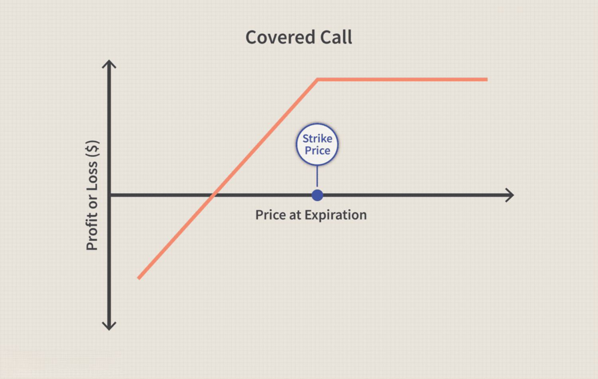

Options trading is a form of investment that allows traders to buy or sell options, which are financial instruments that derive their value from the price of underlying assets, such as stocks, indices, or commodities. These options grant the holder the right, but not the obligation, to buy (call option) or sell (put option) the underlying asset at a predetermined price, known as the strike price, before or at the expiration date. The significance of options trading in financial markets lies in its ability to provide leverage, risk management, and diverse strategic opportunities. Traders can utilize options to hedge against potential losses, to speculate on market movements, or to earn income through various strategies.

Among the several strategies employed in options trading, covered calls stand out as a popular choice, especially for investors holding long positions in underlying assets. A covered call strategy involves holding a long position in an asset while simultaneously selling call options on the same asset. This approach enables investors to generate additional income from premiums received from selling call options. Covered calls can also offer some level of downside protection, as the premium income can offset minor losses in the asset’s value. However, this strategy caps the potential upside, as the asset may be called away if its price exceeds the strike price.



In recent years, the rise of algorithmic trading has revolutionized modern investing, including options trading. Algorithmic trading, or algo trading, involves using computer algorithms to execute trades based on pre-defined criteria. These algorithms can process vast amounts of market data with speed and precision, executing trades at optimal times without the influence of human emotions. Algo trading offers significant advantages, such as improved efficiency, accuracy, and the ability to back-test strategies over historical data.

This article focuses on the synergy between the covered call strategy and algorithmic trading techniques. By integrating algorithms with covered call strategies, investors can enhance their trading performance, achieving a balance between risk and reward. The article will delve into the mechanics of options trading and covered calls, explore how algorithms can fine-tune trading strategies, and provide insights into the practical application of these concepts. Through this exploration, readers will gain a comprehensive understanding of how to leverage technology to optimize their investment strategies in the ever-evolving landscape of options trading.

## Table of Contents

## Understanding Options Trading

Options trading is a sophisticated financial practice involving contracts that give the holder the right, but not the obligation, to buy or sell an underlying asset at a predetermined price within a specified time frame. The two primary components of options are calls and puts. A call option provides the holder the right to purchase an asset, whereas a put option grants the right to sell it. These fundamental building blocks enable traders and investors to capitalize on market movements, hedge against risks, or enhance returns.

### Mechanics of Buying and Selling Options

When trading options, the buyer pays a premium to the option seller (writer) for the rights conferred by the option. The premium is influenced by several factors, including the option's strike price, the [volatility](/wiki/volatility-trading-strategies) of the underlying asset, the time until expiration, and prevailing interest rates. An option's strike price is the agreed-upon price at which the underlying asset can be bought or sold.

For example, suppose an investor buys a call option on 100 shares of a stock with a strike price of $50 that expires in three months. If the stock's market price exceeds $50 before expiration, the investor can exercise the option to purchase the shares at the lower strike price, potentially profiting from the difference. Conversely, if the market price remains below $50, the investor may choose not to exercise the option, only losing the paid premium.

### Advantages of Options Trading

Options trading offers several advantages, most notably leverage and risk management. Leverage allows traders to control a larger position in the underlying asset with a relatively small amount of capital. This ability to amplify potential returns makes options attractive to many investors. However, it also increases risk, as losses can be amplified in adverse market conditions.

Risk management is another significant advantage of options. Investors can use options to hedge against potential losses in other positions. For instance, purchasing a put option can protect a portfolio from a decline in asset prices by allowing the holder to sell the underlying asset at a predetermined, favorable price.

### Common Strategies in Options Trading

Options traders employ a variety of strategies to achieve their financial goals. Some popular strategies include:

1. **Long Call and Long Put**: These are straightforward strategies where the trader buys call or put options, betting on price increases or decreases, respectively.

2. **Covered Call**: This involves holding a long position in an asset while selling call options on the same asset. The aim is to generate income from the premium while retaining ownership of the asset.

3. **Protective Put**: This strategy, also known as a married put, involves purchasing a put option for an asset that the investor already owns. It acts as an insurance policy against declining prices.

4. **Straddle**: This strategy involves purchasing both a call and a put option with the same strike price and expiration date. Traders use it to benefit from significant price movements in either direction.

5. **Iron Condor**: This advanced strategy involves holding both a bull put spread and a bear call spread on the same asset. It is designed to capitalize on range-bound markets with minimal volatility.

Understanding these strategies and the underlying mechanics of options trading is crucial for investors seeking to leverage options effectively within their portfolios. Whether for hedging, speculation, or income generation, options offer a versatile tool for navigating financial markets.

## The Covered Call Strategy

Covered calls are an options trading strategy widely used to generate additional income and reduce portfolio volatility. This strategy involves owning an underlying asset, such as stocks, while simultaneously selling call options on the same asset. This combination allows the investor to collect a premium from the sale of the call options, while retaining the potential to profit from the underlying asset's price movements up to the strike price of the options.

To illustrate, suppose an investor owns 100 shares of a particular stock. They could write (sell) a call option for these shares, agreeing to sell them at a predetermined strike price before the option's expiration date. By doing so, the investor receives an option premium, which provides immediate income. This income can help offset potential losses from a decline in the stock's price and, therefore, reduce overall volatility in the portfolio.

The benefits of using covered calls are multifaceted. Primarily, they offer a way to generate additional income through the option premiums, which can enhance returns in sideways or moderately bullish markets. Additionally, by already owning the underlying asset, the risk of being forced to sell the asset at a loss (in case the market price is below the original purchase price) is mitigated compared to naked call writing.

Covered call strategies are ideally deployed in stable market conditions where the investor expects minimal or moderate price movements. If the market is expected to rise sharply, the investor might miss out on significant potential gains, as the shares might get called away at the strike price. Conversely, in bear markets where prices are expected to fall, the additional income from the premiums can help cushion losses, although it doesn't eliminate them entirely.

However, there are risks and limitations associated with covered calls. One major risk is the opportunity cost: if the underlying asset's price rises significantly above the strike price, the investor might have to sell their shares at the strike price, missing out on further gains. Furthermore, while the strategy offers some downside protection through premiums, it doesn't provide complete protection against substantial declines in the underlying asset's price. Another limitation is the capped profit potential since the maximum gain is limited to the premium received plus the difference between the purchase price and strike price of the stock.

In conclusion, covered calls provide a strategic approach for investors seeking to enhance income and manage volatility, particularly in specific market conditions. However, a clear understanding of the associated risks and limitations is crucial for effectively integrating this strategy within a comprehensive investment portfolio.

## Algorithmic Trading in Options

Algorithmic trading, often referred to as algo trading, involves the use of computer programs and algorithms to execute financial market transactions at speeds and frequencies that a human trader cannot achieve. In the context of options trading, these algorithms can analyze vast amounts of data to identify trading opportunities, execute trades, and manage portfolios with minimal human intervention.

Algorithms are particularly well-suited for options trading due to the complexity and [volume](/wiki/volume-trading-strategy) of the available data. Options have various strike prices, expiration dates, and underlying assets, which create a multi-dimensional trading environment. Algorithms can swiftly assess and react to this data using predefined criteria.

One of the primary advantages of [algorithmic trading](/wiki/algorithmic-trading) is speed. Computers can process information and execute trades in milliseconds, significantly faster than a human reaction time. This is critical in markets where price movements can be rapid and unpredictable. Additionally, algo trading enhances accuracy by removing the possibility of human error in trade execution and allows the implementation of complex mathematical models that can handle numerous simultaneous trades.

Algo trading also mitigates emotional decision-making, a common pitfall in traditional trading. By adhering strictly to the algorithm’s rules and logic, traders can avoid the biases and emotional responses that often lead to irrational decisions.

The use of algorithmic trading in the options market is on the rise, driven by advances in technology and increased demand for data-driven trading strategies. The market has seen a shift towards automated systems as traders and institutional investors seek to enhance efficiency and performance. The growing sophistication of trading platforms, combined with access to high-speed internet and large datasets, have made it feasible for investors to deploy sophisticated trading strategies that were previously accessible only to large financial institutions. As a result, algo trading is continuing to shape the landscape of options trading by offering tools that improve execution, manage risk, and optimize portfolio performance.

## Integrating Covered Calls with Algo Trading

Investors can leverage algorithmic trading to enhance their execution of covered calls, which involves selling call options on stocks that they already own to generate additional income. Integrating algorithmic trading into this strategy can streamline execution, reduce human error, and enhance responsiveness to market conditions.

Several tools and platforms facilitate the automation of covered call strategies. Platforms such as [Interactive Brokers](/wiki/interactive-brokers-api), TD Ameritrade’s thinkorswim, and MetaTrader 5 offer capabilities for algorithmic option trading. These platforms allow users to create custom scripts or use pre-built algorithms to automate the selection of call options to sell, the timing of trades, and the management of positions. Users can define parameters such as delta, expiration dates, and premiums to suit their risk and income preferences.

The integration of algorithmic trading with covered calls provides notable efficiency and precision advantages. Algorithms can quickly analyze vast amounts of market data, adjusting positions as needed without emotional interference. This capability allows for the consistent execution of strategies, ensuring that trades are made at optimal times based on pre-determined criteria. For instance, an algorithm can be programmed to automatically sell call options when certain technical indicators or price levels are met, thus capturing potential profits or adjusting positions in rapidly changing markets.

Real-world examples illustrate the successful implementation of algorithmic covered call strategies. For instance, Robo-advisors like Wealthfront and Betterment have begun exploring automated strategies that incorporate options trading to boost returns for specific client segments. Users report achieving systematic income streams with reduced volatility by integrating automation, optimizing the selection and timing of call option sales, and minimizing transaction costs through high-frequency execution.

In conclusion, combining covered calls with algorithmic trading offers a powerful strategy to enhance income from stock portfolios with high efficiency and precision. By selecting appropriate trading tools and platforms, investors can automate and refine their covered call strategies, benefiting from immediate market responsiveness and systematic execution of trades. As the landscape of options trading evolves, such integrations are likely to become increasingly sophisticated, offering even greater opportunities for investors.

## Choosing the Right Platform for Algo Trading

When selecting an algorithmic trading platform for executing options and covered call strategies, several key features should be considered to ensure optimal performance and alignment with trading goals. The primary attributes to evaluate include the platform's ability to execute trades efficiently, support for a wide range of options instruments, ease of customization, and user interface quality.

One important feature to look for is the platform's execution speed and capability. Fast and reliable execution is crucial in algorithmic trading as it allows traders to capitalize on fleeting market opportunities. Additionally, a platform that supports both [high frequency](/wiki/high-frequency-trading) and low latency execution can be beneficial for adapting to different trading styles.

Another [factor](/wiki/factor-investing) to consider is the platform's range of options trading capabilities. The platform should provide comprehensive support for various options strategies, including covered calls, and offer tools for analyzing and managing options positions. This ensures that traders can implement and adjust their strategies as market conditions evolve.

Customization and flexibility are also vital characteristics of a good trading platform. This includes the ability to design and test bespoke trading algorithms using scripting languages like Python. For instance, platforms that offer open APIs (Application Programming Interfaces) allow users to build custom algorithms or modify existing ones to better fit their personal trading approach. Here's a simple example of how one might begin to specify such an algorithm in Python:

```python
def execute_covered_call(stock_price, strike_price, premium, expiration):
    if stock_price >= strike_price:
        return "Option Exercised"
    else:
        return f"Collect Premium: {premium}"

# Example usage
result = execute_covered_call(100, 105, 2, '2023-10-20')
print(result)  # Output will be 'Collect Premium: 2'
```

User interface quality and platform usability significantly affect traders' experiences. A platform with a straightforward, intuitive interface enables users to efficiently monitor positions, access real-time data, and execute trades without unnecessary complexity.

When comparing popular platforms, some noteworthy options include Interactive Brokers, Thinkorswim, and TradeStation. Interactive Brokers is known for its broad market access and robust API features, making it suitable for seasoned traders who require comprehensive trading tools. Thinkorswim, part of TD Ameritrade, offers a powerful thinkScript language for custom strategy development alongside user-friendly interfaces. TradeStation provides a rich trading environment with advanced analytical tools and EasyLanguage, which allows for individualized algorithm development.

Evaluating platforms should be aligned with specific needs and goals. For individual traders, a platform's overall cost, data access, and educational resources may be paramount. Institutions or advanced traders might prioritize execution capabilities and the availability of advanced technical and analytical tools.

Security and reliability are non-negotiable features for any trading platform. It is essential to choose a provider with strong data protection measures, including encryption, two-factor authentication, and continuous security updates. Additionally, evaluating the platform's historical downtime and customer service response times helps ensure reliability, particularly during periods of market volatility.

In conclusion, choosing the right platform for algorithmic trading in options and covered calls involves a careful assessment of features, including execution speed, customization capabilities, and security. By aligning platform choice with specific trading objectives, traders can enhance their strategic implementation and improve overall market performance.

## Risk Management and Best Practices

Risk management is a critical aspect of options trading and algorithmic strategies, as it helps protect investments from adverse market movements and ensures steady growth. In options trading, the volatility and leverage involved necessitate a structured approach to managing risks. Implementing effective risk management techniques can significantly enhance the performance and sustainability of trading strategies.

Diversification is a foundational risk management technique used by traders to mitigate potential losses. By spreading capital across various assets or options, investors can reduce the impact of a poor-performing investment on their overall portfolio. Each asset class or option might react differently to market events, and therefore, diversification helps capture more stable returns over time. 

Setting stop-loss orders is another essential practice for managing risks. A stop-loss order is a predefined price level at which a trade is automatically closed to prevent further losses. This tool is especially vital in options trading due to the high volatility and rapid price changes. By establishing a stop-loss strategy, traders limit their downside risk while maintaining potential upside gains.

When implementing covered calls, best practices involve understanding the underlying asset’s volatility and market conditions. Covered calls require owning the underlying stock, providing a buffer against market downturns. Traders should select call options with strike prices strategically aligned with market forecasts to optimize income generation while protecting against downside risks. Maintaining a disciplined approach and regularly reviewing market conditions can enhance the effectiveness of covered calls.

Incorporating algorithms in trading strategies brings an additional layer of precision and efficiency. Algorithms can be programmed to follow specific trading rules, such as predefined risk parameters, entry and [exit](/wiki/exit-strategy) points, and diversification targets. By automating these processes, traders can reduce human errors and eliminate emotional decision-making, which often leads to poor outcomes. Best practices in algorithmic trading include [backtesting](/wiki/backtesting) strategies on historical data to ensure their efficacy before live deployment.

Continuous learning and adaptation are crucial for success in the dynamic options market. As market conditions and trading technologies evolve, investors must stay informed about new strategies, market trends, and technological advancements. Engaging in ongoing education, such as webinars, courses, and financial literature, can equip traders with the knowledge needed to refine their strategies and adapt to changes.

In conclusion, effective risk management is integral to successful options trading and algorithmic implementation. By utilizing diversification, stop-loss orders, and covered calls judiciously, and by leveraging algorithms to enhance precision, traders can manage risks effectively. Moreover, embracing a mindset of continuous learning ensures that traders remain agile and responsive to the ever-evolving landscape of options trading.

## Conclusion

Combining covered calls with algorithmic trading presents a strategic advantage for modern investors, offering both increased profitability and sophisticated risk management. By integrating the systematic precision of algorithms with the income-generating potential of covered calls, traders can enjoy benefits such as enhanced execution speed and accuracy. Algorithms mitigate emotional biases, allowing for more objective decision-making processes, which are critical in the fast-paced options market.

The use of technology amplifies these benefits, offering tools for backtesting strategies and real-time adjustments based on market conditions. This technological support enables greater flexibility and adaptation, essential for maintaining effective trading strategies over time. Investors are encouraged to integrate these methods into their portfolios, leveraging platforms that provide algorithmic capabilities tailored to their unique objectives.

Looking ahead, the landscape of options trading is poised for continuous innovation. As [artificial intelligence](/wiki/ai-artificial-intelligence) and [machine learning](/wiki/machine-learning) continue to evolve, their applications within trading strategies, including covered calls, will become more sophisticated. This evolution presents exciting opportunities for traders to harness technological advancements to refine their strategies further. Embracing these advancements promises not only enhanced performance but also the ability to stay competitive in an ever-evolving financial market.

## References & Further Reading

[1]: ["Options, Futures, and Other Derivatives"](https://www.pearson.com/en-us/subject-catalog/p/options-futures-and-other-derivatives/P200000005938/9780136939917) by John C. Hull

[2]: ["Algorithmic Trading and DMA: An introduction to direct access trading strategies"](https://www.amazon.com/Algorithmic-Trading-DMA-introduction-strategies/dp/0956399207) by Barry Johnson

[3]: [Hull, J. C. (2015). "Risk Management and Financial Institutions."](https://books.google.com/books/about/Risk_Management_and_Financial_Institutio.html?id=1J1QDwAAQBAJ) Wiley

[4]: ["Option Volatility and Pricing: Advanced Trading Strategies and Techniques"](https://www.amazon.com/Option-Volatility-Pricing-Strategies-Techniques/dp/0071818774) by Sheldon Natenberg

[5]: ["Option Trading: Pricing and Volatility Strategies and Techniques"](https://www.amazon.com/Option-Trading-Volatility-Strategies-Techniques-ebook/dp/B003YJF07W) by Euan Sinclair