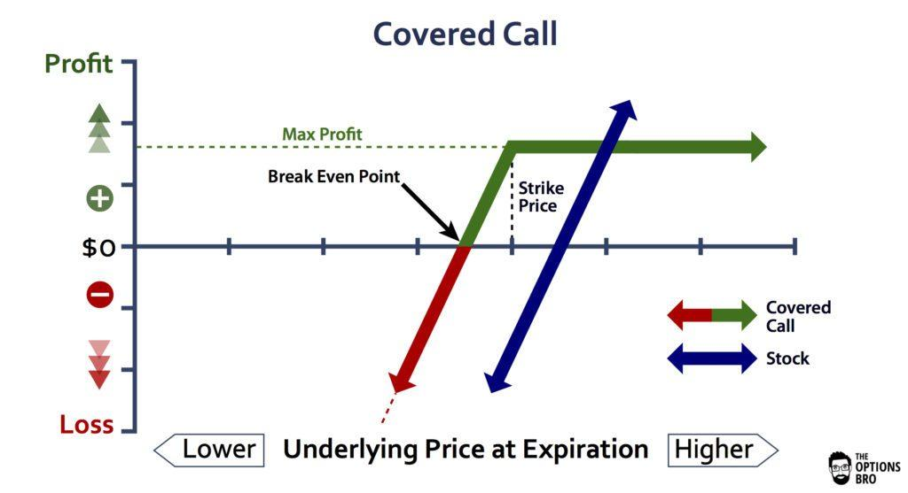

## Table of Contents

## What is a covered call and how does it work?

A covered call is a strategy used in the stock market where you own a stock and then sell someone else the right to buy that stock from you at a certain price before a certain date. This right is called an option, specifically a call option. The price at which the stock can be bought is called the strike price, and the date by which it must be bought is the expiration date. You get paid for selling this option, and the money you receive is called the premium.

Here's how it works: Let's say you own 100 shares of a company, and you think the stock price might stay the same or go up a little but not too much. You can sell a call option on those shares. If the stock price stays below the strike price by the expiration date, the option will expire worthless, and you keep the premium as extra income. If the stock price goes above the strike price, the buyer of the option can choose to buy your shares at the strike price. You still keep the premium, but you have to sell your shares at the strike price, which might be less than the current market price. This strategy can help you earn extra money from stocks you already own, but it also limits how much you can gain if the stock price rises a lot.

## What are the basic requirements for writing a covered call?

To write a covered call, you need to own the stock first. You can't sell a call option on a stock you don't have. So, if you want to write a covered call on 100 shares of a company, you need to have at least 100 shares of that company in your account.

Once you own the stock, you can sell a call option on it. This means you are giving someone else the right to buy your stock at a certain price before a certain date. You get paid for this, and the money you receive is called the premium. The price at which they can buy your stock is called the strike price, and the date by which they must buy it is the expiration date. That's all you need to start writing covered calls.

## How can covered calls generate income for investors?

Covered calls can generate income for investors by letting them earn money from stocks they already own. When you own a stock, you can sell a call option on it. This means you give someone else the right to buy your stock at a set price before a certain date. You get paid for this right, and the money you get is called the premium. This premium is extra income for you.

If the stock price stays below the set price by the expiration date, the option will expire worthless, and you get to keep the premium. This is like getting paid for doing nothing extra. But if the stock price goes above the set price, the person who bought the option can choose to buy your stock at that price. You still keep the premium, but you have to sell your stock. So, covered calls can give you a steady income, but they also limit how much you can gain if the stock price rises a lot.

## What are the potential risks associated with covered calls?

Covered calls can be risky because they limit how much money you can make if the stock price goes up a lot. When you sell a call option, you agree to sell your stock at a certain price, even if the stock becomes worth more than that. So, if the stock price shoots up, you miss out on the extra money you could have made because you have to sell it at the lower price you agreed to.

Another risk is that the stock price might drop a lot. If this happens, the premium you get from selling the call option won't be enough to cover your losses. The premium might help a little, but it won't make up for a big drop in the stock's value. So, you could end up losing money on the stock itself, even though you got some extra income from the call option.

Lastly, there's the risk of assignment. If the stock price goes above the strike price, the person who bought the call option might decide to buy your stock. You have to sell it to them at the strike price, which could be less than what it's worth on the market. This means you might have to give up your stock when you didn't want to, and at a price that's not as good as you could get if you sold it on the open market.

## How does the choice of strike price and expiration date affect the risk and reward of a covered call?

The choice of strike price in a covered call affects both the risk and reward. If you choose a strike price that's close to the current stock price, you'll get a higher premium, which means more immediate income. But this also increases the chance that the stock will be called away from you, limiting your potential profit if the stock price rises a lot. On the other hand, if you pick a higher strike price, you'll get a smaller premium, but there's less chance the stock will be called away, giving you more room for the stock to go up in value before you have to sell it.

The expiration date also plays a big role. A shorter expiration date means you get the premium sooner, but it gives the stock less time to move in your favor. If the stock price doesn't go above the strike price before the option expires, you keep the premium and the stock. A longer expiration date gives the stock more time to rise above the strike price, increasing the chance it will be called away. But you'll also get a bigger premium for a longer-term option, which can cushion any potential losses if the stock price drops.

## What is the impact of stock price movement on the profitability of a covered call?

The movement of the stock price can really change how much money you make or lose with a covered call. If the stock price stays below the strike price until the option expires, you get to keep the premium you were paid for selling the call option. This is like getting extra money for free because you don't have to do anything else. But if the stock price goes up a lot and goes above the strike price, the person who bought the call option might decide to buy your stock. You still keep the premium, but you have to sell your stock at the strike price, which might be less than what it's worth now. So, you miss out on the extra money you could have made if you had just held onto the stock.

If the stock price goes down, the premium you got from selling the call option can help a little. It's like a small cushion that softens the blow of the stock losing value. But if the stock price drops a lot, the premium won't be enough to cover your losses. You could end up losing money on the stock itself, even though you got some extra income from the call option. So, the movement of the stock price can make a big difference in how profitable your covered call strategy is.

## How does implied volatility influence the pricing of covered call options?

Implied volatility is a big deal when it comes to figuring out how much a covered call option is worth. It's like a guess about how much the stock price might move around in the future. When people think the stock price will move a lot, the implied volatility goes up. This makes the price of the call option go up too, because the person buying the option wants to be paid more for taking on the risk that the stock price might jump around a lot. So, if you're selling a covered call when implied volatility is high, you can get a bigger premium, which means more money in your pocket right away.

On the other hand, if people think the stock price won't move much, the implied volatility goes down. This makes the price of the call option go down too, because there's less risk for the person buying the option. So, if you're selling a covered call when implied volatility is low, you'll get a smaller premium. This means less immediate income for you, but it also means there's less chance that the stock price will move above the strike price and get called away from you. So, implied volatility can really change how much money you make from selling covered calls.

## What are the tax implications of profits from covered calls?

When you make money from selling covered calls, you have to think about taxes. The money you get from selling the call option, called the premium, is usually counted as regular income. This means it's taxed at your normal income tax rate, which can be pretty high depending on how much money you make in a year. If the stock gets called away and you have to sell it, any profit you make from selling the stock is usually taxed as a capital gain. If you held the stock for less than a year, it's a short-term capital gain, and it's taxed at the same rate as your regular income. If you held it for more than a year, it's a long-term capital gain, and the tax rate is usually lower.

Sometimes, the tax rules can get tricky. If you sell a covered call and the stock gets called away, but you don't actually have to sell the stock because you use a different strategy to keep it, the premium you got might be added to the stock's cost basis instead of being taxed right away as income. This can change how much tax you owe when you finally do sell the stock. It's always a good idea to talk to a tax professional to make sure you're doing everything right and not paying more tax than you need to.

## How can an investor manage early assignment risk in covered calls?

Early assignment risk in covered calls happens when the person who bought your call option decides to buy your stock before the option expires. This can be a surprise because you might not expect it to happen early. To manage this risk, you can keep an eye on the stock's price and the ex-dividend date. If the stock price is above the strike price, the person who bought the option might want to buy your stock early, especially if there's a dividend coming up. They might want to get the dividend, so they exercise the option early. If you see this happening, you might want to close out the option by buying it back before it gets assigned.

Another way to manage early assignment risk is to choose a strike price that's far enough away from the current stock price. This makes it less likely that the stock will be called away early. Also, picking an expiration date that's further out can help because it gives the stock more time to move around without getting called away. If you do get assigned early, you can always buy the stock back if you want to keep holding it. Just remember, managing early assignment risk is all about being prepared and watching the market closely.

## What advanced strategies can be used to enhance returns or mitigate risks in covered calls?

One advanced strategy to enhance returns with covered calls is called the "rolling" strategy. If the stock price goes up and gets close to the strike price before the option expires, you can buy back the call option you sold and then sell a new one with a higher strike price or a later expiration date. This lets you keep the stock longer and maybe get a bigger premium. It's like playing a game where you keep moving the goalposts to keep making money. But you have to be careful because rolling can cost you money if you're not doing it at the right time.

Another way to manage risks is to use a "collar" strategy. With a collar, you buy a put option on the stock you own while you're selling the call option. The put option gives you the right to sell your stock at a certain price if it drops a lot, which can protect you from big losses. The premium you get from selling the call option can help pay for the put option, so it doesn't cost you much extra. This strategy can help you sleep better at night because it limits how much you can lose, but it also limits how much you can gain if the stock price goes up a lot.

A third strategy is to use "delta hedging." Delta is a number that shows how much the price of an option changes when the stock price changes. If you're selling covered calls, you can buy or sell other options or stocks to balance out the delta and make your overall position less risky. This can be a bit tricky because it involves more trading and watching the market closely, but it can help you manage the risk of the stock price moving against you.

## How do market conditions and sector performance affect the strategy of using covered calls?

Market conditions and sector performance can really change how well covered calls work for you. If the market is going up a lot, you might miss out on big gains because you have to sell your stock at the strike price if it gets called away. But if the market is not moving much or is going down a little, covered calls can be a good way to make some extra money from the premiums you get. Also, if the sector your stock is in is doing well, the stock price might go up fast, and you could lose out on those gains. But if the sector is not doing so great, selling covered calls can help you make some money even when the stock price is not going up.

In a volatile market, where stock prices are jumping around a lot, the premiums for call options can be higher because people are willing to pay more for the chance to buy the stock if it goes up. This can be good for you because you get more money right away from selling the covered call. But it also means there's a bigger chance your stock will be called away if the price goes above the strike price. So, you have to think about how much risk you want to take and how much you want to make from the premiums. If the sector is doing badly, you might want to be careful because the stock price could drop a lot, and the premium won't be enough to cover your losses.

## What are the key differences between covered calls and other option strategies like protective puts or collars?

Covered calls, protective puts, and collars are all option strategies, but they work differently. With a covered call, you own a stock and sell someone else the right to buy it from you at a certain price before a certain date. You get paid for this right, called the premium, which can be extra money for you. But if the stock price goes up a lot, you might miss out on those big gains because you have to sell the stock at the strike price if the option is exercised. Covered calls are good when you think the stock price will stay the same or go up a little, but not too much.

Protective puts and collars are more about protecting your stock from big losses. A protective put means you buy a put option on a stock you own. This gives you the right to sell your stock at a certain price if it drops a lot, so it can save you from losing too much money. You have to pay for this put option, which can be costly, but it gives you peace of mind. A collar combines a covered call with a protective put. You sell a call option on your stock to get some money, and then you use that money to buy a put option. This limits how much you can lose if the stock price goes down, but it also limits how much you can gain if the stock price goes up a lot. Collars are good when you want to protect your stock but still make some extra money from the call option.

## What is Understanding Covered Calls?

A covered call is an options strategy frequently used by investors seeking to generate additional income from stocks they already own. This approach involves holding a long position in a stock and selling a call option on that same stock. The primary objective of this strategy is to earn income through the premium received from writing the call option.

The strategy is most advantageous in market conditions where the investor holds a neutral to a mildly bullish perspective on the stock. In such scenarios, if the stock price remains stagnant or only rises slightly, the option may expire worthless, allowing the investor to keep the premium as profit.

Formally, let's consider the following scenario: an investor owns 100 shares of a company, each worth 'S' dollars. The investor sells a call option with a strike price 'K' and receives a premium 'P' for doing so. The possible outcomes are as follows:

1. **Stock price ≤ K (option expires worthless):**  
   The investor retains the stock and profits from the premium:
$$
   \text{Total Profit} = P

$$

2. **Stock price > K (option is exercised):**  
   The shares are sold at the strike price, leading to a potential profit or loss:
$$
   \text{Total Profit} = (K - S) + P

$$
   Here, the investor's gains are capped at this amount, as the opportunity for further appreciation above 'K' is forfeited.

This strategy's trade-off is the limitation on the stock's upside potential, as the stock can be "called away" if its price surpasses the strike price. Despite this limitation, many investors value covered calls for their ability to supply a steady stream of income, particularly in flat or slightly positive market environments. Additionally, the premiums collected can help to offset minor stock market declines, providing a cushion against [volatility](/wiki/volatility-trading-strategies) without requiring significant changes to the investor's stock holdings.

## References & Further Reading

[1]: [CBOE Options Institute: Covered Call Strategies](https://www.cboe.com/education/)

[2]: ["Options, Futures, and Other Derivatives"](https://www.pearson.com/en-us/subject-catalog/p/options-futures-and-other-derivatives/P200000005938/9780136939917) by John C. Hull

[3]: Lo, A. W., & MacKinlay, A. C. (1999). ["A Non-Random Walk Down Wall Street"](https://www.jstor.org/stable/j.ctt7tccx) Princeton University Press.

[4]: ["Algorithmic Trading and DMA: An Introduction to Direct Access Trading Strategies"](https://archive.org/details/algorithmictradi0000john) by Barry Johnson

[5]: ["Financial Risk Management: A Practitioner's Guide to Managing Market and Credit Risk"](https://www.amazon.com/Financial-Risk-Management-Practitioners-Managing/dp/111817545X) by Steve L. Allen