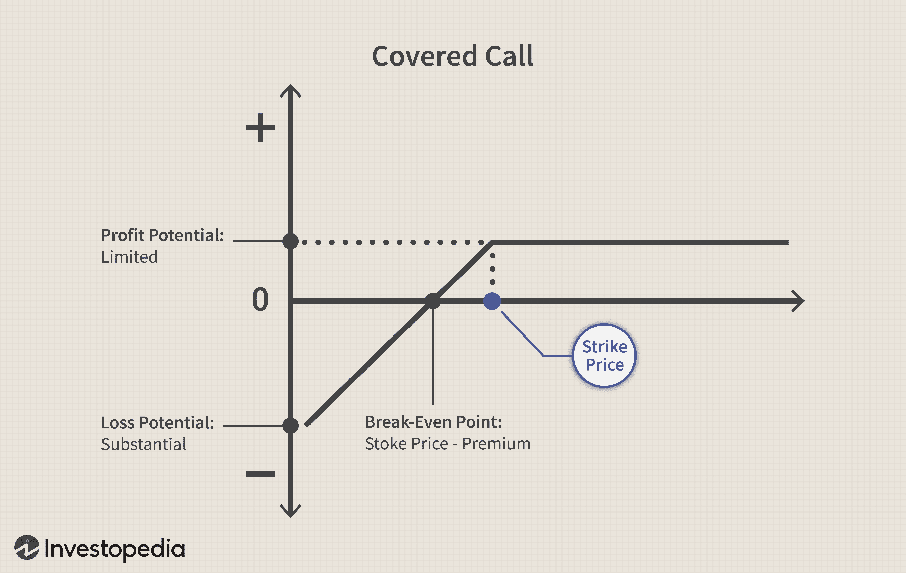

Covered calls are a prominent strategy in options trading, frequently utilized for generating additional income. This strategy involves purchasing the underlying asset, such as a stock, and simultaneously selling call options on that asset. Investors often favor covered calls in stable or moderately bullish markets due to the potential for earning option premiums, thereby providing an additional revenue stream.

However, when considering the integration of covered calls into algorithmic trading systems, their perceived advantages may diminish. Algorithmic trading relies heavily on speed and efficiency, typically focusing on exploiting market patterns and trends. Covered calls, with their inherent limitations on upside potential, may not align well with algorithms designed to capitalize on significant market movements. The cap on profitability imposed by selling call options can restrict an algorithm's ability to seize potential gains, especially in volatile or rapidly changing markets.



This article investigates the potential drawbacks of incorporating covered calls into algorithmic trading. We will analyze various aspects such as the strategy's risk/reward profile, effectiveness in algorithmic environments, associated tax implications and costs, and their relative performance under different market conditions. The objective is to provide a thorough understanding of why covered calls might pose challenges within algorithmic contexts, ultimately guiding traders in making informed decisions regarding their use.

## Table of Contents

## Understanding Covered Calls

A covered call strategy involves simultaneously holding a position in an underlying asset, such as stocks, while selling call options on the same asset. This is done to earn a premium, serving as a secondary income stream for the investor. The core idea is to capitalize on modest moves in the asset price while mitigating potential downside risks associated with direct stock holding.

The strategy presents specific characteristics: it limits the upside potential while providing limited downside protection. When the strategy is executed, the investor retains the premium from selling the call option as income. However, if the underlying asset price exceeds the strike price of the call option at expiration, the investor forfeits additional gains above that level. Therefore, covered calls are often perceived as beneficial in stable or slightly bullish market conditions, where the investor can retain the premium without the asset being called away.

Despite its apparent simplicity, the covered call strategy comes with inherent costs and risks. While the premium can provide a cushion against minor price drops in the underlying asset, it does not fully protect against significant declines. In scenarios where the asset's price drops substantially, the premium may not be sufficient to offset the loss in the value of the held asset.

Integrating covered calls into automated trading strategies adds another layer of complexity. Algorithmic trading typically relies on rules-based strategies that operate without continuous human intervention. The success of these algorithms hinges on precision and the ability to adapt quickly to changing market conditions. When algorithms are programmed to execute covered call strategies, they must be adept at analyzing market data to determine optimal timing and pricing for selling call options. This requires sophisticated algorithms capable of gauging market sentiment and [volatility](/wiki/volatility-trading-strategies), making it challenging to maintain effectiveness without human oversight.

The intrinsic connection between options pricing, volatility, and time decay further complicates the strategy in algorithmic contexts. Algorithms need to accurately model these relationships to maximize the potential gains from premiums while managing the downside risks. Therefore, the mechanics of covered calls, while easy to understand conceptually, demand detailed knowledge and advanced programming skills for effective incorporation into automated trading systems.

## Negative Impact on Risk and Reward Profile

Covered calls represent a trading strategy characterized by a negatively skewed risk/reward profile. This skewness is fundamentally due to the strategy's design: it allows for the collection of premiums through selling call options, which are small but frequent gains. However, the trade-off for these consistent, minor profits is the potential for substantial losses if the underlying asset experiences a significant upward price movement.

In the context of [algorithmic trading](/wiki/algorithmic-trading), this skewed risk profile can be disadvantageous. The primary allure of algorithmic strategies lies in their ability to execute a large number of trades swiftly and efficiently, often capitalizing on trends and patterns that human traders might miss. However, the utilization of covered calls within an algorithm's framework can disrupt this potential. The capped profit of a covered call limits the algorithm's capacity to benefit from large, favorable price movements, which are crucial for generating substantial returns in trend-following strategies.

Traders engaging in algorithmic trading frequently aim for a symmetrical or positively skewed risk profile, where the potential upside of each trade outweighs the downside. Covered calls inherently conflict with this approach as they favor high-probability, minor gains through the collected premiums but at the expense of forgoing larger, less frequent opportunities that arise when the market moves significantly upwards. 

For algorithms programmed to identify and exploit positive trends, covered calls can be restrictive. The strategy's nature to lock in only limited profits means that any substantial upward trends in the market may result in missed opportunities, where the gains are constrained due to the short position in the call options. This constraint can ultimately undermine the algorithm's long-term profitability and effectiveness, especially in markets with pronounced upward movements.

In summary, the negativity skew of covered calls, characterized by low-risk, high-reward missed opportunities, makes them less than ideal for algorithmic trading strategies that rely on capturing significant upward trends and maintaining an advantageous risk/reward profile.

## Limited Effectiveness in Algorithmic Environments

Algorithms in trading are designed to quickly adapt and react to market conditions, leveraging their speed and efficiency to optimize profitability. In this environment, the covered call strategy can present specific challenges due to its inherent characteristics. 

Covered calls inherently limit potential profits by capping the upside gain of the underlying asset through the call option sold. This characteristic can be detrimental in an algorithmic trading setup that is designed to identify and capitalize on significant market movements. For instance, when an algorithm detects a strong upward trend and initiates trades, the covered call cap can prevent full realization of profits from such moves. The fixed premium received from selling the call can pale in comparison to the potential market gains that are forgone when the asset price surges above the strike price.

Moreover, algorithms aiming to exploit market volatility and [momentum](/wiki/momentum) encounters further limitations with covered calls. These algorithms typically rely on capturing trends—both upward and downward—and making rapid adjustments as market conditions shift. Covered calls confine the potential gains from upward trends while offering limited protection in downturns, dampening the overall efficacy of such algorithms. For strategies that depend on maximizing gains from volatile price swings, the restrictive nature of covered calls can neutralize the benefits of speed and precision inherent to algorithmic trading.

One of the critical challenges with covered calls in algorithmic environments is the lack of adaptability to swiftly evolving market circumstances. Financial markets can change rapidly, and successful trading algorithms are those that can promptly recalibrate, optimizing decision-making processes to exploit these changes. The static structure of covered calls, with their fixed premiums and capped gains, offers little room for such dynamic adjustments. Consequently, in low volatility phases or abrupt market shifts, where quick strategy shifts are vital, covered calls can considerably curtail an algorithm's operational flexibility and potential returns.

In summary, while covered call strategies offer a means of income generation in many trading scenarios, their utility in algorithmic setups is limited. The constraining impact on profit realization, especially under volatile or trending conditions, coupled with the challenges in adapting to rapid market changes, undermines their effectiveness in optimizing algorithmic trading performance. This calls for a careful consideration of strategy suitability and potential adjustments to ensure alignment with algorithmic trading goals.

## Tax Implications and Costs

Premiums obtained from covered call strategies are typically taxed as ordinary income, which can have a significant effect on net returns. This tax treatment contrasts with the generally more favorable long-term capital gains tax rates that might apply to the underlying securities if held longer. For traders employing algorithmic strategies, the [high frequency](/wiki/high-frequency-trading) of transactions further intensifies the likelihood of incurring higher tax obligations. Each sale of a covered call, for instance, can trigger a taxable event, and algorithms that systematically execute multiple transactions amplify this exposure.

Moreover, trading costs become a significant consideration. The process of rolling covered calls, which involves closing an existing option position and opening a new one, adds layers of transaction costs. This might include bid-ask spreads, brokerage fees, or commissions. These financial drags reduce the overall profitability of a strategy reliant on repeated adjustments or the rolling of positions. 

To illustrate the financial impact, consider a scenario where a covered call is rolled over multiple periods. The strategy incurs direct costs, such as trading fees, and indirect costs, such as opportunity costs and eventual tax liabilities. Below is a simple Python snippet to simulate the cumulative costs from trading fees and taxes over a series of transactions:

```python
def calculate_total_costs(num_trans, fee_per_trans, tax_rate, premium_income):
    trading_costs = num_trans * fee_per_trans
    tax_costs = premium_income * tax_rate
    total_costs = trading_costs + tax_costs
    return total_costs

# Example usage
num_transactions = 10  # Number of transactions
fee_per_transaction = 5  # Cost per transaction
tax_rate = 0.24  # Assuming a 24% ordinary income tax rate
premium_income = 1000  # Total income from premiums

total_costs = calculate_total_costs(num_transactions, fee_per_transaction, tax_rate, premium_income)
print(f"Total Costs from Trading and Taxes: ${total_costs}")
```

By understanding these financial implications, algorithm developers can recognize the adverse effects on strategy efficiency when using covered calls. As these costs accumulate, they compound the inefficiencies of incorporating such strategies into algorithmic trading. Therefore, while covered calls might appear advantageous for generating income, consideration of tax treatment and transactional costs is critical in evaluating their suitability for automated trading environments.

## Market Conditions and Strategy Limitations

Covered calls are particularly effective in stable market conditions, where the underlying assets demonstrate minimal price fluctuations. In such environments, the intrinsic value of the call options remains low, allowing traders to generate consistent income through premiums without losing out on significant capital appreciation. However, in trending markets, especially those with upward trajectories, covered calls inherently restrict profit potential. This is because the obligation to sell the underlying asset at the strike price of the call option negates the benefit of capitalizing on upward price movements beyond that level. Consequently, in bullish markets, traders using covered calls may miss significant profit opportunities.

Algorithmic trading systems, designed to operate in diverse environments, often focus on capturing momentum and exploiting trends. When integrated with covered calls, algorithms face constraints due to the capped profit nature of this options strategy. An algorithm's ability to dynamically adjust to trending conditions and capitalize on significant price movements can be substantially hindered. Therefore, employing covered calls within algorithmic systems can result in forgoing potential gains that could be otherwise captured by strategies aimed at maximizing returns from market trends.

In rapidly declining markets, covered calls provide limited downside protection. Although the premium received acts as a buffer against losses, this benefit is minor compared to potential capital loss. For algorithmic trading systems, which are often capable of implementing stop-loss mechanisms or deploying hedging strategies, reliance on covered calls for downside protection proves inadequate. Algorithmic frameworks prioritize strategies that can adapt quickly to limit exposure to downturns, which covered calls alone may not sufficiently address.

Given these market dynamics, algorithmic trading setups face intricate decisions regarding the deployment of covered calls. An algorithm must be sophisticated enough to determine optimal conditions for employing covered calls or otherwise adapt its strategy to seize market opportunities effectively. This necessitates a nuanced understanding of the underlying asset's behavior and prevailing market trends, ensuring algorithmic systems can autonomously decide when to incorporate covered calls or opt for alternative approaches. Such complexity underscores the challenges of integrating covered calls within algorithmic trading strategies focusing on flexibility and adaptability.

## Conclusion

While covered calls offer income potential, their integration in algorithmic trading evidently limits profitability. Covered calls are primarily designed to generate limited profits through premiums, but they restrict upside potential by capping the maximum possible return. This limitation poses a significant drawback in algorithmic trading, where the ability to capitalize quickly on market trends and large price movements is essential.

The nuances of such strategies require thorough understanding for effective application in trading algorithms. Covered calls introduce complexity due to their negatively skewed payoff profile, which implies a tendency towards numerous small gains coupled with occasional large losses. This skewness contradicts typical algorithmic objectives, which often strive for a balanced risk-reward framework. Moreover, the need for continual monitoring and potential adjustments—such as rolling options to later expiration dates or adjusting strike prices—adds layers of complexity to automated trading systems.

It may be more prudent to examine alternative strategies that align better with the goals of algorithmic trading. Strategies such as momentum trading or mean reversion, which inherently align with algorithmic strengths like speed and adaptability, might offer more congruent opportunities. Additionally, sophisticated algorithms can incorporate [machine learning](/wiki/machine-learning) models to analyze historical data and predict market movements, providing a more dynamic and responsive approach than the static nature of covered calls.

Ultimately, discretion in the use of covered calls in an algorithmic strategy is advisable based on market analysis and goals. Algorithm designers should assess market conditions and the specific objectives of their system before integrating covered calls. This careful evaluation ensures that trading systems maintain alignment with their strategic aspirations, such as maximizing return potential, managing risk effectively, and exploiting short-term market inefficiencies. Selecting the right strategies that complement the strengths of algorithmic trading will likely lead to more successful outcomes.

## References & Further Reading

[1]: Baird, J. (2007). ["Option Market Making"](https://www.amazon.com/Option-Market-Making-Financial-Commodity/dp/0471578320). 

[2]: Whaley, R. E. (2006). ["Derivatives on Market Volatility: Hedging Tools Long Overdue."](https://onlinelibrary.wiley.com/doi/full/10.1002/9780470404324.hof001020) The Journal of Derivatives, 13(3), 71-84.

[3]: Hull, J. C. (2017). ["Options, Futures, and Other Derivatives"](https://www.amazon.com/Options-Futures-Other-Derivatives-9th/dp/0133456315) (10th Edition). Pearson.

[4]: Chance, D. M., & Brooks, R. (2015). ["An Introduction to Derivatives and Risk Management"](https://books.google.com/books/about/Introduction_to_Derivatives_and_Risk_Man.html?id=b8PgBQAAQBAJ). 

[5]: Black, F., & Scholes, M. (1973). ["The Pricing of Options and Corporate Liabilities."](https://www.cs.princeton.edu/courses/archive/fall09/cos323/papers/black_scholes73.pdf) Journal of Political Economy, 81(3), 637-654.

[6]: Murphy, J. J. (1999). ["Technical Analysis of the Financial Markets"](https://www.amazon.com/Technical-Analysis-Financial-Markets-Comprehensive/dp/0735200661). New York Institute of Finance.

[7]: McMillan, L. G. (2012). ["Options as a Strategic Investment"](https://books.google.com/books/about/Options_as_a_Strategic_Investment.html?id=jKhPEAAAQBAJ) (5th Edition). Prentice Hall Press.