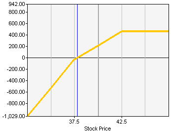

## Table of Contents

## What is a Covered Combination Strategy?

A Covered Combination Strategy is a way to invest in the stock market that involves buying stocks and selling options at the same time. It's called "covered" because the options you sell are backed by the stocks you own. This strategy can help you earn extra money from the options while also having the safety of owning the actual stocks.

This strategy is often used by investors who want to make a bit more money from their stocks without taking on too much risk. By selling options, they can get paid a premium, which is like a fee, from the buyer of the option. However, it's important to understand that while this can increase your income, it also comes with its own set of risks and complexities, so it's not for everyone.

## How does a Covered Combination Strategy work?

A Covered Combination Strategy involves buying a stock and then selling call options on that same stock. Imagine you own 100 shares of a company. You can sell someone the right to buy those shares from you at a set price before a certain date. This is called selling a call option. The person buying the option pays you a fee, called a premium, for this right. Because you already own the stock, the option is "covered," meaning you can deliver the stock if the buyer decides to use their option.

This strategy can help you earn extra money from the premiums you receive when you sell the call options. If the stock price stays below the set price (strike price) of the option, the option will expire worthless, and you keep the premium. However, if the stock price goes above the strike price, the buyer might choose to buy your stock at the lower price, and you'll have to sell it to them. This means you might miss out on further gains if the stock keeps going up, but you still get to keep the premium and the profit from the stock's increase up to the strike price. It's a way to balance potential gains with some extra income, but it also comes with risks, so it's important to understand it well before trying it.

## What are the key components of a Covered Combination Strategy?

A Covered Combination Strategy involves two main parts: owning a stock and selling call options on that stock. When you own the stock, you have the shares that back up the options you sell, which is why it's called "covered." The call options give someone else the right to buy your stock at a certain price, called the strike price, before a specific date. You get paid a fee, known as a premium, for selling these options.

The goal of this strategy is to earn extra money from the premiums while still owning the stock. If the stock price stays below the strike price by the expiration date, the options will expire worthless, and you keep the premium. However, if the stock price goes above the strike price, the buyer might choose to buy your stock at the lower price, and you'll have to sell it to them. This means you might miss out on further gains if the stock keeps rising, but you still keep the premium and any profit from the stock's increase up to the strike price.

## What are the potential benefits of using a Covered Combination Strategy?

Using a Covered Combination Strategy can help you make some extra money from your stocks. When you sell call options on the stocks you own, you get paid a premium. This premium is like a little bonus that you get to keep no matter what happens with the stock, as long as the stock price doesn't go above the strike price by the expiration date. This can be a nice way to earn some extra cash on top of any dividends you might get from owning the stock.

Another benefit is that this strategy can help you manage risk a bit. If the stock price goes up a lot, you might have to sell your stock at the strike price, but you still get to keep the premium and any profit up to that point. This means you're not totally out of the game if the stock does really well. On the other hand, if the stock price goes down, you still have the stock and the premium you collected can help cushion the loss. So, it's a way to balance making more money with managing risk.

## What are the risks associated with a Covered Combination Strategy?

One of the main risks of using a Covered Combination Strategy is that you might miss out on big gains. If the stock price goes above the strike price of the call options you sold, you have to sell your stock at that lower price. This means you won't get to enjoy any further increase in the stock's value. So, while you get to keep the premium from selling the options, you might feel like you missed out if the stock keeps going up a lot after you sell it.

Another risk is that if the stock price goes down, the premium you received might not be enough to cover your losses. Even though owning the stock gives you some safety, a big drop in the stock's price can still hurt your investment. Also, managing this strategy can be a bit tricky because you need to keep an eye on both the stock and the options. If you're not careful, you might end up selling the wrong options or not understanding how the options and stock prices are connected, which can lead to mistakes and more risk.

## How does one set up a Covered Combination Strategy in the stock market?

To set up a Covered Combination Strategy in the stock market, you first need to buy shares of a company that you think will do well. Let's say you buy 100 shares of a company. Once you own these shares, you can then sell call options on those shares. Selling a call option means you're giving someone else the right to buy your 100 shares at a set price, called the strike price, before a certain date. In return, the person buying the option pays you a fee, called a premium. This premium is yours to keep no matter what happens, as long as the stock price doesn't go above the strike price by the expiration date.

After you've set up the strategy, you need to keep an eye on the stock price. If the stock price stays below the strike price by the expiration date, the options will expire worthless, and you get to keep the premium. This is like getting a little bonus on top of owning the stock. However, if the stock price goes above the strike price, the buyer of the option might choose to buy your shares at the lower price. You'll have to sell your shares to them, but you still get to keep the premium and any profit from the stock's increase up to the strike price. This strategy can help you earn extra money, but it also means you might miss out on bigger gains if the stock keeps going up a lot after you sell it.

## What types of securities are typically used in a Covered Combination Strategy?

A Covered Combination Strategy mainly uses two types of securities: stocks and call options. When you use this strategy, you first buy shares of a company's stock. These shares are the foundation of the strategy because they give you something to back up the options you sell. For example, if you own 100 shares of a company, those shares are what you use to cover the options.

The second part of the strategy involves selling call options on the stock you own. A call option gives someone else the right to buy your shares at a set price, called the strike price, before a certain date. When you sell these options, you get paid a fee called a premium. This premium is extra money you can earn on top of any gains from the stock itself. By using both stocks and call options together, you can try to balance making more money with managing risk.

## Can you explain the tax implications of a Covered Combination Strategy?

The tax implications of a Covered Combination Strategy can be a bit tricky, but let's break it down simply. When you sell call options and receive a premium, this money is usually considered ordinary income and is taxed at your regular income tax rate. If you end up selling your stock because someone exercises their option, any profit you make from selling the stock (the difference between the sale price and what you paid for the stock) is considered a capital gain. If you've held the stock for more than a year, this gain is taxed at the long-term capital gains rate, which is usually lower than your regular income tax rate. If you've held it for less than a year, it's a short-term capital gain and taxed at your ordinary income rate.

Now, if the stock price stays below the strike price and the options expire worthless, you get to keep the premium. This premium is still taxed as ordinary income. If the stock price goes down and you sell the stock at a loss, you can use that loss to offset other capital gains you might have, which can help reduce your taxes. It's important to keep good records of all your transactions because the tax situation can get complicated, especially if you're doing a lot of buying and selling. Talking to a tax professional can help you understand all the details and make sure you're handling everything correctly.

## How does market volatility affect a Covered Combination Strategy?

Market [volatility](/wiki/volatility-trading-strategies) can have a big impact on a Covered Combination Strategy. When the stock market is going up and down a lot, it can make the price of the stock you own change quickly. If the stock price goes up a lot and goes above the strike price of the call options you sold, the person who bought the options might decide to buy your stock. This means you have to sell your stock at the strike price, even if it's lower than the current market price. You'll miss out on any extra money you could have made if you had kept the stock. On the other hand, if the stock price goes down a lot, the premium you got from selling the options might not be enough to cover your losses on the stock.

Because of this, it's important to think about how much the market might move when you're using a Covered Combination Strategy. If you expect a lot of ups and downs, you might want to choose a higher strike price for the options to give yourself more room for the stock price to go up before you have to sell. Or, you might decide to sell options with a shorter time until they expire, so you're not locked into the strategy for too long if the market gets really wild. Keeping an eye on market volatility can help you make better choices and manage the risks that come with this strategy.

## What are some common mistakes to avoid when implementing a Covered Combination Strategy?

One common mistake when using a Covered Combination Strategy is choosing the wrong strike price for the call options you sell. If you pick a strike price that's too low, you might have to sell your stock at a price that's lower than you want, especially if the stock price goes up a lot. On the other hand, if you pick a strike price that's too high, you might not get as much money from the premium because people might not want to buy the options. It's important to think about where you think the stock price might go and choose a strike price that makes sense for your goals.

Another mistake is not paying attention to the expiration date of the options. If you sell options that expire too soon, you might not get as much money from the premium. But if you sell options that expire too far in the future, you're locking yourself into the strategy for a long time, which can be risky if the market changes a lot. It's a good idea to find a balance and pick an expiration date that gives you enough time to make money from the premium but also lets you adjust your strategy if things change.

Lastly, some people forget to keep an eye on the stock price after they set up the strategy. The stock market can be unpredictable, and if you're not watching what's happening, you might miss out on chances to make changes that could help you. It's important to stay informed and be ready to adjust your strategy if the stock price moves a lot or if other things in the market change.

## How can one monitor and adjust a Covered Combination Strategy over time?

To monitor a Covered Combination Strategy, you need to keep a close eye on the stock price of the shares you own. Check the price regularly to see if it's getting close to the strike price of the call options you sold. If the stock price is going up a lot and getting near the strike price, you might want to think about what to do next. You could decide to buy back the options you sold if you think the stock will keep going up, or you might just let the options be exercised and sell your stock at the strike price. Also, keep an eye on the overall market and any news that might affect your stock, because these things can change how your strategy works.

Adjusting a Covered Combination Strategy means making changes based on what's happening with the stock and the market. If the stock price is going up a lot and you don't want to sell it at the strike price, you can buy back the call options you sold. This will cost you money, but it lets you keep your stock. If the stock price is going down, you might decide to sell more call options to get more premium money, which can help if the stock keeps dropping. Sometimes, you might want to change the strike price or the expiration date of the options you sell, depending on what you think will happen next. The key is to stay flexible and ready to make changes to keep your strategy working well.

## What advanced techniques can be used to optimize a Covered Combination Strategy?

One advanced technique to optimize a Covered Combination Strategy is called "rolling up and out." This means if the stock price is going up and getting close to the strike price of the options you sold, you can buy back those options and sell new ones with a higher strike price and a later expiration date. This lets you keep your stock longer and maybe get more money from the new options. It's like giving yourself more room for the stock price to go up before you have to sell it. But remember, doing this will cost you money to buy back the old options, so you need to think about if it's worth it.

Another technique is using "delta hedging." Delta is a way to measure how much the price of an option changes when the stock price changes. By keeping an eye on the delta of your options, you can buy or sell more options to balance out the risk. For example, if your stock goes up a lot and the delta of your options goes up too, you might sell more call options to get more premium money and lower your risk. This can help you make the most of your strategy, but it can get complicated, so you need to understand how delta works and be ready to make changes often.

Lastly, you can use "collar strategies" to protect your stock from big drops in price. A collar means you buy a put option, which gives you the right to sell your stock at a set price if it goes down a lot, and at the same time, you sell a call option like you do in a Covered Combination Strategy. This can help limit how much you might lose if the stock price falls, but it also means you might not make as much money if the stock goes up a lot. Using a collar can make your strategy safer, but it's more complex and costs more because you have to pay for the put option.

## What are Covered Combination Strategies and how can they be understood?

Covered combination strategies present an intriguing approach within options trading, designed to capitalize on premium income generation through strategic options sales. This strategy involves selling an out-of-the-money call option and an out-of-the-money put option with identical expiration dates, secured against a security already owned by the investor. The dual sale of options creates multiple income streams, leveraging premiums from both the call and put options, thus enhancing potential returns on a single underlying security.

The distinctive aspect of covered combinations lies in their integration of characteristics from two separate strategies: the covered call and the short put. A covered call traditionally involves holding a long position in a stock while concurrently selling a call option, which provides the investor a premium while capping upside potential at the strike price of the call option. Conversely, a short put involves the commitment to purchase a stock at the put option's strike price if exercised, generating income through the put's premium in exchange for the obligation to buy the stock.

By merging these two strategies, the covered combination allows investors to harness benefits from both premiums while managing risk exposure through careful strike price selection. The strategy's profitability is contingent on the investor's bullish outlook; it is particularly suited for those who anticipate moderate upward movement in the stock price but are also open to acquiring additional shares should the price decline. This is due to the inherent risk of being obligated to purchase the stock if the market price drops below the put option's strike price, leading to increased stock holdings at potentially unfavorable prices.

Quantifying the risk and reward of such strategies might involve considerations of the breakeven points and the probability of different market scenarios. For instance, the breakeven point for a covered combination can be calculated by factoring in the total premiums received from both the call and put options against the underlying stock's prevailing market price. Formulaically, this can be expressed as:

$$
\text{Breakeven Price} = \text{Stock Price} + \text{Put Premium} - \text{Call Premium}
$$

Where:
- $\text{Stock Price}$ is the initial price of the owned security.
- $\text{Put Premium}$ is the income generated from selling the put option.
- $\text{Call Premium}$ is the income generated from selling the call option.

Inherent in this strategy is the risk of increased exposure if the stock's value decreases substantially, as the put option may be exercised, obliging the investor to purchase more shares. Therefore, covered combinations are most effective for investors who are optimistic about the stock's prospects and are comfortable with the potential acquisition of shares due to market price fluctuations. The ability to adeptly perform such strategies relies on a solid understanding of options pricing dynamics and effective risk management practices.

## References & Further Reading

[1]: Kolb, R. W., & Overdahl, J. A. (2007). ["Financial Derivatives: Pricing and Risk Management."](https://books.google.com/books/about/Financial_Derivatives.html?id=NJ5mBgAAQBAJ) John Wiley & Sons.

[2]: Kaminski, K. M. (2014). ["A Practitioner's Guide to Asset Allocation."](https://www.amazon.com/Practitioners-Guide-Asset-Allocation-Finance/dp/1119397804) John Wiley & Sons.

[3]: Mengelkamp, J., Gärttner, J., Rock, K., & Weinhardt, C. (2018). [“The Role of Trading Algorithms in Cryptocurrency Markets: Evidence from Bitcoin Bitcoin Cash Futures Markets.”](https://www.sciencedirect.com/science/article/pii/S030626191730805X) SSRN.

[4]: Chaboud, A., Chiquoine, B., Hjalmarsson, E., & Vega, C. (2014). ["Rise of Machines: Algorithmic Trading in the Foreign Exchange Market."](https://www.jstor.org/stable/43612951) The Journal of Finance, 69(5), 2045-2084.

[5]: Hull, J. (2018). ["Options, Futures, and Other Derivatives."](https://books.google.com/books/about/Options_Futures_and_Other_Derivatives.html?id=vpIYvgAACAAJ) Pearson.