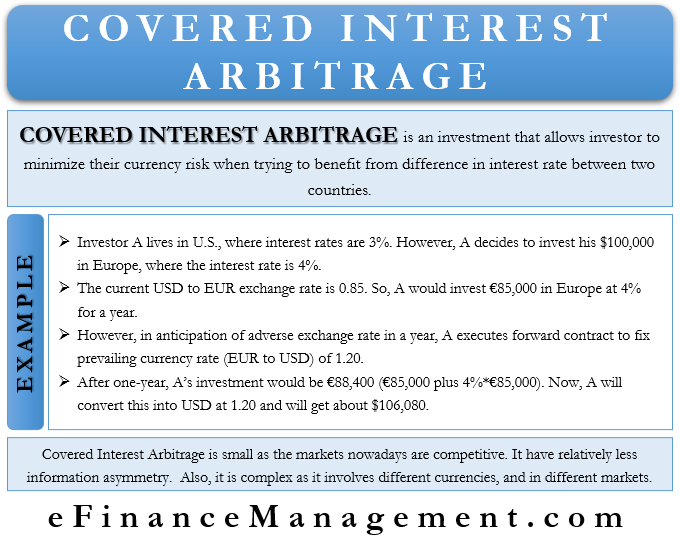

## Table of Contents

## What is arbitrage in the context of finance?

Arbitrage in finance is when someone buys something in one place and sells it in another place for a higher price, making a profit from the difference. It's like buying a toy for $10 in one store and selling it for $15 in another store. This works because the prices of the same thing can be different in different places or at different times.

People who do arbitrage, called arbitrageurs, look for these price differences all the time. They use computers and special tools to find them quickly. By doing this, they help make prices more similar everywhere, which is good for the market. But it can be risky because prices can change fast, and if they don't act quickly, they might lose money instead of making a profit.

## What is the difference between covered and uncovered interest arbitrage?

Covered interest arbitrage happens when someone borrows money in one country, changes it to another country's money, and puts it into a safe investment there. The key is that they use a special agreement called a forward contract to make sure they can change the money back at a good rate later. This way, they know exactly how much they'll get when they change it back, which makes it less risky. They make money if the interest they earn in the other country is more than what they pay to borrow the money, even after considering the cost of the forward contract.

Uncovered interest arbitrage is different because it's riskier. Here, someone borrows money in one country, changes it to another country's money, and puts it into an investment there, but they don't use a forward contract. They hope that when they change the money back, the exchange rate will be good enough to make a profit. But because they don't know what the exchange rate will be in the future, they could lose money if the rate goes against them. So, it's like gambling a bit more compared to covered interest arbitrage.

## How does covered interest arbitrage work?

Covered interest arbitrage is like a safe way to make money by borrowing in one country, changing the money to another country's currency, and investing it there. The trick is to use something called a forward contract. This is a special agreement that lets you lock in the rate at which you'll change the money back in the future. So, if you borrow dollars, change them to euros, and invest in Europe, you use the forward contract to make sure you can change the euros back to dollars at a good rate later. This way, you know exactly how much you'll get when you change it back, which makes it less risky.

You make money if the interest you earn in the other country is more than what you pay to borrow the money, even after considering the cost of the forward contract. For example, if you borrow at a low interest rate in the U.S., change the dollars to euros, and invest in Europe where the interest rate is higher, you can make a profit. The forward contract protects you from changes in the exchange rate, so you're not worried about the euros being worth less when you change them back. This makes covered interest arbitrage a smart way to take advantage of different interest rates around the world without taking big risks.

## What are the steps involved in executing covered interest arbitrage?

Covered interest arbitrage involves a few key steps to make sure you can make money safely. First, you borrow money in a country where the interest rate is low. Let's say you borrow dollars in the U.S. because the interest rate there is low. Then, you change those dollars into another country's currency, like euros, at the current exchange rate. After that, you invest the euros in a safe investment in Europe, where the interest rate is higher. This way, you earn more interest on your investment than what you pay to borrow the money.

The next important step is to use a forward contract. This is like a promise that lets you change your euros back to dollars at a set rate in the future. By using this contract, you protect yourself from any changes in the exchange rate. When the time comes, you change your euros back to dollars at the rate you locked in with the forward contract. If everything goes as planned, the interest you earned in Europe will be more than the interest you paid to borrow the money in the U.S., even after considering the cost of the forward contract. This way, you make a profit without taking big risks.

## What are the risks associated with covered interest arbitrage?

Covered interest arbitrage is usually seen as a safe way to make money, but there are still some risks to think about. One risk is the cost of the forward contract. Even though it protects you from changes in the exchange rate, it's not free. If the cost of the forward contract is too high, it might eat up all the profit you could make from the difference in interest rates. So, you need to make sure the cost of the forward contract is worth it.

Another risk is something called counterparty risk. This means the other person or company you made the forward contract with might not be able to keep their promise. If they can't or won't change your money back at the rate you agreed on, you could lose money. It's important to check if the company you're dealing with is trustworthy and will be able to honor the contract.

Lastly, there's the risk that comes from changes in the market. Even though the forward contract protects you from big changes in the exchange rate, small changes in interest rates or other market conditions can still affect your profit. For example, if interest rates in the country you borrowed from go up unexpectedly, it could make your borrowing more expensive and cut into your profit. So, you need to keep an eye on the market and be ready to adjust your plans if things change.

## How does uncovered interest arbitrage work?

Uncovered interest arbitrage is a way to make money by borrowing in one country, changing the money to another country's currency, and investing it there, but without using a forward contract. Let's say you borrow dollars in the U.S. where the interest rate is low, and then you change those dollars to euros and invest them in Europe where the interest rate is higher. You hope to make a profit from the difference in interest rates between the two countries.

The big difference here is that you don't use a forward contract, so you don't know what the exchange rate will be when you change your euros back to dollars. This makes it riskier because if the exchange rate goes against you, you could lose money. For example, if the euro becomes worth less compared to the dollar when you want to change it back, your profit could turn into a loss. So, uncovered interest arbitrage is like gambling a bit more because you're hoping the exchange rate will be in your favor when the time comes to change your money back.

## What are the key assumptions behind uncovered interest arbitrage?

Uncovered interest arbitrage works on the idea that you can make money by borrowing money in one place where the interest rate is low and investing it in another place where the interest rate is higher. The main assumption here is that the exchange rate between the two currencies will stay the same or move in a way that helps you make a profit. For example, if you borrow dollars in the U.S. and invest in euros in Europe, you hope that when you change your euros back to dollars, the exchange rate will be good enough to make a profit.

Another important assumption is that you can predict how the exchange rate will change in the future. Since you're not using a forward contract to lock in the exchange rate, you're guessing that the rate will move in your favor. This means you believe the euro will either stay the same or become worth more compared to the dollar when you want to change it back. If these assumptions don't hold true, you could end up losing money instead of making a profit.

## What are the potential pitfalls of engaging in uncovered interest arbitrage?

Uncovered interest arbitrage can be risky because you're guessing about the future exchange rate. If you borrow money in a country with low interest rates and invest it in a country with higher interest rates, you hope to make a profit. But if the currency you invested in loses value compared to the currency you borrowed in, you could lose money instead. For example, if you borrow dollars and invest in euros, and the euro becomes worth less when you change it back, you might not make enough to cover what you borrowed plus the interest.

Another problem is that markets can be unpredictable. Even if you think you know how the exchange rate will change, it might not go the way you expect. Things like economic news, political events, or even natural disasters can make the exchange rate move suddenly. If you're wrong about how the exchange rate will change, you could end up losing money. So, uncovered interest arbitrage is like gambling a bit because you're taking a chance on the exchange rate moving in your favor.

## How do interest rate parity and forward rates relate to covered interest arbitrage?

Interest rate parity and forward rates are key to understanding covered interest arbitrage. Interest rate parity is a theory that says the difference in interest rates between two countries should be equal to the difference in their forward and spot exchange rates. In other words, if you can borrow money at a low rate in one country and invest it at a higher rate in another, the forward rate should make sure you don't make easy money. The forward rate is like a promise to change money at a set rate in the future, and it helps balance out the interest rate differences so you can't just make a profit without any risk.

Covered interest arbitrage uses this idea to make money safely. You borrow money in a country with low interest rates, change it to another country's currency, and invest it where the interest rate is higher. Then, you use a forward contract to lock in the exchange rate for when you change the money back. If interest rate parity holds true, the forward rate should be set so that you don't make a profit just from the interest rate difference. But if there's a small mistake or difference in the forward rate, you can still make a profit. So, covered interest arbitrage works because it takes advantage of these small differences while using the forward rate to protect against big risks.

## Can you explain the concept of transaction costs in the context of arbitrage?

Transaction costs are the fees and expenses you have to pay when you buy or sell something. In the world of arbitrage, these costs can make a big difference. When you're trying to make money by buying something in one place and selling it in another, the transaction costs can eat into your profit. For example, if you buy a toy for $10 and sell it for $15, but you have to pay $3 in fees to do the buying and selling, your profit goes down to $2. So, you need to make sure the difference between the buying and selling prices is big enough to cover these costs.

In arbitrage, you're always looking for ways to make a profit from price differences. But transaction costs can make it harder to find good opportunities. If the costs are too high, the price difference might not be enough to make it worth doing the arbitrage. That's why people who do arbitrage, called arbitrageurs, need to think carefully about these costs. They use special tools and computers to find the best deals and keep the costs as low as possible, so they can still make a profit even after paying the fees.

## What impact do regulatory differences between countries have on arbitrage opportunities?

Regulatory differences between countries can create arbitrage opportunities by making it possible to buy something in one place and sell it in another for a higher price. If one country has strict rules that make a product more expensive or harder to get, people might buy it where it's cheaper and easier to get, and then sell it in the country with the strict rules. This can happen with things like medicines, where one country might have tight controls on prices or availability, while another country has fewer restrictions.

However, these regulatory differences can also make arbitrage harder. If a country has rules that make it difficult to move goods or money across borders, it can stop people from taking advantage of price differences. For example, if there are high taxes or fees for importing goods, or if there are strict rules about moving money, it might not be worth trying to do arbitrage. So, while regulatory differences can create chances to make money, they can also add extra costs and risks that make it tougher to succeed.

## How do advanced traders use predictive models to enhance the success rate of uncovered interest arbitrage?

Advanced traders use predictive models to guess how exchange rates will change in the future, which is really important for uncovered interest arbitrage. They use computers and special math formulas to look at lots of data from the past, like interest rates, inflation, and even big news events. By studying this data, they try to find patterns that can help them predict what will happen next. If they think the exchange rate will move in a way that helps them, they can borrow money in a country with low interest rates, change it to another country's money, and invest it where the interest rate is higher. The goal is to make more money from the higher interest rate than they pay to borrow, even if they have to guess about the exchange rate.

However, using predictive models is not a sure thing. Even the best models can be wrong because the future is hard to predict. Things like unexpected news or sudden changes in the economy can mess up their guesses. So, while predictive models can help traders make better decisions, they still need to be careful and ready for surprises. By combining these models with their own experience and knowledge, traders can try to increase their chances of making a profit from uncovered interest arbitrage, but they know it's still a bit like gambling.

## What is Covered Interest Arbitrage and how does it work?

Covered interest arbitrage is a fundamental strategy in financial markets that takes advantage of the interest rate differentials between two countries while simultaneously neutralizing exchange rate risk through the use of forward contracts. This approach is grounded in the principle of covered interest rate parity, which maintains that disparities in interest rates between countries should correspond to the differential in forward and spot currency exchange rates, ensuring no arbitrage opportunities at equilibrium. 

Mathematically, covered interest rate parity can be expressed as:

$$
(1 + i_d) = \frac{F}{S} \times (1 + i_f)
$$

where $i_d$ denotes the domestic interest rate, $i_f$ the foreign interest rate, $F$ is the forward exchange rate, and $S$ is the spot exchange rate. This formula signifies that the return from investing domestically should equate to the return from investing abroad, hedged with a forward contract.

To illustrate the application of covered interest [arbitrage](/wiki/arbitrage), consider an investor in the United States noticing an [interest rate](/wiki/interest-rate-trading-strategies) differential between the U.S. dollar (USD) and the Euro (EUR). Suppose the USD offers a lower interest rate compared to the EUR. An investor could achieve risk-free profits by:

1. Borrowing an amount in USD at the domestic interest rate.
2. Converting this amount into EUR at the current spot exchange rate.
3. Investing the EUR in a foreign financial instrument at the foreign interest rate.
4. Simultaneously entering a forward contract to convert the future proceeds from the EUR back into USD at a predetermined rate.

The essence of this strategy is to lock in the current interest rate differential and secure a fixed return on investment, regardless of future fluctuations in exchange rates. By using forward contracts, the investor ensures that exchange rate risk is mitigated, providing a relatively stable and predictable return, dependent solely on the interest rate differential.

Despite the theoretical appeal of this strategy, actual market conditions have become increasingly efficient, diminishing the frequency of such profitable opportunities. As technology and information dissemination improve, even slight mispricings are quickly corrected, often requiring sophisticated timing and execution to exploit fleeting opportunities effectively. Covered interest arbitrage offers modest returns due to its low-risk profile, typically requiring substantial trading volumes to be financially rewarding.

In summary, covered interest arbitrage presents a strategic method for investors to benefit from international interest rate disparities with minimal exposure to currency risk, due to the use of forward contracts. However, the increasing efficiency of global markets necessitates advanced methodologies and precise execution to maintain profitability within this approach.

## What is Exploring Uncovered Interest Arbitrage?

Uncovered interest arbitrage is a strategy that involves investing in a foreign currency that offers a higher yield than one's domestic currency, without using forward contracts or other methods to hedge against exchange rate risk. This lack of hedging differentiates it from covered interest arbitrage and introduces significant exchange rate risk to the strategy, as currency values can be highly volatile and impact potential returns.

The fundamental principle underlying uncovered interest arbitrage is the expectation that interest rate differentials between currencies indicate future movements in exchange rates, as per the theory of uncovered interest rate parity (UIRP). This theory suggests that a currency with a higher interest rate will depreciate relative to one with a lower interest rate, balancing out the advantage of the higher yield. Mathematically, this can be expressed as:

$$
\left(1 + i_f\right) = \frac{E(S_{t+1})}{S_t} \times (1 + i_d)
$$

where $i_f$ is the foreign interest rate, $i_d$ is the domestic interest rate, $S_t$ is the current exchange rate, and $E(S_{t+1})$ is the expected future exchange rate. In practice, however, these expectations do not always hold true, leading to potential arbitrage opportunities.

Investors leveraging this strategy hope to profit from scenarios where the foreign currency appreciates or remains stable, compensating for the lack of hedging. However, they face the risk of adverse currency movements eroding any potential gains from the interest differential. For instance, if the foreign currency depreciates more than the interest rate advantage, investors could incur losses.

The risk of negative returns due to unfavorable shifts in foreign exchange rates requires robust risk assessment and management. Investors must evaluate economic indicators, geopolitical events, and market sentiment that could affect currency values. In addition, they may employ forecasting models to better estimate future exchange rates, although these predictions inherently [carry](/wiki/carry-trading) uncertainty.

While uncovered interest arbitrage can potentially offer higher returns than its covered counterpart due to the absence of hedging costs, the strategy demands a higher risk tolerance. Investors must carefully consider the trade-off between potential gains and the risks posed by exchange rate [volatility](/wiki/volatility-trading-strategies). As such, it is typically pursued by those with a strong understanding of international finance and a willingness to accept the accompanying risks.

## References & Further Reading

[1]: ["Interest Rate Parity, Uncovered and Covered"](https://www.investopedia.com/terms/c/covered-interest-rate-parity.asp) - Investopedia

[2]: ["Global Macroeconomic Effects of Uncovered Interest Parity"](https://www.investopedia.com/terms/u/uncoveredinterestrateparity.asp) by Philip R. Lane, European Economic Review

[3]: ["Interest-Rate Parity, Cointegration, and the Term Structure"](https://www.sciencedirect.com/science/article/pii/S1057521915002112) - Journal of International Financial Markets, Institutions and Money

[4]: ["Advances in Financial Machine Learning"](https://www.wiley.com/en-us/Advances+in+Financial+Machine+Learning-p-9781119482086) by Marcos Lopez de Prado

[5]: ["Algorithmic Trading and DMA"](https://www.amazon.com/Algorithmic-Trading-DMA-introduction-strategies/dp/0956399207) by Barry Johnson

[6]: ["Quantitative Trading: How to Build Your Own Algorithmic Trading Business"](https://books.google.com/books/about/Quantitative_Trading.html?id=j70yEAAAQBAJ) by Ernest P. Chan

[7]: ["The Art of Currency Trading: A Professional's Guide to the Foreign Exchange Market"](https://www.amazon.com/Art-Currency-Trading-Professionals-Exchange/dp/1119583551) by Brent Donnelly