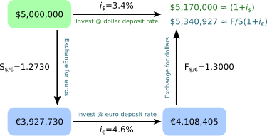

## Table of Contents

## What is covered interest arbitrage?

Covered interest arbitrage is a way to make money by taking advantage of differences in interest rates between two countries while also using the foreign exchange market. It involves borrowing money in one country where the interest rate is low, converting that money into another currency where the interest rate is higher, and then investing it there. To protect against changes in the exchange rate, a forward contract is used to lock in the rate at which the money will be converted back to the original currency at the end of the investment period.

The goal is to end up with more money than you started with after paying back the loan and any associated costs. If everything goes as planned, the profit comes from the difference between the higher interest earned and the lower interest paid. This strategy works best when there are significant differences in interest rates and when the forward exchange rate is favorable. However, it requires careful calculation and understanding of the markets to ensure that the arbitrage opportunity actually results in a profit.

## How does covered interest arbitrage differ from uncovered interest arbitrage?

Covered interest arbitrage and uncovered interest arbitrage are two ways to try to make money from differences in interest rates between countries. In covered interest arbitrage, you use something called a forward contract to protect yourself from changes in the exchange rate between the two currencies you're dealing with. This means you know exactly how much money you'll get back when you convert your investment back to your original currency. You borrow money in a country with a low interest rate, convert it to another currency with a higher interest rate, invest it, and then use the forward contract to change it back at the end.

Uncovered interest [arbitrage](/wiki/arbitrage) is different because it doesn't use a forward contract. This means you're taking a risk on the exchange rate changing while your money is invested. You still borrow in a country with a low [interest rate](/wiki/interest-rate-trading-strategies) and invest in a country with a higher interest rate, but you don't know what the exchange rate will be when you want to convert your money back. This can be riskier because if the exchange rate moves against you, you might end up losing money instead of making a profit.

## What are the key components required to execute covered interest arbitrage?

To execute covered interest arbitrage, you need to find a difference in interest rates between two countries. One country should have a lower interest rate where you can borrow money, and the other should have a higher interest rate where you can invest that money. You start by borrowing money in the country with the low interest rate. Then, you convert that money into the currency of the country with the high interest rate. After converting, you invest the money in that country to earn the higher interest.

The second key part is using a forward contract. This is like a promise that lets you change your money back to the original currency at a set rate in the future. By using a forward contract, you protect yourself from changes in the exchange rate. This means you know exactly how much money you will get back when you convert your investment back to the original currency. At the end of the investment period, you use the forward contract to convert your money back and pay back the loan you took out, hopefully making a profit from the difference in interest rates.

## Can you explain the process of covered interest arbitrage with an example?

Imagine you live in the United States where the interest rate is low, at 1%. You see that in the United Kingdom, the interest rate is higher, at 3%. You decide to borrow $100,000 in the US. You then convert those dollars into British pounds at the current exchange rate, let's say $1 equals £0.75, so you get £75,000. You take that £75,000 and invest it in the UK to earn the higher 3% interest rate. 

To protect yourself from changes in the exchange rate between the dollar and the pound, you use a forward contract. This contract lets you convert your money back to dollars at a set rate in the future. Let's say the forward rate is $1 equals £0.75, the same as the current rate. At the end of the investment period, you earn 3% interest on your £75,000, which is £2,250. Now you have £77,250. You use the forward contract to convert this back to dollars at the rate of $1 equals £0.75, so you get $103,000. After paying back your $100,000 loan plus 1% interest, which is $1,000, you have $2,000 left. That's your profit from the covered interest arbitrage.

## What are the assumptions behind covered interest arbitrage?

Covered interest arbitrage assumes that there are differences in interest rates between two countries. It also assumes that you can borrow money in the country with the lower interest rate and invest it in the country with the higher interest rate. Another important assumption is that you can use a forward contract to lock in the exchange rate between the two currencies. This means you know exactly how much money you will get back when you convert your investment back to your original currency.

The strategy also assumes that you can accurately calculate all the costs involved, like the interest you pay on the loan and any fees for the forward contract. It assumes that after paying back the loan and all costs, you will still have more money left over as profit. If these assumptions hold true, covered interest arbitrage can work well. But if any of these assumptions are wrong, like if the forward rate changes or if there are unexpected costs, the strategy might not make a profit.

## How does the interest rate parity condition relate to covered interest arbitrage?

The interest rate parity condition is a theory that says the difference in interest rates between two countries should be equal to the difference in the forward and spot exchange rates of their currencies. This condition is important for covered interest arbitrage because it helps you understand if there's a chance to make money. If the interest rate parity condition holds perfectly, then covered interest arbitrage won't give you any profit because any difference in interest rates is already matched by the forward exchange rate. But if the condition doesn't hold, there might be a chance to make money through arbitrage.

In real life, markets are not always perfect, so the interest rate parity condition might not always be true. When this happens, you might find that the forward exchange rate doesn't fully match the difference in interest rates. This is when covered interest arbitrage can be profitable. You can borrow in the country with the lower interest rate, invest in the country with the higher interest rate, and use a forward contract to protect yourself from exchange rate changes. If you can do this and still make more money than you spend, you've successfully used covered interest arbitrage to take advantage of the difference between the interest rate parity condition and the actual market conditions.

## What are the potential risks involved in covered interest arbitrage?

Covered interest arbitrage can seem like a safe way to make money because you use a forward contract to protect against changes in the exchange rate. But there are still risks involved. One risk is that the costs of borrowing money, converting currencies, and using the forward contract might be higher than you expect. If these costs are too high, you might not make any profit, even if the interest rates are different.

Another risk is that the interest rate parity condition might start to hold true while you're doing the arbitrage. This means the difference in interest rates between the two countries could start to match the forward exchange rate more closely. If this happens, the chance to make money from the arbitrage could go away before you finish the process. You need to be quick and careful to make sure you can still make a profit.

Also, there's the risk of something unexpected happening in the markets. For example, a big event could cause the exchange rates to change a lot, even if you have a forward contract. Or the government of one of the countries could change its interest rates suddenly. These unexpected changes can mess up your plans and make it hard to make money from covered interest arbitrage.

## How do transaction costs affect the profitability of covered interest arbitrage?

Transaction costs can make a big difference in whether you make money from covered interest arbitrage. When you do this kind of arbitrage, you have to pay for things like borrowing money, converting currencies, and using a forward contract. If these costs are high, they can eat into your profit. For example, if you borrow money at a low interest rate and invest it at a higher rate, but the fees for converting the money and using the forward contract are too high, you might not make any money at all. You need to make sure that the difference in interest rates is big enough to cover all these costs and still leave you with a profit.

Sometimes, even if the interest rates between two countries look good for arbitrage, the transaction costs can make it not worth doing. If the costs are too high, the small difference in interest rates might not be enough to make a profit. This means you have to be very careful and do a lot of math to figure out if covered interest arbitrage will actually work for you. If you don't pay attention to these costs, you might think you're going to make money, but end up losing money instead.

## In what scenarios would covered interest arbitrage be most profitable?

Covered interest arbitrage would be most profitable when there's a big difference in interest rates between two countries. Imagine one country has really low interest rates, and another has much higher rates. If you can borrow money in the country with low rates and invest it in the country with high rates, you can make a lot of money from the difference. But you also need to make sure that the costs of borrowing, converting money, and using a forward contract are low. If these costs are small, the big difference in interest rates can lead to a nice profit.

Another important scenario is when the forward exchange rate is in your favor. This means that when you use a forward contract to lock in the rate for converting your money back, the rate should be good enough so that you still make money after paying back your loan. If the forward rate matches well with the interest rate difference, and the transaction costs are low, covered interest arbitrage can be very profitable. You just need to be quick and careful to take advantage of these conditions before they change.

## How have regulatory changes impacted the practice of covered interest arbitrage?

Regulatory changes can really affect how people do covered interest arbitrage. Governments and financial authorities sometimes change the rules about borrowing money, investing it in another country, and using forward contracts. If these rules get stricter, it might be harder to do arbitrage. For example, if a government puts limits on how much money you can move out of the country, it could be tough to convert your money and invest it somewhere else. Also, if there are new fees or taxes on these transactions, it can make the costs go up and cut into your profits.

Sometimes, regulatory changes can actually make covered interest arbitrage more possible. If a country lowers the rules on moving money across borders or makes borrowing cheaper, it could create more chances for arbitrage. But you still need to be careful. Even if the rules seem good, unexpected changes can happen. So, it's important to keep an eye on what the regulators are doing and be ready to change your plans if the rules shift.

## What role do forward contracts play in covered interest arbitrage?

Forward contracts are really important for covered interest arbitrage because they help you avoid risks from changes in exchange rates. When you do covered interest arbitrage, you borrow money in a country with a low interest rate, convert it to another currency with a higher interest rate, and invest it there. But the exchange rate between the two currencies can change while your money is invested. A forward contract lets you lock in the exchange rate for the future, so you know exactly how much money you'll get back when you convert your investment back to the original currency. This way, you can focus on making money from the difference in interest rates without worrying about losing money because of exchange rate changes.

Using a forward contract makes covered interest arbitrage safer and more predictable. Without it, you'd be doing uncovered interest arbitrage, which is riskier because you don't know what the exchange rate will be when you want to convert your money back. The forward contract acts like a safety net, protecting your investment from unexpected changes in the market. This is why forward contracts are a key part of covered interest arbitrage, helping you plan and make sure you can still make a profit even if the exchange rates move around.

## Can you discuss any recent empirical studies on the effectiveness of covered interest arbitrage?

Recent empirical studies have shown that covered interest arbitrage opportunities have become less common in recent years, especially in major currency markets like those of the US and Europe. One study by Du, Tepper, and Verdelhan (2018) found that since the 2008 financial crisis, deviations from the interest rate parity condition have increased, but it's become harder to profit from these deviations due to factors like regulatory changes and increased transaction costs. They noted that even though there are still small arbitrage opportunities, the costs and risks often make it not worth it for many investors.

Another study by Liao (2020) looked at how covered interest arbitrage works in emerging markets. The research found that in these markets, there can be more opportunities for arbitrage because the interest rate differences are often larger, and the forward exchange markets are less developed. However, the study also pointed out that the risks are higher in these markets due to political instability and less predictable economic conditions. Overall, these studies suggest that while covered interest arbitrage can still be profitable under the right conditions, it's important to carefully consider the costs, risks, and market conditions before trying to take advantage of these opportunities.

## What is Covered Interest Arbitrage and how does it work?

Covered interest arbitrage (CIA) is a strategy used in the foreign exchange markets to exploit differences in interest rates between two countries while mitigating exchange rate risk through the use of forward contracts. This financial tactic hinges on the interest rate parity condition, which posits that the forward exchange rate should incorporate the interest rate differentials between two currencies. When this condition does not hold, arbitrage opportunities arise. Let's explore this concept in detail, including a practical example to clarify the execution mechanics and the opportunities created by interest rate discrepancies.

### Definition and Mechanics

The core of covered interest arbitrage is to capitalize on discrepancies in interest rates between two countries while locking in exchange rates using forward contracts. The interest rate parity condition dictates that:

$$
F = S \times \left( \frac{1 + i_d}{1 + i_f} \right)
$$

Where:
- $F$ is the forward exchange rate
- $S$ is the current spot exchange rate
- $i_d$ is the domestic interest rate
- $i_f$ is the foreign interest rate

When the quoted forward rate deviates from this theoretical forward rate, covered interest arbitrage opportunities exist.

### Step-by-Step Example

Consider a scenario involving two countries: the United States (USD) and Japan (JPY). Suppose the current spot exchange rate is $S = 110$ JPY/USD, the one-year interest rate in the US is 2% ($i_{USD} = 0.02$), and the one-year interest rate in Japan is 1% ($i_{JPY} = 0.01$).

**Step 1:** Determine the theoretical forward rate using the interest rate parity formula:

$$
F = 110 \times \left( \frac{1 + 0.02}{1 + 0.01} \right) = 111.09
$$

**Step 2:** Suppose the forward market quotes a rate of $F = 112$ JPY/USD. This discrepancy indicates a potential arbitrage opportunity.

**Step 3:** Initiate the arbitrage:
- Borrow 1,000,000 JPY at 1% interest rate.
- Convert the borrowed amount to USD at the spot rate ($1,000,000 / 110 = 9,090.91$ USD).
- Invest the USD at the 2% US interest rate for a year to get $9,090.91 \times 1.02 = 9,272.73$ USD by the end of the year.
- Simultaneously, enter a forward contract to convert future USD back to JPY at the forward rate of 112 JPY/USD, receiving $9,272.73 \times 112 = 1,038,545.76$ JPY.

**Step 4:** Repay the initial JPY loan:

$1,000,000 \times 1.01 = 1,010,000 \text{ JPY}$

**Profit Calculation:** The arbitrage profit is:

$$
1,038,545.76 - 1,010,000 = 28,545.76 \text{ JPY}
$$

### Opportunities from Interest Rate Discrepancies

Such arbitrage opportunities arise when discrepancies between domestic and foreign interest rates are not reflected in the forward exchange rate, often due to market inefficiencies, regulatory environments, or temporary factors affecting currency supply and demand. In efficient markets, these opportunities are transient, as traders executing such strategies help align the forward rate with the interest rate parity condition, restoring equilibrium.

In this way, covered interest arbitrage serves both as a tool for riskless profit when conditions permit and as a mechanism that fosters market efficiency by correcting mispricings that violate interest rate parity.

## References & Further Reading

[1]: Gyntelberg, J., & Schrimpf, A. (2011). "FX strategies in corporate bond markets and covered interest arbitrage." BIS Quarterly Review.

[2]: Anderson, N., Domanski, D., & Menkveld, A. (2016). "Central bank balance sheets and interest rate risk management: Evidence from Hong Kong and Singapore." BIS Papers No. 66.

[3]: Lopez de Prado, M. (2018). ["Advances in Financial Machine Learning."](https://www.amazon.com/Advances-Financial-Machine-Learning-Marcos/dp/1119482089) Wiley.

[4]: Mackenzie, M. (2006). "Carry Trade Continues to Gain Popularity." Financial Times.

[5]: Lyons, R. K. (2001). ["The Microstructure Approach to Exchange Rates."](https://direct.mit.edu/books/monograph/2004/The-Microstructure-Approach-to-Exchange-Rates) MIT Press.

[6]: Rogoff, K. (1996). "The purchasing power parity puzzle." Journal of Economic Literature, 34(2), 647-668.

[7]: Burnside, C., Eichenbaum, M., & Rebelo, S. (2007). "The Returns to Currency Speculation." NBER Working Paper No. 12916.

[8]: Shleifer, A., & Vishny, R. W. (1997). "The limits of arbitrage." The Journal of Finance, 52(1), 35-55.