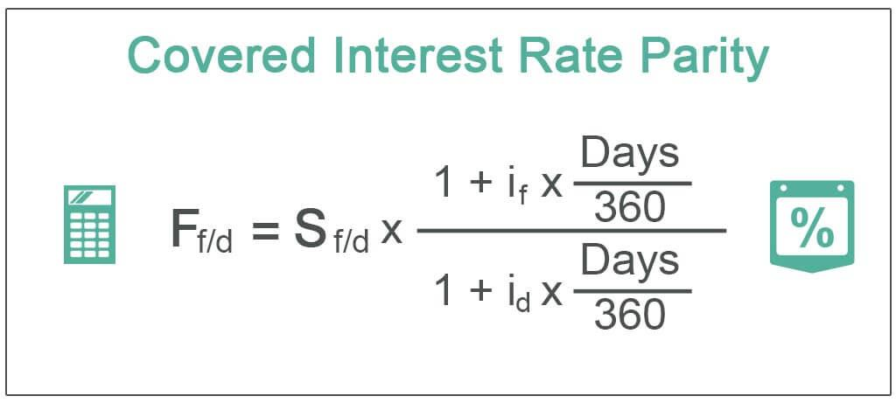

## Table of Contents

## What is Covered Interest Rate Parity (CIRP)?

Covered Interest Rate Parity (CIRP) is a financial theory that explains the relationship between interest rates and exchange rates in different countries. It suggests that the difference in interest rates between two countries should be equal to the difference between the forward and spot exchange rates of their currencies. In simpler terms, if you invest money in a foreign country, the interest you earn, when converted back to your home currency, should be the same as what you would have earned at home, once you account for the changes in currency value.

To understand CIRP better, imagine you have dollars and you're deciding whether to invest in the U.S. or in Europe. If you invest in Europe, you'll convert your dollars to euros, earn interest on the euros, and then convert the euros back to dollars at a future date. CIRP says that the total return from this process should be the same as if you had invested your dollars in the U.S. This balance is maintained through forward contracts, which lock in the exchange rate for the future, ensuring that the returns are equalized across different currencies.

## How does Covered Interest Rate Parity relate to arbitrage?

Covered Interest Rate Parity (CIRP) is closely tied to the concept of arbitrage, which is the practice of taking advantage of price differences in different markets to make a profit. In the context of CIRP, arbitrage involves moving money between countries to exploit any differences in interest rates and exchange rates. If CIRP doesn't hold, meaning the interest rate differential does not equal the forward-spot exchange rate differential, an arbitrage opportunity arises. Traders can borrow in a country with a lower interest rate, convert the money to a currency with a higher interest rate, invest it, and then use a forward contract to convert the money back at a guaranteed rate, making a risk-free profit.

The process of arbitrage helps to bring the markets back into equilibrium, where CIRP holds true. When traders spot these arbitrage opportunities and act on them, they increase the demand for the currency with the higher interest rate and increase the supply of the currency with the lower interest rate. This action causes the spot and forward exchange rates to adjust until the interest rate differential matches the exchange rate differential, eliminating the arbitrage opportunity. In this way, arbitrage plays a crucial role in ensuring that Covered Interest Rate Parity is maintained in the financial markets.

## What are the key components needed to understand Covered Interest Rate Parity?

To understand Covered Interest Rate Parity (CIRP), you need to know about interest rates, exchange rates, and forward contracts. Interest rates are what banks charge for loans or pay for savings. Exchange rates tell you how much one country's money is worth in another country's money. Forward contracts are agreements to exchange money at a set rate in the future. CIRP says that the difference in interest rates between two countries should be the same as the difference between the current exchange rate and the future exchange rate set by a forward contract.

When you understand these parts, you can see how CIRP works. Imagine you have money in the U.S. and you're thinking about investing it in Europe. You would convert your dollars to euros, invest them in Europe, and then convert the euros back to dollars later. If you use a forward contract to set the future exchange rate, the total return from this should be the same as if you had kept your money in the U.S. This balance is what CIRP is all about. If it's not balanced, people can make money by moving funds around, which helps bring the rates back into line.

## Can you explain the formula used to calculate Covered Interest Rate Parity?

The formula for Covered Interest Rate Parity (CIRP) helps to show how interest rates and exchange rates are connected. The formula is: (1 + i_domestic) = (1 + i_foreign) * (F/S), where i_domestic is the interest rate in your home country, i_foreign is the interest rate in the foreign country, F is the forward exchange rate, and S is the spot exchange rate. This formula says that if you invest money at home, the return should be the same as if you convert your money to another currency, invest it there, and then convert it back at a future date using a forward contract.

In simple terms, if the interest rate in the U.S. is 2% and in Europe it's 1%, and the spot exchange rate is 1 USD = 0.85 EUR, then the forward rate should be set so that the returns are equal. If the forward rate is 1 USD = 0.86 EUR, then the formula would show that the returns from investing in the U.S. and Europe, after converting back to USD, are the same. This balance is what keeps the financial markets in equilibrium, and if it's not balanced, people can make money by moving funds around until the rates adjust to match the formula.

## What is the difference between Covered and Uncovered Interest Rate Parity?

Covered Interest Rate Parity (CIRP) and Uncovered Interest Rate Parity (UIRP) are two theories that explain how interest rates and exchange rates are connected, but they work a bit differently. CIRP uses forward contracts to lock in future exchange rates, making sure that the returns from investing in different countries are the same when you convert the money back. It's like a safety net because you know exactly what the exchange rate will be in the future, so there's no risk from changes in the exchange rate.

On the other hand, UIRP doesn't use forward contracts. Instead, it assumes that the expected future spot exchange rate will balance out the interest rate differences between countries. This means you're taking a risk because you don't know what the exchange rate will be when you convert your money back. If the exchange rate changes a lot, you might end up with more or less money than you expected. So, while CIRP is about making sure returns are equal with no risk, UIRP is about expecting the exchange rate to adjust to make returns equal, but with some risk involved.

## How does the forward exchange rate play a role in Covered Interest Rate Parity?

The forward exchange rate is super important in Covered Interest Rate Parity (CIRP) because it helps make sure that the returns from investing in different countries are the same. Imagine you have money in the U.S. and you're thinking about investing it in Europe. You would convert your dollars to euros, invest them in Europe, and then convert the euros back to dollars later. If you use a forward contract to set the future exchange rate, you know exactly how many dollars you'll get back for your euros. This forward rate makes sure that the total return from investing in Europe, after converting back to dollars, is the same as if you had kept your money in the U.S.

If the forward exchange rate didn't exist, there would be a lot of risk because you wouldn't know what the exchange rate would be when you convert your money back. But with a forward contract, you lock in the rate, so there's no risk from changes in the exchange rate. This is why the forward exchange rate is key to CIRP. It helps keep everything balanced, so people can't make easy money by moving funds around. If the returns weren't the same, people would do this until the rates adjusted to match the CIRP formula.

## What are the assumptions behind Covered Interest Rate Parity?

Covered Interest Rate Parity (CIRP) is based on some important ideas that help make it work. One big assumption is that there are no restrictions on moving money between countries. This means you can easily convert your money into another currency and back again without any problems. Another assumption is that there are no extra costs, like fees or taxes, when you move your money or use forward contracts. If there were extra costs, it would mess up the balance that CIRP tries to keep.

Another key assumption is that people can borrow and lend money at the same interest rates that are used in the CIRP formula. This means everyone has access to the same rates, whether they're borrowing or lending. Also, CIRP assumes that forward contracts are always available and that you can use them to lock in future exchange rates without any trouble. These assumptions help make sure that the returns from investing in different countries are the same, which is what CIRP is all about.

## How can deviations from Covered Interest Rate Parity be interpreted?

When Covered Interest Rate Parity (CIRP) doesn't hold, it means there's a difference between the interest rates in two countries and the difference between their spot and forward exchange rates. This can happen for different reasons. One reason could be that there are costs or restrictions when moving money between countries, like taxes or fees. These extra costs can make the returns from investing in different places not equal, even when using forward contracts to lock in exchange rates.

Another reason for deviations from CIRP could be that there are limits on how much money people can move or borrow. If someone can't borrow at the interest rate used in the CIRP formula, or if they can't easily convert their money into another currency, then the balance CIRP tries to keep won't work. These deviations show that the real world isn't always as simple as the theory, and there are many factors that can affect how money moves and how much return people get from their investments.

## What impact do transaction costs have on Covered Interest Rate Parity?

Transaction costs can mess up Covered Interest Rate Parity (CIRP). When you move money between countries, you might have to pay fees or taxes. These costs can make the returns from investing in different places not equal, even if you use forward contracts to lock in exchange rates. If it costs more to move your money or use a forward contract, then the balance that CIRP tries to keep won't work. This means the difference in interest rates between two countries won't match the difference between their spot and forward exchange rates.

In simple terms, if you have to pay a lot to convert your dollars to euros and back again, or if there are high fees for using a forward contract, then the total return from investing in Europe won't be the same as investing in the U.S. These extra costs can create situations where people can't take advantage of arbitrage opportunities as easily, because the costs eat into any potential profits. So, transaction costs are a big reason why CIRP might not hold in the real world.

## How do central bank interventions affect Covered Interest Rate Parity?

Central bank interventions can mess up Covered Interest Rate Parity (CIRP) because they can change how interest rates and exchange rates work. When a central bank steps in, they might change the interest rate in their country, which is one of the key parts of the CIRP formula. If the interest rate goes up or down because of the central bank, it can make the returns from investing in that country different from what you'd expect based on the exchange rates. Also, central banks can affect exchange rates by buying or selling their own currency. If they do this, it can change the spot and forward exchange rates, which are the other important parts of the CIRP formula.

These changes mean that the balance CIRP tries to keep might not work anymore. For example, if a central bank raises interest rates a lot, people might want to invest more in that country. But if the central bank also makes it harder to move money in and out, or if they change the exchange rates a lot, then the returns from investing there won't match what you'd get from investing somewhere else, even with forward contracts. So, central bank actions can create situations where CIRP doesn't hold, because they can mess with the key parts of the formula that are supposed to keep everything in balance.

## Can you discuss empirical evidence supporting or challenging Covered Interest Rate Parity?

Empirical evidence on Covered Interest Rate Parity (CIRP) shows that it usually holds pretty well, but there are times when it doesn't. Studies have found that in normal times, the differences between interest rates and exchange rates are pretty close to what CIRP predicts. This means that if you invest money in different countries and use forward contracts to lock in exchange rates, the returns are often about the same. Researchers look at lots of data from different countries and time periods, and they find that CIRP works most of the time, especially in big, open markets where money can move freely.

However, there are also times when CIRP doesn't hold, and this is important to understand. During big financial crises or when there are lots of restrictions on moving money between countries, the balance that CIRP tries to keep can break down. For example, during the 2008 financial crisis, the differences between interest rates and exchange rates got bigger than what CIRP would predict. This happened because people were worried and didn't want to take risks, so they didn't move money around as much. Also, if there are high transaction costs or if central banks mess with interest rates and exchange rates, CIRP can be off. So, while CIRP is a good guide in normal times, it can fail when things get tough or when there are big changes in the financial world.

## What are the implications of Covered Interest Rate Parity for international financial management?

Covered Interest Rate Parity (CIRP) has big implications for people who manage money across different countries. It helps them understand how they can invest money in different places and still get the same return. If CIRP holds, it means that the interest rate difference between two countries will be balanced out by the difference between the current exchange rate and the future exchange rate set by a forward contract. This balance means that if you invest in another country, you won't get more or less money just because of exchange rate changes, as long as you use a forward contract. This helps managers plan their investments without worrying too much about currency risk.

However, if CIRP doesn't hold, it can create challenges. When there are big differences between what CIRP predicts and what actually happens, it can mean there are opportunities for making money by moving funds around. But it can also mean there are risks, especially if there are high transaction costs, restrictions on moving money, or if central banks change interest rates or exchange rates a lot. Managers need to keep an eye on these things and be ready to adjust their plans. Understanding when and why CIRP might not hold can help them make better decisions about where and how to invest their money across different countries.

## What is involved in understanding financial calculations in Forex?

The foreign exchange ([forex](/wiki/forex-system)) market relies on a variety of financial calculations essential for conducting trades and managing exchange rate risks. These calculations help traders determine the value of currency pairs, assess potential gains or losses, and forecast future currency movements.

### Currency Conversions

Currency conversion is the process of calculating the equivalent value of one currency in terms of another. It requires using current exchange rates to compute the conversion. The basic formula is:

$$
\text{Target Currency Amount} = \text{Base Currency Amount} \times \text{Exchange Rate}
$$

For example, if a trader wishes to convert 1,000 USD to EUR and the exchange rate is 0.85, the equation is:

$$
\text{EUR} = 1,000 \times 0.85 = 850
$$

This calculation is fundamental for businesses and individuals engaged in international transactions.

### Calculating Pips

A pip, or "percentage in point," is a standardized unit used to measure currency value changes within the forex market. It is typically the smallest price move that a particular exchange rate can make based on market convention. For most currency pairs, a pip is the fourth decimal place (0.0001). However, for pairs involving the Japanese yen, a pip is the second decimal place (0.01).

To compute the pip value:

$$
\text{Pip Value} = \left(\frac{\text{One Pip}}{\text{Exchange Rate}}\right) \times \text{Lot Size}
$$

Assuming a standard lot size of 100,000 units and an USD/JPY exchange rate of 110.00, the pip value is:

$$
\text{Pip Value} = \left(\frac{0.01}{110.00}\right) \times 100,000 \approx 9.09 \text{ USD}
$$

Understanding pip values is crucial for risk management and helps traders set stop-loss and take-profit levels accurately.

### Forward Rates

Forward rates are used to determine the future exchange rate for a currency pair, established today for settlement at a later date. This calculation takes into account the [interest rate](/wiki/interest-rate-trading-strategies) differential between the two currencies. The formula to calculate a forward rate is:

$$
\text{Forward Rate} = \text{Spot Rate} \times \left(1 + \frac{\text{Interest Rate of Base Currency } \times \text{t}}{360}\right) \div \left(1 + \frac{\text{Interest Rate of Quote Currency } \times \text{t}}{360}\right)
$$

Where $t$ is the number of days until the contract expires. Forward rates are essential for hedging currency exposure, as they allow traders and companies to lock in exchange rates for future transactions.

### Tools and Software

Various tools and software programs aid traders in performing these calculations efficiently. Trading platforms like MetaTrader and software suites such as Bloomberg Terminal and Reuters Eikon provide built-in calculators for real-time conversion, pip valuation, and forward rate computation. Additionally, these platforms can automate calculations and provide updates to improve accuracy and speed, facilitating prompt trading decisions.

These financial calculations form the backbone of forex trading, allowing market participants to strategize effectively and mitigate risks associated with currency fluctuations. Understanding and utilizing these calculations is key to achieving success in the highly dynamic forex environment.

## What is Exploring Interest Rate Parity?

Interest Rate Parity (IRP) is a fundamental principle that connects interest rates and exchange rates, crucial for foreign exchange markets. It postulates that the difference in nominal interest rates between two countries is equal to the expected change in exchange rates between their currencies. This principle ensures that potential profits from interest rate differentials are offset by corresponding changes in exchange rates, acting as a tool for [arbitrage](/wiki/arbitrage) elimination in efficient markets.

**Theoretical Framework and Assumptions of IRP**

The IRP theory hinges on the assumption of capital mobility and efficient markets that disallow arbitrage opportunities. It is based on two primary forms: Covered Interest Rate Parity (CIRP) and Uncovered Interest Rate Parity (UIRP). CIRP involves the use of forward contracts to hedge against exchange rate risk, ensuring that the return on domestic deposits equals foreign deposits when hedged. Conversely, UIRP does not involve hedging, predicting that futures spot rates will adjust to offset interest differentials.

Mathematically, IRP is expressed as:

$$

F = S \cdot \left(\frac{1 + i_d}{1 + i_f}\right) 
$$

Where:
- $F$ is the forward exchange rate.
- $S$ is the current spot exchange rate.
- $i_d$ is the interest rate for the domestic currency.
- $i_f$ is the interest rate for the foreign currency.

Under CIRP, if the equation holds, no arbitrage opportunity exists as the interest rate differential is counterbalanced by the forward discount or premium. Under UIRP, the expectation is that changes in spot rates will follow the differential.

**The Relationship Between Exchange Rates and Interest Rates**

The relationship posited by IRP dictates that changes in interest rates impact exchange rates. Higher interest rates in a country attract foreign capital, leading to an appreciation of that country’s currency, and vice versa. For UIRP, expectations about future spot rates adjust to reflect changes in interest differentials, impacting capital flows and investment decisions.

**Practical Examples of IRP in Action**

Consider a scenario where the interest rate in the United States is at 2% and in the Eurozone at 1%. According to CIRP, if the current EUR/USD spot rate is 1.10, assuming no arbitrage, the one-year forward rate should be calculated as:

$$

F = 1.10 \cdot \left(\frac{1 + 0.02}{1 + 0.01}\right) 
= 1.10 \cdot 1.0099 
= 1.121
$$

This computation suggests that in a year, the EUR/USD forward rate will adjust to neutralize the interest rate disparity, discouraging arbitrage. Such practical implications of IRP make it indispensable for multinational corporations and investors managing foreign exchange risks.

Interest rate parity plays an instrumental role in maintaining equilibrium in international finance, serving as a guidepost for traders and policymakers alike, emphasizing the interconnectedness of global finance markets.

## References & Further Reading

[1]: Frenkel, J. A., & Levich, R. M. (1975). ["Covered interest arbitrage: Unexploited profits?"](https://www.jstor.org/stable/1830925) Journal of Political Economy, 83(2), 325-338.

[2]: Hull, J. C. (2018). ["Options, Futures, and Other Derivatives"](https://www.semanticscholar.org/paper/Options%2C-Futures%2C-and-Other-Derivatives-Hull/89bdee500c8623864fc9eb7a471546aa713acc44) (10th Edition). Pearson.

[3]: Taylor, M. P. (1987). ["Covered Interest Parity: A High-Frequency, High-Quality Data Study"](https://www.semanticscholar.org/paper/Covered-Interest-Parity%3A-A-High-Frequency%2C-Data-Taylor/f7c167aac5756fbbc72955eac3cdf7dd7d34ba77) Economica, 54(216), 429-438.

[4]: Tsai, C. Y., & Wang, S. H. (2002). ["The performance of interest rate parity: Big data evidence from the foreign exchange market"](https://onlinelibrary.wiley.com/doi/10.1002/advs.202105850) Journal of Computational and Applied Mathematics, 146(1), 287-298.

[5]: Chaboud, A. P., Chiquoine, B., Hjalmarsson, E., & Vega, C. (2014). ["Rise of the Machines: Algorithmic Trading in the Foreign Exchange Market"](https://www.jstor.org/stable/43612951) Journal of Finance, 69(5), 2045-2084.

[6]: ["Interest Rate Parity and the Foreign Exchange Market"](https://www.taylorfrancis.com/chapters/mono/10.4324/9780429456251-6/interest-rate-parity-foreign-exchange-market-francisco-carrada-bravo) by Martin D. D. Evans. Chapman and Hall/CRC.

[7]: Barberis, N., & Thaler, R. (2003). ["A Survey of Behavioral Finance"](https://www.nber.org/papers/w9222) Handbook of the Economics of Finance, 105-438.