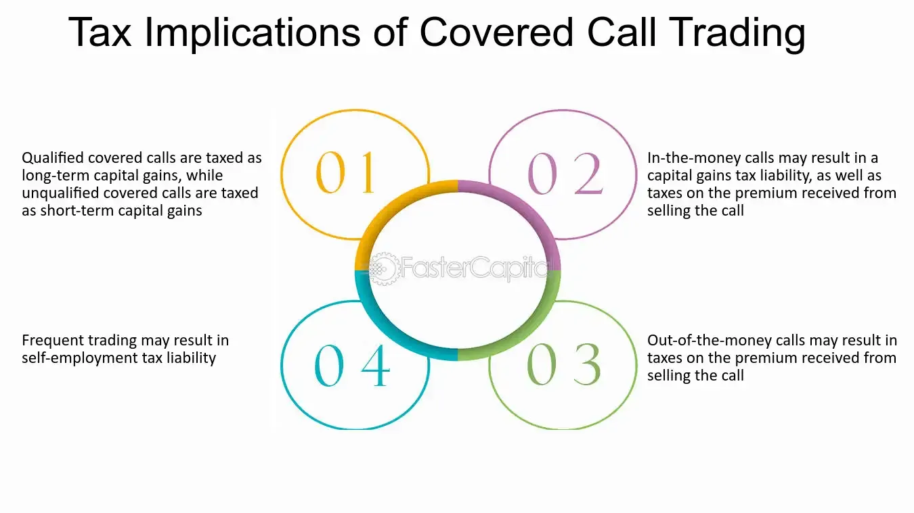

## Table of Contents

## What are covered securities?

Covered securities are types of investments that are regulated by the federal government instead of state governments. This mainly includes stocks that are listed on big stock exchanges like the New York Stock Exchange or Nasdaq. The idea behind this is to make it easier for companies to sell their stocks across different states without having to follow a bunch of different state rules.

Because of this federal regulation, covered securities help make the stock market more efficient. Investors can buy and sell these stocks more easily, knowing that the federal government is overseeing them. This can also help protect investors by making sure that the companies they invest in follow certain rules and standards set by the federal government.

## How do covered securities differ from non-covered securities?

Covered securities are mainly stocks that are listed on big stock exchanges like the New York Stock Exchange or Nasdaq. They are regulated by the federal government, which means they follow rules set by the U.S. Securities and Exchange Commission (SEC). This makes it easier for companies to sell their stocks across different states without having to deal with different state rules. Investors like covered securities because they can buy and sell them easily, and they feel safer knowing the federal government is watching over them.

Non-covered securities, on the other hand, are not listed on these big exchanges and are regulated by state governments. These can include smaller company stocks, certain types of bonds, and other investment products. Because they are regulated at the state level, the rules can be different from one state to another. This can make it harder for companies to sell these securities in multiple states and can be more confusing for investors who have to understand different state regulations.

In summary, the main difference between covered and non-covered securities is who regulates them. Covered securities are overseen by the federal government, making them easier to trade and more standardized. Non-covered securities are regulated by state governments, which can lead to more complexity and variation in rules depending on where you are.

## What are the basic tax implications of selling covered securities?

When you sell covered securities like stocks, you might have to pay taxes on any profit you make. This profit is called a capital gain. If you held the stock for a year or less before selling, it's a short-term capital gain, and you'll pay taxes on it at your regular income tax rate. If you held the stock for more than a year, it's a long-term capital gain, and the tax rate is usually lower, often between 0% and 20% depending on your income.

Sometimes, you might sell a stock for less than you paid for it, which is called a capital loss. You can use these losses to reduce your taxable income. If your losses are more than your gains, you can deduct up to $3,000 of the loss from your regular income each year. Any remaining loss can be carried over to future years to offset gains or income then. It's a good idea to keep track of your buying and selling prices and dates to figure out your taxes correctly.

## How does the cost basis reporting affect taxes on covered securities?

When you sell covered securities like stocks, the cost basis reporting helps figure out how much tax you owe. The cost basis is what you originally paid for the stock. When you sell, the difference between what you sell it for and the cost basis is your gain or loss. Since 2011, brokers have to report this cost basis to the IRS for certain covered securities, making it easier for the IRS to check if you're paying the right amount of tax.

This reporting can affect your taxes because it makes sure the IRS knows about your gains or losses. If your broker reports a higher gain than what you report on your tax return, the IRS might ask you about it. It's important to keep your own records and make sure they match what your broker reports. This helps you avoid any surprises or issues when you file your taxes.

## What is the difference between short-term and long-term capital gains for covered securities?

When you sell covered securities like stocks, the tax you owe depends on how long you held them before selling. If you held the stock for a year or less, any profit you make is called a short-term capital gain. The tax on this gain is the same as your regular income tax rate, which can be pretty high depending on how much you earn.

If you held the stock for more than a year before selling, the profit is called a long-term capital gain. The tax rate for long-term gains is usually lower than for short-term gains. It can be 0%, 15%, or 20%, depending on your income. This means if you can wait more than a year to sell, you might pay less in taxes on your profit.

## How can wash sales impact the tax treatment of covered securities?

A wash sale happens when you sell a stock at a loss and then buy the same or a very similar stock within 30 days before or after the sale. If this happens, you can't use the loss to lower your taxes right away. Instead, you have to add the loss to the cost of the new stock you bought. This means you'll pay taxes on it later when you sell the new stock.

This rule is important to know because it can change how much tax you owe. If you're not careful, you might think you can claim a loss on your taxes, but if it's a wash sale, you can't. It's a good idea to keep track of when you buy and sell stocks, especially if you're trying to use losses to save on taxes.

## What are the tax implications of dividend income from covered securities?

When you own covered securities like stocks, you might get money from them called dividends. These dividends are usually taxed as income. The tax rate depends on how long you've owned the stock. If you've owned it for more than 60 days during the 121-day period that starts 60 days before the ex-dividend date, the dividend is called a qualified dividend. Qualified dividends are taxed at the lower long-term capital gains rates, which can be 0%, 15%, or 20% depending on your income.

If you haven't owned the stock long enough, the dividend is called a non-qualified dividend. Non-qualified dividends are taxed at your regular income tax rate, which can be higher. It's important to know the difference because it can affect how much tax you pay. Keeping track of when you buy and sell stocks can help you figure out if your dividends are qualified or not, and plan your taxes better.

## How do tax lots and their selection methods influence the tax outcome of selling covered securities?

When you sell covered securities like stocks, you have to decide which specific shares you're selling. This is called choosing a tax lot. The tax lot you pick can change how much tax you pay. There are different ways to pick which shares to sell, like selling the ones you bought first (FIFO, or First In, First Out), the ones you bought last (LIFO, or Last In, First Out), or the ones that will give you the best tax result (specific identification). Each method can lead to different tax outcomes because the price you paid for the shares (the cost basis) and how long you held them can be different for each tax lot.

For example, if you use the FIFO method, you'll sell the shares you bought earliest. If those shares have gone up a lot in value and you've held them for more than a year, you'll have a long-term capital gain, which is usually taxed at a lower rate. But if you use the specific identification method, you might pick shares that you bought more recently, leading to a short-term gain taxed at your regular income tax rate. By choosing the right tax lot, you can sometimes lower your taxes. It's important to think about which method to use and keep good records of when you bought and sold your stocks.

## What are the specific IRS forms related to reporting gains or losses from covered securities?

When you sell covered securities like stocks, you need to report any gains or losses on your tax return. The main form you use is Form 1040, which is the standard form for your personal income tax. On this form, you'll report your total capital gains or losses on Schedule D, which is attached to Form 1040. Schedule D breaks down your gains and losses into short-term and long-term categories, helping you figure out how much tax you owe.

Your broker will send you a Form 1099-B at the end of the year. This form shows the details of your stock sales, including the sale price and the cost basis. You'll use the information from Form 1099-B to fill out Schedule D. If you had any wash sales, you'll also need to report those on Form 8949, which you'll attach to Schedule D. Form 8949 helps you list each sale and any adjustments, like those from wash sales, so you can calculate your total gains or losses accurately.

## How do regulations like the Tax Cuts and Jobs Act affect the taxation of covered securities?

The Tax Cuts and Jobs Act (TCJA), which was passed in 2017, made some big changes to how taxes work, including how you're taxed on covered securities like stocks. One big change was that it lowered the tax rates for long-term capital gains and qualified dividends. If you hold a stock for more than a year before selling it, or if you get dividends that are qualified, you'll pay less tax on those profits than before. This can save you money if you're investing in stocks for the long term.

Another change from the TCJA is that it raised the amount of income you can have before you have to start paying higher taxes on long-term capital gains and qualified dividends. Before the TCJA, you started paying more if your income was over certain amounts. Now, those amounts are higher, so more people can pay the lower rates. This means that if you're selling stocks or getting dividends, you might be able to keep more of your money because of these changes.

## What advanced strategies can be used to minimize taxes on covered securities?

One way to lower your taxes on covered securities is by using tax loss harvesting. This means you sell stocks that have lost value to offset the gains from stocks that have gone up in value. If your losses are more than your gains, you can use up to $3,000 of that loss to reduce your regular income tax. The rest of the loss can be carried over to future years. Just be careful not to trigger a wash sale by buying the same or a very similar stock within 30 days before or after the sale, or you won't be able to use the loss right away.

Another strategy is choosing which tax lots to sell. When you sell stocks, you can pick which specific shares to sell. If you use the specific identification method, you can choose shares that will give you the best tax result. For example, selling shares you've held for more than a year can give you a long-term capital gain, which is taxed at a lower rate than short-term gains. This can save you money on taxes. Keeping good records of when you bought and sold your stocks is important so you can make the best choice.

You can also think about holding onto stocks for more than a year before selling them to get the lower long-term capital gains tax rate. If you're getting dividends, make sure they're qualified dividends by holding the stock for more than 60 days during the 121-day period around the ex-dividend date. This can also lower your tax bill. Planning when to buy and sell can help you keep more of your investment profits.

## How do international tax treaties impact the taxation of covered securities for non-resident investors?

International tax treaties can change how much tax non-resident investors have to pay on covered securities like stocks. These treaties are agreements between countries that set rules to avoid double taxation, where you'd have to pay taxes on the same income in two different countries. For example, if you live in one country but invest in stocks from another country, the treaty might say you only have to pay taxes in your home country, or it might limit the amount of tax the other country can take from your dividends or capital gains.

These treaties can also affect how much tax is withheld from dividends. Normally, a country might take a big chunk of tax out of the dividends you get from stocks listed there. But if there's a tax treaty, it might lower that amount. This can make a big difference in how much money you keep from your investments. It's important for non-resident investors to know about these treaties because they can help you plan better and maybe save on taxes.

## References & Further Reading

[1]: Lopez de Prado, M. (2018). ["Advances in Financial Machine Learning."](https://www.amazon.com/Advances-Financial-Machine-Learning-Marcos/dp/1119482089) Wiley.

[2]: Aronson, D. (2011). ["Evidence-Based Technical Analysis: Applying the Scientific Method and Statistical Inference to Trading Signals."](https://www.amazon.com/Evidence-Based-Technical-Analysis-Scientific-Statistical/dp/0470008741) John Wiley & Sons.

[3]: Jansen, S. (2018). ["Machine Learning for Algorithmic Trading."](https://github.com/stefan-jansen/machine-learning-for-trading) Packt Publishing.

[4]: Chan, E. P. (2008). ["Quantitative Trading: How to Build Your Own Algorithmic Trading Business."](https://github.com/egorpe/EPChan-QuantitativeTrading/blob/master/example7_6.m) Wiley.

[5]: Securities and Exchange Commission (SEC). ["Market Access Rule - Rule 15c3-5."](https://www.sec.gov/files/rules/final/2010/34-63241.pdf)

[6]: U.S. Government Publishing Office. (1996). ["National Securities Markets Improvement Act of 1996."](https://www.congress.gov/104/plaws/publ290/PLAW-104publ290.pdf) 

[7]: Financial Industry Regulatory Authority (FINRA). ["Algorithmic Trading – Regulatory Notice 15-09."](https://www.finra.org/rules-guidance/notices/15-09)