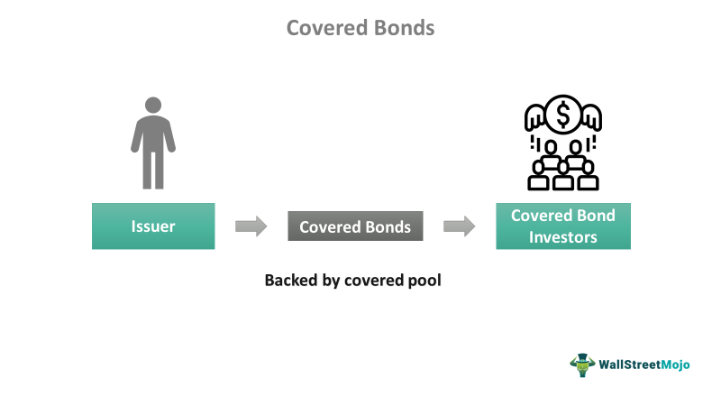

The financial industry has undergone substantial evolution with the integration of technology, particularly influencing the domains of trading and investment. At the forefront of this technological revolution is algorithmic trading, which has established itself as a key element of contemporary financial markets. This sophisticated trading approach relies on complex algorithms capable of executing trades at unprecedented speeds, fundamentally altering traditional trading dynamics.

Algorithmic trading employs advanced mathematical models and utilizes high-frequency trading (HFT) strategies to analyze market data and execute transactions in fractions of a second. This rapid execution can enhance market efficiency but also introduces new complexities and challenges. For instance, the need for faster data processing and quicker decision-making has heightened competition among trading institutions.



The intersection of financial regulation, tax implications, and the classification of covered securities within the context of algorithmic trading is of paramount importance to both investors and financial firms. Regulatory frameworks, such as those implemented by the U.S. Securities and Exchange Commission (SEC), are crucial in ensuring market fairness and transparency while mitigating potential risks associated with automated trading systems. The classification of covered securities, defined under the National Securities Market Improvement Act (NSMIA), plays a significant role in standardizing regulatory and tax obligations across different jurisdictions.

Understanding these elements is vital for market participants who aim to navigate the complexities of modern financial markets effectively. This article aims to provide a comprehensive overview of these factors, exploring their implications and impacts on algorithmic trading practices. Through this exploration, investors and firms can gain valuable insights into optimizing their trading strategies while remaining compliant with evolving regulatory and tax landscapes.

## Table of Contents

## Understanding Financial Regulation in Algorithmic Trading

Financial regulation plays a pivotal role in maintaining order and fairness in financial markets, especially with the rise of algorithmic trading. As technology advances, regulatory bodies must adapt to ensure that trading activities remain transparent and equitable for all market participants. In the United States, key regulatory bodies like the Securities and Exchange Commission (SEC) and the Financial Industry Regulatory Authority (FINRA) have established specific rules to oversee algorithmic trading practices, with the aim of reducing risks and maximizing market integrity.

The SEC oversees the securities industry, including the stock and options exchanges, and has implemented rules pertinent to algorithmic trading. One of the primary concerns addressed by the SEC is the speed of trade execution. Algorithmic trading can execute large volumes of orders at high speeds, potentially leading to [volatility](/wiki/volatility-trading-strategies) and market disruptions. To mitigate these risks, regulatory frameworks such as the Market Access Rule (SEC Rule 15c3-5) require brokers and dealers to establish, document, and maintain a system of risk management controls reasonably designed to prevent erroneous trading or market disruptions due to excessive automated trading orders. This rule underscores the importance of pre-trade risk controls in maintaining a fair and orderly market.

FINRA, an independent, non-governmental organization that regulates member brokerage firms and exchange markets, also plays a crucial role in the regulation of [algorithmic trading](/wiki/algorithmic-trading). FINRA has articulated guidelines emphasizing the need for good governance practices, which include the oversight of the development and deployment of algorithmic strategies. FINRA's rules require firms to maintain a supervisory system and written procedures to oversee algorithmic trading activities appropriately, thereby ensuring market fairness and the protection of investors.

Additionally, both the SEC and FINRA place importance on the registration and monitoring of high-frequency trading ([HFT](/wiki/high-frequency-trading-strategies)) participants. HFT entities, defined by their use of complex algorithms for high-speed trading, are required to register as broker-dealers. This registration ensures that these entities are subject to regulatory oversight, contributing to greater market transparency and oversight of their trading activities.

Regulations addressing market fairness are critical in algorithmic trading as they seek to prevent market manipulation and other unethical trading behaviors. For instance, both the SEC and FINRA have established rules against "spoofing", a practice where traders place large orders they intend to cancel to manipulate stock prices, with potential regulatory actions including fines and trading restrictions.

In conclusion, the regulatory environment surrounding algorithmic trading is designed to address the unique challenges and risks presented by rapid advancements in trading technologies. By implementing structured rules and requirements for trade execution speed, market fairness, and the oversight of high-frequency trading participants, regulatory bodies effectively work towards fostering a stable and equitable trading environment. This regulatory vigilance not only enhances investor protection but also supports the integrity and efficiency of financial markets in the context of algorithmic trading.

## Covered Securities and Their Significance

Covered securities hold a pivotal place in the financial regulatory framework under the National Securities Market Improvement Act (NSMIA) of 1996. This classification plays a crucial role in streamlining tax and regulatory requirements for investors and traders across different states. The NSMIA was primarily enacted to eliminate the redundancy of state regulations over securities, especially those already under federal oversight, thus facilitating a more uniform securities market.

Most publicly traded stocks in the United States are categorized as covered securities. This classification exempts them from state-level registration and qualification requirements, thereby reducing compliance costs and complexities for issuers. By standardizing regulation under federal purview, covered securities enhance the operational efficiency of trading activities and provide a consistent legal framework across states. This consistency is particularly beneficial for national and multinational firms dealing with securities, as it mitigates the patchwork of regulatory requirements that would otherwise exist.

The simplification of the regulatory landscape brought about by the covered securities classification supports a more accessible market for both institutional and individual investors. It reduces the barriers to entry and allows traders to operate more freely, knowing that they are subject to a single, cohesive set of federal regulations rather than varying state laws.

Furthermore, the classification of covered securities also influences tax reporting and other financial obligations, as it inherently ties into the broader discussions on algorithmic trading and financial regulations. Investors and firms engaged in trading must be acutely aware of the implications of dealing with covered securities to ensure full compliance with the required legal and tax frameworks, ultimately leading to reduced administrative burdens and optimized financial operations.

## Tax Implications of Covered Securities in Algorithmic Trading

Covered securities, as defined under the National Securities Market Improvement Act (NSMIA), [carry](/wiki/carry-trading) distinct tax implications, significantly influencing both individual investors and institutional trading entities engaged in algorithmic trading. The focal point of these tax implications lies primarily in the strict reporting obligations associated with the cost basis of these securities. 

The cost basis of a security represents the original value or purchase price, adjusted for stock splits, dividends, and return of capital distributions. For covered securities, brokers are mandated to report this cost basis information to the Internal Revenue Service (IRS) when the securities are sold. This requirement distinguishes covered securities from non-covered securities, which have less stringent reporting criteria.

For algorithmic trading systems, the imperative to accurately account for the cost basis is paramount. The complexity of algorithmic trading can lead to frequent buy and sell transactions, necessitating precise tracking of the cost basis to ensure accurate tax reporting and compliance. Incomplete or incorrect cost basis reporting can result in underpayment or overpayment of taxes, impacting the financial outcomes of trades.

Due to these requirements, algorithmic trading strategies must incorporate mechanisms for efficient tracking and reporting. This can be achieved through software solutions that integrate with trading algorithms, automatically record the necessary details of each transaction, and calculate gains or losses in compliance with tax regulations. For instance, a Python-based solution could automate the tracking of each transaction's cost basis, accounting for any adjustments, and generating reports for IRS submission. Here’s a sample code snippet that outlines a basic structure for tracking the cost basis:

```python
class SecurityTransaction:
    def __init__(self, purchase_price, quantity, date):
        self.purchase_price = purchase_price
        self.quantity = quantity
        self.date = date

    def calculate_cost_basis(self):
        # Example of cost basis calculation
        return self.purchase_price * self.quantity

# Example usage
transactions = [
    SecurityTransaction(100, 10, '2023-01-01'),
    SecurityTransaction(110, 15, '2023-06-01')
]

for transaction in transactions:
    print(f"Cost Basis on {transaction.date}: ${transaction.calculate_cost_basis()}")
```

In addition to compliance, optimizing tax outcomes is another key consideration for algorithmic traders. Tax-loss harvesting, a strategy that involves selling securities at a loss to offset capital gains taxes, can be applied to the frequent trades conducted by algorithms. By effectively timing these transactions, traders can minimize tax liabilities and enhance after-tax returns.

In essence, the tax implications of covered securities necessitate a comprehensive approach in algorithmic trading systems. Compliance must be prioritized through stringent reporting practices, while strategic considerations such as tax optimization can be employed to improve net returns. This dual focus ensures that traders and firms can navigate the intricacies of tax regulations, mitigating risks and capitalizing on potential tax benefits.

## Challenges and Opportunities in Algorithmic Trading

Algorithmic trading, while highly sophisticated and efficient, brings with it several challenges that market participants must navigate. One of the most significant concerns is market manipulation risk. This can occur when traders use algorithms to deliberately manipulate stock prices, thereby misleading investors and trading systems. This type of manipulation may involve techniques such as spoofing, where false orders are placed with the intention of canceling them before they are executed, creating artificial demand or supply that affects market prices.

Another considerable challenge is the potential for flash crashes. These are rapid and significant price drops within short time frames, often triggered by automated trading algorithms reacting to erroneous or unexpected market conditions. The most notable example of this phenomenon occurred on May 6, 2010, when the U.S. stock market experienced a brief yet dramatic plunge, erasing nearly $1 trillion in market value before recovering swiftly.

Despite these challenges, algorithmic trading offers substantial opportunities that continue to shape financial markets. One major advantage is improved market [liquidity](/wiki/liquidity-risk-premium). Algorithms can execute trades much faster than humans, providing consistent liquidity across markets which can lead to more efficient price discovery. This rapid trade execution can also significantly reduce transaction costs for traders, making markets more accessible and less expensive to navigate.

Furthermore, algorithmic trading enables faster trade executions, often completing transactions within microseconds. This speed is crucial in high-frequency trading (HFT), where firms profit by executing numerous trades at extremely high speeds to capitalize on small price discrepancies.

Balancing the risks and opportunities associated with algorithmic trading necessitates robust regulatory frameworks. Regulatory bodies must enforce strict rules to prevent and penalize market manipulation and to mitigate the impact of sudden market dislocations like flash crashes. This involves real-time monitoring of trading activities and implementing circuit breakers—a mechanism that temporarily halts trading following rapid price declines to stabilize markets.

Moreover, advanced technological solutions are essential in harnessing the benefits of algorithmic trading while minimizing its risks. These include employing [machine learning](/wiki/machine-learning) algorithms to detect suspicious trading patterns indicative of manipulation or developing more sophisticated risk management systems to predict and respond to market anomalies promptly.

To ensure that algorithmic trading remains both a driving force for efficiency and a field of fair play, it is critical for stakeholders to emphasize not only technological innovation but also ethical trading practices and regulatory compliance. This approach fosters a resilient trading environment that benefits both the market and its participants.

## Ensuring Compliance and Ethical Practices

In the rapidly evolving environment of algorithmic trading, maintaining compliance and adhering to ethical standards are imperative for firms aiming to minimize risk and sustain investor confidence. To manage the complexities associated with regulatory and tax obligations, firms must establish robust compliance programs tailored to the unique challenges presented by automated trading systems.

Compliance programs should encompass a comprehensive understanding of the pertinent regulations established by authorities such as the U.S. Securities and Exchange Commission (SEC) and the Financial Industry Regulatory Authority (FINRA). These programs are essential for monitoring adherence to rules concerning trade execution speeds, market fairness, and reporting requirements, ultimately reducing the potential for regulatory breaches and fostering operational integrity.

Developing algorithmic strategies demands meticulous planning and rigorous testing to diminish the likelihood of errors. Utilizing a structured algorithm development cycle, incorporating stages such as [backtesting](/wiki/backtesting), forward testing, and real-time monitoring, enhances strategy reliability and effectiveness. Python, a favored language in algorithmic trading, provides various libraries such as NumPy, pandas, and [backtrader](/wiki/backtrader), which facilitate robust backtesting and strategy development processes:

```python
import backtrader as bt
import pandas as pd

# Sample strategy for backtesting purposes
class MyStrategy(bt.Strategy):
    def __init__(self):
        self.dataclose = self.datas[0].close

    def next(self):
        if self.dataclose[0] > self.dataclose[-1]:
            self.buy()
        elif self.dataclose[0] < self.dataclose[-1]:
            self.sell()

# Load data and apply backtesting
data = bt.feeds.PandasData(dataname=pd.read_csv('data.csv'))
cerebro = bt.Cerebro()
cerebro.addstrategy(MyStrategy)
cerebro.adddata(data)
cerebro.run()
```

Apart from technical robustness, algorithmic trading must prioritize ethical considerations to maintain trust among stakeholders. Ethical practices involve avoiding manipulative tactics like spoofing and ensuring transparency in algorithmic decisions, aiding in fostering a positive perception of the market's integrity. With the public and regulatory scrutiny intensifying, practicing transparency and ethical trading can serve as a competitive advantage, enhancing stakeholder relationships and preserving the firm's reputation.

Ultimately, implementing robust compliance frameworks coupled with a commitment to ethical trading practices is essential for the successful operation of algorithmic trading systems. These efforts not only align firms with regulatory expectations but also promote a sustainable and trustworthy market environment.

## Conclusion

As algorithmic trading continues to evolve, grasping the nuances of financial, regulatory, and tax environments becomes increasingly vital for market participants. These dimensions form the framework within which algorithmic strategies operate and must be navigated with precision to avoid pitfalls and optimize outcomes. 

Covered securities represent a critical aspect of this landscape, offering a standardized regulatory environment that simplifies certain compliance tasks. However, they also bring specific tax and reporting obligations that demand attention. Brokers are mandated to report the cost basis of covered securities, directly affecting investors' and firms' tax liabilities. This requirement necessitates an in-depth knowledge of tax laws and meticulous record-keeping to ensure compliance and optimize tax positions.

Staying informed and compliant amidst these dynamic conditions is not just a regulatory obligation but a strategic advantage. Effective trading strategies should incorporate considerations of both speed and compliance, utilizing technology to aid in real-time monitoring and reporting. This balance ensures that market participants can harness the benefits of algorithmic trading—such as improved liquidity and reduced costs—without falling foul of regulatory or tax provisions.

Integrating ethical practices within these frameworks will further strengthen trust within the market, fostering confidence among investors and regulators alike. As trading technologies continue to advance, maintaining this ethical and compliant stance will be pivotal for traders and firms aiming to leverage algorithmic trading efficiently and responsibly.

## References & Further Reading

[1]: Lopez de Prado, M. (2018). ["Advances in Financial Machine Learning."](https://www.amazon.com/Advances-Financial-Machine-Learning-Marcos/dp/1119482089) Wiley.

[2]: Aronson, D. (2011). ["Evidence-Based Technical Analysis: Applying the Scientific Method and Statistical Inference to Trading Signals."](https://www.amazon.com/Evidence-Based-Technical-Analysis-Scientific-Statistical/dp/0470008741) John Wiley & Sons.

[3]: Jansen, S. (2018). ["Machine Learning for Algorithmic Trading."](https://github.com/stefan-jansen/machine-learning-for-trading) Packt Publishing.

[4]: Chan, E. P. (2008). ["Quantitative Trading: How to Build Your Own Algorithmic Trading Business."](https://github.com/egorpe/EPChan-QuantitativeTrading/blob/master/example7_6.m) Wiley.

[5]: Securities and Exchange Commission (SEC). ["Market Access Rule - Rule 15c3-5."](https://www.sec.gov/files/rules/final/2010/34-63241.pdf)

[6]: U.S. Government Publishing Office. (1996). ["National Securities Markets Improvement Act of 1996."](https://www.congress.gov/104/plaws/publ290/PLAW-104publ290.pdf) 

[7]: Financial Industry Regulatory Authority (FINRA). ["Algorithmic Trading – Regulatory Notice 15-09."](https://www.finra.org/rules-guidance/notices/15-09)