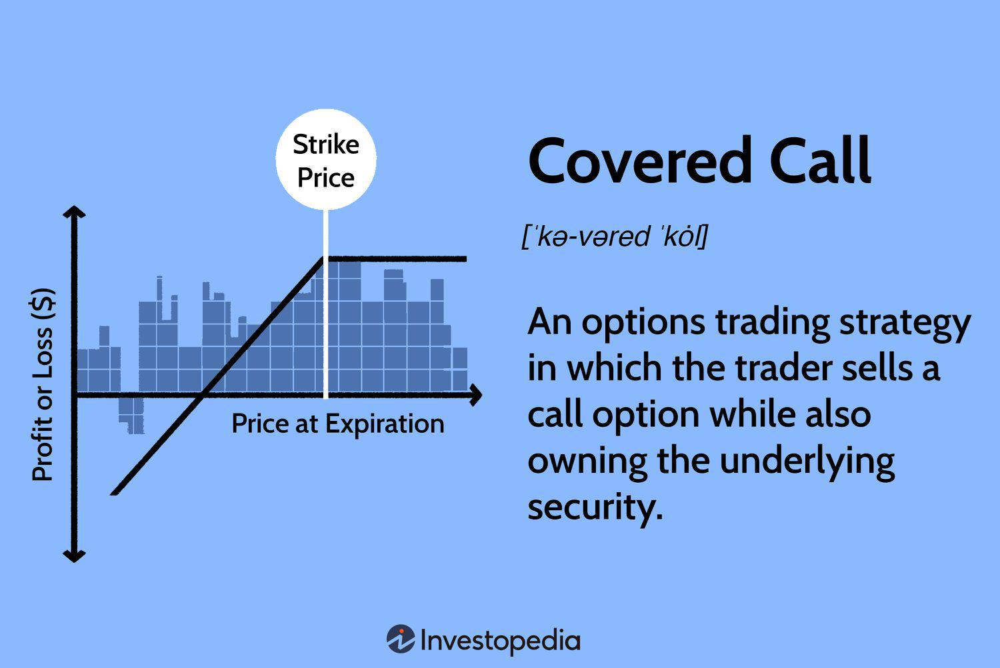

In the financial markets, understanding key terms related to stock investments and algorithmic trading is crucial for both novice and experienced traders. Stock coverage and covered stocks are terms that investors encounter often, and they play a significant role in investment analysis. Stock coverage refers to the research and analytical reports prepared by financial analysts that evaluate and provide insights on specific stocks. Covered stocks are those for which such detailed research is available, assisting investors in making informed decisions. These reports often contain recommendations such as 'buy', 'sell', or 'hold', which are based on various quantitative and qualitative analyses of the company's performance, market conditions, and future prospects.

Similarly, algorithmic trading, a technology-driven trading method, has become increasingly prevalent in modern markets. It involves using computer algorithms to execute trades at high speeds and frequencies, minimizing human emotional biases in trading decisions. The use of algorithms not only facilitates systematic trading but also contributes significantly to improving market liquidity and efficiency.



This article will explore these concepts to provide a comprehensive understanding of stock investment terms and algorithmic trading. By examining stock coverage and algorithmic trading, investors can gain valuable insights into market dynamics, enhance their trading strategies, and improve overall decision-making processes in the financial markets.

## Table of Contents

## Understanding Stock Coverage

Stock coverage encompasses the research and analysis that equity analysts provide on specific stocks. This involves a comprehensive assessment of a company's performance parameters, market dynamics, financial health, and growth prospects. The stocks that receive such detailed analysis and insights are termed as 'covered stocks.' Analysts publish research reports on these stocks, which serve as critical tools for investors seeking to make well-informed investment decisions.

These research reports typically feature stock ratings like ‘buy,’ ‘sell,’ or ‘hold.’ These ratings are derived from rigorous [fundamental analysis](/wiki/fundamental-analysis) of the company. Fundamental analysis involves scrutinizing a company's financial statements, evaluating its management team, analyzing its competitive advantages, and assessing market conditions. The aim is to estimate a stock's intrinsic value and compare it to its current market price to determine investment potential.

Sell-side analysts, usually employed by brokerage firms, play a pivotal role in this process. They provide the market with forecasts and recommendations based on their extensive research and specialist knowledge. These analysts gather public data, industry information, and leverage financial models to produce insightful reports. These insights, when aggregated, can significantly influence investor behavior and stock prices by shaping market perceptions.

Despite their utility, the work of sell-side analysts is not free from criticism. There is sometimes a perceived bias, where analysts may be reluctant to issue negative ratings. Concerns revolve around maintaining positive relations with the companies they cover and their clients. As such, investors are advised to use these reports as part of a broader research toolkit rather than relying on them solely for investment decisions.

In conclusion, understanding stock coverage provides both retail and institutional investors with a lens through which to view potential investments. These analytical insights, expertly crafted by sell-side analysts, are invaluable for making strategic investment choices, enhancing an investor's ability to navigate the financial markets effectively.

## The Role of Analysts in Stock Coverage

Analysts perform in-depth research to understand a company's business model, assess its market position, and evaluate its financial health. This rigorous analysis often involves dissecting financial statements, reviewing market trends, and considering competitive dynamics. These efforts provide analysts with a comprehensive view that is crucial when formulating investment recommendations and setting target prices for stocks.

The impact of analysts on stock prices and investment decisions is notable. Once analysts release their findings, often encapsulated in detailed equity research reports, these insights can sway investor sentiment and influence market movements. For instance, a positive rating or an upgrade in a stock's status could lead to increased buying interest, potentially driving up the stock price. Conversely, a downgrade can result in selling pressure.

Analysts' reports typically encompass recommendations expressed as ratings such as 'buy,' 'hold,' or 'sell.' These ratings are synthesized from both quantitative models and qualitative assessments. Quantitative models may use techniques such as discounted cash flow analysis, comparable company analysis, or dividend discount models to estimate a company's intrinsic value. Meanwhile, qualitative assessments consider factors like management effectiveness, brand strength, and regulatory environment.

However, despite their crucial role, analysts face criticism concerning the objectivity of their reports. A pertinent issue is the potential bias analysts might exhibit to preserve their relationships with the companies they cover. This reluctance to issue negative ratings can stem from two main concerns: maintaining access to company management for future insights, and a desire to support the investment banking arms of their own firms that may seek business from these companies. This potential conflict of interest implies that investors should exercise caution and complement analyst reports with independent research.

In summary, while analysts are indispensable in guiding investors through complex market landscapes with their well-researched insights, awareness of the potential for bias is key to utilizing these insights effectively.

 to Algorithmic Trading

Algorithmic trading, or algo-trading, involves the use of computer algorithms to automate trading activities, executing trades at speeds and frequencies that are significantly higher than any human could achieve. This automation is based on predetermined criteria, which can include timing, price, quantity, and complex mathematical models. The primary advantage of [algorithmic trading](/wiki/algorithmic-trading) is its capacity for high-speed and high-frequency trading, enabling the execution of numerous trades within microseconds. This efficiency reduces the emotional and psychological influences that often affect human trading decisions, creating a more structured and disciplined approach.

One of the key benefits of algo-trading is its ability to improve market [liquidity](/wiki/liquidity-risk-premium). By facilitating trades through automation, it contributes to tighter bid-ask spreads, which denote the price difference between buying and selling. This increased liquidity enables market participants to enter and [exit](/wiki/exit-strategy) positions more easily without causing significant market impact.

Overall, algorithmic trading brings about a systematic trading environment, offering enhanced speed and precision. It handles large volumes of data and complex decisions consistently, making it a vital component in modern financial markets.

## Key Concepts in Algorithmic Trading

Common strategies employed in algorithmic trading are fundamental to understanding its practical applications and benefits. A prominent technique is trend-following, which involves algorithms making buy or sell decisions based on the analysis of a security's direction. By relying on technical indicators, such as moving averages, these algorithms can identify and capitalize on emerging market trends.

Arbitrage opportunities present another key strategy. Traders develop algorithms to exploit price inefficiencies across different markets or securities. For instance, if a stock is priced lower on one exchange compared to another, an algorithm could simultaneously buy the undervalued security and sell it where it's overvalued, profiting from the discrepancy.

Mean reversion is a strategy based on the assumption that an asset’s price will revert to its mean or average level over time. When a security's current price deviates significantly from its historical average, algorithms are designed to execute trades anticipating a return to this mean value. This strategy often uses statistical indicators such as standard deviations and Z-scores to assess the significance of price movements.

Trading algorithms analyze market data continuously, executing trades when specific, predefined criteria are met. This can include conditions like price thresholds, time of the day, or the appearance of particular patterns. The use of complex algorithms allows for the handling of vast amounts of data, leading to advantages in speed and precision over traditional trading methods. These algorithms operate without the emotional biases that can impact human traders, consistently applying pre-established plans across fluctuating market conditions.

```python
# Example of a simple Python script for a trend-following strategy using moving average crossovers
import pandas as pd
import numpy as np

def moving_average(data, window_size):
    return data.rolling(window=window_size).mean()

def trading_signals(data, short_window, long_window):
    signals = pd.DataFrame(index=data.index)
    signals['signal'] = 0.0
    signals['short_mavg'] = moving_average(data['Close'], short_window)
    signals['long_mavg'] = moving_average(data['Close'], long_window)

    signals['signal'][short_window:] = np.where(signals['short_mavg'][short_window:] 
                                                > signals['long_mavg'][short_window:], 1.0, 0.0)
    signals['positions'] = signals['signal'].diff()
    return signals

# Example usage:
# Assume `data` is a pandas DataFrame with a 'Close' column containing price data.
# signals = trading_signals(data, short_window=40, long_window=100)
```

The advantages of algorithmic trading are underscored by its capacity to execute trades with unmatched speed and accuracy, facilitating the implementation of complex strategies without human intervention. These benefits are complemented by the provision of continuous market analysis, enabling traders to capitalize on fleeting opportunities that may arise during trading sessions.

## Advantages and Challenges of Algorithmic Trading

Algorithmic trading, widely recognized for its capacity to enhance trading efficiency, offers several advantages while confronting certain challenges. A primary benefit of algorithmic trading is its ability to execute trades at optimal prices. By swiftly responding to market changes, algorithms secure trades at favorable price points, thereby reducing transaction costs associated with delayed executions. The precision of algorithms ensures that trades are completed in real-time, without the inconsistencies or biases inherent in human decision-making.

Additionally, algorithmic trading enables [backtesting](/wiki/backtesting) of trading strategies using historical data. This process allows traders to evaluate the viability of strategies by simulating their performance against past market conditions. By leveraging backtesting, traders can refine their approaches and mitigate risks, aiming to identify strategies that consistently yield favorable outcomes. The iterative process of backtesting and optimization enhances the effectiveness of trading strategies within algorithmic frameworks.

Despite these advantages, algorithmic trading is not without challenges. Establishing and maintaining the necessary technological infrastructure requires significant investment and expertise. High-performance computing systems, data feeds, and reliable network connections are essential to implement trading algorithms successfully. Moreover, system failures, whether due to hardware malfunctions or software glitches, can lead to substantial financial losses if not properly managed. Ensuring robust system architecture and implementing fail-safes is crucial to mitigate such risks.

Compliance with regulatory requirements is another significant challenge. Regulatory bodies impose stringent guidelines on algorithmic trading practices to ensure market stability and prevent abuses. Traders must navigate complex regulatory landscapes, which often vary across jurisdictions, requiring dedicated resources to achieve compliance. This includes monitoring and reporting trade activities, implementing risk management protocols, and ensuring transparent operations that align with legal standards.

In summary, while algorithmic trading offers substantial benefits such as improved trade execution and strategy optimization through backtesting, it necessitates a robust technological framework, rigorous risk management, and strict adherence to regulatory requirements.

## Conclusion

In today's rapidly evolving financial markets, a deep understanding of stock coverage and algorithmic trading is indispensable for investors seeking to enhance their trading strategies and decision-making processes. Stock coverage provides critical insights through detailed research reports, helping investors evaluate the potential of specific stocks based on ratings and analysis offered by equity analysts. This information is invaluable in identifying investment opportunities and risks, ultimately aiding in the formulation of sound investment strategies.

Algorithmic trading, on the other hand, represents a technological advancement that has revolutionized how trades are executed. By using sophisticated computer programs to [carry](/wiki/carry-trading) out trades based on predefined criteria, algorithmic trading offers unmatched speed and precision. This not only reduces human error but also allows for the execution of complex trading strategies efficiently. Moreover, algorithmic trading brings about improved market liquidity and reduced transaction costs, which are crucial advantages in high-speed trading environments.

As technology continues to progress, staying informed about stock coverage and algorithmic trading will equip investors with the necessary tools to remain competitive. Mastery of these concepts allows investors to leverage technological advancements and analytical insights, thus positioning themselves strategically in the market. Therefore, continuous education on these fronts will not only facilitate informed decision-making but also ensure investors maintain a resilient and adaptable approach to stock investments and trading.

## Frequently Asked Questions (FAQs)

### What is stock coverage and why is it important?

Stock coverage refers to the analysis and evaluation provided by financial analysts on particular stocks. Analysts, often from the sell-side, produce detailed reports that assess a company's financial health, business model, market competitiveness, and future prospects. These insights typically result in stock ratings such as 'buy', 'sell', or 'hold', offering guidance to investors. 

The importance of stock coverage lies in its ability to inform investment decisions. Analysts provide comprehensive research that helps investors understand the potential risks and rewards associated with a stock. By relying on these evaluations, investors can make more informed decisions and potentially improve their portfolio's performance. Additionally, the analysis can influence stock market trends by affecting investor perceptions and actions.

### How does algorithmic trading work?

Algorithmic trading, or algo-trading, involves using computer programs to execute trades based on predefined instructions. These algorithms analyze a variety of market data and execute transactions when specific conditions are met, such as timing, price, quantity, or any mathematical model. 

A common example would be a trend-following strategy, where the algorithm trades based on moving averages. Here's a simple Python snippet that demonstrates a basic moving average crossover:

```python
import pandas as pd

# Assume we have market data in a DataFrame
data = pd.DataFrame({
    'Price': [100, 102, 104, 103, 105, 110, 108, 115, 120, 117]
})

# Calculate the short-term and long-term moving averages
short_window = 3
long_window = 5

data['Short_MA'] = data['Price'].rolling(window=short_window).mean()
data['Long_MA'] = data['Price'].rolling(window=long_window).mean()

# Generate buy/sell signals
data['Signal'] = 0
data.loc[data['Short_MA'] > data['Long_MA'], 'Signal'] = 1
data.loc[data['Short_MA'] < data['Long_MA'], 'Signal'] = -1

print(data)
```

This simple algorithm generates buy or sell signals based on the crossover of short-term and long-term moving averages.

### What are the risks associated with algorithmic trading?

Algorithmic trading, while beneficial for its speed and precision, comes with several risks. First, there is a potential for system failures due to bugs or connectivity issues, which can lead to missed opportunities or unintended trades. Second, algorithms can sometimes amplify market [volatility](/wiki/volatility-trading-strategies), particularly if many traders use similar strategies simultaneously. Third, there is a risk of inadequate testing, where algorithms underperform in real markets because they were overfitted to historical data during backtesting. Lastly, compliance with regulatory requirements presents ongoing challenges, as markets and technologies evolve rapidly.

### How can I leverage stock coverage reports in my investment strategy?

Investors can leverage stock coverage reports by integrating the analysts' insights into their investment strategies. These reports can serve as a foundation for conducting further individual analysis, helping investors to:

1. **Identify Opportunities:** Use ratings and target prices to identify potential buys or stocks to watch.
2. **Understand Risks:** Gain insight into the potential risks and downsides of stocks you are considering.
3. **Monitor Investments:** Regularly track the analysts' updates on stocks you hold, adjusting your portfolio as needed.
4. **Diversify:** Consider recommendations across sectors to diversify risk effectively.

By incorporating these reports into a broader investment strategy, investors can make well-informed decisions that align with their financial goals and risk tolerance.

## References & Further Reading

[1]: ["Advances in Financial Machine Learning"](https://www.amazon.com/Advances-Financial-Machine-Learning-Marcos/dp/1119482089) by Marcos Lopez de Prado

[2]: ["Algorithmic Trading and DMA: An Introduction to Direct Access Trading Strategies"](https://www.amazon.com/Algorithmic-Trading-DMA-introduction-strategies/dp/0956399207) by Barry Johnson

[3]: ["Quantitative Trading: How to Build Your Own Algorithmic Trading Business"](https://www.amazon.com/Quantitative-Trading-Build-Algorithmic-Business/dp/1119800064) by Ernest P. Chan

[4]: ["Evidence-Based Technical Analysis: Applying the Scientific Method and Statistical Inference to Trading Signals"](https://www.amazon.com/Evidence-Based-Technical-Analysis-Scientific-Statistical/dp/0470008741) by David Aronson

[5]: O'Hara, M. (2015). ["High-Frequency Trading and its Impact on Markets."](https://rpc.cfainstitute.org/research/financial-analysts-journal/2014/high-frequency-trading-and-its-impact-on-markets) Journal of Financial Economics, 116(2), 257-270.

[6]: Aldridge, I. (2013). ["High-Frequency Trading: A Practical Guide to Algorithmic Strategies and Trading Systems"](https://books.google.com/books/about/High_Frequency_Trading.html?id=6l0DDQAAQBAJ) by Irene Aldridge

[7]: Fabozzi, F. J., Focardi, S. M., & Kolm, P. N. (2010). ["Quantitative Equity Investing: Techniques and Strategies"](https://www.semanticscholar.org/paper/Quantitative-Equity-Investing%3A-Techniques-and-Fabozzi-Focardi/1c49a2a53919f7e65cb96f16691b8ff726fd3cd7) by Frank J. Fabozzi, Sergio M. Focardi, and Petter N. Kolm