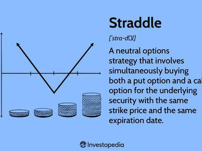

Understanding financial derivatives is crucial for modern trading strategies, providing traders with tools to manage risks and exploit market opportunities. Financial derivatives are contracts that derive their value from the performance of underlying entities, such as assets, indices, or interest rates. Among these derivatives, options are particularly instrumental as they offer the right, though not the obligation, to buy or sell an asset at a predetermined price within a set timeframe. This flexibility allows traders to construct various strategies tailored to different market conditions and risk appetites.

One such strategy gaining popularity is the covered straddle. This strategy involves holding the underlying asset while simultaneously writing both call and put options on that asset with the same strike price and expiration date. This approach is designed to capitalize on minimal price movement while maintaining a generally bullish perspective on the asset. By selling options, investors collect premiums that can lead to profits if the asset price remains stable, although they must manage potential downside risks.



With the advent of advanced technologies, algorithmic trading has become integral to executing these strategies. Algorithmic trading employs automated systems to conduct trades based on predefined criteria. This automation enhances efficiency and precision, allowing traders to respond instantly to market movements. In the context of covered straddles, algorithmic trading can optimize the timing and execution of trades, ensuring the strategy is implemented effectively and swiftly.

This article examines the covered straddle strategy within the framework of algorithmic trading, highlighting its potential for profit and the efficiencies introduced by automated trading systems. Through a detailed exploration of these concepts, the article aims to provide insight into how these strategies can be leveraged in modern financial markets.

## Table of Contents

## Understanding Financial Derivatives and Options

Financial derivatives are complex financial instruments whose value is dependent on, or derived from, the value of an underlying entity such as an asset, index, or interest rate. These derivatives are utilized in financial markets for purposes including hedging, speculating, and leveraging positions. They allow participants to transfer risks and can provide opportunities for significant returns. Derivatives can be adapted to a wide array of underlying entities, thereby offering flexibility in their application across various markets.

Options are a class of financial derivatives that grant the holder the right, but not the obligation, to buy or sell an underlying asset at a predetermined price, known as the strike price, before or at a specified expiration date. This flexibility differentiates options from other derivatives and provides a unique mechanism for traders to manage financial exposure. Options can be categorized mainly into two types: call options, which provide the right to buy, and put options, which allow the right to sell.

The strategies involving options are diverse and cater to different financial goals. For example, basic strategies include buying calls or puts, which can protect against losses or speculate on asset price movements. More sophisticated strategies, such as straddles, spreads, and butterflies, allow traders to capitalize on factors such as [volatility](/wiki/volatility-trading-strategies), directionality, and time decay. By amalgamating different options contracts, traders can tailor a strategy that fits specific market outlooks and risk profiles.

In summary, financial derivatives and options are pivotal tools in modern trading. They offer myriad strategies that can be employed to manage risk and capitalize on market speculation. This flexibility and the layered complexity of derivative instruments make them a fundamental component of contemporary financial markets.

## Overview of Covered Straddle Strategy

A covered straddle is an options trading strategy that combines both ownership of the underlying asset and writing options contracts. Specifically, it involves owning the asset and simultaneously selling both a call option and a put option on that same asset with identical strike prices and expiration dates. This strategy is commonly employed when an investor anticipates minimal price movement in the underlying asset but maintains a bullish outlook.

The mechanics of the strategy rely on the asymmetric nature of options trading. By selling a call option, the investor is obliged to sell the underlying asset at the strike price if exercised, whereas selling a put option obliges them to buy more of the asset at the strike price if exercised. The net outcome of being "covered" means that the investor already owns the asset necessary to fulfill the call option, thereby reducing potential losses typically associated with selling naked options.

The appeal of this strategy lies primarily in its capacity to generate income through the collection of option premiums. When market conditions are stable, both options can expire worthless, allowing the trader to keep the premiums as profit. This predilection for low volatility environments aligns with the strategy's primary goal: capitalizing on price stability while minimizing downside risk. For investors with a positive disposition toward the underlying asset, this method provides a cushion against small price fluctuations, while still allowing the potential to benefit from upward price movements in the asset.

Like all trading strategies, the covered straddle has its challenges. If the market moves significantly in one direction, potential losses may occur, especially from the put side if the price drops significantly. Nevertheless, its structured approach offers an intriguing blend of risk management and strategic positioning for those aiming to leverage minimally volatile markets.

## How Covered Straddles Work

A covered straddle is an options strategy that seeks to profit from periods of low volatility while maintaining exposure to an underlying asset. It involves holding a long position in the underlying asset while simultaneously writing (selling) both call and put options with the same strike price and expiration date. This approach allows the investor to generate income through the premiums received from selling the options.

For the covered straddle strategy to be profitable, the price of the underlying asset must remain relatively stable, ideally close to the strike price of the options sold. When the asset's price is stable, both the call and put options expire worthless, allowing the investor to keep the full premium as profit.

The key aspect of the covered straddle is the ownership of the underlying asset. Holding the stock position (or equivalent asset) acts as a hedge against potential losses from the call option. Should the underlying asset's price increase substantially, the investor can satisfy the obligation of the call option by providing the stocks they already own, thereby mitigating potential losses.

Conversely, the put option remains uncovered, which adds risk to the overall strategy. If the asset's price decreases significantly, the investor would have to purchase more of the asset at a potentially higher market price to meet the obligations of the put option, since they do not hold a short position equivalent to the put option. This exposes the investor to greater financial risk, as the potential loss on the put side of the strategy is theoretically unlimited.

To illustrate, consider a covered straddle on a stock priced at $50, where both a call option and a put option with a strike price of $50 and an expiration date of three months are written. Suppose the options generate a total premium income of $5. If the stock's price at expiration is between $45 and $55, both options would expire worthless, allowing the investor to retain the entire premium and securing a profit. However, if the stock price moves outside this range, the investor could face losses, particularly if the decline is steep enough that buying stock for the put option results in a net loss exceeding the premiums received.

In summary, the success of the covered straddle strategy hinges on the stability of the underlying asset's price and the effective management of risks, notably the uncovered nature of the put position. Proper assessment of market conditions and volatility forecasts is essential to deploying this strategy effectively.

## Algorithmic Trading in Financial Derivatives

Algorithmic trading represents a significant advancement in the execution of financial derivatives, particularly options strategies like the covered straddle. This approach employs automated, pre-programmed trading instructions to facilitate trades at unprecedented speeds and efficiencies. Algorithms, or "algos", are designed to capitalize on even the smallest of market inefficiencies, ensuring that trades are executed not only swiftly but also accurately.

When applied to the covered straddle strategy, [algorithmic trading](/wiki/algorithmic-trading) can significantly enhance execution. The covered straddle strategy involves holding an underlying asset and selling both a call and a put option on it, usually with the same strike price and expiration date. The dual components of this strategy can inherently benefit from the precision of algorithmic systems, which can monitor price movements in real-time and execute orders based on predetermined criteria. For example, an algorithm might be programmed to trigger trades only when the underlying asset remains within a specific price range, optimizing positions to maximize premium collection and minimize potential losses.

To implement this in a computing environment such as Python, one might use libraries like NumPy for handling numerical data, pandas for data manipulation, and a trading API for executing trades. A sample Python script illustrating the concept might resemble the following:

```python
import numpy as np
import pandas as pd
# Assume we have a function to get current asset data
from trading_api import get_asset_data, execute_trade

# Define parameters for the covered straddle
strike_price = 100
option_expiry = '2023-12-31'
premium_threshold = 5

def monitor_market(asset_symbol):
    asset_data = get_asset_data(asset_symbol)
    current_price = asset_data['current_price']

    # Logic for executing trades based on the covered straddle strategy
    if abs(current_price - strike_price) < premium_threshold:
        # Execute buy/sell logic
        execute_trade(symbol=asset_symbol, trade_type='sell_call', strike_price=strike_price)
        execute_trade(symbol=asset_symbol, trade_type='sell_put', strike_price=strike_price)

# Continuously monitor the market
while True:
    monitor_market('XYZ')
```

This script sets up basic monitoring, checking continuously if the conditions for executing a covered straddle are met, then executing trades if they are. Such automation not only improves the efficiency of trade execution but also minimizes the emotional decisions that often occur in manual trading, ultimately enhancing the strategic potential in competitive markets.

Algorithmic trading's ability to integrate sophisticated financial models, real-time data analysis, and high-speed execution offers a compelling advantage for traders using derivatives strategies like the covered straddle. By reducing the time between decision and execution, algorithms maximize profit potential while adhering to the defined risk parameters. However, it is imperative for users to account for market volatility and the inherent risks associated with software systems, ensuring robust testing and verification processes are in place.

## Benefits and Risks of Using Covered Straddle Strategy with Algo Trading

Algorithmic trading provides significant advantages for implementing covered straddle strategies. Firstly, it enhances market access by allowing traders to execute orders across multiple exchanges simultaneously. This capability helps traders seize market opportunities that might be missed if trades were executed manually. Furthermore, the use of algorithms in trading reduces the likelihood of human errors, which can be costly in manual trading environments. Algorithms can follow complex instructions precisely, ensuring trades are conducted according to predefined parameters. 

Another substantial benefit of algorithmic trading is the ability to perform back-testing on historical data. By simulating how a covered straddle strategy would have performed in past markets, traders can refine their strategies and improve future performance. This data-driven approach provides insights into potential outcomes, enhancing decision-making processes.

Despite these benefits, algorithmic trading is not without risks. One of the primary risks involves potential software errors which can result in incorrect trades being placed automatically. These errors might stem from coding mistakes or unforeseen market conditions that the algorithm was not designed to handle. 

Another significant risk is market volatility, which can impact the effectiveness of a covered straddle strategy. Algorithms might behave unpredictably during sudden market shifts, potentially leading to losses. 

The covered straddle strategy itself carries specific risks, particularly the 'naked' put risk. This aspect of the strategy means that while the investor's stock position covers potential losses from the call options, the put options are not covered, exposing the investor to unlimited downside risk if the asset price drops significantly.

To mitigate these risks, investors using algorithmic trading for covered straddles must ensure rigorous testing and validation of their algorithms. Continuous monitoring and adjustments based on market conditions are crucial to the strategy's success. Understanding these dynamics is essential for leveraging algorithmic trading effectively in financial markets.

## Case Study: Using Covered Straddle in Algo Trading

A covered straddle strategy can benefit significantly from algorithmic trading tools, offering a systematic approach to constructing and executing options trades with precision. This section presents a hypothetical example to illustrate how these trades can be implemented using algorithmic trading. 

### Constructing a Covered Straddle

In a covered straddle, an investor holds a position in the underlying asset and writes both a call and a put option with the same strike price and expiration date. Let's assume an investor owns 100 shares of Company ABC, currently trading at $50 per share.

#### Options Configuration:
- **Call Option**: Strike Price = $50, Premium = $3
- **Put Option**: Strike Price = $50, Premium = $4

### Implementation Using Algorithmic Trading

To implement this strategy algorithmically, we utilize a trading algorithm that monitors the market and executes trades when pre-defined conditions are met. The algorithm is programmed as follows:

```python
import ccxt
import time

exchange = ccxt.binance()  # Example using Binance API
exchange.apiKey = 'YOUR_API_KEY'
exchange.secret = 'YOUR_SECRET_KEY'

def fetch_market_price(symbol):
    try:
        ticker = exchange.fetch_ticker(symbol)
        return ticker['last']
    except Exception as e:
        print(f"Error fetching market price: {e}")

def execute_covered_straddle(symbol):
    market_price = fetch_market_price(symbol)

    # Checking if the market price is near the strike price
    if 49 <= market_price <= 51:
        try:
            # Writing (selling) call and put options
            exchange.create_limit_sell_order(symbol + "-CALL", 1, 3)  # Sell Call Option at $3
            exchange.create_limit_sell_order(symbol + "-PUT", 1, 4)   # Sell Put Option at $4

            # Log the executed orders
            print(f"Covered straddle executed at market price: {market_price}")

        except Exception as e:
            print(f"Error executing orders: {e}")

def main():
    symbol = 'ABC/USDT'

    while True:
        execute_covered_straddle(symbol)
        time.sleep(60)  # Run the algorithm every minute

if __name__ == "__main__":
    main()
```

### Analyzing Market Scenarios

#### Stable Market
Assume the stock price remains at $50 at option expiration. The investor retains the collected premiums:

$$
\text{Total Premium Collected} = \$3 + \$4 = \$7
$$

No options are exercised, resulting in a profit of $7 per option contract, excluding transaction costs.

#### Bullish Market
If the stock rises to $55, the call option is exercised. The investor sells the stock at $50 but gains from the premium:

$$
\text{Profit from Call Option} = \$3 - (\$55 - \$50) = -\$2
$$

The put option expires worthless, resulting in a net loss when combined:

$$
\text{Net Profit/Loss} = (\$3 - \$5) + \$4 = \$2
$$

#### Bearish Market
If the stock falls to $45, the put option is exercised. The investor buys additional shares at $50 but benefits from the premium:

$$
\text{Loss on Put Option} = \$4 - (\$50 - \$45) = -\$1
$$

The call option expires worthless, yielding:

$$
\text{Net Profit/Loss} = (\$4 - \$5) + \$3 = \$2
$$

### Adjustments and Considerations

Algorithmic adjustments can be made to better respond to market signals such as volatility spikes or trend reversals. Altering strike prices, premiums, or rebalancing exposure based on algorithmic analyses can optimize the strategy further. Moreover, employing [machine learning](/wiki/machine-learning) models for predictive insights is a potential enhancement.

In summary, using algorithmic trading frameworks for a covered straddle strategy can improve efficiency, execution speed, and the ability to dynamically adjust to varied market conditions, potentially maximizing profitability while managing risks effectively.

## Conclusion

Combining the covered straddle options strategy with algorithmic trading creates opportunities for enhancing trading outcomes through improved efficiency and precision. This integration allows for automated monitoring and execution, thus capitalizing on market opportunities that manual processes might miss. By automating the execution of trades, algorithmic trading can mitigate delays inherent in manual interventions, ensuring that trades are executed at optimal times based on pre-defined conditions.

In today's fast-evolving financial landscape, it is crucial for both individual and institutional investors to comprehend and adopt such sophisticated strategies. Markets are becoming more complex, and the ability to implement advanced strategies like the covered straddle with algorithmic precision can provide a competitive edge. Investors can adjust quickly to market changes, collecting premiums while managing potential risks associated with option contracts.

However, despite the significant advantages, employing a covered straddle with algorithmic trading necessitates caution. While it optimizes execution, the integration of technology introduces risks such as software malfunctions and increased sensitivity to market volatility. It's imperative that investors conduct thorough due diligence, including stress-testing algorithms and continually refining strategies to align with market dynamics.

Moreover, the nature of the covered straddle strategy—with its potential for uncovered risks from the naked put component—requires careful risk management. Investors should be prepared for scenarios where market movements deviate significantly from expectations, potentially leading to losses. Therefore, maintaining a balance between leveraging sophisticated algorithmic tools and preserving robust risk management practices is fundamental to achieving long-term success with this strategy.

## References & Further Reading

[1]: Hull, J. C. (2017). ["Options, Futures, and Other Derivatives"](https://www.semanticscholar.org/paper/Options%2C-Futures%2C-and-Other-Derivatives-Hull/89bdee500c8623864fc9eb7a471546aa713acc44) (9th ed.). Pearson.

[2]: Wilmott, P. (2006). ["Paul Wilmott Introduces Quantitative Finance"](https://www.amazon.com/Paul-Wilmott-Quantitative-Finance-Set/dp/0470018704). Wiley.

[3]: Chan, E. P. (2009). ["Quantitative Trading: How to Build Your Own Algorithmic Trading Business"](https://github.com/ftvision/quant_trading_echan_book). Wiley.

[4]: Lopez de Prado, M. (2018). ["Advances in Financial Machine Learning"](https://www.amazon.com/Advances-Financial-Machine-Learning-Marcos/dp/1119482089). Wiley.

[5]: Jansen, S. (2020). ["Machine Learning for Algorithmic Trading: Second Edition"](https://www.amazon.com/Machine-Learning-Algorithmic-Trading-alternative/dp/1839217715). Packt Publishing.

[6]: Aronson, D. (2007). ["Evidence-Based Technical Analysis: Applying the Scientific Method and Statistical Inference to Trading Signals"](https://www.amazon.com/Evidence-Based-Technical-Analysis-Scientific-Statistical/dp/0470008741). Wiley.