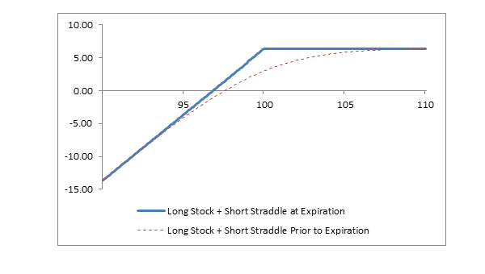

## Table of Contents

## What is a covered straddle in options trading?

A covered straddle in options trading is when an investor sells both a call option and a put option on the same stock at the same strike price and expiration date, while also owning the underlying stock. This strategy is called "covered" because the investor already owns the stock, which can help cover the potential obligations from selling the options.

The main goal of a covered straddle is to earn income from the premiums received from selling the options. However, it's a risky strategy because the investor can lose money if the stock price moves significantly in either direction. If the stock price goes up a lot, the call option could be exercised, forcing the investor to sell the stock at a lower price than the market. If the stock price goes down a lot, the put option could be exercised, forcing the investor to buy more stock at a higher price than the market.

## How does a covered straddle differ from a regular straddle?

A covered straddle and a regular straddle are both options trading strategies, but they have a key difference. In a regular straddle, an investor buys both a call option and a put option at the same strike price and expiration date on the same stock. The goal is to profit from big moves in the stock price, either up or down. The investor hopes that the stock will move enough to cover the cost of the options and make a profit.

In contrast, a covered straddle involves selling both a call and a put option at the same strike price and expiration date, while also owning the underlying stock. This strategy is called "covered" because the stock ownership helps cover the potential obligations from selling the options. The main aim here is to earn income from the premiums received from selling the options. However, it's riskier because the investor can lose money if the stock price moves a lot in either direction.

## What are the components of a covered straddle?

A covered straddle is made up of three main parts. First, you own the stock. This means you have shares of the company in your account. Second, you sell a call option on that stock. A call option gives someone else the right to buy your stock at a certain price before a certain date. Third, you also sell a put option on the same stock. A put option gives someone else the right to sell you the stock at that same price before the same date.

The key thing about a covered straddle is that the call and put options have the same price and end date. This is important because it means you are betting that the stock will not move too much in either direction. If it stays close to the price you set, you can keep the money you got from selling the options. But if the stock moves a lot, you could lose money because you might have to buy or sell the stock at a bad price.

## What is the purpose of using a covered straddle strategy?

The main reason people use a covered straddle strategy is to make money from the fees they get when they sell the options. When you sell a call and a put option on a stock you already own, you get to keep the money people pay you for those options. If the stock price stays pretty close to the price you set for the options, the options will expire without anyone using them, and you get to keep all that money.

However, this strategy can be risky. If the stock price goes up a lot, the person who bought the call option might want to use it to buy your stock at a lower price than it's worth now. This means you miss out on the higher price the stock could have sold for. If the stock price drops a lot, the person who bought the put option might want to use it to sell you the stock at a higher price than it's worth now. This means you have to buy more stock at a price that's too high. So, while you can make money from the fees, you also take on the risk that the stock might move a lot in either direction.

## What are the risks associated with a covered straddle?

The main risk with a covered straddle is that the stock price can move a lot in either direction. If the stock price goes up a lot, the person who bought the call option might use it to buy your stock at a lower price than it's worth now. This means you miss out on selling your stock at the higher price it could have fetched. On the other hand, if the stock price drops a lot, the person who bought the put option might use it to sell you more stock at a higher price than it's worth now. This means you have to buy more stock at a price that's too high, which can lead to losses.

Another risk is that the stock might not move enough to cover the costs if things go wrong. Even though you get money from selling the options, if the stock price moves just enough to make one of the options worth using, you could lose more money than you made from the fees. Also, if the stock is very unpredictable, it's hard to guess how it will move, making the strategy even riskier. So, while you can make money from the fees, the potential for big losses if the stock moves a lot is a big risk to think about.

## Can you explain the potential profit and loss scenarios of a covered straddle?

When you use a covered straddle, you hope to make money from the fees you get when you sell the call and put options. If the stock price stays close to the price you set for the options, neither option will be used, and you get to keep all the money from selling the options. This is the best-case scenario where you make a profit equal to the total premiums you received.

However, there are also ways you could lose money. If the stock price goes up a lot, the person who bought the call option might use it to buy your stock at a lower price than it's worth now. This means you miss out on selling your stock at the higher price it could have fetched, which could lead to a loss if the stock price increase is bigger than the money you made from selling the options. On the other hand, if the stock price drops a lot, the person who bought the put option might use it to sell you more stock at a higher price than it's worth now. This means you have to buy more stock at a price that's too high, leading to a loss if the stock price drop is bigger than the money you made from selling the options.

In summary, the potential profit comes from keeping the premiums if the stock price stays stable. The potential loss comes from the stock moving a lot in either direction, causing you to either miss out on a higher selling price or be forced to buy more stock at a higher price than it's worth.

## How do market conditions affect the performance of a covered straddle?

Market conditions can have a big impact on how well a covered straddle works. If the market is calm and the stock price stays close to the price you set for your options, you are likely to make money. This is because neither the call nor the put option will be used, and you get to keep all the money from selling the options. So, a stable market is good for a covered straddle because it lets you keep the premiums without having to deal with big stock price changes.

But if the market is very up and down, a covered straddle can be risky. If the stock price goes up a lot, the person who bought the call option might use it to buy your stock at a lower price than it's worth now. This means you miss out on selling your stock at the higher price it could have fetched. If the stock price drops a lot, the person who bought the put option might use it to sell you more stock at a higher price than it's worth now. This means you have to buy more stock at a price that's too high. So, a volatile market can lead to losses if the stock moves too much in either direction.

## What are the key considerations before implementing a covered straddle?

Before you decide to use a covered straddle, you should think about how much the stock might move. If the stock price stays close to where you set the options, you can make money from the fees you get when you sell the options. But if the stock price moves a lot, either up or down, you could lose money. So, you need to look at how the stock has moved in the past and think about what might happen in the future. If the stock is usually calm, a covered straddle might be a good choice. But if the stock is very up and down, it might be too risky.

Another thing to consider is how much money you can lose. When you sell a call option, you might have to sell your stock at a lower price than it's worth if the stock goes up a lot. And when you sell a put option, you might have to buy more stock at a higher price than it's worth if the stock goes down a lot. So, you need to make sure you can handle these losses if things don't go your way. Also, think about the money you get from selling the options. This money can help cover some of your losses, but it won't always be enough if the stock moves a lot.

## How does volatility impact a covered straddle strategy?

Volatility, which means how much a stock's price goes up and down, really affects a covered straddle. If the stock price stays calm and doesn't move much, you can make money from the fees you get when you sell the call and put options. This is because nobody will use the options if the stock price stays close to the price you set, and you get to keep all that money. So, low volatility is good for a covered straddle because it means you can keep the money you made from selling the options without having to worry about big changes in the stock price.

But if the stock is very up and down, a covered straddle can be risky. High volatility means the stock price can move a lot in either direction. If it goes up a lot, the person who bought the call option might use it to buy your stock at a lower price than it's worth now. This means you miss out on selling your stock at the higher price it could have fetched. If the stock price drops a lot, the person who bought the put option might use it to sell you more stock at a higher price than it's worth now. This means you have to buy more stock at a price that's too high. So, high volatility can lead to losses if the stock moves too much in either direction.

## Can you provide a step-by-step example of setting up a covered straddle?

Let's say you own 100 shares of XYZ Company, and the stock price is $50 per share. You decide to set up a covered straddle to earn some extra money from the options. First, you sell a call option on your XYZ stock with a strike price of $50 and an expiration date one month from now. You get paid a premium of $2 per share for selling the call option, so you receive $200 (100 shares x $2). Next, you sell a put option on the same XYZ stock with the same strike price of $50 and the same expiration date. You get paid another premium of $2 per share for selling the put option, so you receive another $200 (100 shares x $2). In total, you have received $400 from selling the call and put options.

Now, you wait to see what happens with the stock price over the next month. If the stock price stays close to $50, neither the call nor the put option will be used, and you get to keep the entire $400 you made from selling the options. This is the best-case scenario. But if the stock price goes up a lot, say to $60, the person who bought the call option might use it to buy your stock at $50 per share. You would have to sell your stock at $50, missing out on the higher price of $60, but you still keep the $400 you made from selling the options. If the stock price drops a lot, say to $40, the person who bought the put option might use it to sell you more stock at $50 per share. You would have to buy more stock at $50, which is higher than the current price of $40, but you still keep the $400 you made from selling the options. In both cases, the $400 can help cover some of your losses, but you need to be ready for the stock to move a lot in either direction.

## What are some advanced techniques to optimize a covered straddle?

One way to make a covered straddle work better is to pick the right strike price and expiration date for your options. If you think the stock will stay calm, you can choose a strike price that's close to the current price. This way, you get more money from selling the options because they're more likely to be used. But if you think the stock might move a bit, you can choose a strike price that's a little further away from the current price. This might give you less money upfront, but it also lowers your risk if the stock moves more than you expected. Also, choosing a shorter expiration date can mean more money from the options, but it also means less time for the stock to move in your favor.

Another technique is to keep an eye on the stock and be ready to make changes. If the stock starts to move a lot, you might want to buy back the options you sold to stop your losses from getting bigger. This costs money, but it can save you from even bigger losses if the stock keeps moving. You can also use stop-loss orders to automatically sell your stock if it drops too much, which can help limit how much money you could lose. By being active and ready to adjust your strategy, you can better handle the risks of a covered straddle and maybe make more money from it.

## How do tax implications affect the returns from a covered straddle?

Tax rules can change how much money you keep from a covered straddle. When you sell options, the money you get is usually seen as regular income and taxed at your normal tax rate. If you have to buy or sell stock because someone uses the options, any money you make or lose from the stock is treated as a capital gain or loss. This can be taxed differently, depending on how long you held the stock. If you held the stock for less than a year, it's a short-term capital gain or loss, which is taxed at your regular income tax rate. If you held it for more than a year, it's a long-term capital gain or loss, which usually has a lower tax rate.

Because of these tax rules, you need to think about how they might affect your returns. The money you make from selling the options might be taxed at a higher rate than any gains from the stock if you held it long enough. Also, if you have to buy or sell stock at a bad price because of the options, the losses can help lower your taxes. But you need to keep good records and maybe talk to a tax expert to make sure you're doing everything right and not paying more taxes than you need to.

## What is a Case Study on Using Covered Straddle in Algo Trading?

A covered straddle strategy can benefit significantly from algorithmic trading tools, offering a systematic approach to constructing and executing options trades with precision. This section presents a hypothetical example to illustrate how these trades can be implemented using algorithmic trading. 

### Constructing a Covered Straddle

In a covered straddle, an investor holds a position in the underlying asset and writes both a call and a put option with the same strike price and expiration date. Let's assume an investor owns 100 shares of Company ABC, currently trading at $50 per share.

#### Options Configuration:
- **Call Option**: Strike Price = $50, Premium = $3
- **Put Option**: Strike Price = $50, Premium = $4

### Implementation Using Algorithmic Trading

To implement this strategy algorithmically, we utilize a trading algorithm that monitors the market and executes trades when pre-defined conditions are met. The algorithm is programmed as follows:

```python
import ccxt
import time

exchange = ccxt.binance()  # Example using Binance API
exchange.apiKey = 'YOUR_API_KEY'
exchange.secret = 'YOUR_SECRET_KEY'

def fetch_market_price(symbol):
    try:
        ticker = exchange.fetch_ticker(symbol)
        return ticker['last']
    except Exception as e:
        print(f"Error fetching market price: {e}")

def execute_covered_straddle(symbol):
    market_price = fetch_market_price(symbol)

    # Checking if the market price is near the strike price
    if 49 <= market_price <= 51:
        try:
            # Writing (selling) call and put options
            exchange.create_limit_sell_order(symbol + "-CALL", 1, 3)  # Sell Call Option at $3
            exchange.create_limit_sell_order(symbol + "-PUT", 1, 4)   # Sell Put Option at $4

            # Log the executed orders
            print(f"Covered straddle executed at market price: {market_price}")

        except Exception as e:
            print(f"Error executing orders: {e}")

def main():
    symbol = 'ABC/USDT'

    while True:
        execute_covered_straddle(symbol)
        time.sleep(60)  # Run the algorithm every minute

if __name__ == "__main__":
    main()
```

### Analyzing Market Scenarios

#### Stable Market
Assume the stock price remains at $50 at option expiration. The investor retains the collected premiums:

$$
\text{Total Premium Collected} = \$3 + \$4 = \$7
$$

No options are exercised, resulting in a profit of $7 per option contract, excluding transaction costs.

#### Bullish Market
If the stock rises to $55, the call option is exercised. The investor sells the stock at $50 but gains from the premium:

$$
\text{Profit from Call Option} = \$3 - (\$55 - \$50) = -\$2
$$

The put option expires worthless, resulting in a net loss when combined:

$$
\text{Net Profit/Loss} = (\$3 - \$5) + \$4 = \$2
$$

#### Bearish Market
If the stock falls to $45, the put option is exercised. The investor buys additional shares at $50 but benefits from the premium:

$$
\text{Loss on Put Option} = \$4 - (\$50 - \$45) = -\$1
$$

The call option expires worthless, yielding:

$$
\text{Net Profit/Loss} = (\$4 - \$5) + \$3 = \$2
$$

### Adjustments and Considerations

Algorithmic adjustments can be made to better respond to market signals such as volatility spikes or trend reversals. Altering strike prices, premiums, or rebalancing exposure based on algorithmic analyses can optimize the strategy further. Moreover, employing [machine learning](/wiki/machine-learning) models for predictive insights is a potential enhancement.

In summary, using algorithmic trading frameworks for a covered straddle strategy can improve efficiency, execution speed, and the ability to dynamically adjust to varied market conditions, potentially maximizing profitability while managing risks effectively.

## References & Further Reading

[1]: Hull, J. C. (2017). ["Options, Futures, and Other Derivatives"](https://www.semanticscholar.org/paper/Options%2C-Futures%2C-and-Other-Derivatives-Hull/89bdee500c8623864fc9eb7a471546aa713acc44) (9th ed.). Pearson.

[2]: Wilmott, P. (2006). ["Paul Wilmott Introduces Quantitative Finance"](https://www.amazon.com/Paul-Wilmott-Quantitative-Finance-Set/dp/0470018704). Wiley.

[3]: Chan, E. P. (2009). ["Quantitative Trading: How to Build Your Own Algorithmic Trading Business"](https://github.com/ftvision/quant_trading_echan_book). Wiley.

[4]: Lopez de Prado, M. (2018). ["Advances in Financial Machine Learning"](https://www.amazon.com/Advances-Financial-Machine-Learning-Marcos/dp/1119482089). Wiley.

[5]: Jansen, S. (2020). ["Machine Learning for Algorithmic Trading: Second Edition"](https://www.amazon.com/Machine-Learning-Algorithmic-Trading-alternative/dp/1839217715). Packt Publishing.

[6]: Aronson, D. (2007). ["Evidence-Based Technical Analysis: Applying the Scientific Method and Statistical Inference to Trading Signals"](https://www.amazon.com/Evidence-Based-Technical-Analysis-Scientific-Statistical/dp/0470008741). Wiley.