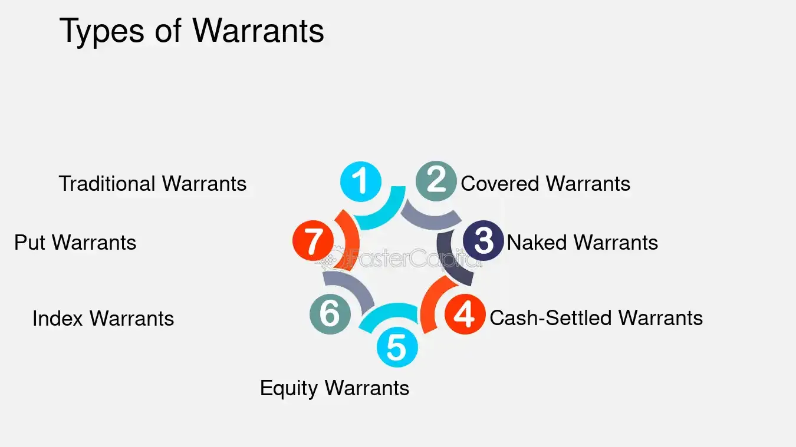

## Table of Contents

## What is a covered warrant?

A covered warrant is a type of financial product that gives you the right, but not the obligation, to buy or sell an asset at a specific price before a certain date. The asset could be a stock, a currency, or an index. Covered warrants are called "covered" because the issuer of the warrant, usually a bank or financial institution, holds the underlying asset or has a way to get it. This makes the warrant safer for the issuer.

These warrants are popular because they can be used to make money from small movements in the price of the asset. For example, if you think the price of a stock will go up, you can buy a covered warrant that allows you to buy the stock at a lower price. If the stock price does go up, you can make a profit by exercising the warrant. However, if the stock price doesn't move as expected, you could lose the money you spent on the warrant.

## How does a covered warrant differ from a regular warrant?

A covered warrant and a regular warrant are both financial tools that give you the right to buy or sell an asset at a set price before a certain date. The main difference is in how they are backed. A covered warrant is backed by the issuer, usually a bank, who either owns the underlying asset or has a way to get it. This makes it safer for the issuer because they can fulfill the terms of the warrant if it is exercised. On the other hand, a regular warrant, often issued by a company, is not backed in the same way. It's more like a promise from the company that they will give you the asset if you exercise the warrant.

Another difference is where you can trade them. Covered warrants are usually traded on stock exchanges, making them easy to buy and sell. Regular warrants, however, might not be traded on an exchange and could be harder to buy and sell. Both types of warrants can be used to make money from small changes in the price of an asset, but the safety and ease of trading covered warrants make them a popular choice for many investors.

## What are the basic components of a covered warrant?

A covered warrant has a few basic parts that you need to know about. First, there's the underlying asset. This is the stock, currency, or index that the warrant is based on. Next, there's the strike price, which is the price at which you can buy or sell the asset if you use the warrant. The expiration date is also important. This is the last day you can use the warrant. If you don't use it by then, it becomes worthless.

Another part of a covered warrant is the type, which can be either a call warrant or a put warrant. A call warrant lets you buy the asset, while a put warrant lets you sell it. The price of the warrant itself is also something to consider. This is what you pay to get the warrant, and it can change based on how the underlying asset is doing. These parts all work together to make the covered warrant a useful tool for investors who want to make money from changes in asset prices.

## How does the mechanism of a covered warrant work?

When you buy a covered warrant, you're getting the right to buy or sell an asset at a set price before a certain date. The asset could be a stock, a currency, or an index. The price at which you can buy or sell the asset is called the strike price, and the last day you can use the warrant is the expiration date. If you think the price of the asset will go up, you can buy a call warrant, which lets you buy the asset at the strike price. If you think the price will go down, you can buy a put warrant, which lets you sell the asset at the strike price.

The issuer of the covered warrant, usually a bank, makes sure they can give you the asset if you use the warrant. They do this by either owning the asset or having a way to get it. This makes the warrant safer for the issuer. The price of the warrant can change based on how the underlying asset is doing. If you decide to use the warrant, you can make a profit if the asset's price has moved in the direction you expected. But if the price doesn't move as you hoped, you could lose the money you spent on the warrant.

## What are the types of covered warrants available?

Covered warrants come in two main types: call warrants and put warrants. A call warrant gives you the right to buy the underlying asset at a set price before a certain date. This can be useful if you think the price of the asset will go up. If it does, you can buy the asset at the lower strike price and then sell it at the higher market price, making a profit. On the other hand, a put warrant gives you the right to sell the underlying asset at a set price before a certain date. This can be helpful if you think the price of the asset will go down. If it does, you can buy the asset at the lower market price and then sell it at the higher strike price, also making a profit.

There are also covered warrants that can be settled in different ways. Some are settled in cash, which means if you use the warrant, you get the difference between the market price and the strike price in cash instead of getting the actual asset. Others are settled by delivery, which means you get the actual asset if you use the warrant. The choice between cash-settled and delivery-settled warrants depends on what you want to do with the asset and how you want to manage your investment.

## What are the key risks associated with investing in covered warrants?

Investing in covered warrants can be risky. One big risk is that you can lose all the money you put into them. If the price of the asset doesn't move the way you thought it would by the expiration date, the warrant becomes worthless. This means you lose the money you spent on the warrant. Another risk is that covered warrants can be very volatile. Their prices can go up and down a lot in a short time, which can be scary if you're not used to it.

There's also the risk of leverage. Covered warrants let you control a big amount of an asset with a small amount of money. This can make your gains bigger, but it can also make your losses bigger. If the price of the asset moves against you, you can lose more money than you would with a regular investment. Finally, there's the risk of not understanding how covered warrants work. If you don't know what you're doing, you might make bad choices and lose money. It's important to learn about covered warrants before you start investing in them.

## How can covered warrants be used in investment strategies?

Covered warrants can be used in different ways to help you make money from your investments. One way is to use them to guess which way the price of an asset will go. If you think the price will go up, you can buy a call warrant. This lets you buy the asset at a lower price if you're right, and then you can sell it at the higher price to make a profit. If you think the price will go down, you can buy a put warrant. This lets you sell the asset at a higher price if you're right, and then you can buy it back at the lower price to make a profit. Using covered warrants this way can help you make money even if the price of the asset doesn't move a lot.

Another way to use covered warrants is to protect your other investments. If you own a stock and you're worried that its price might go down, you can buy a put warrant for that stock. This acts like insurance, because if the stock's price does go down, you can use the put warrant to sell it at a higher price and lose less money. Covered warrants can also be used to make money from big events that might affect the price of an asset, like a company's earnings report or a big news event. By using covered warrants in these ways, you can try to make money or protect your money, but remember that there are risks involved too.

## What is the process of issuing and trading covered warrants?

Covered warrants are issued by financial institutions, usually banks. The process starts when the bank decides to create a covered warrant based on an asset like a stock, currency, or index. The bank makes sure they can give the asset to the buyer if the warrant is used. They do this by either owning the asset or having a way to get it. Once the bank has everything ready, they set the terms of the warrant, like the strike price and the expiration date. Then, they offer the warrant for sale on a stock exchange, where investors can buy and sell them.

Trading covered warrants happens on stock exchanges, just like trading stocks. Investors can buy and sell these warrants during trading hours. The price of the warrant can change based on how the underlying asset is doing. If an investor wants to use the warrant, they can do so before the expiration date. If they don't use it by then, the warrant becomes worthless. Trading covered warrants can be a way for investors to make money from small changes in the price of an asset, but it can also be risky because the price of the warrant can go up and down a lot.

## How do the pricing and valuation of covered warrants work?

The price of a covered warrant is based on a few things, like how the underlying asset is doing, how much time is left until the warrant expires, and how much the market expects the asset's price to move around. If the underlying asset's price goes up, the price of a call warrant usually goes up too. If the asset's price goes down, the price of a put warrant usually goes up. The more time left until the warrant expires, the more valuable it can be, because there's more time for the asset's price to move in the right direction. The market's guess about how much the asset's price will move around, called [volatility](/wiki/volatility-trading-strategies), also affects the warrant's price. If the market thinks the asset's price will move around a lot, the warrant's price can be higher.

To figure out the value of a covered warrant, people often use a math formula called the Black-Scholes model. This model looks at the current price of the underlying asset, the strike price, how much time is left until the warrant expires, the expected volatility of the asset's price, and the [interest rate](/wiki/interest-rate-trading-strategies). By putting these numbers into the formula, you can get an idea of what the warrant should be worth. But remember, the actual price of the warrant on the stock exchange can be different from this value because of things like how many people want to buy or sell the warrant, and what they think will happen in the future.

## Can you explain the role of the issuer in covered warrants?

The issuer of a covered warrant, usually a bank, is very important. They make the warrant and decide what it will be based on, like a stock, currency, or index. They also set the rules for the warrant, like the price at which you can buy or sell the asset and when the warrant will stop working. The issuer makes sure they can give you the asset if you decide to use the warrant. They do this by either owning the asset or having a way to get it. This makes the warrant safer for the issuer because they can always fulfill the promise they made when they sold the warrant.

When the issuer puts the warrant on the stock exchange, they let investors buy and sell it. The issuer keeps an eye on the warrant and makes sure everything goes smoothly. If an investor uses the warrant, the issuer has to give them the asset or the money they're owed, depending on how the warrant is set up. The issuer also makes money from selling the warrant, but they take on some risk too. If a lot of people use their warrants at the same time, the issuer has to be ready to give out a lot of assets or money. This is why they plan carefully to make sure they can handle it.

## What are some real-world examples of covered warrants?

In the real world, covered warrants are often used by investors who want to make money from small changes in the price of assets. For example, let's say you think the price of a stock like Apple will go up in the next few months. You can buy a call warrant for Apple stock from a bank like Goldman Sachs. If the stock price does go up, you can use the warrant to buy Apple stock at a lower price than it's trading at now, and then sell it at the higher price to make a profit. But if the stock price doesn't go up, you lose the money you spent on the warrant.

Another example is if you own a stock and you're worried its price might go down. Let's say you own shares in Tesla and you're worried about a big drop in its price. You can buy a put warrant for Tesla stock from a bank like Bank of America. If the stock price does go down, you can use the put warrant to sell your Tesla shares at a higher price than they're trading at now, which helps you lose less money. But if the stock price stays the same or goes up, you lose the money you spent on the put warrant. These examples show how covered warrants can be used to make money or protect your investments, but they also show that there's always a risk involved.

## How do regulatory frameworks affect the use of covered warrants?

Regulatory frameworks play a big role in how covered warrants are used. These rules are made by governments and financial watchdogs to make sure that covered warrants are safe for everyone who uses them. They set out what banks and other issuers have to do when they make and sell covered warrants. For example, they might need to tell investors about the risks of buying a warrant and make sure they have enough of the asset to give out if people use their warrants. These rules can also say where and how covered warrants can be traded, like only on certain stock exchanges.

The rules can also affect how much people want to use covered warrants. If the rules are too strict, it might be harder for banks to make and sell them, and fewer people might want to buy them. On the other hand, if the rules are not strict enough, it could be riskier for investors because they might not be as protected. So, the right balance of rules can help make covered warrants a useful tool for investors who want to make money or protect their investments, while also keeping everyone safe.

## References & Further Reading

### List of Credible Sources

1. **Books**
   - Hull, J. C. (2022). *Options, Futures, and Other Derivatives*. This seminal book provides a comprehensive overview of derivatives and offers deep insights into options and covered warrants.
   - Haug, E. G. (2007). *The Complete Guide to Option Pricing Formulas*. It includes detailed explanations and formulas that are essential for understanding both options and covered warrants.

2. **Articles and Journals**
   - Black, F., & Scholes, M. (1973). "The Pricing of Options and Corporate Liabilities." *Journal of Political Economy*. This classic paper introduces the Black-Scholes model, a cornerstone in pricing options and covered warrants.
   - Avellaneda, M., & Stoikov, S. (2008). "High-frequency trading in a limit order book."

3. **Online Resources**
   - Investopedia. "Covered Warrants Explained." This article serves as an introductory guide to covered warrants, explaining their basic features and differences from options. [Investopedia Link](https://www.investopedia.com)
   - QuantInsti Blog. "What is Algorithmic Trading? Rules and Tools." An accessible resource for those looking to understand the basics of algorithmic trading. [QuantInsti Link](https://www.quantinsti.com)

4. **Regulatory Guidelines**
   - International Organization of Securities Commissions (IOSCO) reports on covered warrants provide guidelines and regulatory frameworks useful for investors.

### Additional Resources for Advanced Learning and Strategy Development

1. **Advanced Courses**
   - Coursera - "Financial Engineering and Risk Management": Offers deeper insights into derivatives including warrants.
   - edX - "Algorithmic Trading and Machine Learning": A course focusing on algorithmic trading strategies applicable to covered warrants.

2. **Research Papers**
   - Bertsimas, D., & Lo, A. W. (1998). "Optimal control of execution costs." This paper describes strategies particularly beneficial for algorithmic trading of covered warrants.

3. **Online Platforms**
   - QuantConnect: A popular platform for developing and backtesting algorithmic trading strategies. Offers tutorials and community support.
   - Interactive Brokers: Provides advanced tools for implementing algorithmic trading strategies with real-world market data.

These resources offer valuable information and practical tools for those interested in mastering covered warrants and enhancing their [algorithmic trading](/wiki/algorithmic-trading) strategies.

