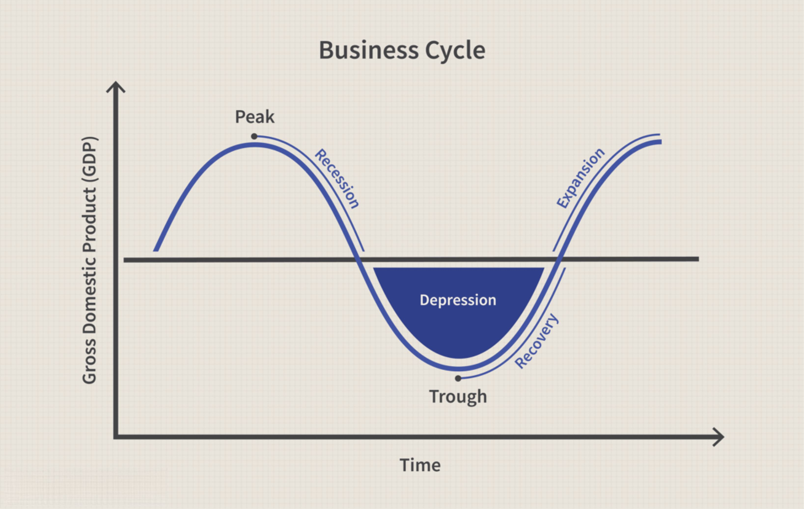

Investment strategy, financial analysis, and algorithmic trading are fundamental tools for successfully navigating market fluctuations. As global markets experience rebounds, investors encounter both challenges and opportunities. Market rebounds are characterized by significant price recoveries following downturns, often resulting in volatility that can be both rewarding and risky. To navigate this complex environment, a well-rounded understanding of market analysis is crucial.

Integrating financial analysis with algorithmic trading strategies can significantly improve investment outcomes during market rebounds. Financial analysis provides insights into market trends, identifying potential price movements and valuations that might indicate a recovery. This is achieved through tools like fundamental analysis, which considers metrics such as price-to-earnings ratios and dividend yields, and technical analysis, which examines historical price patterns and volume data to predict future trends.



Algorithmic trading introduces a level of precision and speed that human traders cannot match. It involves using computer algorithms to execute trades based on pre-defined criteria, minimizing human bias and error. Techniques such as trend following, arbitrage, and mean reversion can leverage temporary market inefficiencies to generate profits. Algorithmic trading can quickly adapt to the rapid changes typical of market rebounds, executing trades with accuracy and consistency.

This article aims to explore how combining these elements can enhance investment strategies in rebounding markets. We will cover various aspects of market analysis and discuss innovative algorithmic trading techniques. This comprehensive approach allows investors to capture opportunities and manage risks effectively, ensuring they remain competitive in fast-changing market environments.

## Table of Contents

## Understanding Market Rebound

A market rebound refers to the recovery phase following a downturn or correction, marking a return to previous or higher levels of economic activity and market prices. Recognizing the signs and stages of a market rebound is critical for making timely investments and capitalizing on emerging opportunities. Historical data provide valuable insights into these recovery phases, helping investors predict future rebounds.

One of the primary signs of a market rebound is a shift in investor sentiment. This shift is often captured by financial indices that track market performance, such as the S&P 500 or the Dow Jones Industrial Average. When these indicators start to consistently move upwards after a period of decline, it could signal the beginning of a rebound. Analysts typically look for a consistent improvement over a range of trading days, often confirmed by increased trading volumes, which suggest renewed investor confidence.

Key indicators that signal a market's potential to rebound include economic factors such as GDP growth rates, unemployment [statistics](/wiki/bayesian-statistics), and consumer confidence indices. An upturn in these metrics usually precedes market recoveries, as they reflect improved economic conditions and increased consumer and business activity. Additionally, monitoring sector-specific performance can provide further clarity, as some sectors may recover faster than others depending on the nature of the initial downturn.

Distinguishing between temporary price corrections and genuine market recoveries is vital for making sound investment decisions. Temporary corrections are typically characterized by short-term price [volatility](/wiki/volatility-trading-strategies) that may not affect the market's long-term trend. In contrast, a genuine market recovery implies sustainable growth and improved economic fundamentals. Investors can utilize technical analysis tools, such as moving averages and Relative Strength Index (RSI), to differentiate between these scenarios. A simple moving average (SMA), for instance, smooths price data over a specific period and can highlight upward trends, while the RSI helps to identify overbought or oversold conditions, indicating potential reversals.

To further elucidate the understanding of market rebounds, consider a Python example to analyze moving averages as a tool for detecting trends:

```python
import pandas as pd

# Sample data of a hypothetical market index
data = {'Date': ['2023-01-01', '2023-01-02', '2023-01-03', '2023-01-04', '2023-01-05'],
        'Close': [100, 102, 101, 103, 105]}

# Creating a DataFrame
df = pd.DataFrame(data)

# Calculate 3-day moving average
df['SMA_3'] = df['Close'].rolling(window=3).mean()

# Display the DataFrame
print(df)
```

This example demonstrates how to calculate a simple moving average, which helps investors identify upward trends indicative of a potential market rebound. Recognizing and correctly interpreting these signs and signals can aid investors in making informed decisions, ultimately allowing them to leverage the opportunities that market rebounds present.

## Investment Strategy in a Rebounding Market

Investment strategies during a market rebound emphasize the need for dynamism and flexibility in response to fluctuating market conditions. One critical aspect of safeguarding portfolios during such periods is diversification. Diversification involves spreading investments across various asset classes, geographic regions, and sectors to mitigate risks associated with market volatility. A well-diversified portfolio reduces the impact of any single asset's poor performance on the overall portfolio, thereby enhancing stability and potential returns.

Tactical asset allocation (TAA) strategies are particularly effective during market rebounds. TAA involves adjusting the asset allocation mix in response to changing market conditions to exploit short-term opportunities while maintaining a long-term investment perspective. This strategy requires understanding macroeconomic indicators, market trends, and investor sentiment to re-balance portfolio assets judiciously, ensuring alignment with prevailing market dynamics.

For instance, during a market rebound, investors might temporarily increase their exposure to equities that are expected to perform well, such as cyclical stocks, while reducing holdings in defensive stocks. This approach leverages the growth [momentum](/wiki/momentum) of recovering sectors. Conversely, during uncertain rebounds, increasing exposure to fixed-income securities might provide a hedge against potential downsides. 

Staying informed and adaptable is imperative in investment planning, especially in a rebounding market. Modern investors can utilize technology to stay abreast of real-time financial news, data analyses, and economic forecasts. Platforms offering market insights and tools for portfolio analysis can facilitate informed decision-making. Furthermore, adapting investment strategies to incorporate new information and market changes can significantly enhance performance. Regularly reviewing and adjusting the asset allocation based on updated market conditions and economic outlooks is essential for optimizing portfolio returns during a market rebound.

## Financial Analysis Techniques

Financial analysis is a crucial component of making informed investment decisions, especially during market rebounds. By evaluating market trends, investors can identify promising opportunities and strategically position their portfolios to capitalize on these conditions.

### Fundamental Analysis Tools

Fundamental analysis involves assessing a company's financial health and intrinsic value to determine its market position. Key tools in [fundamental analysis](/wiki/fundamental-analysis) include the Price-to-Earnings (P/E) ratio and dividend yields:

- **P/E Ratio**: This ratio is calculated as the market value per share divided by the earnings per share (EPS). It provides insights into how much investors are willing to pay for each dollar of earnings, helping identify under or overvalued stocks. A lower P/E may suggest a stock is undervalued, while a higher P/E could indicate overvaluation.
$$
  \text{P/E Ratio} = \frac{\text{Market Value per Share}}{\text{Earnings per Share (EPS)}}

$$

- **Dividend Yields**: Calculated as the annual dividend per share divided by the stock's price per share, dividend yields offer an understanding of the return on investment for dividend-paying stocks. A high dividend yield might signify a lucrative investment opportunity, especially if the dividends are sustainable.
$$
  \text{Dividend Yield} = \frac{\text{Annual Dividends per Share}}{\text{Price per Share}}

$$

These tools can signal a market's position by indicating whether stocks are priced appropriately relative to their earnings and dividends, which is particularly useful in determining investment viability during a market rebound.

### Technical Analysis for Price Movements

Technical analysis involves examining historical price movements and trading volumes to predict future market behavior. Key technical indicators include moving averages and the Relative Strength Index (RSI):

- **Moving Averages**: These smooth out price data to identify trends by filtering out short-term fluctuations. Common moving averages include the simple moving average (SMA) and the exponential moving average (EMA). For instance, the crossing of a short-term moving average above a longer-term moving average is often a bullish signal, indicating a potential rebound.

- **Relative Strength Index (RSI)**: The RSI measures the speed and change of price movements, oscillating between 0 and 100. An RSI above 70 typically suggests a stock is overbought, while below 30 indicates it may be oversold. These thresholds can help determine optimal entry and exit points during market rebounds.

By leveraging these tools, investors can devise strategies to predict price trends and make timely investments as markets recover.

### Case Studies on Successful Applications

Historically, financial analysis has been integral in capitalizing on market rebounds. One notable example is the recovery phase after the 2008 financial crisis, where investors who employed comprehensive financial analysis tools effectively navigated the market upturn.

- **P/E Ratios and Dividend Yields Usage**: During the post-2008 rebound, investors identified undervalued stocks with low P/E ratios and stable, high dividend yields, resulting in significant portfolio gains.

- **Technical Analysis Application**: In the same period, investors successfully utilized moving averages and RSI to time their entries and exits, maximizing returns as the market recovered.

These case studies underscore the significance of combining fundamental and technical analysis for informed decision-making during market rebounds. By applying these strategies, investors can optimize their approaches and potentially achieve superior investment outcomes in fluctuating markets.

## Algorithmic Trading for Market Rebound

Algorithmic trading plays a crucial role in enhancing efficiency and accuracy when navigating volatile market conditions, such as during a market rebound. It involves using computer algorithms to execute trades based on pre-defined criteria, helping investors capitalize on short-lived market opportunities without the influence of emotional biases.

### Overview of Popular Algorithmic Trading Strategies

**Trend Following**: This strategy aims to capture profits through the analysis of an asset's momentum in a particular direction. Algorithms identify upward or downward trends by assessing data such as moving averages and trading volume. Once a trend is detected, the algorithm executes trades that align with the direction of the trend, maintaining the position until indicators suggest a reversal.

**Arbitrage**: Arbitrage is a low-risk strategy that exploits price discrepancies of a single asset across different markets or identical assets in the same market. Algorithms rapidly identify these inconsistencies and execute simultaneous buy and sell orders to capitalize on the price differences before they naturally correct, effectively capturing the "spread" as profit.

**Mean Reversion**: This strategy is based on the assumption that asset prices temporarily deviate from their historical average but will revert to their mean over time. Algorithms implementing this strategy identify opportunities when the price of an asset deviates considerably from its average and execute trades accordingly, betting on the price reverting to the mean.

### Implementing Algorithmic Strategies for Market Rebounds

Effectively leveraging algorithmic strategies during market rebounds requires fine-tuning algorithms to adapt swiftly to changing market dynamics. An implementation might involve:

1. **Data Collection and Analysis**: Gathering large datasets of historical prices, market sentiment, and macroeconomic indicators. This data is crucial for training algorithms to detect patterns that precede market rebounds.

2. **Model Development and Testing**: Creating trading models using programming languages like Python. Libraries such as Pandas, NumPy, and scikit-learn facilitate data manipulation and statistical analysis. Backtesting these models against historical data ensures their robustness in identifying profitable trades during rebounds.

3. **Automation and Execution**: Deploying the models on trading platforms that support automated trading. These platforms continuously scan the market for signals specified by the strategies and execute trades automatically, minimizing the delay and maximizing the response to market conditions.

### Impact of Removing Emotional Bias from Trading

One of the significant advantages of [algorithmic trading](/wiki/algorithmic-trading) is its ability to eliminate emotional bias in trading decisions. Human traders often fall prey to fear and greed, which can lead to inconsistent decision-making, particularly in volatile markets. Automated systems, however, execute trades based strictly on predefined criteria, ensuring a disciplined approach that adheres to the established strategy. By doing so, algorithmic trading can enhance overall market efficiency and increase the likelihood of achieving consistent investment outcomes.

In summary, utilizing algorithmic trading during market rebounds offers a structured and disciplined approach, capable of executing trades with speed and precision that manual methods cannot match. These strategies not only improve the potential of capturing transient market opportunities but also help maintain a rational investment process free of emotional interference.

## Risks and Considerations

Investing during market rebounds can offer substantial returns, but it also carries inherent risks that must be carefully managed. One prominent risk is technology-driven trading, which introduces challenges such as over-optimization and potential technical failures. Over-optimization, often a result of excessive fine-tuning of trading algorithms based on historical data, can lead to strategies that perform well in past conditions but falter under new market dynamics. This is commonly referred to as "curve fitting," where the algorithm is tailored too closely to past data, potentially reducing its robustness in live trading environments.

Additionally, technical failures, including software glitches or internet connectivity issues, can disrupt trading processes, leading to significant financial losses. To mitigate these risks, investors should develop resilient risk management protocols. This includes conducting thorough [backtesting](/wiki/backtesting) across different market scenarios and stress testing strategies to evaluate their performance under extreme conditions. Moreover, maintaining a diversified portfolio of algorithms, each optimized for different market phases, can reduce reliance on a single strategy.

Continuous monitoring and optimization of trading algorithms are crucial in responding to ever-changing market conditions. Regular performance evaluations help identify inefficiencies, allowing for timely adjustments to the trading models. Implementing adaptive algorithms, which learn and adjust in real-time, can also enhance resilience. These algorithms incorporate [machine learning](/wiki/machine-learning) techniques to refine their decision-making processes based on new data inputs, thus improving their accuracy and effectiveness.

Regulatory considerations are increasingly important in algorithmic trading. Market regulators globally are focused on ensuring that trading algorithms are deployed ethically and transparently. Traders must comply with regulations that govern market manipulation, insider trading, and the fair treatment of market participants. Algorithm developers should also implement robust logging and oversight mechanisms to track algorithm performance and ensure compliance.

Ethical deployment of algorithms extends beyond regulatory compliance. It involves designing algorithms that do not exploit market inefficiencies to the detriment of broader market stability. Ethical considerations should guide the development and deployment of trading algorithms, ensuring that they contribute positively to market [liquidity](/wiki/liquidity-risk-premium) and efficiency.

In conclusion, while market rebounds present attractive investment opportunities, they require careful consideration of the associated risks. Employing robust risk management, continuous optimization of trading strategies, and adherence to regulatory and ethical standards are essential to successfully navigating these volatile market phases.

## Conclusion

Combining thorough financial analysis with advanced algorithmic trading strategies offers compelling advantages in rebounding markets. This integrative approach allows investors to systematically analyze market data, assess risks, and execute optimized trades with precision. A comprehensive understanding of financial metrics such as price-to-earnings ratios, dividend yields, and historical performance indicators equips investors with the tools to identify lucrative opportunities and mitigate potential pitfalls.

Algorithmic trading enhances this strategy by minimizing human error and emotional bias, which are often detrimental in volatile markets. By implementing automated systems, traders can efficiently capitalize on trend shifts and execute trades swiftly in response to real-time data. This automation fosters disciplined investment practices that are crucial during periods of market rebound, where rapid changes can be both challenging and rewarding.

Investors are encouraged to integrate these insights into their strategies for potential gains. Through a rigorous blend of analysis and technology, they can make informed decisions that align with both immediate market conditions and long-term objectives. This dynamic strategy provides a robust framework for portfolio management, leveraging both traditional financial principles and cutting-edge technological tools.

Staying flexible and continually learning is key to thriving in dynamic market environments. As financial landscapes evolve, so too should investment methodologies. Continuous education and adaptation not only enhance an investor’s ability to navigate market rebounds but also position them to seize emerging opportunities, ultimately fostering sustainable success in the ever-changing world of trading and investment.

## References & Further Reading

[1]: Bergstra, J., Bardenet, R., Bengio, Y., & Kégl, B. (2011). ["Algorithms for Hyper-Parameter Optimization."](https://dl.acm.org/doi/10.5555/2986459.2986743) Advances in Neural Information Processing Systems 24.

[2]: ["Advances in Financial Machine Learning"](https://www.amazon.com/Advances-Financial-Machine-Learning-Marcos/dp/1119482089) by Marcos Lopez de Prado

[3]: ["Evidence-Based Technical Analysis: Applying the Scientific Method and Statistical Inference to Trading Signals"](https://www.amazon.com/Evidence-Based-Technical-Analysis-Scientific-Statistical/dp/0470008741) by David Aronson

[4]: ["Machine Learning for Algorithmic Trading"](https://github.com/stefan-jansen/machine-learning-for-trading) by Stefan Jansen

[5]: ["Quantitative Trading: How to Build Your Own Algorithmic Trading Business"](https://www.amazon.com/Quantitative-Trading-Build-Algorithmic-Business/dp/1119800064) by Ernest P. Chan