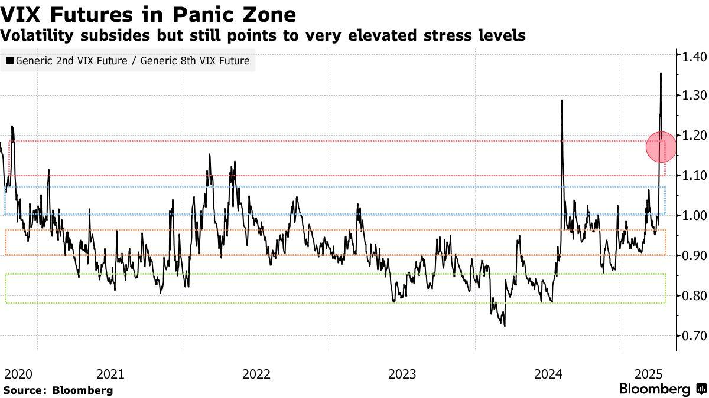

## Table of Contents

## What is a market rebound?

A market rebound is when the prices of stocks or other investments start to go up again after they have been going down. It's like when a ball bounces back up after it hits the ground. This can happen for many reasons, like good news about the economy or a company doing better than expected. When investors see these signs, they might feel more confident and start buying again, which pushes the prices up.

Sometimes, a market rebound can be quick and strong, making people feel like the market is recovering fast. Other times, it might be slower and more gradual. It's important for investors to understand that rebounds can be tricky. They might not last, and the market could start falling again. That's why it's a good idea to keep an eye on the bigger picture and not just focus on short-term changes.

## What causes a market rebound?

A market rebound happens when the prices of stocks or other investments start to go up after they've been going down. This can be caused by many things. One big reason is good news about the economy. For example, if the government says that more people are getting jobs or that businesses are doing better, investors might feel more confident. When they feel good about the future, they start buying more stocks, which makes the prices go up.

Another reason for a market rebound can be good news about specific companies. If a company says it made more money than people thought it would, or if it announces a new product that everyone wants, its stock price might go up. This can make the whole market feel better, and other stocks might start going up too. Sometimes, even things like lower interest rates from the government can help, because it makes borrowing money cheaper, which can help businesses grow and make investors feel more positive.

Market rebounds can also be influenced by what investors are feeling. If everyone is feeling scared and selling their stocks, the market goes down. But if something changes and people start feeling hopeful again, they might start buying, and that can cause a rebound. It's like a big group of people all deciding to be less worried at the same time. This can happen quickly, making the market bounce back fast, or it can be slow and steady.

## How can I identify the early signs of a market rebound?

To spot the early signs of a market rebound, you need to keep an eye on a few things. First, look at the news about the economy. If you hear that more people are getting jobs or that businesses are doing better, that's a good sign. Also, pay attention to what companies are saying. If a big company announces good news, like making more money than expected or launching a new product, it might mean the market is starting to go up again.

Another thing to watch is how investors are feeling. You can tell this by looking at things like stock market indexes, which show how the overall market is doing. If these indexes start to go up after being down for a while, it could mean people are feeling more hopeful. Also, if you see more people buying stocks instead of selling them, that's another sign that a rebound might be starting. It's all about noticing these little changes and putting them together to see the bigger picture.

## What are the key indicators to watch during a market rebound?

When the market starts to go up again after going down, there are some important things to watch. One key thing is the economic news. If you hear that more people are getting jobs or that businesses are doing better, that's a good sign. Also, pay attention to what big companies are saying. If they announce good news, like making more money than expected or launching a new product, it might mean the market is starting to go up again.

Another thing to keep an eye on is how investors are feeling. You can see this by looking at stock market indexes, which show how the overall market is doing. If these indexes start to go up after being down for a while, it could mean people are feeling more hopeful. Also, if you see more people buying stocks instead of selling them, that's another sign that a rebound might be happening. It's all about noticing these little changes and putting them together to see the bigger picture.

## How should I adjust my investment strategy during a market rebound?

During a market rebound, it's a good idea to think about what you want from your investments. If you see that the market is starting to go up again, you might want to buy more stocks. But don't just buy anything. Look for companies that are doing well and have a good future ahead of them. It's also important to keep some of your money in safe places, like savings accounts or bonds, so you're not putting all your eggs in one basket.

Another thing to think about is how long you plan to keep your money invested. If you're planning to use your money soon, you might not want to take too many risks. But if you're saving for something far in the future, like retirement, you might be okay with a bit more risk because you have time to recover if the market goes down again. Just remember to keep checking your investments and be ready to change your plan if things start to look different.

## What are the common pitfalls to avoid when investing in a rebounding market?

When the market starts to go up again, it can be exciting, but there are some common mistakes to watch out for. One big mistake is getting too excited and buying a lot of stocks without thinking. It's easy to think that the market will keep going up forever, but that's not always true. If you buy too much at once, you could lose a lot of money if the market goes down again. It's better to take your time and think about which stocks are really good investments.

Another mistake is not paying attention to your overall plan. When the market is going up, it's important to remember why you're investing in the first place. Are you saving for something in the future, like a house or retirement? If so, don't let the excitement of a rebounding market make you forget your goals. Stick to your plan and don't take too many risks just because the market is doing well right now. Keep some of your money in safe places, like savings accounts or bonds, so you're not putting all your money into the stock market.

## How do different asset classes perform during a market rebound?

During a market rebound, different types of investments, or asset classes, can act in different ways. Stocks often do really well when the market starts going up again. This is because people feel more confident and start buying stocks, which pushes the prices up. But not all stocks are the same. Stocks of big companies that everyone knows about, like tech or big businesses, might go up faster than smaller companies because more people want to buy them.

Bonds, which are like loans you give to a company or the government, might not go up as much as stocks during a rebound. Bonds are usually safer, so they don't move as much when the market goes up or down. But if interest rates go down, bonds can become more valuable because they pay the same amount of interest but it's worth more compared to new bonds with lower rates. 

Other types of investments, like real estate or commodities like gold, can also change during a market rebound. Real estate might go up if people feel more confident and start buying homes again. Gold, on the other hand, might not go up as much because people often buy it when they're worried about the market, not when they're feeling good about it. Each type of investment has its own way of reacting to a market rebound, so it's important to think about what you want from your investments and how much risk you're okay with.

## What role do economic policies play in a market rebound?

Economic policies can have a big impact on whether the market goes up again after going down. When the government or central banks make changes to things like interest rates or taxes, it can help the market rebound. For example, if the central bank lowers interest rates, it makes borrowing money cheaper. This can help businesses grow because they can borrow money to expand or hire more people. When businesses do well, it makes investors feel more confident, and they start buying more stocks, which helps the market go up.

Another way economic policies can help is through things like tax cuts or spending more on public projects. If the government gives people more money to spend by cutting taxes, or if it spends more on things like roads and schools, it can make the economy grow faster. When the economy is doing well, people feel better about the future and are more likely to invest in the stock market. This can lead to a market rebound as more people buy stocks, pushing the prices up. So, the right economic policies can really help the market start going up again.

## How can historical data be used to predict market rebounds?

Historical data can help us guess when the market might go up again by looking at what happened before. When we study past market rebounds, we can see patterns and signs that often happen before the market starts to go up. For example, if we notice that the market usually goes up after the government lowers interest rates or after good news about jobs, we can watch for these things now. By looking at how long past rebounds lasted and what made them happen, we can make better guesses about when the next rebound might start.

But, using historical data to predict market rebounds is not perfect. The past doesn't always tell us exactly what will happen in the future because the world changes. New things can happen that we haven't seen before, like new laws or big world events. So, while historical data can give us clues and help us make smarter guesses, it's important to also pay attention to what's happening right now in the world and the economy. Using both historical data and current information can help us make the best predictions about market rebounds.

## What advanced technical analysis tools are useful for tracking a market rebound?

When trying to track a market rebound, one useful tool is the Moving Average Convergence Divergence (MACD). This tool helps you see when the market might start going up again by showing you the difference between two moving averages of a stock's price. If the MACD line crosses above the signal line, it's often a sign that the market is starting to go up. Another helpful tool is the Relative Strength Index (RSI). The RSI tells you if a stock is overbought or oversold. If the RSI is below 30, it means the stock might be a good buy because it's been going down a lot and could start going up soon.

Another tool that can be useful is the Bollinger Bands. These bands show the high and low points of a stock's price over time. When the price of a stock gets close to the lower band, it might be a good time to buy because the stock could start going up again. Also, chart patterns like the "double bottom" can be a sign of a market rebound. A double bottom happens when the price of a stock goes down to a certain point twice before starting to go up again. By using these tools together, you can get a better idea of when the market might start to rebound.

## How do global economic factors influence the timing and strength of a market rebound?

Global economic factors can really change when and how strong a market rebound will be. If big countries like the United States or China are doing well, it can make investors feel more confident. When these countries have good news, like more people getting jobs or businesses making more money, it can help the whole world's markets start to go up again. Also, if there's good news about trade between countries, like new agreements that make it easier to buy and sell things, it can help the market rebound faster and stronger.

On the other hand, if there are problems in big economies, it can slow down or weaken a market rebound. For example, if there's a big financial crisis in Europe or if China's economy is slowing down, it can make investors worried and less likely to buy stocks. Things like high debts in countries, wars, or big changes in oil prices can also make the market more unsure and affect how fast and strong the rebound will be. So, what's happening around the world can make a big difference in how the market bounces back.

## What are the long-term implications of investing during a market rebound?

Investing during a market rebound can have good long-term effects if you do it the right way. When the market starts going up again, it can be a great time to buy stocks because they might keep going up for a while. If you pick good companies to invest in and hold onto your investments for a long time, you could see your money grow a lot. It's like buying a ticket to a ride that's just starting to go up. But, it's important to remember that not all rebounds last forever, so you should still be careful and not put all your money into the market at once. Spreading your money out over time can help you buy more stocks if the market goes down again before going up even more.

On the other hand, there can be some risks too. If you get too excited and buy a lot of stocks without thinking, you might lose money if the market goes down again. It's important to keep some of your money in safe places, like savings accounts or bonds, so you're not putting all your eggs in one basket. Also, if you need your money soon, like for buying a house or paying for school, you might not want to take big risks because the market can be unpredictable. But if you're saving for something far in the future, like retirement, a market rebound can be a good chance to grow your money over time. Just make sure you have a plan and stick to it, even when the market is going up and down.

## What are Financial Analysis Techniques?

Financial analysis is a crucial component of making informed investment decisions, especially during market rebounds. By evaluating market trends, investors can identify promising opportunities and strategically position their portfolios to capitalize on these conditions.

### Fundamental Analysis Tools

Fundamental analysis involves assessing a company's financial health and intrinsic value to determine its market position. Key tools in [fundamental analysis](/wiki/fundamental-analysis) include the Price-to-Earnings (P/E) ratio and dividend yields:

- **P/E Ratio**: This ratio is calculated as the market value per share divided by the earnings per share (EPS). It provides insights into how much investors are willing to pay for each dollar of earnings, helping identify under or overvalued stocks. A lower P/E may suggest a stock is undervalued, while a higher P/E could indicate overvaluation.
$$
  \text{P/E Ratio} = \frac{\text{Market Value per Share}}{\text{Earnings per Share (EPS)}}

$$

- **Dividend Yields**: Calculated as the annual dividend per share divided by the stock's price per share, dividend yields offer an understanding of the return on investment for dividend-paying stocks. A high dividend yield might signify a lucrative investment opportunity, especially if the dividends are sustainable.
$$
  \text{Dividend Yield} = \frac{\text{Annual Dividends per Share}}{\text{Price per Share}}

$$

These tools can signal a market's position by indicating whether stocks are priced appropriately relative to their earnings and dividends, which is particularly useful in determining investment viability during a market rebound.

### Technical Analysis for Price Movements

Technical analysis involves examining historical price movements and trading volumes to predict future market behavior. Key technical indicators include moving averages and the Relative Strength Index (RSI):

- **Moving Averages**: These smooth out price data to identify trends by filtering out short-term fluctuations. Common moving averages include the simple moving average (SMA) and the exponential moving average (EMA). For instance, the crossing of a short-term moving average above a longer-term moving average is often a bullish signal, indicating a potential rebound.

- **Relative Strength Index (RSI)**: The RSI measures the speed and change of price movements, oscillating between 0 and 100. An RSI above 70 typically suggests a stock is overbought, while below 30 indicates it may be oversold. These thresholds can help determine optimal entry and exit points during market rebounds.

By leveraging these tools, investors can devise strategies to predict price trends and make timely investments as markets recover.

### Case Studies on Successful Applications

Historically, financial analysis has been integral in capitalizing on market rebounds. One notable example is the recovery phase after the 2008 financial crisis, where investors who employed comprehensive financial analysis tools effectively navigated the market upturn.

- **P/E Ratios and Dividend Yields Usage**: During the post-2008 rebound, investors identified undervalued stocks with low P/E ratios and stable, high dividend yields, resulting in significant portfolio gains.

- **Technical Analysis Application**: In the same period, investors successfully utilized moving averages and RSI to time their entries and exits, maximizing returns as the market recovered.

These case studies underscore the significance of combining fundamental and technical analysis for informed decision-making during market rebounds. By applying these strategies, investors can optimize their approaches and potentially achieve superior investment outcomes in fluctuating markets.

## References & Further Reading

[1]: Bergstra, J., Bardenet, R., Bengio, Y., & Kégl, B. (2011). ["Algorithms for Hyper-Parameter Optimization."](https://dl.acm.org/doi/10.5555/2986459.2986743) Advances in Neural Information Processing Systems 24.

[2]: ["Advances in Financial Machine Learning"](https://www.amazon.com/Advances-Financial-Machine-Learning-Marcos/dp/1119482089) by Marcos Lopez de Prado

[3]: ["Evidence-Based Technical Analysis: Applying the Scientific Method and Statistical Inference to Trading Signals"](https://www.amazon.com/Evidence-Based-Technical-Analysis-Scientific-Statistical/dp/0470008741) by David Aronson

[4]: ["Machine Learning for Algorithmic Trading"](https://github.com/stefan-jansen/machine-learning-for-trading) by Stefan Jansen

[5]: ["Quantitative Trading: How to Build Your Own Algorithmic Trading Business"](https://www.amazon.com/Quantitative-Trading-Build-Algorithmic-Business/dp/1119800064) by Ernest P. Chan