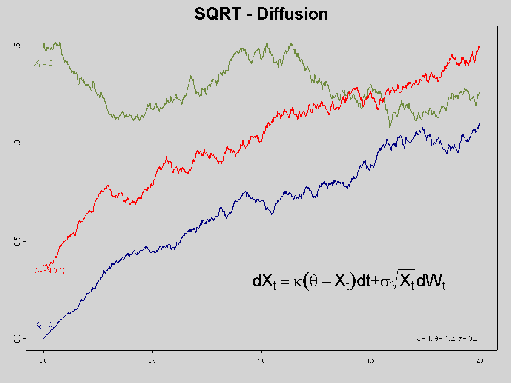

## Table of Contents

## What is the Cox-Ingersoll-Ross (CIR) model?

The Cox-Ingersoll-Ross (CIR) model is a mathematical formula used to predict how interest rates might change over time. It was created by John C. Cox, Jonathan E. Ingersoll, and Stephen A. Ross in 1985. This model is popular because it helps people who work with money, like bankers and investors, to make better guesses about future interest rates. The CIR model says that interest rates move in a way that is not too wild but also not too predictable, which is a bit like how interest rates actually behave in real life.

In the CIR model, interest rates are influenced by two main things: a long-term average rate that they tend to move towards, and random changes that can push them up or down. The model uses a special kind of math called stochastic calculus to describe these movements. One cool thing about the CIR model is that it makes sure interest rates will never go below zero, which makes sense because you can't have a negative interest rate in most real-world situations. This feature makes the CIR model very useful for financial planning and risk management.

## Who developed the Cox-Ingersoll-Ross model and when was it introduced?

The Cox-Ingersoll-Ross model, often called the CIR model, was developed by three people: John C. Cox, Jonathan E. Ingersoll, and Stephen A. Ross. These three researchers worked together to create this model.

They introduced the CIR model to the world in 1985. It was a big deal because it helped people predict how interest rates might change in the future, which is really important for anyone working with money.

## What are the main assumptions of the CIR model?

The CIR model makes a few key guesses about how interest rates work. First, it assumes that interest rates tend to move towards a long-term average rate over time. This means if the current [interest rate](/wiki/interest-rate-trading-strategies) is higher than the average, it will likely go down, and if it's lower, it will likely go up. This pull towards the average is like a rubber band effect, gently guiding the interest rate back to its normal level.

Another important guess is that interest rates can also change randomly. These random changes are what make the model more realistic because real interest rates don't follow a perfect pattern. The CIR model uses a special kind of math to describe these random changes, making sure they are not too big or too small. It's like adding a bit of unpredictability to the model to match what we see in real life.

Lastly, the CIR model assumes that interest rates will never drop below zero. This makes sense because in the real world, you can't have a negative interest rate in most situations. This feature helps people who use the model to plan and manage risks without worrying about impossible scenarios.

## How does the CIR model differ from other interest rate models like the Vasicek model?

The CIR model and the Vasicek model both try to guess how interest rates will change over time, but they do it in slightly different ways. The Vasicek model, which was created before the CIR model, assumes that interest rates move around a long-term average rate, kind of like a rubber band pulling them back to the center. But the Vasicek model allows for the possibility that interest rates could go negative, which doesn't make sense in real life because you can't have a negative interest rate in most situations. This is a big difference because the CIR model makes sure interest rates stay above zero, which makes it more realistic and useful for financial planning.

Another difference is how the two models handle the random changes in interest rates. Both models include random movements, but the CIR model uses a special type of math to make sure these changes aren't too big or too small. This means the CIR model predicts interest rate movements that are more likely to happen in real life. The Vasicek model, on the other hand, uses a simpler way to describe random changes, which can lead to more extreme movements in interest rates. So, while the Vasicek model is easier to work with mathematically, the CIR model is often seen as more accurate and practical for real-world use.

## What is the mathematical formulation of the CIR model?

The CIR model uses a special equation to describe how interest rates change over time. The equation says that the change in the interest rate (let's call it r) depends on two things: a pull towards a long-term average rate (let's call it θ) and some random changes. The pull towards the average rate is controlled by a speed parameter (let's call it κ), which decides how fast the interest rate moves back to the average. The random changes are described by a term that includes a volatility parameter (let's call it σ) and a random variable (often called a Wiener process, or W). The equation looks like this: dr = κ(θ - r)dt + σ√r dW. This means the interest rate changes a little bit at a time (dt), pulled towards θ by κ, and also gets nudged randomly by σ√r dW.

One cool thing about the CIR model is that it makes sure the interest rate stays positive. This is because of the σ√r part in the equation. When the interest rate (r) is very small, the random changes (σ√r dW) also become very small, which stops the interest rate from going negative. This is different from other models like the Vasicek model, which can let interest rates drop below zero. The CIR model's way of handling random changes also makes the interest rate movements more realistic, because it keeps them from getting too wild. This makes the CIR model really useful for people who need to predict and plan with interest rates in the real world.

## How is the CIR model used in practice, such as in pricing bonds or interest rate derivatives?

The CIR model is often used to help people figure out the prices of bonds and interest rate derivatives. When someone wants to know the price of a bond, they need to predict what interest rates will do in the future. The CIR model helps with this by giving a way to guess how interest rates might change over time. For example, if you're trying to price a bond that pays interest every year, you can use the CIR model to estimate the interest rates for each year until the bond matures. This helps you figure out how much the bond is worth today.

For interest rate derivatives like options on bonds or interest rate swaps, the CIR model is also very useful. These financial products depend a lot on what interest rates will do in the future. The CIR model helps traders and investors predict these rates, which is important for deciding if they should buy or sell these derivatives. By using the CIR model, they can calculate the fair price of these products and manage the risks that come with changes in interest rates. This makes the CIR model a key tool in the world of finance.

## What are the advantages of using the CIR model over simpler interest rate models?

The CIR model has some big advantages over simpler interest rate models like the Vasicek model. One of the biggest advantages is that the CIR model makes sure interest rates never go below zero. This is really important because in the real world, you can't have a negative interest rate in most situations. Simpler models might let interest rates drop into negative territory, which doesn't make sense and can mess up financial planning. The CIR model's way of keeping rates positive makes it more realistic and useful for people who need to predict future interest rates accurately.

Another advantage of the CIR model is how it handles the random changes in interest rates. The CIR model uses a special kind of math that keeps these changes from getting too wild. This means the model's predictions about interest rates are more likely to match what actually happens in real life. Simpler models might not control these random changes as well, which can lead to predictions that are too extreme. By giving more realistic predictions, the CIR model helps people make better decisions about things like buying bonds or managing interest rate risks.

## What are the limitations or criticisms of the CIR model?

Even though the CIR model is really useful, it's not perfect and has some limitations. One big problem is that it assumes interest rates move towards a single long-term average. In real life, this average can change over time, but the CIR model doesn't account for that. Also, the model thinks the random changes in interest rates are the same no matter what the current rate is, which isn't always true. Sometimes, interest rates can be more unpredictable when they are very high or very low, and the CIR model doesn't capture this well.

Another criticism of the CIR model is that it can be tricky to use in practice. The math behind it is pretty complex, which means it can be hard for people to work with, especially if they don't have a strong math background. This complexity can make it challenging to fit the model to real data and to use it for making quick decisions in the financial world. Despite these limitations, the CIR model is still very popular and widely used because it does a good job of keeping interest rates positive and predicting realistic movements.

## Can you explain the concept of mean reversion in the context of the CIR model?

Mean reversion is a big idea in the CIR model. It means that interest rates tend to move back to a normal, long-term average rate over time. Imagine you have a rubber band that you stretch out. When you let go, the rubber band pulls back towards its original shape. In the CIR model, if the interest rate is higher than the average, it will slowly move back down towards that average. If it's lower, it will move back up. This pull towards the average is called mean reversion.

The CIR model uses a special number called the speed of mean reversion to decide how fast the interest rate moves back to the average. If this number is big, the interest rate will snap back to the average quickly, like a tight rubber band. If it's small, the interest rate will take its time, like a loose rubber band. This idea of mean reversion helps the CIR model predict interest rates in a way that makes sense in the real world, where rates often seem to hover around a certain level over time.

## How does the CIR model handle the risk of negative interest rates?

The CIR model is really good at making sure interest rates never go below zero. This is important because in real life, you can't have a negative interest rate in most situations. The CIR model does this by using a special part in its math formula. When the interest rate gets very small, the random changes that can push the rate up or down also get very small. This stops the interest rate from dropping into negative territory, which is a big advantage over simpler models that might let rates go below zero.

This feature of the CIR model makes it more realistic and useful for people who need to predict future interest rates. If you're trying to figure out the price of a bond or decide whether to buy an interest rate derivative, you don't want to worry about impossible scenarios like negative rates. The CIR model's way of keeping rates positive helps people plan and manage risks better, which is why it's so popular in the world of finance.

## What are some empirical studies that have tested the validity of the CIR model?

Many researchers have looked at the CIR model to see if it works well in the real world. One study by Chan, Karolyi, Longstaff, and Sanders in 1992 compared the CIR model to other interest rate models. They used data on U.S. interest rates to see which model fit the data best. They found that the CIR model did a good job, but it wasn't perfect. It showed that interest rates tend to move back to a long-term average, just like the model says, but the random changes in rates were sometimes bigger than the model expected.

Another important study was done by Ait-Sahalia in 1996. He used a different way to test the CIR model, looking at how well it could predict future interest rates. Ait-Sahalia found that the CIR model was pretty good at keeping interest rates positive, which is a big plus. But he also noticed that the model sometimes struggled to capture the full range of how interest rates can change. This means the CIR model is useful, but it might need some tweaks to be even better at predicting what happens in real life.

## How can the CIR model be extended or modified for more advanced applications?

The CIR model can be made better by adding more details to it. One way to do this is by letting the long-term average rate change over time instead of staying the same. This makes the model more realistic because in real life, what people think of as a normal interest rate can change. Another way to improve the CIR model is by making the random changes in interest rates depend on the current rate. This means the model can show that interest rates might be more unpredictable when they are very high or very low, which is something we see in the real world.

These changes can make the CIR model more useful for things like pricing very complex financial products or managing risks in a more detailed way. For example, if you're trying to price a bond that has payments that change based on interest rates, a more advanced version of the CIR model can give you a better guess about what those payments will be. By making the model more flexible and realistic, it can help people in finance make better decisions and plan for the future more accurately.

## What is the CIR Model: An Overview?

The Cox-Ingersoll-Ross (CIR) model is defined by a specific stochastic differential equation (SDE) representing the dynamics of short-term interest rates. The SDE for the CIR model is given by:

$$
dr_t = a(b - r_t)dt + \sigma \sqrt{r_t} dW_t
$$

where:
- $r_t$ is the short-term interest rate at time $t$.
- $a$ is the speed of adjustment, dictating how quickly the interest rate reverts to the mean.
- $b$ is the long-term mean level to which the interest rate reverts.
- $\sigma$ is the volatility of the interest rate.
- $dW_t$ is a Wiener process or Brownian motion.

A key feature of the CIR model is its mean reversion property. This mechanism ensures that the interest rate tends to move back towards a long-term average level, $b$, over time. The parameter $a$ influences the speed at which this reversion occurs; a higher value of $a$ results in faster mean reversion.

Another significant aspect of the CIR model is its treatment of [volatility](/wiki/volatility-trading-strategies). The volatility term $\sigma \sqrt{r_t}$ ensures that volatility is proportional to the square root of the interest rate. This prevents negative interest rates due to the square root term, which becomes undefined for negative values, thus creating a natural barrier. This characteristic is crucial for accurately representing real-world interest rates, which are typically non-negative.

The mathematical structure of the CIR model thus provides a robust framework for capturing the stochastic behavior of interest rates, ensuring both mean-reversion and a volatility-dependent barrier against negative rates. This makes it an essential tool for modeling interest rate dynamics in financial applications.

## How does the CIR Model work for bond pricing?

Under the no-[arbitrage](/wiki/arbitrage) framework, the Cox-Ingersoll-Ross (CIR) model is pivotal in bond pricing, particularly for zero-coupon bonds. The model adopts an exponential affine form, where bond prices are represented as an exponential function of interest rate dynamics. This characteristic ensures that bond pricing aligns with the observed interest rate environment, while avoiding arbitrage opportunities in the market.

In the CIR model, the pricing of zero-coupon bonds relies on the relationship between bond prices and the short-term interest rate. The price $P(t, T)$ of a zero-coupon bond at time $t$, maturing at time $T$, is given by:

$$
P(t, T) = A(t, T) \cdot e^{-B(t, T) \cdot r(t)}
$$

Here, $r(t)$ denotes the short-term interest rate at time $t$, while $A(t, T)$ and $B(t, T)$ are deterministic functions derived from the model parameters—speed of adjustment ($a$), long-term mean ($b$), and volatility ($\sigma$)—and the time to maturity $T-t$. The function $B(t, T)$ generally decreases over the bond's lifespan, reflecting the mean-reverting nature of interest rates in the CIR framework.

The term structure of interest rates, or yield curve, is a critical outcome of the CIR model's application in bond pricing. The yield to maturity $Y(t, T)$ for a zero-coupon bond can be expressed as:

$$
Y(t, T) = -\frac{\ln P(t, T)}{T-t}
$$

This formula enables the calculation of yields across different maturities, providing crucial insights for fixed-income investors on bond valuations and portfolio management. The bond yield curve, informed by the CIR model, assists investors in assessing expected changes in interest rates and corresponding impacts on bond returns.

The CIR model's ability to adapt to various interest rate structures and generate reliable predictions of bond prices and yields reaffirms its utility in finance. By capturing the essential dynamics of interest rate movements, the model provides a robust foundation for pricing and risk management in fixed-income securities.

## References & Further Reading

[1]: Cox, J. C., Ingersoll, J. E., & Ross, S. A. (1985). ["A Theory of the Term Structure of Interest Rates."](https://pages.stern.nyu.edu/~dbackus/BCZ/discrete_time/CIR_Econometrica_85.pdf) Econometrica, 53(2), 385-407.

[2]: Filipović, D. (2009). ["Term-Structure Models: A Graduate Course."](https://link.springer.com/book/10.1007/978-3-540-68015-4) Springer.

[3]: Brigo, D., & Mercurio, F. (2007). ["Interest Rate Models - Theory and Practice: With Smile, Inflation, and Credit."](https://link.springer.com/book/10.1007/978-3-540-34604-3) Springer Finance.

[4]: Giesecke, K. (2006). ["Credit Risk Modeling and Valuation: An Introduction."](https://papers.ssrn.com/sol3/papers.cfm?abstract_id=479323) Oxford University Press.

[5]: Lamberton, D., & Lapeyre, B. (2008). ["Introduction to Stochastic Calculus Applied to Finance."](https://www.taylorfrancis.com/books/mono/10.1201/9781420009941/introduction-stochastic-calculus-applied-finance-bernard-lapeyre-damien-lamberton) Chapman and Hall/CRC.

[6]: Glasserman, P. (2003). ["Monte Carlo Methods in Financial Engineering."](https://link.springer.com/book/10.1007/978-0-387-21617-1) Springer.