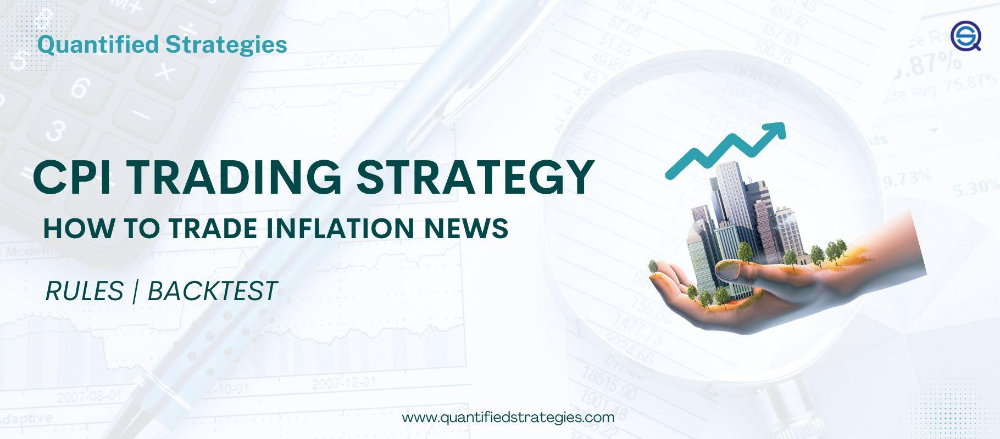

## Table of Contents

## What is the Consumer Price Index (CPI)?

The Consumer Price Index, or CPI, is a measure that shows how the prices of things people buy change over time. It looks at the cost of a basket of goods and services, like food, clothes, and rent, that a typical family might buy. If the CPI goes up, it means prices are going up and things are getting more expensive. This is called inflation. The CPI helps people understand how much more they need to spend to keep the same lifestyle.

Governments and economists use the CPI to make important decisions. For example, it helps them set interest rates and plan economic policies. It's also used to adjust wages and retirement benefits so they keep up with inflation. If the CPI is too high, it can mean trouble for the economy, as people might not be able to afford what they need. On the other hand, if the CPI is too low, it might mean the economy isn't growing as it should.

## How does the CPI influence trading strategies?

The CPI can affect how people trade in the stock market or with currencies. When the CPI goes up, it means inflation is increasing, and this can make traders worried. They might think that the central bank will raise interest rates to slow down inflation. Higher interest rates can make borrowing more expensive, which can slow down the economy and affect stock prices. So, traders might sell stocks or buy things that do well when interest rates go up, like certain bonds.

On the other hand, if the CPI stays low or goes down, traders might think the economy is not growing fast enough. This could lead them to believe that the central bank will keep interest rates low or even lower them to help the economy grow. Low interest rates can make borrowing cheaper, which can help businesses grow and increase stock prices. So, traders might buy more stocks or invest in things that do well when interest rates are low.

Understanding the CPI helps traders make better guesses about what the central bank might do next. This can help them decide when to buy or sell, and what kinds of investments to make. By keeping an eye on the CPI, traders can adjust their strategies to try and make money no matter what the economy is doing.

## What are the key components of the CPI?

The CPI is made up of different things that people buy every day. These things are grouped into categories like food and drinks, housing, clothes, transportation, medical care, entertainment, and education. Each category is given a weight, which means some things are more important than others when figuring out the CPI. For example, if people spend a lot more money on housing than on clothes, housing will have a bigger effect on the CPI.

To calculate the CPI, people look at the prices of these things in different places and at different times. They compare the prices now to the prices from a year ago to see how much they have changed. If the prices have gone up, the CPI goes up too. This helps show if things are getting more expensive overall. By looking at the CPI, we can understand how inflation is affecting the cost of living for regular people.

## How often is the CPI released and why is the timing important for traders?

The CPI is released once a month, usually around the middle of the month. This timing is important because it gives traders new information about inflation, which can help them make decisions about buying and selling. Traders need to know if prices are going up or down so they can guess what the central bank might do next with interest rates. If the CPI shows high inflation, traders might think the central bank will raise rates, which can affect the stock market and other investments.

The monthly release of the CPI is like a regular check-up on the economy. Traders pay close attention to these reports because they can cause big changes in the market. If the CPI numbers are different from what traders expected, it can lead to quick buying or selling, causing prices to move a lot. Knowing when the CPI comes out helps traders be ready to act fast and adjust their strategies based on the latest information about inflation.

## What is the CPI trading strategy and how does it work?

A CPI trading strategy involves using the Consumer Price Index to make decisions about buying and selling investments. Traders watch the CPI numbers to see if inflation is going up or down. If the CPI shows that prices are rising a lot, traders might think the central bank will raise interest rates to slow down inflation. This could make borrowing more expensive, which might slow down the economy and affect stock prices. So, traders might sell stocks or buy things that do well when interest rates go up, like certain bonds.

On the other hand, if the CPI shows that prices are not rising much or are even going down, traders might think the central bank will keep interest rates low or lower them to help the economy grow. Low interest rates can make borrowing cheaper, which can help businesses grow and increase stock prices. So, traders might buy more stocks or invest in things that do well when interest rates are low. By keeping an eye on the CPI, traders can adjust their strategies to try and make money no matter what the economy is doing.

## How can traders use CPI data to predict market movements?

Traders can use CPI data to predict market movements by looking at how inflation is changing. If the CPI goes up a lot, it means prices are rising quickly, and traders might think the central bank will raise interest rates to slow down inflation. Higher interest rates can make borrowing more expensive, which might slow down the economy. This could make stock prices go down, so traders might sell stocks or buy things like bonds that do well when interest rates go up. By watching the CPI, traders can guess what the central bank might do next and adjust their investments accordingly.

If the CPI stays low or goes down, it means prices are not rising much or are even falling. Traders might think the central bank will keep interest rates low or even lower them to help the economy grow. Low interest rates can make borrowing cheaper, which can help businesses grow and might push stock prices up. So, traders might buy more stocks or invest in things that do well when interest rates are low. By keeping an eye on the CPI, traders can make smart guesses about future market movements and try to make money no matter what the economy is doing.

## What are the risks associated with trading based on CPI data?

Trading based on CPI data can be risky because the numbers can be hard to predict. Sometimes, the CPI numbers come out different from what traders expected. This can cause big moves in the market as traders quickly buy or sell to adjust their investments. If the CPI goes up a lot more than expected, traders might think interest rates will go up and sell stocks, which can make stock prices drop fast. On the other hand, if the CPI is lower than expected, traders might think interest rates will stay low or go down, and they might buy more stocks, pushing prices up. These quick changes can be hard to handle and can lead to losses if traders are not ready.

Another risk is that the CPI is just one piece of the puzzle. The economy is affected by many things, not just inflation. Other reports like jobs numbers, manufacturing data, and even news events can change how the market moves. If traders focus too much on the CPI and ignore these other factors, they might miss important information that could affect their investments. Also, central banks might not always do what traders expect based on the CPI. They might have other reasons for changing interest rates, like trying to help the economy grow or keep it stable. So, relying too much on the CPI can lead to wrong guesses and losses.

## Can you explain the difference between headline CPI and core CPI, and their impact on trading?

Headline CPI and core CPI are two ways to measure inflation, but they look at different things. Headline CPI includes all the things people buy, like food and energy. These prices can change a lot from month to month because of things like bad weather or oil prices going up or down. So, headline CPI can be very up and down. On the other hand, core CPI leaves out food and energy. It looks at things like rent, clothes, and medical care, which don't change as much. Core CPI gives a smoother picture of inflation over time.

Traders use both headline and core CPI to make decisions, but they often pay more attention to core CPI. This is because core CPI can show longer-term trends in inflation, which helps traders guess what the central bank might do with interest rates. If core CPI is going up, traders might think the central bank will raise rates to slow down inflation, and they might sell stocks or buy bonds. But if headline CPI jumps a lot because of a sudden change in oil prices, traders might not worry as much because they know it might not last. So, understanding the difference between headline and core CPI helps traders make better guesses about the economy and adjust their investments.

## How do different markets (stocks, forex, commodities) react to CPI data?

When the CPI data comes out, it can shake up different markets in different ways. In the stock market, if the CPI goes up a lot, it might mean that inflation is getting higher. Traders might worry that the central bank will raise interest rates to slow down inflation. Higher interest rates can make borrowing more expensive for businesses, which can slow down the economy and make stock prices go down. So, traders might sell stocks and look for safer investments like bonds. But if the CPI stays low or goes down, traders might think interest rates will stay the same or go down, which can make borrowing cheaper and help businesses grow. This can push stock prices up as traders buy more stocks.

In the [forex](/wiki/forex-system) market, where people trade different currencies, the CPI can also cause big changes. If a country's CPI goes up a lot, it might mean that the central bank will raise interest rates. Higher interest rates can make a country's currency more attractive to investors because they can earn more from holding that currency. So, the value of that currency might go up compared to other currencies. On the other hand, if the CPI is low or goes down, traders might think the central bank will keep rates low or lower them, which can make the currency less attractive and cause its value to drop.

In the commodities market, where things like oil, gold, and food are traded, the CPI can also have a big impact. If the CPI goes up because of higher food or energy prices, it can make those commodities more expensive. Traders might buy more of these commodities because they think prices will keep going up. But if the CPI goes up because of other things, like higher rent or medical costs, it might not affect commodity prices as much. Still, if traders think inflation is going up overall, they might buy commodities like gold as a way to protect their money from losing value because of inflation.

## What technical analysis tools complement CPI trading strategies?

When traders use CPI data to make decisions, they often use technical analysis tools to help them. One common tool is the moving average, which helps traders see the general direction of a stock or currency's price over time. If the price is above the moving average, it might be a good time to buy, and if it's below, it might be a good time to sell. Another tool is the Relative Strength Index (RSI), which shows if a stock or currency is overbought or oversold. If the RSI is high, it might mean the price has gone up too fast and could go down soon. If it's low, the price might have gone down too fast and could go up soon.

Traders also use support and resistance levels to see where prices might stop going up or down. If a price keeps bouncing off a certain level, that's called support if it's below the price and resistance if it's above. Knowing these levels can help traders decide when to buy or sell. Another useful tool is the Bollinger Bands, which show how much a price is moving around. If the price is near the top of the band, it might be overbought, and if it's near the bottom, it might be oversold. By combining these technical tools with CPI data, traders can make better guesses about where prices might go next and adjust their strategies accordingly.

## How can historical CPI data be used to refine trading strategies?

Historical CPI data can help traders make better trading strategies by showing them how prices have changed over time. By looking at past CPI numbers, traders can see patterns in inflation and how the market has reacted to these changes. For example, if the CPI has gone up a lot in the past and then the central bank raised interest rates, traders can use this information to guess what might happen next time the CPI goes up. This can help them decide when to buy or sell and what kinds of investments to make.

Traders can also use historical CPI data to test their trading strategies. They can look at what would have happened if they had used their strategy in the past. If their strategy worked well with old CPI data, they might feel more confident using it now. But if it didn't work well, they can change their strategy to make it better. By using historical CPI data, traders can learn from the past and make smarter decisions about their investments.

## What advanced strategies can expert traders employ with CPI data?

Expert traders can use CPI data in more advanced ways by combining it with other economic indicators. They might look at things like employment numbers, manufacturing data, and GDP growth to get a fuller picture of the economy. For example, if the CPI is going up but employment is also going up, traders might think the economy is strong and inflation is not a big problem. They could use this information to decide to keep their investments in stocks or even buy more. On the other hand, if the CPI is going up and employment is going down, traders might worry about stagflation, where prices are rising but the economy is not growing. They might sell stocks and buy things like gold or bonds to protect their money.

Another advanced strategy is to use CPI data to trade in different markets at the same time. For example, if the CPI goes up a lot in one country, traders might buy that country's currency because they think the central bank will raise interest rates. At the same time, they might sell stocks in that country because higher interest rates could slow down the economy. They might also buy commodities like oil or gold if they think inflation will keep going up. By trading in different markets based on the same CPI data, expert traders can spread their risk and try to make money no matter what happens.

## What is the understanding of CPI and its economic impact?

The Consumer Price Index (CPI) is a critical economic indicator that conveys the average change over time in the prices paid by urban consumers for a market basket of consumer goods and services. Published by national statistical agencies, such as the Bureau of Labor Statistics (BLS) in the United States, the CPI is one of the most widely watched metrics for tracking inflation, providing valuable insights into the purchasing power of a nation’s currency.

The CPI measures inflation by calculating the percentage change in the price of a basket of goods and services. This basket typically includes categories such as housing, apparel, transportation, healthcare, and education. To quantify inflation using the CPI, the formula applied is:

$$
\text{Inflation Rate} = \left( \frac{\text{CPI in Current Period} - \text{CPI in Previous Period}}{\text{CPI in Previous Period}} \right) \times 100
$$

This formula helps to understand price changes for consumers and is instrumental in decision-making for economic policy.

CPI's influence on economic policy is profound, as it directly informs monetary policy decisions made by central banks like the Federal Reserve. A rising CPI indicates increasing inflation, prompting central banks to consider tightening monetary policy by raising interest rates to cool down the economy. Conversely, a low or negative CPI may lead to lower interest rates to stimulate economic activity. The CPI thus serves as a compass for guiding [interest rate](/wiki/interest-rate-trading-strategies) adjustments and other monetary measures.

Market sentiment is also significantly affected by CPI data. Unexpected changes in the CPI can lead to increased market [volatility](/wiki/volatility-trading-strategies). Investors closely watch CPI announcements as they are indicative of future economic conditions. For instance, a higher-than-expected CPI might lead to a sell-off in bonds due to anticipated interest rate hikes, whereas equities might experience increased volatility due to shifting profit expectations.

In summary, the Consumer Price Index is an indispensable tool for measuring inflation, shaping economic policies, and influencing market sentiment. Its role in monitoring economic stability and purchasing power underscores its importance across financial and policy-making landscapes.

## References & Further Reading

[1]: Bureau of Labor Statistics. ["Consumer Price Index."](https://www.bls.gov/cpi/) U.S. Bureau of Labor Statistics.

[2]: FRED, Federal Reserve Bank of St. Louis. ["Consumer Price Index for All Urban Consumers: All Items in U.S. City Average (CPIAUCSL)."](https://fred.stlouisfed.org/series/CPIAUCSL)

[3]: Chan, Ernest P. ["Algorithmic Trading: Winning Strategies and Their Rationale."](https://github.com/ftvision/quant_trading_echan_book) Wiley, 2013.

[4]: Chan, Ernest P. ["Quantitative Trading: How to Build Your Own Algorithmic Trading Business."](https://github.com/ftvision/quant_trading_echan_book) Wiley, 2008.

[5]: Lopez de Prado, Marcos. ["Advances in Financial Machine Learning."](https://www.amazon.com/Advances-Financial-Machine-Learning-Marcos/dp/1119482089) Wiley, 2018.

[6]: Jansen, Stefan. ["Machine Learning for Algorithmic Trading."](https://github.com/stefan-jansen/machine-learning-for-trading) Packt Publishing, 2018.