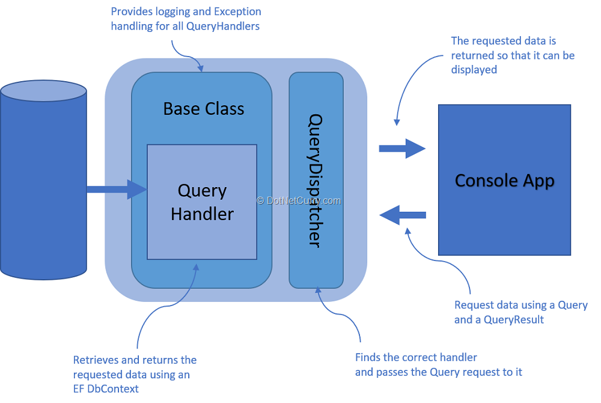

In today's financial markets, algorithmic trading, commonly referred to as algo trading, has seen a significant surge in adoption. At the forefront of this technological advancement is CQS, a firm distinguished for its sophisticated trading algorithms. The advent of electronic trading has revolutionized the processing and execution of large orders, and CQS, along with other firms, capitalizes on cutting-edge technology to optimize trading strategies and execution processes.

This article explores the integral role of CQS within the algo trading landscape, focusing on the strategies and technologies the firm employs, as well as the advantages it offers to market participants. Understanding the operations of firms like CQS is crucial not only for seasoned traders but also for those new to the market, as it provides a comprehensive understanding of modern financial market dynamics.



By examining the impact of CQS's strategic implementations and technological advances, we can gain insight into the evolving nature of algorithmic trading and appreciate how such firms contribute to the broader financial markets.

## Table of Contents

## Understanding Algorithmic Trading

Algorithmic trading is a method that employs computer algorithms to automate trading activities, including order execution and decision-making processes. This approach leverages advanced computational capabilities to execute trades based on pre-defined criteria, which can include timing, price, quantity, or any mathematical model. Such precision and automation bring several key advantages to market participants.

In today's financial markets, where trades occur at a rapid pace, algorithmic trading offers significant benefits. Speed is a crucial factor; algorithms can execute complex calculations and place orders in fractions of a second, far surpassing human capabilities. This enables traders to capitalize on even the smallest market inefficiencies before they dissipate. Algorithms also provide precision and reduce the likelihood of human error, ensuring that trading strategies are executed exactly as intended.

Another major advantage is the ability of algorithms to process and analyze vast volumes of data in real time. In a market characterized by massive and continuous information flow, quick and efficient data processing can yield insights that inform trading decisions. This capability allows traders to respond swiftly to market events, optimizing their strategies based on the latest available information.

When effectively implemented, these algorithms help traders optimize their strategies by reducing latency—the delay between the decision to trade and the actual execution of that trade. Reduced latency can significantly improve trading efficiency and effectiveness, providing traders with a critical edge in competitive markets. For instance, strategies can be fine-tuned to adapt to slight fluctuations, allowing for improved execution quality and cost control.

Firms like CQS leverage sophisticated algorithms that can swiftly react to market changes within milliseconds, securing a competitive advantage. The algorithms are not only designed for speed but also for adaptability and optimization, ensuring they remain relevant and effective as market conditions evolve. By doing so, CQS can maintain a leadership position and offer substantial value to their clients.

The subsequent sections of this article will explore more about how CQS capitalizes on these advantages, employing its proprietary algorithms and technologies to maintain its market position. Through continual refinement and technological innovation, CQS seeks to ensure their [algorithmic trading](/wiki/algorithmic-trading) strategies are not only competitive but leading the way in modern financial markets.

## CQS: A Leader in Algo Trading

CQS is recognized as a prominent player in the field of algorithmic trading, celebrated for its innovative techniques in market data analysis and order execution. The firm has established itself by providing a comprehensive range of customized trading solutions tailored to meet the unique demands of institutional investors and high-frequency traders. These solutions are not merely generic algorithms, but carefully crafted strategies that consider the complex dynamics of modern financial markets.

Key to CQS's success are its algorithms, which have been meticulously designed to minimize trading costs while maximizing execution efficiency. This is achieved through the integration of advanced mathematical models and sophisticated data analytics, allowing the firm to maintain a competitive edge in profitability. The algorithms take into account various market factors, optimizing transactions to ensure minimal price impact and reduced slippage.

Moreover, CQS furnishes its clients with cutting-edge trading tools and platforms that facilitate seamless operations. These technologies are built to enhance the market impact of trades, utilizing real-time data processing and high-frequency trading techniques to adjust swiftly to market changes. The tools provided by CQS not only streamline trading operations but also empower traders to make more informed decisions with greater confidence.

The firm's prowess in this domain is further underscored by its employment of proprietary algorithms. These algorithms, developed in-house, are based on years of research and development, ensuring they remain at the forefront of technological advancement. By leveraging these proprietary systems, CQS is able to offer distinctive solutions that set it apart from competitors in the algorithmic trading landscape.

CQS's leadership in algorithmic trading is a testament to its commitment to innovation and excellence. By combining state-of-the-art technology with expert trading strategies, the firm has carved out a unique position in the market, continually pushing the boundaries of what is possible in electronic trading.

## Technological Advancements at CQS

CQS's technological infrastructure plays a crucial role in its success in algorithmic trading. At the core of its operations are high-speed, low-latency execution engines, designed to process trades with unprecedented speed and efficiency. These engines allow CQS to execute a high [volume](/wiki/volume-trading-strategy) of trades in milliseconds, a necessity in today's competitive and rapidly changing financial markets.

To support these high-speed operations, CQS employs collocated servers and advanced data centers. Collocation places CQS's servers in close proximity to major exchanges, minimizing the physical distance that data must travel. This spatial optimization significantly reduces latency, ensuring that orders are executed with minimal delay. The advanced data centers further enhance this setup by providing robust and secure physical environments that ensure the reliability and integrity of CQS's trading activities.

CQS's algorithms are developed to include real-time market data, enabling them to quickly respond to shifts in market conditions. By continuously analyzing incoming information, these algorithms make precise and timely trading decisions, maintaining CQS’s competitive positioning. Data feeds are seamlessly integrated into the algorithms, providing a constant stream of updated information that bolsters their decision-making capabilities.

To further empower traders, CQS offers a Custom Algo Software Development Kit (SDK). This tool allows users to create tailored algorithms that fit specific trading strategies or objectives. The SDK provides a flexible and adaptable framework, enabling clients to build and test their own algorithms within CQS's existing technological infrastructure. This adaptability ensures that CQS remains responsive to individual trader needs while pushing the boundaries of technological innovation.

CQS's dedication to high-tech advancements underscores its commitment to maintaining a market edge. By focusing on speed, precision, and flexibility, CQS not only serves the needs of its clients but also sets a benchmark in the algorithmic trading industry. Through these sophisticated systems and tools, CQS epitomizes the integration of cutting-edge technology into trading operations, continually driving forward market efficiency and competitiveness.

## The Future of Algo Trading at CQS

As the financial markets continue to evolve, algorithmic trading will play an even more crucial role in trading strategies. CQS remains at the forefront of this evolution, continually refining its algorithms and execution technologies to align with market developments. The firm's commitment to staying ahead of industry trends is evidenced by its ongoing investment in cutting-edge technologies, which ensures its trading systems remain among the most advanced in the industry.

CQS is actively exploring new frontiers in [artificial intelligence](/wiki/ai-artificial-intelligence) (AI) and [machine learning](/wiki/machine-learning) (ML) to further enhance its trading strategies. By integrating these technologies, CQS can process and analyze vast amounts of market data more efficiently, identifying patterns and opportunities that may not be apparent to human traders. This capability allows CQS to develop predictive models that improve decision-making and optimize trading outcomes.

The application of AI and ML in trading algorithms enables CQS to dynamically adjust its strategies in response to changing market conditions. Machine learning models, such as [reinforcement learning](/wiki/reinforcement-learning), can adapt based on feedback from the markets, continuously improving their accuracy and effectiveness. For instance, a reinforcement learning model can be used to optimize order execution by learning the best strategies through trial and error in a simulated environment.

```python
import numpy as np

# Simple example of a reinforcement learning setup
class TradingEnv:
    def __init__(self):
        self.state = np.random.rand(10)  # Initialize state randomly

    def step(self, action):
        # Simulate a market response to the action
        reward = np.random.choice([1, -1])  # Simplified reward: +1 or -1
        next_state = np.random.rand(10)  # Transition to a new state
        return next_state, reward

# Agent using Q-learning for a basic example
class TradingAgent:
    def __init__(self, state_size, action_size):
        self.q_table = np.zeros((state_size, action_size))

    def update(self, state, action, reward, next_state):
        best_future_reward = np.max(self.q_table[next_state])
        self.q_table[state, action] += 0.1 * (reward + 0.99 * best_future_reward - self.q_table[state, action])

# Example usage
env = TradingEnv()
agent = TradingAgent(state_size=10, action_size=2)
for episode in range(100):
    state = np.random.randint(0, 10)
    action = np.random.randint(0, 2)
    next_state, reward = env.step(action)
    agent.update(state, action, reward, next_state)
```

With a dedication to innovation and technological advancement, CQS is poised to lead the charge in the next generation of algo trading. This commitment is further reflected in its development of bespoke trading solutions that cater to the unique needs of institutional investors and high-frequency traders. By offering flexible and customizable algorithmic frameworks, CQS enables traders to remain agile and responsive in an increasingly complex market environment.

Investors and traders alike can look forward to a future where CQS continues to shape the landscape of algorithmic trading. The firm's proactive approach to integrating emerging technologies ensures it will maintain its pioneering status, providing innovative solutions that redefine trading efficiency and efficacy.

## Conclusion

CQS exemplifies the innovative spirit in algorithmic trading, effectively combining state-of-the-art technology with expert trading strategies. This synthesis allows the firm to maintain a competitive edge in the rapidly evolving world of financial markets. For market participants, the ability to understand and leverage CQS's advanced trading solutions translates into enhanced trading performance and increased profitability. The precision and speed that CQS brings through its sophisticated algorithms enable traders to execute strategies that are efficient and cost-effective.

As the financial industry progresses, the methodologies and technologies developed by firms like CQS are anticipated to play pivotal roles in shaping the future of trading. Innovations in algorithmic trading not only improve execution but also redefine how data is analyzed and interpreted, ultimately leading to more informed decision-making processes.

Staying at the forefront of technological advancements is crucial, and CQS ensures this by continuously enhancing its trading platforms and algorithms. This commitment to progress provides significant value and insights into the often complex world of market trading, fostering an environment where both institutional and individual traders can thrive.

In summary, this article has outlined CQS's significant role in the algorithmic trading landscape, emphasizing the advantages and opportunities it provides to traders globally. As CQS continues to lead with technological innovation, it is set to remain influential in the evolution of financial markets, paving the way for new possibilities in trading strategies and execution.

## References & Further Reading

[1]: Narang, R. K. (2009). ["Inside the Black Box: The Simple Truth About Quantitative Trading"](https://onlinelibrary.wiley.com/doi/book/10.1002/9781118267738). Wiley.

[2]: Kissell, R. (2013). ["The Science of Algorithmic Trading and Portfolio Management"](https://www.sciencedirect.com/book/9780124016897/the-science-of-algorithmic-trading-and-portfolio-management). Academic Press.

[3]: ["High-Frequency Trading: A Practical Guide to Algorithmic Strategies and Trading Systems"](https://www.amazon.com/High-Frequency-Trading-Practical-Algorithmic-Strategies/dp/0470563761) by Irene Aldridge

[4]: Treleaven, P., Galas, M., & Lalchand, V. (2013). ["Algorithmic Trading Review"](https://www.researchgate.net/publication/262239006_Algorithmic_Trading_Review). *European Journal of Operational Research*, 225(2).

[5]: Marquis, D. (2019). ["Trading at the Speed of Light"](https://www.amazon.com/Trading-Speed-Light-Algorithms-Transforming/dp/0691211388). Princeton University Press.