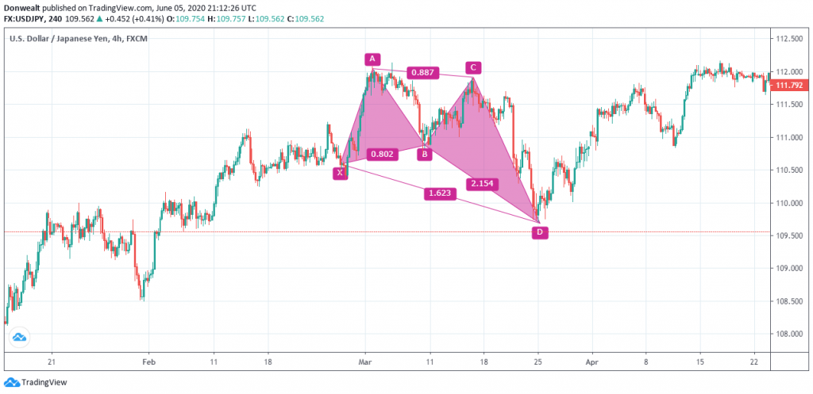

Algorithmic trading relies on sophisticated patterns and strategies to anticipate and capitalize on market movements. Among these, harmonic patterns have gained a reputation for their precision and reliability in predicting potential reversals and continuations. These patterns are geometric configurations based on Fibonacci sequences that help traders identify high-probability entry and exit points in the market.

Among the various harmonic patterns, the harmonic crab pattern is particularly distinct and promising. Discovered by Scott Carney, the crab pattern is known for its unique structure and the precision it offers in identifying reversal zones. The crab pattern is part of the broader category of XABCD patterns, characterized by five specific points that map out potential price movements.



This article is dedicated to demystifying the harmonic crab pattern by diving into its intricate rules and demonstrating its practical application in algorithmic trading. Readers will gain insights into how the pattern is constructed, the significance of its Fibonacci ratios, and how traders can effectively incorporate it into their trading strategies. The harmonic crab pattern stands out not just for its theoretical foundations but also for its real-world applicability in enhancing trading decisions.

## Table of Contents

## Understanding the Harmonic Crab Pattern

The harmonic crab pattern is recognized as a reversal pattern with a high reward-to-risk ratio, often utilized by traders for its precision. This pattern, categorized under the broader umbrella of XABCD harmonic patterns, is structured around five key points: X, A, B, C, and D. These points define four distinctive swings: XA, AB, BC, and CD, which form the basis for identifying the pattern.

The XA leg starts the pattern formation and is typically represented as a downward move. The AB leg follows, comprising a retracement of a specific portion of the XA leg. Next, the BC leg retraces from AB and may range within predetermined Fibonacci levels relative to AB. The defining characteristic of the harmonic crab pattern is the CD leg, which extends significantly beyond the initial XA move, often reaching 161.8% of XA. This extension is a critical aspect of the pattern and a primary [factor](/wiki/factor-investing) in its identification and utilization in trading.

The structural nature of these points and the associated Fibonacci retracements and extensions worldwide provide traders with a means to predict potential reversal points in the market. While straightforward in its conceptual layout, the precision required to identify and utilize the harmonic crab pattern effectively necessitates a detailed understanding of both its anatomy and the mathematical underpinnings of the Fibonacci sequence, making it a pattern that skilled traders often favor.

## Harmonic Crab Pattern Rules and Fib Ratios

The harmonic crab pattern is characterized by distinct Fibonacci ratios, which are fundamental for its identification and reliability in forecasting market reversals. The structure of this pattern is defined through five key points - X, A, B, C, and D - with four connecting legs: XA, AB, BC, and CD. Each segment adheres to specific Fibonacci retracement and extension levels, essential for traders looking to leverage this pattern in [algorithmic trading](/wiki/algorithmic-trading).

The first leg, AB, should retrace either 38.2% or 61.8% of the initial XA move. Mathematically, if the XA movement is represented as $xa$, then:
$$
ab = xa \times 0.382 \quad \text{or} \quad ab = xa \times 0.618
$$

Following this, the BC leg typically extends between 38.2% to 88.6% of the preceding AB leg. Consequently, if $ab$ denotes the length of the AB leg:
$$
bc = ab \times 0.382 \quad \text{to} \quad bc = ab \times 0.886
$$

The CD leg is the defining component of the crab pattern, noted for its significant extension. Generally, it extends 161.8% of the initial XA leg and between 224% to 361.8% of the BC leg. Thus, using $xa$ as the reference:
$$
cd = xa \times 1.618
$$

And for the relationship with the BC leg:
$$
cd = bc \times 2.24 \quad \text{to} \quad cd = bc \times 3.618
$$

These Fibonacci ratios are integral to identifying potential reversal zones, where the price is expected to change direction, either upwards or downwards, thus offering traders observable points for entering or exiting trades. By adhering strictly to these ratios, the crab pattern becomes a dependable tool for predicting market movements with accuracy and precision.

## Trading Strategy Using the Harmonic Crab Pattern

The harmonic crab pattern serves as a powerful reversal indicator in algorithmic trading, providing signals for either bullish or bearish market shifts based on its orientation. The effectiveness of trading this pattern lies in its accurate identification and execution at the designated Potential Reversal Zone (PRZ), typically marked by point D.

To utilize the harmonic crab pattern effectively, traders must first focus on identifying the pattern's critical Fibonacci retracement and extension levels. The accurate definition of these levels forms the backbone of the strategy, ensuring the reliability of the potential reversal signal. The key Fibonacci ratios for the crab pattern include an AB retracement of either 38.2% or 61.8% of the XA leg and a BC retracement ranging from 38.2% to 88.6% of the AB leg. The characteristic CD leg should extend significantly to 161.8% of the XA leg and lie between 224% and 361.8% of the BC leg. These specific ratios offer precise entry and [exit](/wiki/exit-strategy) cues.

Upon identifying a valid crab pattern, the next step is to enter a trade at point D—recognized as the PRZ. This point is critical as it denotes where the market is likely to reverse. In a bearish scenario, traders should place a short order at point D. To optimize the potential for successful trades, it is crucial to establish stop-loss and take-profit targets based on calculated Fibonacci levels associated with the pattern. Setting stop-loss slightly above the PRZ is a common practice to manage risk, while take-profit levels can be set at Fibonacci extensions of the CD leg, such as 261.8% or 361.8%.

The effective implementation of the crab pattern in trading strategies requires meticulous attention to its Fibonacci levels, ensuring that trades are entered at optimal points for maximum potential gain. Proper risk management through well-placed stop-loss and take-profit orders is essential to mitigate potential losses and enhance the pattern's reward/risk ratio. Traders may also integrate other technical indicators to confirm signals and strengthen their strategy when applying the harmonic crab pattern in an algorithmic trading setup.

## Backtesting and Algorithmic Trading with Crab Pattern

Backtesting is an indispensable step in the validation process of any trading pattern, including the harmonic crab pattern. It ensures that the pattern does not merely fit historical data by chance but offers genuine predictive capabilities. Despite the inherent complexity and subjective nature of identifying harmonic patterns, [backtesting](/wiki/backtesting) can still deliver valuable insights into the pattern's potential profitability and risk characteristics.

One challenge in backtesting the crab pattern lies in its strict adherence to Fibonacci ratios, which are not easily translated into rigid algorithmic rules. This complexity arises because the pattern's formation and structure require precise identification of the X, A, B, C, and D points to accurately delineate the swings XA, AB, BC, and CD. As a result, the development of algorithms must account for variability around these critical points while maintaining fidelity to the strict Fibonacci proportions that define the pattern.

To perform effective backtesting, traders can develop basic algorithmic setups that automate the recognition of potential crab patterns. For example, a simple Python-based approach could involve the use of libraries such as NumPy for mathematical calculations and pandas for data manipulation:

```python
import pandas as pd
import numpy as np

def identify_crab_pattern(data):
    # Assume data is a pandas DataFrame with columns: 'close'
    # Simplified steps to identify a potential crab pattern
    fib_ratios = {
        'XA': [0.382, 0.618],
        'BC': [0.382, 0.886],
        'CD': [2.24, 3.618],
        'XD': 1.618
    }

    patterns = []
    for i in range(5, len(data)):
        X, A, B, C, D = data['close'].iloc[i-5:i]
        # Calculate retracements and extensions
        AB = (B - A) / (A - X)
        CD = (D - C) / (B - C)
        XD = (D - X) / (A - X)

        # Verify fib levels
        if (fib_ratios['XA'][0] <= AB <= fib_ratios['XA'][1]) and \
           (fib_ratios['BC'][0] <= CD/XD <= fib_ratios['BC'][1]) and \
           (fib_ratios['CD'][0] <= CD <= fib_ratios['CD'][1]):
            patterns.append((X, A, B, C, D))

    return patterns

# Sample usage
data = pd.DataFrame({
    'close': np.random.rand(100) * 100  # Replace with actual close prices
})
crab_patterns = identify_crab_pattern(data)
print(crab_patterns)
```

Incorporating additional indicators—such as moving averages, RSI, or MACD—can enhance the reliability of pattern recognition by confirming the trading signals generated by the harmonic crab pattern. These indicators can act as supplementary checks to reduce false positives and increase the robustness of the trading strategy.

Ultimately, the application of backtesting in algorithmic trading with crab patterns relies on an iterative process of refinement. Traders should continually tweak their algorithms, using historical data to fine-tune the parameters and assumptions involved in pattern identification. This practice allows for the development of a more adaptive and effective trading system that can maximize the pattern's predictive strengths while mitigating potential downsides.

## Advantages and Challenges of Using the Crab Pattern

The harmonic crab pattern is recognized for offering an excellent risk-reward ratio, which makes it an attractive choice for traders aiming to capitalize on market reversals. This ability to precisely anticipate turning points is largely attributable to its reliance on Fibonacci retracement and extension levels. By accurately identifying the crab pattern and executing trades at the designated Potential Reversal Zone (PRZ), traders can potentially achieve substantial profits, as they are able to position themselves ahead of significant price movements.

Despite these advantages, the crab pattern is not without its challenges. One of the primary difficulties lies in its complexity and the strict adherence to Fibonacci rules required for its accurate identification. The pattern demands a comprehensive understanding of market structure and the precise application of Fibonacci ratios, such as the 38.2% or 61.8% retracement of the XA leg for AB, and the 161.8% extension of XA for the CD leg. This complexity can act as a barrier for novice traders who may find the nuances of recognizing and executing trades based on this pattern overwhelming.

Moreover, the subjective nature of identifying the pattern's pivotal points (X, A, B, C, and D) poses another challenge. Traders often require extensive experience and practice to distinguish valid patterns from false signals, making it essential for those interested in utilizing the crab pattern to dedicate time to study and learn the intricacies involved. Advanced tools, such as charting software with pattern recognition capabilities, can be beneficial in overcoming these challenges, but they do not replace the need for a fundamental understanding of the pattern.

In summary, while the harmonic crab pattern can be highly rewarding, it necessitates a significant investment in education and practice. Traders must be diligent in mastering the complexities and Fibonacci-based rules that define the pattern to use it effectively in their trading strategies.

## Conclusion

The harmonic crab pattern is a valuable tool for algorithmic traders aiming for precision in forecasting market reversals. This pattern, distinguished by its specific Fibonacci ratios and the extensive CD leg, provides a robust framework for anticipating market movements. However, the complexity in accurately identifying and executing trades based on this pattern means that only those who invest time and effort in mastering its intricacies can fully exploit its potential. A successful trader should develop a strategic approach, employing thorough backtesting to verify the pattern's efficacy in historical trades. This ensures a refined understanding, allowing traders to enter high-probability trades with calculated risk-reward ratios. By integrating the harmonic crab pattern into their trading systems, traders can potentially capture significant trend reversals, thereby enhancing their trade success and profitability.

## FAQ

What is the harmonic crab pattern?

The harmonic crab pattern is a specialized chart pattern used in technical analysis, identified for its potential to predict price reversals in financial markets. This pattern is part of the broader category of XABCD harmonic patterns and consists of five key points labeled X, A, B, C, and D. It is characterized by its distinct four-segment structure: XA, AB, BC, and CD. A key feature of the harmonic crab pattern is the elongated CD leg, which typically signals a strong reversal once completed.

How do the Fibonacci ratios apply to the crab pattern?

Fibonacci ratios play a crucial role in identifying the harmonic crab pattern. These ratios are used to define the geometric structure of the pattern, ensuring precision and accuracy. Specifically, the harmonic crab pattern adheres to the following Fibonacci criteria:

- AB should retrace 38.2% or 61.8% of the XA leg.
- BC can vary within 38.2% to 88.6% of the AB leg.
- CD extends significantly, often reaching 161.8% of the XA leg, and ranges between 224% to 361.8% of the BC leg.

These ratios help traders pinpoint potential reversal zones and enhance the pattern's reliability in predicting market movements.

Can the harmonic crab pattern be used for both bullish and bearish signals?

Yes, the harmonic crab pattern can indicate both bullish and bearish reversal signals, depending on its orientation. A bullish crab pattern suggests a price reversal from a downtrend to an uptrend, whereas a bearish crab pattern indicates a transition from an uptrend to a downtrend. Traders identify the pattern's orientation by analyzing its structure and the corresponding Fibonacci retracement and extension levels.

What tools are recommended for identifying and trading the crab pattern?

Traders often employ a combination of technical analysis tools and software to identify and trade the harmonic crab pattern effectively. Some recommended tools include:

- Charting platforms with harmonic pattern recognition capabilities, such as TradingView or MetaTrader.
- Fibonacci retracement and extension tools to manually verify the pattern's specific ratios.
- Algorithmic trading systems that allow for coding custom scripts in languages like Python to automate pattern recognition and trading execution. Here’s a simple Python example using TA-Lib:

```python
import talib
import numpy as np

def identify_crab_pattern(prices):
    # Simplified example to identify potential points for a crab pattern
    x = min(prices)
    a = prices[0]
    b = talib.MIN(prices, timeperiod=3)  # Placeholder for B point determination
    c = talib.MAX(prices, timeperiod=3)  # Placeholder for C point determination
    d = max(prices)

    # Check if the pattern's structure aligns with Fibonacci requirements
    ab_retracement = (b - a) / (x - a)  # Example calculation
    cd_extension = (d - c) / (a - b)    # Example calculation
    if ab_retracement in [0.382, 0.618] and cd_extension >= 1.618:
        return "Potential Crab Pattern Detected"
    return "No Crab Pattern"

# Sample price data (replace with actual data)
prices = np.array([100, 95, 98, 92, 105])
print(identify_crab_pattern(prices))
```

These tools, combined with a trader's skill in recognizing pattern nuances, can significantly enhance the accuracy and profitability of trading strategies based on the harmonic crab pattern.

## References & Further Reading

[1]: Carney, Scott M. ["Harmonic Trading, Volume One: Profiting from the Natural Order of the Financial Markets"](https://www.amazon.com/Harmonic-Trading-One-Profiting-Financial/dp/0137051506). FT Press.

[2]: Pesavento, L. R. ["Fibonacci Ratios with Pattern Recognition."](https://www.amazon.com/Fibonacci-Ratios-Pattern-Recognition-Pesavento/dp/0934380368) Traders Press.

[3]: Bulkowski, Thomas N. ["Encyclopedia of Chart Patterns"](https://books.google.com/books/about/Encyclopedia_of_Chart_Patterns.html?id=tIwlEAAAQBAJ). Wiley.

[4]: Jankovsky, Jeffery. ["Trading Rules that Work: The 28 Essential Lessons Every Trader Must Master"](https://www.amazon.com/Trading-Rules-that-Work-Lessons/dp/0471792160). Wiley.

[5]: Pring, Martin J. ["Technical Analysis Explained: The Successful Investor's Guide to Spotting Investment Trends and Turning Points"](https://www.amazon.com/Technical-Analysis-Explained-Fifth-Successful/dp/0071825177). McGraw-Hill Education.