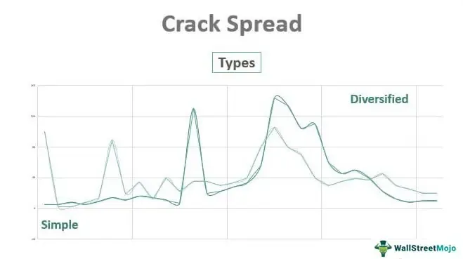

Algorithmic trading, commonly known as algo trading, has revolutionized financial markets by enabling rapid and precise execution of trades through automation. This approach leverages computer programs to follow a defined set of instructions, allowing traders to harness the power of complex algorithms to make trading decisions at speeds and frequencies beyond human capability. The efficiency gains provided by algo trading have led to its widespread adoption across global markets, enhancing liquidity and contributing to narrower spreads.

However, despite these advantages, algo trading is not without its challenges. One of the most significant risks faced by traders is the occurrence of structural breaks, sudden and profound shifts in market data patterns. These breaks can be triggered by a variety of external factors, such as economic events, regulatory updates, or technological advancements, which can dramatically alter market dynamics. For instance, an unexpected change in monetary policy or a breakthrough in financial technology can result in abrupt deviations from historical market behaviors.



The impact of structural breaks on algo trading can be substantial. Algorithms often rely heavily on historical data to forecast future trends and price movements. When a structural break occurs, these historical correlations and patterns may no longer hold, potentially leading to significant trading inaccuracies and financial losses. Consequently, understanding the causes and implications of structural breaks is crucial for developing robust and adaptable trading strategies. Traders and developers must integrate mechanisms to detect and adjust to these shifts, ensuring that their algorithms remain effective in varying market conditions. By examining the underlying factors that contribute to structural breaks and their potential effects on trading, market participants can enhance the resilience and success of their automated trading systems.

## Table of Contents

## Understanding Structural Breaks in Algo Trading

Structural breaks represent significant challenges in algorithmic trading as they disrupt the data generating process that algorithms depend on for predicting market behavior. In simplest terms, structural breaks can be viewed as abrupt changes or shifts in established data patterns, which can occur for various reasons, including macroeconomic events, policy shifts, or technological advancements.

In algorithmic trading, these breaks are particularly consequential because trading algorithms are primarily constructed using historical data under the assumption that past patterns will persist into the future. When a structural break occurs, the assumptions underpinning these algorithms might no longer hold true, resulting in potential inefficiencies and misinformed decisions. 

For instance, consider a simple linear regression model used for predicting asset prices:

$$
y_t = \beta_0 + \beta_1 x_t + \epsilon_t
$$

Where $y_t$ is the predicted value, $x_t$ is the independent variable, $\beta_0$ and $\beta_1$ are coefficients derived from historical data, and $\epsilon_t$ is the error term. A structural break might render the coefficients $\beta_0$ and $\beta_1$ irrelevant, as the relationship between $x_t$ and $y_t$ changes unpredictably.

Common causes of structural breaks include:

1. **Macroeconomic Events**: Significant economic changes, such as a major recession or an unexpected interest rate change, can alter market dynamics swiftly. Such events can shift investor behavior and alter asset correlations previously deemed stable.

2. **Policy Changes**: Regulatory modifications or government interventions can impose new constraints or incentives on the market, which can fundamentally change trading conditions and strategies.

3. **Technological Advancements**: The introduction of new technology can impact how markets operate. For example, the proliferation of high-frequency trading has transformed trading dynamics by reducing latency and changing liquidity patterns.

Recognizing and adapting to these structural changes is paramount for traders who rely on [algorithmic trading](/wiki/algorithmic-trading) strategies. Strategies must incorporate mechanisms to detect and adjust to these new conditions to maintain performance. Failure to adapt can result in the degradation of prediction accuracy and a corresponding decrease in trading profitability. Continual monitoring of market conditions, along with robust risk management strategies, can mitigate the impact of structural breaks, allowing for more resilient algorithmic trading systems.

## Causes of Structural Breaks in Algo Trading

Macroeconomic Factors: Economic crises, such as the 2008 financial crisis, can create abrupt and significant market disruptions, leading to structural breaks in algo trading models. These crises often result in sudden shifts in interest rates, currency valuations, and overall market sentiment. Significant policy changes, like central bank interventions or fiscal policy adjustments, can also impact market dynamics. These factors can lead to changes in the correlations and volatilities that many trading algorithms rely on.

Technological Innovations: The advent of new technologies, including high-frequency trading and blockchain, can significantly alter the behavior and structure of financial markets. These innovations may result in changes to market [liquidity](/wiki/liquidity-risk-premium), transaction costs, and data availability. For instance, the adoption of high-frequency trading has significantly increased market speed and efficiency but has also led to periodic technological glitches that could disrupt traditional trading patterns.

Regulatory Changes: Financial markets are subject to regulatory scrutiny and changes that can affect trading environments. New regulations may impose restrictions or additional compliance requirements, impacting the strategies employed by algorithmic traders. For example, the implementation of the Dodd-Frank Act in the United States introduced comprehensive financial reforms affecting market risk and trading practices. Such regulatory adjustments necessitate regular updates to trading models to ensure compliance and effectiveness.

Market Volatility: Geopolitical events, such as elections, wars, or trade tensions, can lead to sudden market fluctuations, introducing significant uncertainty. Natural disasters, including earthquakes or pandemics, can also disrupt economic activity, leading to rapid changes in asset prices and market conditions. This heightened [volatility](/wiki/volatility-trading-strategies) can create structural breaks in the historical patterns that algorithms use to predict future market behavior. Algorithms must be designed to quickly recognize and adapt to these changes to minimize risks and capitalize on potential opportunities.

To manage these potential disruptions, traders can employ various strategies such as diversification, risk management, and the use of adaptive algorithms that incorporate feedback mechanisms. Additionally, [machine learning](/wiki/machine-learning) approaches can be used to continuously update models and enhance algorithm resilience against structural breaks.

## Detecting Structural Breaks

Detecting structural breaks is a critical component of algorithmic trading as it allows for timely identification and response to changes in market dynamics. There are several methods to detect such disruptions in data, with statistical techniques and machine learning approaches being predominant.

**Statistical Methods:** Among the most established statistical techniques for detecting structural breaks are the Chow test and the Cumulative Sum (CUSUM) test. 

- The **Chow test** is used to determine whether there are significant differences in the regression parameters between different periods. This involves splitting data into two sets and testing for equality of coefficients. The test statistic is given by:
$$
  F = \frac{\left( \frac{S_c - (S_1 + S_2)}{k} \right)}{\left( \frac{S_1 + S_2}{n_1 + n_2 - 2k} \right)}

$$

  where $S_c$ is the sum of squared residuals for the combined dataset, $S_1$ and $S_2$ are the sums of squared residuals for each subset, $k$ is the number of parameters, and $n_1$ and $n_2$ are the number of observations in each subset.

- The **CUSUM test** monitors the cumulative sum of deviations from the target value over time. It is highly sensitive to shifts in the process mean or variance. The CUSUM statistic evolves according to:
$$
  C_t = C_{t-1} + (X_t - \mu)

$$

  where $C_t$ is the cumulative sum at time $t$, $X_t$ is the observed value, and $\mu$ is the target mean.

**Machine Learning Approaches:** Modern developments in machine learning offer advanced tools for structural break detection. Techniques such as reinforcement learning and neural networks provide robust frameworks capable of identifying subtle shifts in data patterns.

- **Reinforcement learning** algorithms can dynamically adapt to new information. By interacting with an environment, these algorithms adjust strategies based on observed rewards, effectively identifying and reacting to structural changes.

- **Neural networks**, particularly recurrent neural networks (RNNs) and long short-term memory networks (LSTMs), excel in processing sequential data and detecting temporal dependencies. These models can learn complex, non-linear relationships and are useful for identifying shifts in time-series data.

**Real-time Monitoring:** Continuous analysis of market data is essential to effectively manage structural breaks. Real-time monitoring systems offer immediate insights, allowing traders to modify strategies as market conditions evolve. Implementing real-time systems often involves streaming data pipelines and real-time analytics tools. In Python, libraries like `pandas` for real-time data processing combined with `scikit-learn` or `TensorFlow` for machine learning can be employed to create a comprehensive monitoring system.

```python
import pandas as pd
import numpy as np
from sklearn.preprocessing import StandardScaler
from sklearn.decomposition import PCA

# Example of a real-time data processing setup
def process_realtime_data(data_stream):
    scaler = StandardScaler()
    scaled_data = scaler.fit_transform(data_stream)

    # Detecting shifts using PCA
    pca = PCA(n_components=1)
    principal_components = pca.fit_transform(scaled_data)

    return principal_components

# Assume data_stream is a continuous feed of market data
data_stream = np.random.random((100, 5))  # Example data stream
real_time_output = process_realtime_data(data_stream)
```

Successfully detecting and adapting to structural breaks necessitates a blend of statistical rigor with machine learning flexibility, allowing traders to maintain competitiveness in increasingly unpredictable markets.

## Adapting Strategies to Structural Breaks

Developing adaptive algorithms in algorithmic trading necessitates the integration of feedback mechanisms that allow trading strategies to recalibrate based on newly acquired data. Feedback mechanisms can be implemented through a process known as online learning, where the algorithm updates its parameters regularly as new data points are processed. This approach ensures that the trading model remains aligned with the current market dynamics, minimizing the impact of structural breaks on trading performance.

One effective method to adapt trading strategies involves the incorporation of machine learning techniques. By utilizing adaptive models, such as [reinforcement learning](/wiki/reinforcement-learning) or dynamic neural networks, trading strategies can be continuously updated. For instance, reinforcement learning allows the trading algorithm to learn from its successes and failures, refining its decision-making process over time. This iterative learning process can be especially valuable when traditional statistical methods fail to capture abrupt changes in market conditions.

Consider the Python example below, which demonstrates an implementation of a basic reinforcement learning agent using the popular TensorFlow library:

```python
import tensorflow as tf
from tensorflow.keras.models import Sequential
from tensorflow.keras.layers import Dense
from tensorflow.keras.optimizers import Adam

# Build a simple feedforward neural network
model = Sequential([
    Dense(24, input_dim=state_size, activation='relu'),
    Dense(24, activation='relu'),
    Dense(action_size, activation='linear')
])

# Compile the model with mean squared error loss and Adam optimizer
model.compile(loss='mse', optimizer=Adam(lr=0.001))
```

Implementing robust risk management practices can further safeguard algorithmic trading systems against the adverse effects of structural breaks. Strategies such as diversification and hedging are vital to mitigate potential losses. Diversification involves spreading investments across various assets or markets, reducing reliance on a single market condition. Hedging, on the other hand, provides a safety net through derivative contracts or other financial instruments that offset potential losses in adverse conditions.

In practice, a balanced approach that combines continuous learning through machine learning, adaptive algorithm development, and strategic risk management can significantly enhance the resilience of algorithmic trading strategies. By equipping models to recognize and adjust to structural shifts proactively, traders can maintain performance stability even as market conditions evolve unpredictably.

## Case Study: Structural Break-Aware Pairs Trading

Pairs trading is a market-neutral strategy that capitalizes on the convergence of two historically correlated securities. The underlying principle is that the prices of the selected asset pairs diverge and then revert to their mean, offering opportunities for [arbitrage](/wiki/arbitrage). However, structural breaks, which are sudden changes in the correlation pattern due to external factors like economic shifts or policy changes, pose challenges to this approach.

### Challenges from Structural Breaks

Structural breaks can significantly affect the assumed correlations between asset pairs in pairs trading. Typically, these breaks are not easily detectable using traditional statistical methods, and they can introduce additional risk by invalidating the assumption of mean reversion. For instance, if a macroeconomic event causes a structural change in the market, the correlation between a stock pair might weaken or disappear, leading to increased potential for trading losses.

### Role of Machine Learning 

Incorporating machine learning (ML) into pairs trading can enhance the strategy's robustness against structural breaks. Machine learning techniques, such as clustering algorithms and neural networks, can identify and adapt to changes in correlation structures dynamically. These frameworks can analyze vast amounts of historical and real-time data to detect subtle shifts that may indicate a structural break.

Consider a machine learning framework for pair selection and signal generation:

```python
from sklearn.cluster import KMeans
import numpy as np

# Simulated historical price returns for ten assets
historical_prices = np.random.random((100, 10))

# Normalize the data
normalized_prices = (historical_prices - historical_prices.mean(axis=0)) / historical_prices.std(axis=0)

# Clustering to find correlated pairs
kmeans = KMeans(n_clusters=5)
clusters = kmeans.fit_predict(normalized_prices.T)

# Select pairs within the same cluster - Simplistic approach
pairs = [(i, j) for i in range(len(clusters)) for j in range(i + 1, len(clusters)) if clusters[i] == clusters[j]]

print("Identified Pairs:", pairs)
```

The above code snippet demonstrates the use of clustering to identify potential pairs based on historical price correlations. Including a step for structural break detection, such as monitoring the stability of these clusters over time using moving windows, helps identify periods where correlations deviate significantly. Machine learning systems can be further enhanced by integrating reinforcement learning for strategy adaptation, maintaining optimal trading performance by learning from market shifts.

### Profitability and Risk Mitigation

By leveraging machine learning frameworks in pairs trading, traders can not only optimize the selection of pairs but also improve signal generation, thus dynamically adjusting their strategies in response to structural breaks. This adaptability allows traders to enhance their profitability by maintaining higher accuracy in predicting mean reversion. Concurrently, the risk associated with structural breaks is mitigated as ML algorithms continuously learn and adjust to new market realities, providing a buffer against sudden market shifts.

In summary, integrating structural break detection into pairs trading strategies through machine learning methodologies significantly bolsters the strategy's effectiveness, offering a sophisticated approach to navigating market uncertainties and capitalizing on arbitrage opportunities.

## Conclusion

Structural breaks, characterized by abrupt and unexplained shifts in financial data patterns, present significant challenges to algorithmic trading. These disruptions introduce elements of uncertainty and risk that can undermine the efficiency and accuracy of algorithmic strategies reliant on historical data trends and correlations. To effectively manage these disruptions, it is critical to leverage a combination of statistical methods and advanced machine learning techniques.

Statistical methods, such as the Chow test and CUSUM, offer foundational tools for detecting structural changes. However, the integration of machine learning, particularly advanced algorithms like reinforcement learning and neural networks, provides a more dynamic approach for anticipating and adjusting to these market disruptions. These technologies enhance the detection process by learning from historical data and rapidly evolving market conditions, thus enabling algorithms to recalibrate and maintain robustness in the face of unpredictability.

The rapid evolution of financial markets necessitates continuous improvements in detection and adaptation strategies. This encompasses not only the deployment of cutting-edge detection methodologies but also the iterative refinement of models based on emerging data and trends. Algorithm developers must implement rigorous real-time monitoring systems to facilitate prompt detection and response to structural shifts.

As financial markets become increasingly complex and interdependent, staying adaptable and informed becomes paramount. Successful algorithmic traders must remain vigilant, continually updating their strategies to incorporate new information and technological advancements. By doing so, they mitigate risks and capitalize on opportunities presented by market changes, ensuring sustained trading performance in increasingly volatile environments. Embracing a proactive and resilient approach empowers market participants to navigate the uncertainties introduced by structural breaks, securing a competitive edge in algorithmic trading.

## References & Further Reading

1. **Bergstra, J. et al., Algorithms for Hyper-Parameter Optimization**  
   This reference outlines methodologies for optimizing hyper-parameters, a crucial step in enhancing the performance of machine learning models, including those used for detecting structural breaks in financial data. Hyper-parameter optimization can significantly improve model accuracy and efficiency.

2. **Lopez de Prado, M., Advances in Financial Machine Learning**  
   This book provides comprehensive insights into the application of machine learning techniques in finance. It extensively discusses methods for identifying and adapting to structural breaks through advanced algorithms, helping traders maintain algorithmic efficiency amid market changes.

3. **Aronson, D., Evidence-Based Technical Analysis**  
   Aronson's work emphasizes the importance of a scientific approach to technical analysis. It highlights statistical methods that can be applied to recognize patterns and breaks in market data, supporting the development of robust strategies in algorithmic trading.

4. **Jansen, S., Machine Learning for Algorithmic Trading**  
   Jansen covers practical applications of machine learning in trading, focusing on adaptive algorithms and real-time data analysis. This resource is valuable for understanding how to incorporate machine learning to monitor and respond to structural changes in trading environments.

5. **Chan, E. P., Quantitative Trading: How to Build Your Own Algorithmic Trading Business**  
   This book is a foundational guide to establishing an algorithmic trading operation. It provides insights into strategy development and the implementation of systems capable of adapting to structural breaks, ensuring sustained profitability in volatile markets.