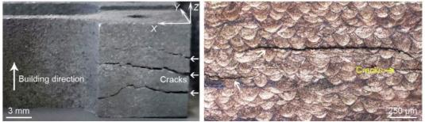

## Table of Contents

## What is crack formation?

Crack formation is when small breaks or splits appear in a material. This can happen in things like rocks, metal, glass, or even concrete. Cracks can start because of stress, which means the material is being pulled or pushed too hard. Sometimes, cracks can also start because the material gets too hot or too cold, or because it is exposed to chemicals that weaken it.

Once a crack starts, it can grow bigger over time. If the stress keeps happening, the crack can spread through the material. This can make the material weaker and might cause it to break completely. People who work with materials, like engineers and builders, try to stop cracks from forming by using strong materials and designing things carefully. They also fix cracks early to stop them from getting worse.

## What are the most common causes of crack formation?

The most common cause of crack formation is stress. Stress happens when a material is pulled or pushed too hard. This can happen when something heavy is put on the material, or when the material is bent or twisted. Stress can also come from inside the material, like when different parts of it want to move in different ways. When the stress gets too big, it can make the material break and form a crack.

Another common cause of crack formation is changes in temperature. When a material gets very hot or very cold, it can expand or shrink. If one part of the material changes size more than another part, it can create stress inside the material. This stress can lead to cracks. For example, if you pour hot water into a cold glass, the glass might crack because the inside gets hot and expands while the outside stays cold.

Chemicals can also cause cracks. Some chemicals can weaken the material they touch. Over time, this weakening can make the material more likely to crack, especially if it is also under stress or temperature changes. For example, rust can weaken metal and make it more likely to crack. People who work with materials try to protect them from these chemicals to stop cracks from forming.

## Can you explain the difference between surface cracks and deep cracks?

Surface cracks are small breaks that only go a little way into the material. They usually stay on the top layer and don't go deep inside. These cracks can happen because of small scratches or because the material is getting old. Surface cracks might not be a big problem at first, but if they are not fixed, they can grow bigger and turn into deeper cracks. People often see surface cracks on things like roads, walls, or even on the screen of a phone.

Deep cracks are more serious because they go far into the material. These cracks can start from the surface and keep going until they reach the other side of the material, or they can start inside the material and grow outward. Deep cracks are often caused by big stresses, like heavy weights or big changes in temperature. They can make the material very weak and might cause it to break completely. Because deep cracks are more dangerous, it's important to fix them quickly to stop the material from breaking.

## How does temperature affect crack formation?

Temperature can cause cracks in materials because it makes them expand or shrink. When a material gets hot, it expands, which means it gets a little bigger. When it gets cold, it shrinks, which means it gets a little smaller. If different parts of the material expand or shrink at different rates, it creates stress inside the material. This stress can be too much for the material to handle, and it might crack. For example, if you pour hot water into a cold glass, the inside of the glass might expand more than the outside, causing it to crack.

Sometimes, big changes in temperature can make cracks worse. If a material already has a small crack, a sudden change in temperature can make that crack grow bigger. This happens because the material around the crack might expand or shrink in a way that pulls the crack apart. For instance, if a road has a small crack and it gets very cold, the crack might get bigger because the material shrinks and pulls the crack open. People who work with materials try to protect them from big temperature changes to stop cracks from forming or growing.

## What role does material fatigue play in crack initiation?

Material fatigue is when a material gets weak because it is used a lot over time. Imagine bending a paper clip back and forth many times. At first, it bends easily, but after a while, it gets weak and breaks. The same thing happens to materials like metal or plastic when they are used repeatedly. They can start to form tiny cracks because the constant use wears them down. This is called fatigue, and it makes the material more likely to crack even if the stress is not very big.

These tiny cracks from fatigue can grow bigger over time if the material keeps being used. Each time the material is stressed, the crack can get a little larger. Eventually, the crack can become big enough to cause the material to break completely. Engineers and builders need to think about fatigue when they design things, so they use strong materials and try to reduce how much the material is stressed. This helps to stop cracks from starting and growing because of fatigue.

## How can environmental factors contribute to crack formation?

Environmental factors can make cracks in materials by changing how they act or by wearing them down. Things like rain, sun, and wind can slowly damage materials over time. For example, water can get into small holes in a material and freeze when it gets cold. When water freezes, it turns into ice and takes up more space, which can push the material apart and start a crack. Also, salt in the air or water can make metal rust, which makes it weak and more likely to crack.

Another way the environment can cause cracks is through big changes in temperature and humidity. When it's very hot, materials can expand, and when it's very cold, they can shrink. If different parts of a material change size at different times, it can create stress inside the material, leading to cracks. Humidity, or the amount of water in the air, can also affect materials. High humidity can make some materials swell, while low humidity can make them shrink. These changes can add more stress to the material, making cracks more likely to happen.

## What are some examples of crack formation in everyday objects?

Cracks can show up in things we use every day, like our phones and glasses. If you drop your phone, it might get a crack on the screen. This happens because the force from dropping it puts a lot of stress on the glass. The glass can't handle the stress, so it breaks and forms a crack. Glasses can also crack if you pour hot liquid into them when they are cold. The inside of the glass gets hot and expands, but the outside stays cold. This difference makes the glass break and form a crack.

Another common place to see cracks is on roads and sidewalks. Over time, the concrete or asphalt can get old and start to crack. This can happen because of the weather. When it's very cold, water in the cracks can freeze and push the material apart, making the cracks bigger. Cars driving over the road can also add stress to the cracks, making them grow. Sometimes, tree roots growing under the sidewalk can push up and cause cracks too.

## How do engineers detect and monitor cracks in structures?

Engineers use special tools and methods to find and keep an eye on cracks in structures like bridges and buildings. One way they do this is by using something called non-destructive testing (NDT). This means they can check for cracks without breaking the material. They might use machines that send sound waves into the material to see if the waves bounce back differently where there is a crack. Another tool they use is called a strain gauge, which sticks to the surface of the material and measures how much it stretches or shrinks. If the material is stretching too much in one spot, it might mean there's a crack starting there.

Once engineers find a crack, they keep watching it to make sure it doesn't get worse. They might use sensors that stay on the structure and send information back to a computer. These sensors can tell them if the crack is getting bigger or if the material around it is under more stress. Sometimes, they take pictures of the crack with special cameras that can see very small details. By checking these pictures over time, they can see if the crack is growing. Keeping a close eye on cracks helps engineers know when they need to fix them before they cause big problems.

## What techniques are used to prevent crack formation in materials?

Engineers use different ways to stop cracks from starting in materials. One way is by choosing strong materials that can handle stress well. They might pick metals or special kinds of concrete that don't crack easily. Another way is by designing things carefully. Engineers try to make sure the material is not bent or pulled too hard in any one spot. They might add extra support or use shapes that spread out the stress evenly. They also try to keep the material away from things like chemicals or big changes in temperature that could weaken it and cause cracks.

Another technique is to treat the material before using it. For example, they might heat the material and then cool it slowly to make it stronger. This is called heat treatment. They can also add special chemicals to the material to make it tougher. These chemicals can fill in tiny holes and stop cracks from starting. Finally, engineers keep an eye on the material while it's being used. If they see a small crack starting, they fix it right away to stop it from getting bigger. By doing all these things, they can keep the material from cracking and make sure it lasts a long time.

## Can you discuss the impact of crack formation on the structural integrity of buildings?

When cracks form in buildings, they can make the whole structure weaker. Cracks can start because of heavy loads, changes in temperature, or just because the building materials get old. If these cracks are small and only on the surface, they might not be a big problem right away. But if they are not fixed, they can grow bigger and deeper. Big cracks can make the building less safe because they can make the walls, floors, or beams weaker. This means the building might not be able to hold up as much weight as it should, which can be dangerous.

Engineers and builders try to stop cracks from happening by using strong materials and designing the building carefully. They also check the building often to find any cracks early and fix them before they get worse. If a crack does start to grow and affect the building's safety, the engineers might need to add extra support or even fix the whole part of the building. By keeping an eye on cracks and fixing them quickly, they can make sure the building stays strong and safe for everyone inside.

## How do advanced materials science approaches address crack formation?

Advanced materials science helps stop cracks from forming by creating new kinds of materials that are tougher and more flexible. Scientists work on making materials that can handle stress better. They might mix different materials together to make a new one that is stronger. For example, they can add tiny fibers to concrete to make it less likely to crack. They also study how materials act when they are stressed or when the temperature changes. By understanding this, they can make materials that don't break easily.

Another way advanced materials science deals with cracks is by using special treatments on the materials. They might use heat to make the material stronger or add chemicals that fill in tiny holes and stop cracks from starting. Scientists also develop smart materials that can fix themselves if a crack starts. These materials might have tiny capsules inside them that break open when a crack forms, releasing a substance that fills the crack and stops it from growing. By using these new approaches, scientists can make buildings and other structures safer and longer-lasting.

## What are the latest research developments in predicting and controlling crack formation?

Scientists are working on new ways to predict when and where cracks might start in materials. They use special computer programs that can guess how materials will act under stress. These programs look at things like how the material is made, what it's made of, and what kind of stress it will face. By using these computer models, scientists can find spots in the material that might crack first. They can also test different ways to make the material stronger and see if it helps stop cracks before they even start.

Another big step in controlling crack formation is using smart materials. These are materials that can fix themselves if a crack begins. Scientists put tiny capsules inside the material that break open when a crack forms. When the capsules break, they release a special liquid that hardens and fills the crack, stopping it from getting bigger. This self-healing ability can make buildings and other structures last longer and stay safe. Researchers are also working on making these smart materials cheaper and easier to use in everyday things.

## What is the understanding of structural breaks in algo trading?

Structural breaks represent significant challenges in algorithmic trading as they disrupt the data generating process that algorithms depend on for predicting market behavior. In simplest terms, structural breaks can be viewed as abrupt changes or shifts in established data patterns, which can occur for various reasons, including macroeconomic events, policy shifts, or technological advancements.

In algorithmic trading, these breaks are particularly consequential because trading algorithms are primarily constructed using historical data under the assumption that past patterns will persist into the future. When a structural break occurs, the assumptions underpinning these algorithms might no longer hold true, resulting in potential inefficiencies and misinformed decisions. 

For instance, consider a simple linear regression model used for predicting asset prices:

$$
y_t = \beta_0 + \beta_1 x_t + \epsilon_t
$$

Where $y_t$ is the predicted value, $x_t$ is the independent variable, $\beta_0$ and $\beta_1$ are coefficients derived from historical data, and $\epsilon_t$ is the error term. A structural break might render the coefficients $\beta_0$ and $\beta_1$ irrelevant, as the relationship between $x_t$ and $y_t$ changes unpredictably.

Common causes of structural breaks include:

1. **Macroeconomic Events**: Significant economic changes, such as a major recession or an unexpected interest rate change, can alter market dynamics swiftly. Such events can shift investor behavior and alter asset correlations previously deemed stable.

2. **Policy Changes**: Regulatory modifications or government interventions can impose new constraints or incentives on the market, which can fundamentally change trading conditions and strategies.

3. **Technological Advancements**: The introduction of new technology can impact how markets operate. For example, the proliferation of high-frequency trading has transformed trading dynamics by reducing latency and changing liquidity patterns.

Recognizing and adapting to these structural changes is paramount for traders who rely on [algorithmic trading](/wiki/algorithmic-trading) strategies. Strategies must incorporate mechanisms to detect and adjust to these new conditions to maintain performance. Failure to adapt can result in the degradation of prediction accuracy and a corresponding decrease in trading profitability. Continual monitoring of market conditions, along with robust risk management strategies, can mitigate the impact of structural breaks, allowing for more resilient algorithmic trading systems.

## Can we detect structural breaks?

Detecting structural breaks is a critical component of algorithmic trading as it allows for timely identification and response to changes in market dynamics. There are several methods to detect such disruptions in data, with statistical techniques and machine learning approaches being predominant.

**Statistical Methods:** Among the most established statistical techniques for detecting structural breaks are the Chow test and the Cumulative Sum (CUSUM) test. 

- The **Chow test** is used to determine whether there are significant differences in the regression parameters between different periods. This involves splitting data into two sets and testing for equality of coefficients. The test statistic is given by:
$$
  F = \frac{\left( \frac{S_c - (S_1 + S_2)}{k} \right)}{\left( \frac{S_1 + S_2}{n_1 + n_2 - 2k} \right)}

$$

  where $S_c$ is the sum of squared residuals for the combined dataset, $S_1$ and $S_2$ are the sums of squared residuals for each subset, $k$ is the number of parameters, and $n_1$ and $n_2$ are the number of observations in each subset.

- The **CUSUM test** monitors the cumulative sum of deviations from the target value over time. It is highly sensitive to shifts in the process mean or variance. The CUSUM statistic evolves according to:
$$
  C_t = C_{t-1} + (X_t - \mu)

$$

  where $C_t$ is the cumulative sum at time $t$, $X_t$ is the observed value, and $\mu$ is the target mean.

**Machine Learning Approaches:** Modern developments in machine learning offer advanced tools for structural break detection. Techniques such as reinforcement learning and neural networks provide robust frameworks capable of identifying subtle shifts in data patterns.

- **Reinforcement learning** algorithms can dynamically adapt to new information. By interacting with an environment, these algorithms adjust strategies based on observed rewards, effectively identifying and reacting to structural changes.

- **Neural networks**, particularly recurrent neural networks (RNNs) and long short-term memory networks (LSTMs), excel in processing sequential data and detecting temporal dependencies. These models can learn complex, non-linear relationships and are useful for identifying shifts in time-series data.

**Real-time Monitoring:** Continuous analysis of market data is essential to effectively manage structural breaks. Real-time monitoring systems offer immediate insights, allowing traders to modify strategies as market conditions evolve. Implementing real-time systems often involves streaming data pipelines and real-time analytics tools. In Python, libraries like `pandas` for real-time data processing combined with `scikit-learn` or `TensorFlow` for machine learning can be employed to create a comprehensive monitoring system.

```python
import pandas as pd
import numpy as np
from sklearn.preprocessing import StandardScaler
from sklearn.decomposition import PCA

# Example of a real-time data processing setup
def process_realtime_data(data_stream):
    scaler = StandardScaler()
    scaled_data = scaler.fit_transform(data_stream)

    # Detecting shifts using PCA
    pca = PCA(n_components=1)
    principal_components = pca.fit_transform(scaled_data)

    return principal_components

# Assume data_stream is a continuous feed of market data
data_stream = np.random.random((100, 5))  # Example data stream
real_time_output = process_realtime_data(data_stream)
```

Successfully detecting and adapting to structural breaks necessitates a blend of statistical rigor with machine learning flexibility, allowing traders to maintain competitiveness in increasingly unpredictable markets.

## References & Further Reading

1. **Bergstra, J. et al., Algorithms for Hyper-Parameter Optimization**  
   This reference outlines methodologies for optimizing hyper-parameters, a crucial step in enhancing the performance of machine learning models, including those used for detecting structural breaks in financial data. Hyper-parameter optimization can significantly improve model accuracy and efficiency.

2. **Lopez de Prado, M., Advances in Financial Machine Learning**  
   This book provides comprehensive insights into the application of machine learning techniques in finance. It extensively discusses methods for identifying and adapting to structural breaks through advanced algorithms, helping traders maintain algorithmic efficiency amid market changes.

3. **Aronson, D., Evidence-Based Technical Analysis**  
   Aronson's work emphasizes the importance of a scientific approach to technical analysis. It highlights statistical methods that can be applied to recognize patterns and breaks in market data, supporting the development of robust strategies in algorithmic trading.

4. **Jansen, S., Machine Learning for Algorithmic Trading**  
   Jansen covers practical applications of machine learning in trading, focusing on adaptive algorithms and real-time data analysis. This resource is valuable for understanding how to incorporate machine learning to monitor and respond to structural changes in trading environments.

5. **Chan, E. P., Quantitative Trading: How to Build Your Own Algorithmic Trading Business**  
   This book is a foundational guide to establishing an algorithmic trading operation. It provides insights into strategy development and the implementation of systems capable of adapting to structural breaks, ensuring sustained profitability in volatile markets.

