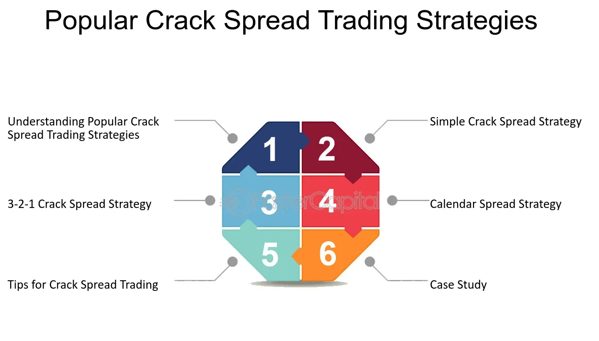

## Table of Contents

## What is a crack spread in the context of trading?

A crack spread is a term used in trading that refers to the difference between the price of crude oil and the price of the refined products made from it, like gasoline and diesel. Traders use the crack spread to understand how profitable it might be to refine crude oil into these products. If the price of the refined products is much higher than the price of crude oil, the crack spread is wide, which means refining could be more profitable.

The crack spread is important for people who work in the oil refining business because it helps them decide when to buy crude oil and when to sell the refined products. It's also used by traders who don't actually refine oil but want to make money by betting on the price differences. They might buy crude oil and sell gasoline futures at the same time, hoping to make a profit from the spread between the two.

## How does the crack spread relate to the oil refining industry?

The crack spread is very important for the oil refining industry. It shows the difference between what it costs to buy crude oil and what the refineries can sell their products like gasoline and diesel for. If the crack spread is big, it means that refining oil could make a lot of money. This is because the price they get for the gasoline and diesel is much higher than what they paid for the crude oil. Refineries use the crack spread to decide when it's a good time to buy crude oil and start refining it.

On the other hand, if the crack spread is small, it means the profit from refining might not be very good. This could happen if the price of crude oil goes up a lot or if the prices of gasoline and diesel go down. Refineries might then choose to slow down or stop refining until the crack spread gets better. By keeping an eye on the crack spread, refineries can try to make the most money possible from turning crude oil into useful products.

## What are the basic components involved in calculating a crack spread?

The crack spread is calculated by looking at the difference between the price of crude oil and the prices of the products that come from refining it, like gasoline and diesel. To figure out the crack spread, you need to know the price of a barrel of crude oil and the prices of the gasoline and diesel that can be made from that barrel. Usually, a refiner can make about two-thirds of a barrel of gasoline and one-third of a barrel of diesel from one barrel of crude oil.

So, to calculate the crack spread, you would take the price of two-thirds of a barrel of gasoline plus the price of one-third of a barrel of diesel and subtract the price of one barrel of crude oil. If the result is a big number, it means refining oil could be very profitable. If the result is a small number or even negative, it means the profit from refining might not be so good. This simple calculation helps refiners decide when to buy crude oil and start refining it to make the most money.

## Can you explain the difference between a simple and complex crack spread?

A simple crack spread is the basic way to figure out how much money a refinery might make. It looks at the difference between the price of crude oil and the prices of gasoline and diesel that come from it. Usually, a refiner can make about two-thirds of a barrel of gasoline and one-third of a barrel of diesel from one barrel of crude oil. So, you take the price of two-thirds of a barrel of gasoline plus the price of one-third of a barrel of diesel and subtract the price of one barrel of crude oil. This gives you the simple crack spread, which helps refiners decide if it's a good time to start refining oil.

A complex crack spread, on the other hand, takes into account that modern refineries can make more than just gasoline and diesel. They can also produce other products like jet fuel, heating oil, and even chemicals like propylene. To calculate a complex crack spread, you need to consider the prices of all these different products that come from refining one barrel of crude oil. This gives a more accurate picture of the refinery's potential profits because it includes all the products they can sell, not just gasoline and diesel. Refineries use complex crack spreads to better understand their profitability and make smarter decisions about when to refine oil.

## What are the common trading strategies used in crack spread trading?

Crack spread trading involves buying and selling futures contracts for crude oil and its refined products, like gasoline and diesel, to make money from the difference in their prices. One common strategy is called the "long crack spread" where a trader buys crude oil futures and sells gasoline and diesel futures at the same time. They do this because they think the price of gasoline and diesel will go up more than the price of crude oil. If they're right, they can make money from the difference between the prices.

Another strategy is the "short crack spread" where a trader does the opposite. They sell crude oil futures and buy gasoline and diesel futures, betting that the price of crude oil will go up more than the prices of gasoline and diesel. If the price of crude oil goes up a lot and the prices of gasoline and diesel don't go up as much, the trader can make money from the difference. Both strategies are about trying to guess how the prices will change and making trades based on those guesses.

## How do market conditions affect the crack spread?

Market conditions can change the crack spread a lot. The crack spread is the difference between the price of crude oil and the prices of the products like gasoline and diesel that come from refining it. If the price of crude oil goes up but the prices of gasoline and diesel stay the same, the crack spread gets smaller. This means it's harder for refineries to make money because what they're selling isn't worth much more than what they paid for the oil. On the other hand, if the price of crude oil goes down or the prices of gasoline and diesel go up, the crack spread gets bigger. A bigger crack spread means refineries can make more money because they can sell their products for a lot more than what they paid for the oil.

Other things in the market can also affect the crack spread. For example, if there's a lot of demand for gasoline, like in the summer when people drive more, the price of gasoline can go up. This can make the crack spread bigger and make refining more profitable. But if there's a problem with refineries, like a big refinery shutting down, it can be harder to make gasoline and diesel. This can make the prices of these products go up, which can also make the crack spread bigger. On the other hand, if there's not much demand for gasoline or diesel, their prices can go down, making the crack spread smaller and refining less profitable.

## What role do futures contracts play in crack spread trading?

Futures contracts are really important in crack spread trading. They let traders buy and sell crude oil, gasoline, and diesel at prices that are set now but for delivery in the future. Traders use these contracts to make bets on how the prices of these things will change over time. For example, if a trader thinks the price of gasoline will go up more than the price of crude oil, they might buy a crude oil futures contract and sell a gasoline futures contract at the same time. This way, they can make money from the difference in prices without having to actually buy and store the oil and gasoline.

Futures contracts also help traders manage risk. If a refinery wants to make sure they can buy crude oil at a certain price in the future, they can buy a futures contract now. This protects them from big changes in the price of crude oil. The same goes for selling gasoline and diesel futures contracts. By using futures contracts, traders and refineries can plan better and protect themselves from sudden changes in the market. This makes crack spread trading more predictable and helps everyone involved make smarter decisions about buying and selling oil and its products.

## How can one hedge risks associated with crack spread trading?

Hedging risks in crack spread trading means taking steps to protect against losing money because of changes in the prices of crude oil, gasoline, and diesel. One common way to hedge is by using futures contracts. If a trader or a refinery thinks the price of crude oil might go up, they can buy a futures contract for crude oil at today's price. This way, even if the price goes up later, they are protected because they locked in a lower price. They can also sell futures contracts for gasoline and diesel if they think the prices of these might go down. By doing this, they can make sure they won't lose too much money if the prices change in ways they didn't expect.

Another way to hedge is by using options contracts. Options give the right, but not the obligation, to buy or sell something at a set price in the future. For example, if a trader is worried about the price of crude oil going up, they can buy a call option on crude oil. This gives them the choice to buy oil at a set price if it goes up a lot. If the price doesn't go up, they can just let the option expire without using it. Using options can be a bit more complicated than futures, but they give more flexibility and can help manage risks better in crack spread trading.

## What are the key indicators to watch when trading crack spreads?

When trading crack spreads, it's important to keep an eye on the prices of crude oil, gasoline, and diesel. If the price of crude oil goes up a lot, it can make the crack spread smaller because the cost of the oil is higher. On the other hand, if the prices of gasoline and diesel go up, the crack spread can get bigger because refineries can sell their products for more money. Traders need to watch these prices closely to guess if the crack spread will get bigger or smaller and make their trades based on that.

Another key thing to watch is the demand for gasoline and diesel. If more people are driving or using diesel, the demand for these products goes up, and their prices can go up too. This can make the crack spread bigger and make refining more profitable. Also, keeping an eye on any problems with refineries, like a big one shutting down, can help traders guess if the prices of gasoline and diesel will go up because there's less of them being made. By watching all these things, traders can make smarter decisions about when to buy and sell in crack spread trading.

## How do geopolitical events influence crack spread dynamics?

Geopolitical events can have a big impact on the crack spread because they can change the price of crude oil. If there's a war or a problem in a country that makes a lot of oil, like Saudi Arabia or Russia, it can make the price of crude oil go up. This happens because people worry that there might not be enough oil, so they are willing to pay more for it. When the price of crude oil goes up, the crack spread can get smaller because refineries have to pay more for the oil they use to make gasoline and diesel.

But geopolitical events can also affect the prices of gasoline and diesel. If there's a problem in a place where a lot of oil is refined, like the Gulf Coast in the United States, it can make it harder to make gasoline and diesel. This can make their prices go up because there's less of them to go around. When the prices of gasoline and diesel go up, the crack spread can get bigger because refineries can sell their products for more money. So, traders need to keep an eye on what's happening around the world because it can change the crack spread in big ways.

## What advanced analytical tools are used by expert traders in crack spread trading?

Expert traders in crack spread trading use advanced tools like quantitative models to help them make better guesses about how the prices of crude oil, gasoline, and diesel will change. These models use math and past data to predict what might happen in the future. Traders also use software that can look at a lot of data very quickly. This helps them see patterns and trends that might be hard to spot otherwise. By using these tools, traders can make smarter choices about when to buy and sell, and they can do it faster than if they were just looking at numbers on their own.

Another important tool is something called algorithmic trading. This is when computers are set up to buy and sell things automatically based on certain rules. For example, if the price of crude oil goes up by a certain amount, the computer might automatically buy or sell a futures contract. This can help traders take advantage of small changes in the crack spread that they might miss if they were doing everything by hand. These advanced tools help expert traders manage their risks better and try to make more money from the difference between the price of crude oil and the prices of the products that come from it.

## Can you discuss case studies where crack spread trading significantly impacted market outcomes?

In 2005, Hurricane Katrina hit the Gulf Coast of the United States, causing a big problem for oil refineries in the area. Many refineries had to shut down because of the damage, which meant there was less gasoline and diesel being made. The price of gasoline and diesel went up a lot because people still needed these products but there was less of them. At the same time, the price of crude oil didn't go up as much. This made the crack spread much bigger than usual. Traders who had bought crude oil futures and sold gasoline and diesel futures before the hurricane made a lot of money because the difference between the prices got so big.

Another case happened in 2020 when the COVID-19 pandemic started. Because of the lockdowns, fewer people were driving, so the demand for gasoline dropped a lot. The price of gasoline went down because there were fewer people buying it. At the same time, the price of crude oil also went down, but not as much as gasoline. This made the crack spread smaller because the difference between the price of crude oil and the price of gasoline wasn't as big. Traders who had been betting on a big crack spread lost money because the spread got smaller than they expected. These examples show how big events can change the crack spread and affect traders' profits.

## What is a Crack Spread in Commodities?

A crack spread is an essential concept in commodities trading, particularly within the oil refining sector. It represents the differential between the purchase price of crude oil and the selling prices of refined petroleum products, typically gasoline and diesel. Mathematically, a simple crack spread can be expressed as:

$$
\text{Crack Spread} = (\text{Price of Refined Products}) - (\text{Price of Crude Oil})
$$

This spread allows traders and refiners to gauge the profitability of refining [crude oil](/wiki/crude-oil) into its constituent products. For instance, if the spread is widening, it may indicate increased profitability in the refining process, assuming stable operating costs.

In the oil refining industry, the crack spread acts as a gross processing margin, serving as a vital indicator of refinery performance. Refineries purchase crude oil, process it, and sell the resulting outputs. The spread measures the gross profit margin before accounting for additional costs like transportation, labor, and energy. Monitoring this metric helps refineries adjust production schedules or modify the mix of output products to maximize profitability.

Crack spreads are fundamental in hedging strategies and provide important market signals. Fluctuations in the crack spread can signal shifts in demand, supply constraints, or changes in consumer behavior. For example, an increasing crack spread could suggest higher demand for refined products or tighter crude oil supply. Consequently, traders closely observe crack spreads to anticipate market trends and make informed decisions. 

In conclusion, the crack spread is a critical component of the commodities market, offering valuable insights into supply and demand dynamics. By analyzing these spreads, traders and refiners can optimize their strategies, hedge against potential losses, and capitalize on market opportunities. Monitoring crack spreads provides crucial signals, aiding in risk management and strategic planning within the trading environment.

## What is Algorithmic Trading in the Crack Spread Market?

Algorithmic trading has become a cornerstone of modern financial markets, leveraging computer algorithms to execute trades at speeds and frequencies that are impossible for human traders. In the crack spread market, [algorithmic trading](/wiki/algorithmic-trading) plays a significant role by enabling traders to efficiently capitalize on pricing differentials between crude oil and its refined products such as gasoline and distillate oil.

One of the primary advantages of algorithmic trading in crack spread markets is the ability to process large volumes of data at high speeds, assessing pricing trends and executing trades on optimal terms. Algorithms can analyze historical data, chart patterns, and market signals to make informed trading decisions without the delay inherent in manual trading. Additionally, algorithmic systems can operate continuously, enabling them to respond to market movements instantaneously.

Volatility models, such as the Generalized Autoregressive Conditional Heteroskedasticity (GARCH) model, are often employed within these algorithmic strategies to predict market [volatility](/wiki/volatility-trading-strategies). GARCH models are adept at capturing time-varying volatility and autocorrelation in financial time series data, which are crucial aspects of the ever-fluctuating crack spread market. By accurately modeling and forecasting volatility, these algorithms can adjust trading parameters dynamically to optimize risk-adjusted returns.

$$
σ_t^2 = α_0 + α_1 ε_{t-1}^2 + β_1σ_{t-1}^2
$$

In this formula, $σ_t^2$ represents the conditional variance at time t, $ε_{t-1}^2$ is the squared residual from the last period, and $σ_{t-1}^2$ is the previous period’s variance. The parameters $α_0$, $α_1$, and $β_1$ are estimated coefficients that signify the sensitivity of current volatility to past residuals and volatilities.

As a practical example, consider a trading algorithm designed to exploit crack spread opportunities by executing trades based on deviations from predicted equilibrium levels. Such an algorithm would be programmed to identify and analyze divergence in the crack spread relative to historical patterns and use GARCH-derived forecasts to time trades. Upon detecting an overvalued or undervalued crack spread, the algorithm would automatically initiate trades to capture the anticipated price reversion.

In summary, algorithmic trading enhances efficiency and precision in crack spread markets, providing traders with the tools to navigate complex dynamics with greater confidence and accuracy. By incorporating advanced volatility models, traders can better manage risk and exploit market inefficiencies, making algorithmic strategies indispensable in contemporary commodities trading.

## References & Further Reading

[1]: Joshua Levy and Rick Latona (2023). ["The Mechanics of Crack Spreads: Understanding Pricing Spreads in Energy Markets."](https://www.eia.gov/finance/markets/products/prices.php) The Energy Realists.

[2]: Chan, E. (2013). ["Algorithmic Trading: Winning Strategies and Their Rationale."](https://github.com/ftvision/quant_trading_echan_book) Wiley.

[3]: McNally, R. (2017). ["Crude Volatility: The History and the Future of Boom-Bust Oil Prices."](https://www.jstor.org/stable/10.7312/mcna17814) Columbia University Press.

[4]: Bollerslev, T. (1986). ["Generalized Autoregressive Conditional Heteroskedasticity."](https://www.sciencedirect.com/science/article/pii/0304407686900631) Econometrica.

[5]: "Using GARCH Models for Predicting Crack Spreads in Energy Trading." (2019). Journal of Energy Markets.

[6]: Harris, L. (2003). ["Trading and Exchanges: Market Microstructure for Practitioners."](https://academic.oup.com/book/52292) Oxford University Press.