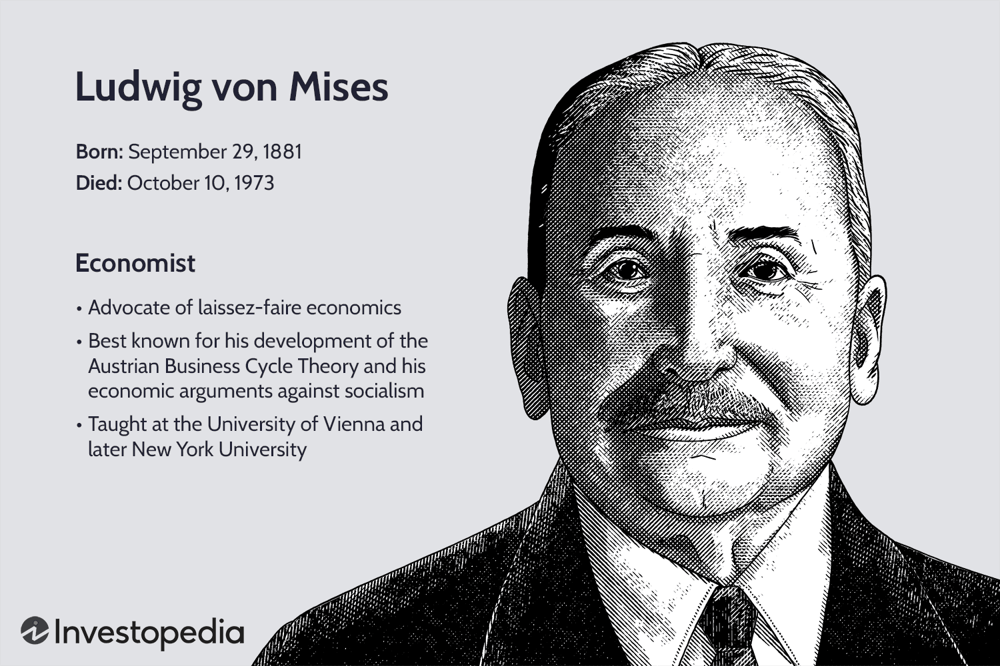

## Table of Contents

## What is a crack-up boom?

A crack-up boom is a term used in economics to describe a situation where people lose faith in the value of money. It happens when inflation gets out of control, and prices rise so fast that people start to believe that money will soon be worthless. Because of this, they rush to spend their money on anything they can, causing prices to rise even more quickly.

This cycle can lead to a complete collapse of the economy. As more and more people spend their money quickly, the value of money drops even faster. Eventually, the currency might become useless, and the economy can fall apart. This is why central banks try to control inflation and keep the value of money stable.

## How does a crack-up boom differ from other economic phenomena?

A crack-up boom is different from other economic phenomena because it involves a very fast and extreme loss of faith in money. In a crack-up boom, people think that money will soon be worthless, so they rush to spend it on anything they can. This causes prices to go up very quickly, which makes people want to spend their money even faster. This cycle can lead to the complete breakdown of the economy. Other economic problems, like recessions or depressions, don't involve this kind of panic and rapid spending.

Unlike inflation, which is a general increase in prices over time, a crack-up boom happens much faster and leads to a total collapse of the currency's value. With inflation, people might still believe that money has some value, even if it's less than before. But in a crack-up boom, they think money will be worthless very soon. This difference makes a crack-up boom much more dangerous and harder to control than regular inflation.

## What are the key characteristics of a crack-up boom?

A crack-up boom happens when people suddenly stop believing in the value of their money. They think that the money they have will soon be worth nothing, so they rush to spend it on anything they can buy. This causes prices to go up very quickly because everyone is trying to get rid of their money at the same time. 

As prices keep going up faster and faster, people's belief that money will soon be worthless gets even stronger. This makes them spend their money even more quickly, which makes prices rise even more. This cycle can keep going until the money becomes totally worthless, and the whole economy falls apart.

## Can you explain the economic theory behind crack-up booms?

The economic theory behind crack-up booms comes from the idea that money is only valuable if people believe it has value. When people start to think that their money will soon be worth nothing, they rush to spend it on anything they can. This causes prices to go up very quickly because everyone is trying to get rid of their money at the same time. As prices rise faster and faster, people's belief that money will soon be worthless gets even stronger. This makes them spend their money even more quickly, which makes prices rise even more.

This cycle can keep going until the money becomes totally worthless, and the whole economy falls apart. Economists call this a crack-up boom because it's like a big explosion that happens very quickly. It's different from other economic problems because it involves this sudden and extreme loss of faith in money. Central banks try to stop crack-up booms by controlling inflation and keeping the value of money stable, but if people's trust in money is lost, it can be very hard to stop a crack-up boom from happening.

## What role does inflation play in a crack-up boom?

Inflation is like a big part of what makes a crack-up boom happen. When inflation gets really high, it means that prices are going up a lot. People start to worry that their money will be worth less and less. If inflation keeps going up and up, people might think that soon their money will be worth nothing at all. This fear makes them want to spend their money as fast as they can, which makes prices go up even more.

This cycle of high inflation and people spending their money quickly can lead to a crack-up boom. In a crack-up boom, everyone is trying to get rid of their money before it becomes worthless. This makes prices go up so fast that it can cause the whole economy to fall apart. So, inflation is really important in a crack-up boom because it's what starts the panic and makes people lose trust in their money.

## What are the stages of a crack-up boom?

A crack-up boom starts when people begin to worry that their money will soon be worth nothing. This happens because of very high inflation, where prices are going up so fast that people think their money will lose all its value soon. When people start to feel this way, they rush to spend their money on anything they can. They want to buy things before their money becomes worthless. This makes prices go up even faster because everyone is trying to spend their money at the same time.

As prices keep going up faster and faster, people's belief that their money will soon be worthless gets even stronger. This makes them spend their money even more quickly, which makes prices rise even more. This cycle can keep going until the money becomes totally worthless, and the whole economy falls apart. This is the final stage of a crack-up boom, where the currency loses all its value, and the economy collapses because nobody wants to use the money anymore.

## Can you provide historical examples of crack-up booms?

One famous example of a crack-up boom happened in Germany in the 1920s. After World War I, Germany had a lot of debt and had to pay a lot of money to other countries. This made their money, called the mark, lose value. Prices started going up very fast, and people began to think that the mark would soon be worth nothing. They rushed to spend their money on anything they could, which made prices go up even faster. This cycle kept going until the mark became totally worthless, and people used it to light fires or as wallpaper. This is a classic example of a crack-up boom because it shows how quickly people can lose trust in their money.

Another example happened in Zimbabwe in the late 2000s. The government was printing too much money, which made prices go up very quickly. People started to think that their money, the Zimbabwean dollar, would soon be worth nothing. They rushed to spend it on anything they could, which made prices go up even faster. This cycle kept going until the Zimbabwean dollar became totally worthless. The government had to stop using it and start using other countries' money instead. This shows how a crack-up boom can happen when people lose trust in their money because of very high inflation.

## How did the Weimar Republic's hyperinflation relate to a crack-up boom?

In the 1920s, the Weimar Republic in Germany went through a time of hyperinflation. This means that prices were going up very fast because the government was printing too much money. They had to do this because they had a lot of debt from World War I and had to pay money to other countries. As prices kept going up, people started to think that their money, called the mark, would soon be worth nothing. They rushed to spend their money on anything they could, which made prices go up even faster.

This cycle of spending and rising prices is what economists call a crack-up boom. In the Weimar Republic, it got so bad that the mark became totally worthless. People used it to light fires or as wallpaper because it was worth less than the paper it was printed on. This shows how a crack-up boom can happen when people lose trust in their money because of very high inflation. It's a clear example of how quickly an economy can fall apart when people think their money will soon be worth nothing.

## What were the consequences of the crack-up boom in Zimbabwe in the early 2000s?

In the early 2000s, Zimbabwe went through a crack-up boom because of very high inflation. The government was printing too much money, which made prices go up very quickly. People started to think that their money, the Zimbabwean dollar, would soon be worth nothing. They rushed to spend it on anything they could, which made prices go up even faster. This cycle kept going until the Zimbabwean dollar became totally worthless. People had to use other countries' money to buy things because their own money was no good anymore.

The consequences of this crack-up boom were very bad for Zimbabwe. People lost all their savings because their money became worthless. Many people couldn't afford to buy food or other things they needed. The economy fell apart, and a lot of people lost their jobs. The government had to stop using the Zimbabwean dollar and start using other countries' money instead. This shows how a crack-up boom can ruin an economy and make life very hard for the people who live there.

## How can governments and central banks prevent or mitigate the effects of a crack-up boom?

Governments and central banks can prevent or mitigate the effects of a crack-up boom by controlling inflation. They do this by making sure that they don't print too much money. If there's too much money, prices go up very fast, and people might start to think that their money will soon be worth nothing. To stop this from happening, central banks can raise interest rates. This makes it more expensive to borrow money, so people spend less, and prices don't go up as fast. By keeping inflation low, governments and central banks can help people keep trusting their money.

If a crack-up boom starts to happen, governments and central banks can take quick action to stop it. They might stop printing new money and even take some money out of the economy. This can help slow down the rise in prices and make people feel better about their money. Sometimes, they might need to change the currency to a new one that people trust more. By acting fast and making these changes, governments and central banks can help stop a crack-up boom before it ruins the economy.

## What are the long-term economic impacts of a crack-up boom on a country?

A crack-up boom can hurt a country's economy for a long time. When people stop believing in their money, it can take years to fix the damage. After a crack-up boom, people lose their savings because their money becomes worthless. This means they can't buy things they need, like food and medicine. Businesses close down because nobody wants to use the old money, and a lot of people lose their jobs. The whole economy can take a long time to get better because people are scared to trust money again.

Governments might have to change to a new kind of money to fix things. This can be hard and take a lot of time. Even with a new money, people might still be worried about another crack-up boom happening. This can make them spend less and save more, which can slow down the economy. It can also make it hard for the country to borrow money from other countries because nobody trusts their money anymore. So, a crack-up boom can make life hard for a long time after it happens.

## Are there any current economic situations that could potentially lead to a crack-up boom?

Right now, there are a few places in the world where things could get bad enough to cause a crack-up boom. One place to watch is Venezuela. They've been having big problems with their money for a while. Prices are going up very fast because the government is printing too much money. If this keeps going, people might start to think that their money will soon be worth nothing, and they might rush to spend it all at once. This could start a crack-up boom.

Another place to keep an eye on is Lebanon. They're also having trouble with their money, and prices are going up quickly. People are already worried about their savings, and if things get worse, they might start to panic and spend their money before it becomes worthless. If that happens, it could lead to a crack-up boom. Both of these places show how important it is for governments to control inflation and keep people trusting their money.

## What is the Crack-Up Boom and how can it be understood?

A crack-up boom is an economic phenomenon characterized by rapid inflation and a subsequent collapse of the monetary system. This situation arises when central banks enforce an expansive monetary policy, continually injecting large amounts of money into the economy. Initially, this may result in a booming economic environment as increased [liquidity](/wiki/liquidity-risk-premium) fuels spending and investment. However, when monetary expansion outpaces economic growth, it can lead to unmanageable inflation levels.

Historically, central banks often implement such policies to sustain economic growth or escape recessionary pressures. They lower interest rates and purchase government securities to increase the money supply. While these actions can boost economic activity in the short term, a persistent lack of monetary control may result in inflated asset prices and speculative bubbles. When these bubbles burst, financial instability follows. Additionally, as inflation accelerates, the real value of currency diminishes, eroding public confidence in monetary value.

The scenario progresses to a point where individuals attempt to convert their money holdings into tangible assets as rapidly as possible to retain value, exacerbating the currency's depreciation. This behavior is described by the equation of exchange in economics, given as:

$$
MV = PQ
$$

Where:
- $M$ is the total money supply in circulation,
- $V$ is the velocity of money, or the rate at which money is exchanged,
- $P$ denotes the price level,
- $Q$ represents the real output or quantity of goods and services produced.

In a crack-up boom, while $M$ increases sharply with continual monetary policy easing, the velocity ($V$) also spikes as people rapidly spend their currency, fearing its imminent depreciation. This behavior further drives up the price level ($P$).

Over time, if unchecked, the currency loses all semblance of value, leading to systemic economic collapse. Individuals' erosion of trust in money as a stable store of value marks the tipping point towards a severe economic crisis. In summary, crack-up booms illustrate the dangers of unchecked monetary policy, where initial exuberance morphs into economic despair as inflation spirals out of control.

## References & Further Reading

[1]: Von Mises, L. (1953). ["The Theory of Money and Credit."](https://mises.org/library/book/theory-money-and-credit) Yale University Press.

[2]: Hanke, S. H., & Krus, N. (2012). ["World Hyperinflations."](https://papers.ssrn.com/sol3/papers.cfm?abstract_id=2130109) Cato Working Paper.

[3]: Fergusson, A. (1975). ["When Money Dies: The Nightmare of the Weimar Hyperinflation."](https://archive.org/details/when-money-dies-the-nightmare-of-deficit-spending) William Kimber & Co.

[4]: Lopez de Prado, M. (2018). ["Advances in Financial Machine Learning."](https://www.amazon.com/Advances-Financial-Machine-Learning-Marcos/dp/1119482089) Wiley.

[5]: Aronson, D. R. (2006). ["Evidence-Based Technical Analysis: Applying the Scientific Method and Statistical Inference to Trading Signals."](https://www.amazon.com/Evidence-Based-Technical-Analysis-Scientific-Statistical/dp/0470008741) Wiley.

[6]: Chan, E. P. (2008). ["Quantitative Trading: How to Build Your Own Algorithmic Trading Business."](https://github.com/ftvision/quant_trading_echan_book) Wiley.

[7]: Jansen, S. (2020). ["Machine Learning for Algorithmic Trading."](https://github.com/stefan-jansen/machine-learning-for-trading) Packt Publishing.