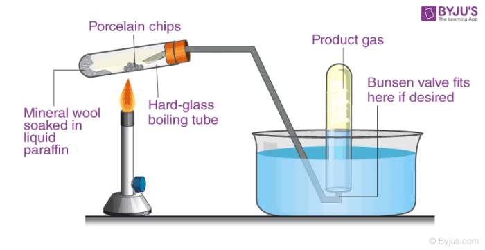

## Table of Contents

## What is cracking in the context of oil refining?

Cracking is a process used in oil refining to break down large, heavy hydrocarbon molecules into smaller, lighter ones. This is important because the smaller molecules are more valuable and useful, like gasoline and diesel. In the past, oil companies would just throw away the heavy parts of crude oil because they couldn't use them. But with cracking, they can turn those heavy parts into something useful.

There are different ways to do cracking, but the main ones are thermal cracking and catalytic cracking. Thermal cracking uses heat and pressure to break the molecules apart. It's been around for a long time but isn't used as much anymore. Catalytic cracking, on the other hand, uses a special material called a catalyst to help break the molecules. This method is more common today because it works better and makes more of the valuable products.

## Why is cracking important in the petroleum industry?

Cracking is really important in the petroleum industry because it helps turn heavy, less useful parts of crude oil into lighter, more valuable products like gasoline and diesel. Without cracking, oil companies would have to throw away a lot of the oil they get from the ground because they couldn't use it. By using cracking, they can make more of the stuff people need, like fuel for cars and trucks.

There are different ways to do cracking, but they all help make better use of the oil we have. Thermal cracking uses heat and pressure to break the heavy molecules apart, while catalytic cracking uses a special material called a catalyst to do the job. Catalytic cracking is more popular now because it works better and makes more of the good stuff. This means oil companies can make more money and waste less oil, which is good for everyone.

## What are the different types of cracking processes?

There are two main types of cracking processes in oil refining: thermal cracking and catalytic cracking. Thermal cracking is the older method where heavy oil molecules are broken down using just heat and pressure. This process was used a lot in the early days of oil refining, but it's not as common now because it doesn't work as well as other methods. It's like cooking the oil at a high temperature to break it apart, but it can be hard to control and doesn't always give the best results.

Catalytic cracking is the more modern and widely used method. It uses a special substance called a catalyst to help break down the heavy oil molecules into lighter ones. The catalyst makes the process faster and more efficient, and it can be adjusted to produce more of the products we want, like gasoline. Think of the catalyst as a helper that makes the job easier and gives better results. This method is used a lot in oil refineries today because it helps make more of the valuable products from crude oil.

There's also another type called hydrocracking, which is a bit different. Hydrocracking uses both a catalyst and hydrogen gas to break down the heavy oil molecules. This process can make even lighter and higher-quality products, like jet fuel and high-grade diesel. It's like combining the best parts of thermal and catalytic cracking to get the most out of the oil. Hydrocracking is more advanced and is used when refineries want to make very specific products.

## How does thermal cracking differ from catalytic cracking?

Thermal cracking and catalytic cracking are two ways to break down heavy oil into lighter, more useful stuff. Thermal cracking is the older way and it uses just heat and pressure to do the job. It's like cooking the oil at a really high temperature until it breaks apart. But this method isn't used as much anymore because it's hard to control and doesn't always make the best products. It's a bit like trying to cook something without knowing the exact recipe.

Catalytic cracking, on the other hand, uses a special helper called a catalyst to break down the heavy oil. The catalyst makes the process faster and more efficient, and it can be adjusted to make more of the products we want, like gasoline. It's like having a special tool that makes cooking easier and gives you better results. This method is used a lot in oil refineries today because it helps make more of the valuable products from crude oil.

## What are the main products obtained from cracking oil?

Cracking oil mainly helps make lighter and more useful products from heavy crude oil. The most important product from cracking is gasoline, which is used in cars and other vehicles. Other important products include diesel fuel, which is used in trucks and some cars, and jet fuel, which is used in airplanes. These lighter products are more valuable and in high demand, so cracking helps oil companies meet the needs of people and businesses.

Besides fuels, cracking also makes other useful things like kerosene, which can be used for heating and lighting, and liquefied petroleum gas (LPG), which is used for cooking and heating. Some of the lighter products from cracking can also be used to make chemicals for plastics and other materials. By turning heavy oil into these lighter products, cracking makes sure that less of the oil goes to waste and more of it can be used for important things.

## What is the role of a catalyst in catalytic cracking?

In catalytic cracking, the catalyst is like a helper that makes the process of breaking down heavy oil into lighter, useful products much easier and faster. The catalyst works by lowering the amount of energy needed to break the heavy molecules apart. This means the oil can be turned into things like gasoline and diesel more efficiently than if you just used heat and pressure alone.

The catalyst also helps control the cracking process so that it makes more of the products we want. It's like having a special tool that you can adjust to get the best results. Without the catalyst, it would be harder to make the right mix of products from the oil, and the process wouldn't be as good at turning heavy oil into something useful.

## How does the cracking process affect the quality of gasoline?

The cracking process can make gasoline better in a few ways. When heavy oil is cracked, it turns into lighter stuff like gasoline. This process can make the gasoline cleaner and more efficient because it breaks down the big, heavy molecules into smaller, lighter ones that burn better. This means the gasoline from cracking can have less of the bad stuff that makes engines dirty and can help cars run smoother.

But, the quality of the gasoline also depends on how the cracking is done. If the cracking process is done right, with the best methods and the right catalysts, it can make really good gasoline. But if it's not done well, the gasoline might not be as good. So, the cracking process is important for making better gasoline, but it has to be done carefully to get the best results.

## What are the environmental impacts of cracking?

Cracking oil can have some bad effects on the environment. One big problem is that cracking makes more greenhouse gases, like carbon dioxide. These gases trap heat in the air and make the Earth warmer, which can cause climate change. Cracking also makes other bad stuff, like sulfur dioxide and nitrogen oxides, which can make the air dirty and hard to breathe. These things can make people sick and hurt plants and animals.

But, there are also some good things about cracking. It helps us use more of the oil we get from the ground, so we don't have to throw away as much. This means we can get more useful stuff, like gasoline and diesel, from the same amount of oil. If we do cracking the right way, we can also make cleaner fuels that are better for the environment. So, while cracking can cause some problems, it can also help if we do it carefully and use the right methods.

## What technological advancements have been made in cracking processes?

Over the years, people have made a lot of improvements to the way they crack oil. One big change was moving from thermal cracking to catalytic cracking. Thermal cracking just used heat and pressure, but it was hard to control and didn't always make the best products. Catalytic cracking uses a special material called a catalyst to help break down the oil. This makes the process faster and better at making useful stuff like gasoline. Another cool thing is that we can now adjust the catalyst to make more of the products we want.

Another important advancement is something called hydrocracking. This method uses both a catalyst and hydrogen gas to break down the heavy oil. Hydrocracking can make even lighter and higher-quality products, like jet fuel and really good diesel. It's like combining the best parts of thermal and catalytic cracking to get the most out of the oil. These new ways of cracking help oil companies make more of the stuff people need and waste less oil, which is good for everyone.

## How do economic factors influence the choice of cracking method?

Economic factors play a big role in deciding which cracking method to use. The main thing companies look at is how much money they can make. Catalytic cracking is more popular now because it makes more of the good stuff like gasoline, which means more profit. But it also costs more to set up because you need the special catalyst. So, companies have to think about whether the extra money they'll make is worth the extra cost. They also need to think about how much oil they have and what kind of oil it is, because different oils work better with different cracking methods.

Another thing to think about is how the price of oil and the products from cracking changes over time. If the price of gasoline goes up, it might make sense to use a method that makes more gasoline, even if it costs more to set up. But if the price of oil goes down, companies might want to use a cheaper method like thermal cracking, even if it doesn't make as much of the good stuff. It's all about balancing the costs and the profits to make the best choice for the company.

## What are the challenges faced in scaling up cracking operations?

Scaling up cracking operations can be tough because it's not just about making everything bigger. One big challenge is the cost. Building bigger cracking units costs a lot of money, and companies have to think about whether they'll make enough extra money to cover those costs. Another challenge is making sure everything works right when it's bigger. When you scale up, small problems can become big ones, and it can be hard to keep the process running smoothly and safely. It's like trying to cook a bigger meal with the same recipe; you have to be careful to get it right.

Another issue is the environment. Bigger cracking operations can make more pollution, so companies have to find ways to keep the air and water clean. This can mean spending more money on special equipment to control pollution. Also, there's the challenge of getting enough oil to keep the bigger operation running. If there's not enough oil, or if the oil is too expensive, it might not make sense to scale up. It's all about balancing the need for more products with the costs and risks that come with making everything bigger.

## What future developments are expected in oil cracking technologies?

In the future, oil cracking technologies are expected to get even better at making useful products like gasoline and diesel while also being kinder to the environment. Scientists are working on new catalysts that can help break down heavy oil more efficiently and with less pollution. These new catalysts might use special materials that can do the job better than the ones we use now. There's also a lot of interest in using things like renewable energy to power the cracking process, which could make it cleaner and cheaper.

Another big area of focus is making the whole cracking process more flexible. This means being able to change the process to make different products depending on what people need. For example, if there's a big demand for jet fuel one year, the cracking units could be adjusted to make more of that. This flexibility could help oil companies make more money and waste less oil. Overall, future developments in oil cracking are all about making it more efficient, cleaner, and able to meet changing needs.

## References & Further Reading

[1]: Aldridge, Irene. *High-Frequency Trading: A Practical Guide to Algorithmic Strategies and Trading Systems*. John Wiley & Sons, 2013.

[2]: Bergstra, J., Bardenet, R., Bengio, Y., & Kégl, B. (2011). ["Algorithms for Hyper-Parameter Optimization."](https://dl.acm.org/doi/10.5555/2986459.2986743) Advances in Neural Information Processing Systems 24.

[3]: Lopez de Prado, Marcos. ["Advances in Financial Machine Learning"](https://www.amazon.com/Advances-Financial-Machine-Learning-Marcos/dp/1119482089).

[4]: Aronson, David. ["Evidence-Based Technical Analysis: Applying the Scientific Method and Statistical Inference to Trading Signals"](https://www.amazon.com/Evidence-Based-Technical-Analysis-Scientific-Statistical/dp/0470008741).

[5]: Jansen, Stefan. ["Machine Learning for Algorithmic Trading"](https://github.com/stefan-jansen/machine-learning-for-trading).

[6]: Chan, Ernest P. ["Quantitative Trading: How to Build Your Own Algorithmic Trading Business"](https://github.com/ftvision/quant_trading_echan_book).