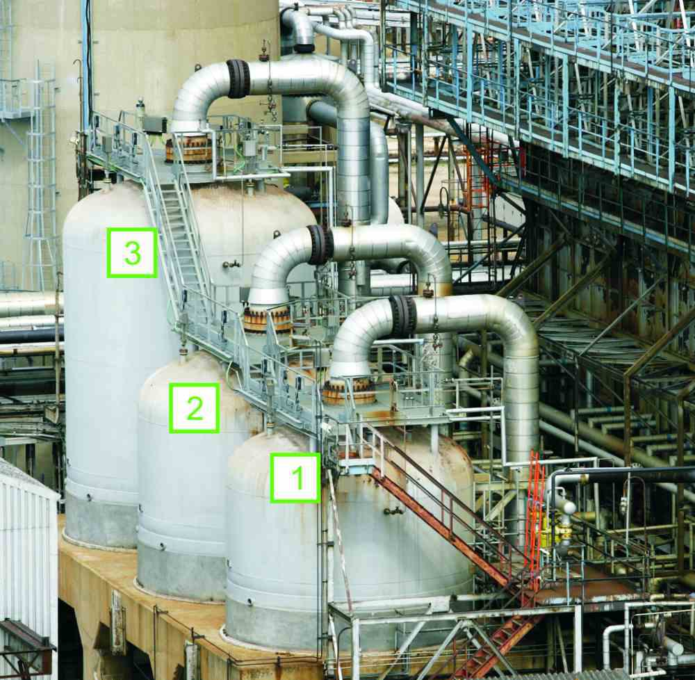

In the rapidly evolving world of finance, algorithmic trading has become a pivotal technology, revolutionizing how trades are executed by leveraging high-speed data processing capabilities. It enables traders to automatically implement strategies at speeds and frequencies far surpassing human ability. By utilizing sophisticated algorithms to analyze vast amounts of market data in real-time, algorithmic trading can execute trades based on pre-determined instructions concerning timing, price, and quantity, thus maximizing efficiency and reducing the likelihood of manual errors [1].

Despite the tremendous benefits algorithmic trading provides, the rise of digital trading platforms has underscored the necessity for stringent security measures. As these platforms handle sensitive financial data and facilitate high-value transactions, they represent attractive targets for cyber threats, necessitating robust defenses to protect against potential data breaches and unauthorized access.



Security encryption and data protection are fundamental to safeguarding the digital assets and information integral to algorithmic trading. Encryption serves as a critical mechanism to protect data integrity and confidentiality by converting information into a coded format, accessible only to authorized users with the correct decryption key. This ensures that even if data is intercepted, it remains unreadable to malicious actors. Data protection measures, including strong authentication protocols and secure data storage practices, further bolster the security framework within which algorithmic trading operates.

Understanding the significance of these security components is essential for traders and institutions aiming to protect their investments and maintain the integrity of their operations. This article examines these key aspects and delineates how they are intertwined with the functioning of algorithmic trading systems. By emphasizing the importance of security encryption and data protection, traders can better navigate the complexities of digital trading platforms, ensuring both rapid execution and robust protection of financial assets.

References:
[1] Aldridge, Irene. *High-Frequency Trading: A Practical Guide to Algorithmic Strategies and Trading Systems*. John Wiley & Sons, 2013.

## Table of Contents

## Understanding Algorithmic Trading

Algorithmic trading, often referred to as 'algo trading,' is a method of executing orders using automated and pre-programmed trading instructions. These instructions take into account variables such as timing, price, and [volume](/wiki/volume-trading-strategy) to optimize trading performance. The algorithms, deeply rooted in mathematical models and statistical computations, process a large array of market data instantly, making decisions and executing trades based on the parameters set by the user.

At its core, [algorithmic trading](/wiki/algorithmic-trading) seeks to capitalize on rapid market fluctuations, executing trades faster than a human trader ever could. The ability to make split-second decisions is critical in markets where prices can change multiple times within a fraction of a second. This speed is achieved through high-frequency trading ([HFT](/wiki/high-frequency-trading-strategies)), a subset of algo trading characterized by extremely high rates of trade execution. HFT firms typically use sophisticated algorithms to exploit minuscule price discrepancies across different markets or securities.

In algorithmic trading, mathematical models are fundamental. For instance, the moving average crossover strategy is a basic algorithmic trading model where buy and sell signals are generated based on moving averages of a security's price. More sophisticated models might involve regression analysis, time series forecasting, or [machine learning](/wiki/machine-learning) techniques to predict market trends and make trading decisions.

The adoption of algo trading has been significantly driven by institutional investors, such as mutual funds and hedge funds, aiming to reduce trading costs and mitigate the impact of market sentiments on their large-scale investments. The automation of trade processes allows for trades to be timed perfectly, minimizing market impact and enhancing [liquidity](/wiki/liquidity-risk-premium).

Individual traders, too, are increasingly embracing algorithmic trading due to advancements in technology and the availability of platforms that democratize access to complex trading algorithms. These platforms offer user-friendly interfaces with drag-and-drop functionalities, scripting environments for developing custom strategies in languages like Python, and [backtesting](/wiki/backtesting) features to test strategies against historical data.

Here's a simple example of a trading algorithm using Python, utilizing the popular backtesting library `[backtrader](/wiki/backtrader)`:

```python
import backtrader as bt

# Define a simple strategy
class SimpleMovingAverageStrategy(bt.Strategy):
    params = (('period', 15),)

    def __init__(self):
        self.sma = bt.indicators.SimpleMovingAverage(self.data.close, period=self.params.period)

    def next(self):
        if self.data.close[-1] < self.sma[-1] and self.data.close[0] > self.sma[0]:
            self.buy()  # Buy if price crosses above SMA
        elif self.data.close[-1] > self.sma[-1] and self.data.close[0] < self.sma[0]:
            self.sell()  # Sell if price crosses below SMA

# Example of running the algorithm
if __name__ == '__main__':
    cerebro = bt.Cerebro()
    data = bt.feeds.YahooFinanceData(dataname='AAPL', fromdate=datetime(2020, 1, 1), todate=datetime(2021, 1, 1))
    cerebro.adddata(data)
    cerebro.addstrategy(SimpleMovingAverageStrategy)
    cerebro.run()
```

This efficiency and capability to execute trades with precision are compelling reasons for the increasing adoption of algo trading among investors. However, the speed and automation also underscore the necessity for stringent checks and robust security measures, given the financial implications of potentially erroneous or malicious trades.

## Importance of Security in Algo Trading

Algorithmic trading platforms have become indispensable in today's financial markets, offering the ability to execute trades at unprecedented speeds based on complex algorithms. However, this efficiency and automation bring significant security challenges. The sensitivity and value of the data handled by these platforms make them attractive targets for cybercriminals.

One of the primary reasons security is paramount in algorithmic trading is the high risk of financial losses due to cyber threats. Attackers who manage to breach these systems can manipulate trade orders, resulting in substantial monetary losses. For instance, unauthorized access could allow a perpetrator to execute trades at inopportune times or alter algorithms to favor certain outcomes. Protecting these platforms from such intrusions is critical to maintaining financial stability and investor trust.

Data breaches pose another significant risk, as they can lead to the unauthorized exposure of sensitive information. This data often includes trading algorithms, which are proprietary and confidential, account information, and transactional data. If exposed, this information could be exploited by competitors or malicious actors to gain an unfair market advantage, leading to competitive disadvantages and loss of intellectual property.

Unauthorized access to algorithmic trading platforms can also have severe repercussions. A breach may grant access to a trader’s entire portfolio, allowing the intruder to alter positions, execute trades, or withdraw funds. This type of access not only jeopardizes individual accounts but can also have broader market implications. In worst-case scenarios, such breaches could cause a cascading effect leading to market disruption, especially if large institutional investors are affected.

Therefore, implementing robust security measures in algorithmic trading platforms is not just a technical necessity but a fundamental requirement to safeguard against the multifaceted threats that these platforms face. By ensuring the integrity, confidentiality, and availability of data, traders can protect themselves from the damaging consequences of cyber attacks, thus preserving both their assets and market stability.

## Key Security Considerations

In algorithmic trading, where transactions are executed based on sophisticated computational algorithms, securing the underlying systems is crucial to prevent unauthorized access and ensure operational integrity. Several key security considerations must be taken into account to uphold this vital aspect.

Platform Security is foundational in protecting algo trading environments. Encryption techniques safeguard data confidentiality by encoding sensitive information so that it can only be accessed by authorized users. Advanced encryption standards like AES (Advanced Encryption Standard) are commonly used for this purpose. Firewalls serve as barriers that manage and monitor incoming and outgoing network traffic based on predetermined security rules, helping to block unauthorized access. Multi-[factor](/wiki/factor-investing) authentication (MFA) adds an extra layer of security by requiring users to present multiple forms of verification before accessing the trading platform, significantly reducing the risk of breaches.

Data Protection is paramount to maintain the confidentiality and integrity of sensitive information such as trade orders, account details, and market data. This involves implementing access controls to restrict data access to authorized personnel only and using encryption to protect data at rest and in transit. Additionally, secure coding practices in software development can mitigate vulnerabilities that could be exploited by attackers.

Regulatory Compliance is another critical consideration, as algo trading platforms must adhere to financial industry standards and regulations designed to protect investors and maintain market integrity. Regulations such as the General Data Protection Regulation (GDPR) in the European Union require platforms to enforce strict data privacy measures and provide mechanisms for data breach notifications. Compliance with regulations not only protects the platform legally but also ensures that customer data is handled responsibly.

System Reliability ensures that trading operations continue smoothly without interruption, even in the face of unexpected challenges. High availability is achieved through designing systems that can withstand failures, such as using redundant network connections and load-balancing servers to distribute trading activities evenly. Disaster recovery capabilities are essential, enabling platforms to quickly restore operations and data in the event of a catastrophic failure, ensuring minimal disruption to trading activities.

By focusing on these key security considerations, algorithmic trading platforms can enhance their resilience against cyber threats while maintaining the trust and security needed for efficient trading.

## Best Practices for Securing Trading Algorithms

Implementing best practices for securing trading algorithms is essential to protect sensitive data and ensure the integrity of trading activities. Here are some key strategies to enhance security:

1. **Strong Passwords**: Employing strong, unique passwords is a fundamental security practice. Strong passwords should be at least 12 characters long, include a mix of uppercase and lowercase letters, numbers, and special characters. Using a password manager can help generate and store complex passwords securely. Password managers encrypt stored passwords, making it difficult for unauthorized users to access them.

2. **Two-Factor Authentication (2FA)**: Adding an extra layer of security beyond just a password is crucial. 2FA requires users to provide two forms of identification before accessing an account. This typically involves something the user knows, such as a password, and something the user has, like a security token or a code sent to a mobile device. This method significantly reduces the risk of unauthorized access even if a password is compromised.

3. **Data Encryption**: Encrypting sensitive data and trading algorithms is vital to protect against unauthorized access. Encryption involves transforming data into a secure format that can only be decrypted and read by someone who holds the correct key. Common encryption protocols such as AES (Advanced Encryption Standard) are widely used for securing sensitive information. For example, Python can be used to encrypt data using the `cryptography` library:

   ```python
   from cryptography.fernet import Fernet

   # Generate a key
   key = Fernet.generate_key()
   cipher = Fernet(key)

   # Encrypt data
   message = b"Trade Algorithm"
   encrypted_data = cipher.encrypt(message)

   # Decrypt data
   decrypted_data = cipher.decrypt(encrypted_data)
   ```

4. **Regular Security Audits**: Conducting periodic security audits can help identify and mitigate potential vulnerabilities in trading systems. Security audits involve a comprehensive review of system architecture, code, and processes to detect weaknesses. These audits should include penetration testing, which simulates cyber attacks to evaluate the robustness of security measures. By adopting a proactive stance, organizations can address potential risks before they can be exploited by malicious actors.

By integrating these best practices, traders can significantly strengthen the security of their trading algorithms, ensuring that their investments remain secure against potential threats.

## Selecting a Secure Algo Trading Platform

When selecting a secure algorithmic trading platform, evaluating the platform's security measures is crucial. These measures should encompass robust encryption techniques to protect data during transmission and storage. Encryption acts as a barrier, transforming sensitive information into unreadable code to unauthorized individuals, thus safeguarding trade orders and user credentials.

Compliance with industry regulations such as the General Data Protection Regulation (GDPR) or the Financial Industry Regulatory Authority (FINRA) rules is another critical aspect of ensuring platform security. Platforms that conduct regular compliance checks and security audits tend to have higher reliability levels, offering traders peace of mind regarding the safety of their investments.

Researching a platform's features reveals the extent of its security capabilities. Ideally, a platform should provide firewall protection, intrusion detection systems, and secure socket layer (SSL) certificates to ensure data integrity and security. A track record of reliability, demonstrated through consistent uptime and strong data protection policies, serves as an indicator of a platform's trustworthiness.

User experience plays a vital role in platform security. A user-friendly interface can minimize user errors, which often serve as entry points for security breaches. Comprehensive support, including tutorials and customer service, further enhances the platform's security posture by assisting users in navigating the system effectively and securely.

In conclusion, selecting a secure algorithmic trading platform is a multi-faceted process that requires careful scrutiny of the platform's security infrastructure and user experience. By considering these factors, traders can mitigate risks and ensure the safety of their digital assets.

## Conclusion

As algorithmic trading becomes increasingly prevalent across financial markets, the imperative of securing trading systems has never been more paramount. The sophisticated algorithms that execute trades at unprecedented speeds also usher in a spectrum of security challenges that must be adeptly managed to protect financial assets and sensitive data. 

By implementing robust security measures, traders can mitigate the risks associated with cyber threats, unauthorized access, and data breaches. Critical components such as encryption, firewalls, and multi-factor authentication help create a secure trading environment where sensitive information is safeguarded. Ensuring regular compliance checks with industry regulations further fortifies the system against potential vulnerabilities that could lead to legal repercussions or financial loss.

Selecting the right trading platform is equally vital, as platforms with comprehensive security features and a proven track record of reliability bolster trader confidence and protect investments. Features such as user-friendly interfaces and responsive support teams contribute to minimizing operational errors, thereby enhancing security indirectly. 

In conclusion, the synergy of advanced security practices and strategically chosen platforms empowers traders to fully exploit the efficiency and speed of algorithmic trading, all while maintaining the integrity and safety of their investments.

## References & Further Reading

[1]: Aldridge, Irene. *High-Frequency Trading: A Practical Guide to Algorithmic Strategies and Trading Systems*. John Wiley & Sons, 2013.

[2]: Bergstra, J., Bardenet, R., Bengio, Y., & Kégl, B. (2011). ["Algorithms for Hyper-Parameter Optimization."](https://dl.acm.org/doi/10.5555/2986459.2986743) Advances in Neural Information Processing Systems 24.

[3]: Lopez de Prado, Marcos. ["Advances in Financial Machine Learning"](https://www.amazon.com/Advances-Financial-Machine-Learning-Marcos/dp/1119482089).

[4]: Aronson, David. ["Evidence-Based Technical Analysis: Applying the Scientific Method and Statistical Inference to Trading Signals"](https://www.amazon.com/Evidence-Based-Technical-Analysis-Scientific-Statistical/dp/0470008741).

[5]: Jansen, Stefan. ["Machine Learning for Algorithmic Trading"](https://github.com/stefan-jansen/machine-learning-for-trading).

[6]: Chan, Ernest P. ["Quantitative Trading: How to Build Your Own Algorithmic Trading Business"](https://github.com/ftvision/quant_trading_echan_book).