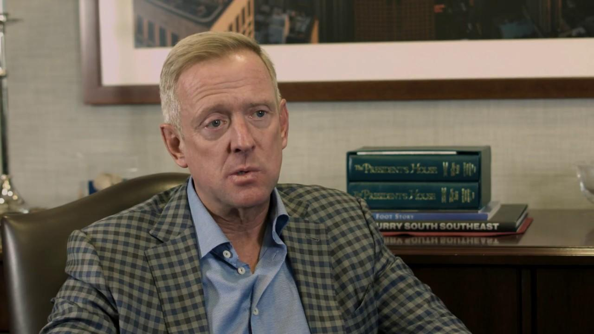

## Table of Contents

## Who is Craig S. Donohue?

Craig S. Donohue is a business leader who used to be the CEO of the CME Group. The CME Group is a big company that helps people trade things like stocks and other financial stuff. He started working there in 1988 and became the CEO in 2004. He helped the company grow a lot and become one of the biggest in the world.

After leaving the CME Group in 2012, Craig has been doing other things. He now helps other companies as a board member and advisor. He also spends time giving talks and sharing his knowledge about business and finance. People respect him a lot because of his experience and success.

## What is Craig S. Donohue's professional background?

Craig S. Donohue started his career at the Chicago Mercantile Exchange in 1988. He worked his way up and became the CEO of the CME Group in 2004. The CME Group is a big company that helps people trade financial products like stocks and futures. During his time as CEO, Craig helped the company grow a lot. He led the merger with the Chicago Board of Trade, which made the CME Group even bigger and more important in the world of finance.

After leaving the CME Group in 2012, Craig has been involved in different things. He now serves on the boards of other companies and gives them advice on how to run their businesses. He also speaks at events and shares his knowledge about finance and business with others. People look up to him because of his experience and the success he had at the CME Group.

## What are some key positions Craig S. Donohue has held?

Craig S. Donohue started working at the Chicago Mercantile Exchange in 1988. He moved up in the company and became the CEO of the CME Group in 2004. While he was CEO, he helped the company grow a lot. One big thing he did was lead the merger with the Chicago Board of Trade. This made the CME Group one of the biggest companies in the world for trading financial products like stocks and futures.

After leaving the CME Group in 2012, Craig has been doing different things. He now helps other companies by being on their boards and giving them advice on how to run their businesses. He also spends time talking at events and sharing what he knows about finance and business with others. People respect him a lot because of his experience and the success he had at the CME Group.

## What industries has Craig S. Donohue worked in?

Craig S. Donohue has mainly worked in the financial industry. He started his career at the Chicago Mercantile Exchange in 1988 and became the CEO of the CME Group in 2004. The CME Group is a big company that helps people trade financial products like stocks and futures. While he was CEO, he helped the company grow a lot by leading the merger with the Chicago Board of Trade. This made the CME Group one of the biggest companies in the world for trading financial stuff.

After leaving the CME Group in 2012, Craig has been involved in different parts of the financial industry. He now helps other companies by being on their boards and giving them advice on how to run their businesses. He also spends time talking at events and sharing what he knows about finance and business with others. People respect him a lot because of his experience and the success he had at the CME Group.

## What are some of Craig S. Donohue's major achievements?

Craig S. Donohue's biggest achievement was leading the CME Group as its CEO. He started at the Chicago Mercantile Exchange in 1988 and became CEO in 2004. During his time as CEO, he helped the company grow a lot. One of the biggest things he did was lead the merger with the Chicago Board of Trade. This made the CME Group one of the biggest companies in the world for trading financial stuff like stocks and futures.

After leaving the CME Group in 2012, Craig has been helping other companies. He now serves on the boards of different companies and gives them advice on how to run their businesses. He also speaks at events and shares what he knows about finance and business with others. People look up to him because of his experience and the success he had at the CME Group.

## How has Craig S. Donohue contributed to the financial sector?

Craig S. Donohue has made big contributions to the financial sector. He worked at the Chicago Mercantile Exchange starting in 1988 and became the CEO of the CME Group in 2004. While he was CEO, he helped the company grow a lot. One of the biggest things he did was lead the merger with the Chicago Board of Trade. This merger made the CME Group one of the biggest companies in the world for trading financial stuff like stocks and futures. His leadership helped the company become more important in the financial world.

After leaving the CME Group in 2012, Craig has continued to help the financial sector. He now serves on the boards of different companies and gives them advice on how to run their businesses. He also speaks at events and shares what he knows about finance and business with others. People look up to him because of his experience and the success he had at the CME Group. His work has helped many companies and people in the financial sector.

## What leadership roles has Craig S. Donohue played in?

Craig S. Donohue started working at the Chicago Mercantile Exchange in 1988. He worked his way up and became the CEO of the CME Group in 2004. As CEO, he helped the company grow a lot. One big thing he did was lead the merger with the Chicago Board of Trade. This made the CME Group one of the biggest companies in the world for trading financial stuff like stocks and futures. His leadership helped the company become more important in the financial world.

After leaving the CME Group in 2012, Craig has taken on different leadership roles. He now helps other companies by being on their boards and giving them advice on how to run their businesses. He also spends time talking at events and sharing what he knows about finance and business with others. People look up to him because of his experience and the success he had at the CME Group. His work has helped many companies and people in the financial sector.

## What is Craig S. Donohue's approach to business strategy?

Craig S. Donohue's approach to business strategy is all about growing and making things better. When he was the CEO of the CME Group, he focused on making the company bigger and more important. One big thing he did was to merge the CME Group with the Chicago Board of Trade. This made the company a lot bigger and helped it become one of the biggest places in the world for trading financial stuff like stocks and futures. He always looked for ways to make the company better and grow, which is why he is respected a lot in the business world.

After leaving the CME Group, Craig continued to use his approach to help other companies. He now serves on the boards of different companies and gives them advice on how to run their businesses. He shares what he knows about finance and business with others at events and talks. His strategy is to use his experience and knowledge to help companies grow and succeed. People look up to him because of his experience and the success he had at the CME Group.

## Can you describe any significant projects or initiatives led by Craig S. Donohue?

Craig S. Donohue led a very big project when he was the CEO of the CME Group. He helped the company grow a lot by merging it with the Chicago Board of Trade. This merger made the CME Group one of the biggest companies in the world for trading financial stuff like stocks and futures. It was a big deal because it helped the company become more important in the financial world. His leadership made sure the merger went well and that the company kept growing.

After leaving the CME Group, Craig has been involved in different projects and initiatives. He now helps other companies by being on their boards and giving them advice on how to run their businesses. He also speaks at events and shares what he knows about finance and business with others. People look up to him because of his experience and the success he had at the CME Group. His work has helped many companies and people in the financial sector.

## How does Craig S. Donohue view the future of financial markets?

Craig S. Donohue thinks the future of financial markets will keep changing a lot. He believes technology will play a bigger role. Things like computers and the internet will make trading faster and easier. He also thinks more people from around the world will start trading. This means financial markets will become more global.

He also believes that rules and regulations will be important. Governments and other groups will need to make sure trading is fair and safe. Craig thinks that companies like the CME Group will need to keep up with these changes. They will need to use new technology and follow new rules to stay successful.

## What challenges has Craig S. Donohue faced in his career, and how did he address them?

Craig S. Donohue faced a big challenge when he was the CEO of the CME Group. One of the biggest challenges was merging the CME Group with the Chicago Board of Trade. This was hard because it involved bringing two big companies together. There were a lot of details to work out, like how to combine their systems and make sure everyone was happy with the new company. Craig used his leadership skills to make sure the merger went smoothly. He worked hard to make sure the new company was strong and successful.

After leaving the CME Group, Craig faced another challenge. He had to figure out how to use his experience to help other companies. He started serving on the boards of different companies and giving them advice. This was tough because each company had its own problems and needs. Craig used his knowledge of finance and business to help these companies grow and succeed. He also started speaking at events to share what he learned with others. People respected him because he was able to help companies in different ways.

## What are some lesser-known facts about Craig S. Donohue's career and personal life?

Craig S. Donohue has had a long career in finance, but not everyone knows that he started at the Chicago Mercantile Exchange in a very junior role. He worked his way up from the bottom, showing a lot of hard work and dedication. Before becoming CEO, he held many different positions within the company, learning about every part of the business. This gave him a strong understanding of how the company worked, which helped him when he became CEO.

Outside of his work, Craig is known to be a family man. He enjoys spending time with his wife and children, often taking them on vacations. He also likes to stay active and is a big fan of golf. Many people don't know that he has been involved in charity work, helping to support education and health programs. His personal life shows that he values family, staying active, and giving back to the community.

## References & Further Reading

[1]: Lo, A. W. (2004). ["The Adaptive Markets Hypothesis: Market Efficiency from an Evolutionary Perspective."](https://papers.ssrn.com/sol3/papers.cfm?abstract_id=602222) The Journal of Portfolio Management, 30(5), 15-29.

[2]: ["Advances in Financial Machine Learning"](https://www.amazon.com/Advances-Financial-Machine-Learning-Marcos/dp/1119482089) by Marcos Lopez de Prado

[3]: Bodie, Z., Kane, A., & Marcus, A. J. (2014). ["Investments"](https://books.google.com/books/about/EBOOK_Investments_Global_edition.html?id=BMsvEAAAQBAJ) (10th Ed.). McGraw-Hill Education.

[4]: O'Hara, M. (2015). ["High Frequency Market Microstructure."](https://www.sciencedirect.com/science/article/pii/S0304405X15000045) Annual Review of Financial Economics, 7, 133-152.

[5]: Hull, J. C. (2017). ["Options, Futures, and Other Derivatives"](https://www.semanticscholar.org/paper/Options%2C-Futures%2C-and-Other-Derivatives-Hull/89bdee500c8623864fc9eb7a471546aa713acc44) (9th Ed.). Pearson.