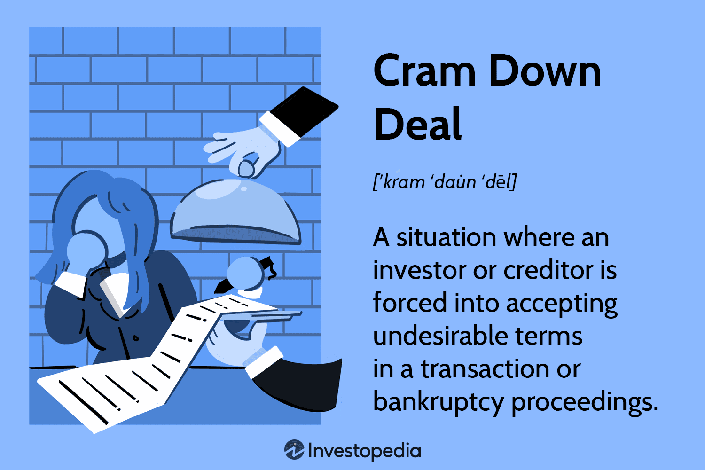

## Table of Contents

## What is a cram-down deal?

A cram-down deal is a type of financial arrangement that happens during bankruptcy. It allows a court to approve a reorganization plan even if some creditors or shareholders don't agree with it. This can happen if the court thinks the plan is fair and the best option available.

In a cram-down deal, the court can change the terms of loans or the value of assets to make the plan work. For example, a court might lower the amount a debtor has to pay back to a creditor. This can help the debtor get back on their feet while still giving creditors something in return. It's called a "cram-down" because the court is essentially forcing the plan on those who disagree.

## How does a cram-down deal work in bankruptcy?

In bankruptcy, a cram-down deal happens when a court approves a reorganization plan even if some creditors or shareholders don't agree. The court can change the terms of loans or the value of assets to make the plan work. This helps the person or company in bankruptcy to start fresh while still giving something back to the creditors.

For example, if someone owes money on a car and files for bankruptcy, the court might say they only have to pay back what the car is worth now, not the full loan amount. This is called a cram-down because the court is forcing the new terms on the creditor, even if they don't like it. The goal is to find a fair solution that helps everyone involved.

## What are the key elements of a cram-down deal?

A cram-down deal happens when a court in bankruptcy says it's okay to change a plan even if some people who are owed money don't agree. The main idea is that the court can decide to lower how much someone has to pay back. This can help the person or company going through bankruptcy to start over and still give something to the people they owe money to. It's called a cram-down because the court is making the new rules stick, even if some creditors don't want them.

For example, if someone has a loan on a car and they file for bankruptcy, the court might say they only need to pay what the car is worth now, not the whole loan. This can make it easier for the person to keep the car and still pay something back. The court looks at what's fair and what will help the person or company the most, while also trying to be fair to the people who lent the money.

## In what situations might a cram-down deal be used?

A cram-down deal might be used when someone or a company is going through bankruptcy and they can't agree with everyone they owe money to on a plan to pay it back. The court can step in and say, "This is the best we can do," even if some people don't like it. This happens a lot when the person or company wants to keep important things like their home or business equipment but can't afford to pay back the full amount they owe.

For example, if someone owes more on their house than it's worth, a cram-down deal could let them keep the house by only paying what it's worth now, not the whole mortgage. This helps them stay in their home and gives the bank something back, even if it's less than they wanted. Courts use cram-down deals to find a middle ground that helps the person or company start fresh while still being fair to the people they owe money to.

## Who are the main parties involved in a cram-down deal?

The main parties involved in a cram-down deal are the debtor and the creditors. The debtor is the person or company that owes money and is going through bankruptcy. They want to keep important things like their home or business equipment but can't pay back the full amount they owe. The creditors are the people or companies that lent money to the debtor. They want to get as much of their money back as possible.

The court is also a key player in a cram-down deal. It's the court's job to decide if the plan is fair and the best option available, even if some creditors don't agree. The court can change the terms of loans or the value of assets to make the plan work. This helps the debtor get back on their feet while still giving creditors something in return.

## What are the legal requirements for a cram-down deal to be approved?

For a cram-down deal to be approved, the court has to make sure that the plan is fair and follows the law. The plan needs to be in the best interest of the creditors, meaning it should give them at least as much as they would get if the debtor's assets were sold off. The court also checks if the debtor can actually follow through with the plan, looking at things like their income and how much they can afford to pay back.

The court also needs to make sure that the plan treats all creditors fairly. This means that one group of creditors can't be favored over another without a good reason. If the plan meets these requirements and the court thinks it's the best way to help the debtor start fresh while still giving something back to the creditors, then the cram-down deal can be approved. Even if some creditors don't agree, the court can still force the plan through if it meets these legal standards.

## How does a cram-down deal affect creditors?

A cram-down deal can change things for creditors. It means they might get less money back than they expected. If someone owes money on a car or a house and the court says they only have to pay what it's worth now, the creditor gets less than the full loan amount. This can be tough for creditors because they were counting on getting all their money back. But, the good thing is that they still get something instead of nothing, which can happen if the person or company goes bankrupt and can't pay at all.

Creditors might not like cram-down deals because they feel like they're being forced to accept less. But the law says the court has to make sure the plan is fair and gives creditors at least as much as they would get if the debtor's stuff was sold off. So, even though creditors might not get everything they want, the cram-down deal tries to find a middle ground that helps the debtor start over and still gives something back to the creditors.

## What are the advantages of a cram-down deal for a debtor?

A cram-down deal can really help someone who owes a lot of money. If they're going through bankruptcy, it lets them keep important things like their home or car by paying less than they originally owed. This can make a big difference because it means they don't have to lose everything. Instead, they can keep what they need to start fresh and get back on their feet.

For example, if someone owes more on their house than it's worth, a cram-down deal could let them keep the house by only paying what it's worth now. This helps them stay in their home and gives them a chance to rebuild their life. It's a way for the court to find a fair solution that helps the person in debt while still making sure the people they owe money to get something back.

## Can you explain the process of negotiating a cram-down deal?

When someone wants to negotiate a cram-down deal, they start by talking with their creditors about a new plan to pay back what they owe. They might say, "I can't pay the full amount, but I can pay what my car or house is worth now." This is a way to keep important things without having to pay back everything. The debtor and the creditors try to find a middle ground that works for everyone. If they can't agree, the debtor can ask the court to step in and help.

The court looks at the plan and checks if it's fair and if it gives the creditors at least as much as they would get if the debtor's stuff was sold off. The court also makes sure the debtor can actually follow the plan, looking at things like their income and what they can afford to pay. If the court thinks the plan is the best option, it can approve the cram-down deal, even if some creditors don't agree. This helps the debtor start fresh while still giving something back to the people they owe money to.

## What are some common challenges or obstacles in implementing a cram-down deal?

One big challenge in implementing a cram-down deal is getting everyone to agree. The debtor and creditors have to talk and try to find a plan that works for both sides. But sometimes, creditors don't want to accept less money than they're owed. They might argue and fight the plan, which can make things harder. The court has to step in and decide what's fair, but this can take time and cause more stress for everyone involved.

Another obstacle is making sure the debtor can actually follow the new plan. The court looks at the debtor's income and what they can afford to pay. If the debtor can't keep up with the payments, the cram-down deal won't work. This means the debtor has to be honest about what they can do and the court has to be careful to set a plan that's realistic. If the plan is too hard to follow, it could fail, and the debtor might end up back where they started.

## How do cram-down deals differ across different jurisdictions?

Cram-down deals can work differently in different places because each country or area has its own laws about bankruptcy. In the United States, for example, cram-down deals are part of the bankruptcy code and can be used in both Chapter 11 (for businesses) and Chapter 13 (for individuals). The court can change the terms of loans or the value of assets to make a plan work, even if some creditors don't agree. But in other countries, the rules might be different. Some places might not allow cram-downs at all, or they might have stricter rules about when they can be used.

Even within the same country, different courts might handle cram-down deals a bit differently. Judges have some freedom to decide what's fair and what will work best for everyone involved. This means that what one judge might approve in one court, another judge might not approve in a different court. So, it's important for people going through bankruptcy to understand the specific laws and how they are applied in their area.

## What are some notable examples of cram-down deals in recent history?

One well-known example of a cram-down deal happened with the American car company General Motors (GM) in 2009. GM was in big trouble and filed for bankruptcy. The court approved a plan that let GM keep running by cutting down what they owed to some creditors. This helped GM get back on its feet, but some creditors got less money than they expected. The deal was important because it saved a lot of jobs and kept the company going.

Another example is the case of Pacific Gas and Electric Company (PG&E) in California. In 2019, PG&E filed for bankruptcy because of huge costs from wildfires. The court approved a cram-down deal that changed how much PG&E had to pay to people affected by the fires and to other creditors. This helped PG&E stay in business and keep providing electricity to millions of people. But, like with GM, some creditors and wildfire victims got less money than they wanted.

## References & Further Reading

[1]: Bolton, Patrick, and David A. Skeel Jr. "Inside the Cram Down: An Improbable Revival?" *Yale Law Journal*, vol. 120, no. 1, 2010, pp. 57-103.

[2]: Gilson, Stuart C. "Managing Default: Some Evidence on How Firms Choose between Workouts and Chapter 11." *The Journal of Applied Corporate Finance*, vol. 3, no. 2, 1990, pp. 62-70.

[3]: Adler, Barry E. "Bankruptcy and Risk Allocation." *Cornell Law Review*, vol. 77, 1992, pp. 439-492.

[4]: Aldridge, Irene. *High-Frequency Trading: A Practical Guide to Algorithmic Strategies and Trading Systems*. Wiley, 2013.

[5]: Narang, Rishi K. *Inside the Black Box: A Simple Guide to Quantitative and High-Frequency Trading*. Wiley, 2013.

[6]: Hendershott, Terrence, and Albert J. Menkveld. "Price Pressures." *Journal of Financial Economics*, vol. 106, no. 3, 2012, pp. 349-370.