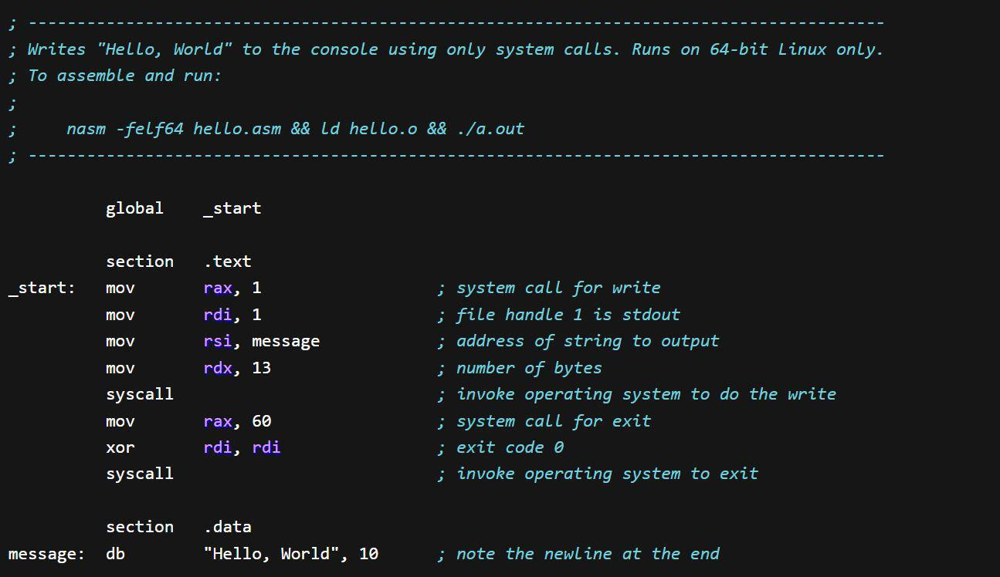

The world of investing is filled with numerous strategies, each tailored to maximize returns and minimize risks. One such intriguing strategy is the Cramer Bounce, named after Jim Cramer, the charismatic host of CNBC's "Mad Money." Cramer's recommendations often trigger immediate market reactions, leading to a temporary surge in the stock prices he endorses—a phenomenon widely known as the Cramer Bounce. This article explores the implications of this market behavior and its relevance in algorithmic trading, a field that seeks to automate the response to such media-driven price movements.

Through detailed analysis, we aim to understand the mechanics behind the Cramer Bounce, assess its effectiveness, and investigate how investors might capitalize on this pattern in their investment strategies. This exploration will provide insights into the temporary price changes that occur following Cramer's recommendations and discuss the potential for integrating such phenomena into algorithmic trading models. We invite readers to examine the complexities and opportunities presented by this financial strategy as we navigate the interconnected world of media influence and stock market dynamics.



## Table of Contents

## Understanding the Cramer Bounce

The Cramer Bounce is a notable phenomenon in the stock market, characterized by a sudden increase in the price of a stock following a recommendation by Jim Cramer, the host of CNBC's 'Mad Money'. This effect is primarily driven by Cramer's substantial influence and the reactive nature of his audience, who may act quickly on the stock tips presented on his show.

Empirical studies have quantified this effect, indicating an average price increase of approximately 3% following Cramer's recommendations. However, it is important to note that this price bump is often ephemeral, typically dissipating as market participants reevaluate the stock's intrinsic value.

The impact of the Cramer Bounce tends to be more pronounced in stocks of smaller companies. Such companies often have lower trading volumes and reduced market visibility, making their stock prices more susceptible to fluctuations induced by new information or endorsements. For instance, a recommendation could lead to a temporary increase in buying pressure, thus amplifying the surge in stock price.

For investors aiming to capitalize on the Cramer Bounce, comprehending these dynamics is crucial. Recognizing the transient nature of the bounce and its propensity to affect small-cap stocks can aid in formulating strategies that either benefit from or mitigate against potential risks associated with such rapid price changes. Employing data analytics and market timing can further enhance an investor's capacity to make informed decisions in response to these media-influenced movements.

## Jim Cramer: The Man Behind the Bounce

Jim Cramer is a prominent television personality and former [hedge fund](/wiki/hedge-fund-trading-strategies) manager known for his dynamic and often emphatic style of stock recommendation. He is widely recognized as the host of CNBC's "Mad Money," a financial television program that provides insight into market trends and investment strategies. In this role, Cramer captures the attention of a broad audience, providing financial advice and stock picks, often with a distinctive theatrical flair intended to educate and entertain viewers.

Cramer's career is built on a solid foundation of financial expertise. He founded Cramer Berkowitz, a hedge fund where he honed his skills in stock selection and portfolio management. His success in the financial industry extends to co-founding TheStreet, Inc., an influential financial news and services website offering independent market commentary and analysis. This platform further amplifies his voice in the financial media landscape, attracting investors and market enthusiasts alike seeking to leverage his insights.

Despite his achievements, Cramer's methods and investment philosophy are not without criticism. Some financial professionals and analysts caution against following his recommendations without additional scrutiny. Critics often argue that while Cramer provides valuable information, the volatile nature of stock markets requires a more analytical and cautious approach. They emphasize the importance of conducting one's own research and not solely relying on media personalities for investment decisions.

Cramer's influence in the stock market is substantial; his pronouncements can lead to significant short-term market movements, a phenomenon often referred to as the "Cramer Bounce." Stocks he recommends can experience a swift surge in price as his audience rushes to capitalize on his endorsements. This impact underscores the power of media figures in shaping investor behavior and market dynamics, placing Cramer among the most influential voices in financial media.

For investors, Cramer's recommendations present both opportunities and challenges. On the one hand, his insights can guide market participants towards potentially lucrative investments. On the other hand, the inherent risk and [volatility](/wiki/volatility-trading-strategies) associated with stock markets necessitate a balanced and well-considered investment strategy. Investors must weigh Cramer's advice against their financial goals, risk tolerance, and the intricate nature of market forces to make informed decisions.

## How the Cramer Bounce Works

The Cramer Bounce typically manifests when Jim Cramer recommends a stock on his show, prompting a vigorous response from his audience. Viewers often act on this new information, placing buy orders soon after the recommendation. This immediate demand surge can elevate the stock price, often noticeable by the next trading session. The subsequent price increase is generally short-lived, with research indicating that the stock prices often return to their pre-recommendation levels approximately 12 days later. Such patterns illustrate the transient nature of the Cramer Bounce.

The phenomenon is particularly pronounced among small-cap stocks. These stocks, typically smaller companies with lower market capitalizations, have less [liquidity](/wiki/liquidity-risk-premium) and market visibility compared to larger, well-established firms. Consequently, relatively smaller trade volumes can substantially impact their stock prices, leading to larger percentage changes. As a result, the influence of Cramer’s recommendations is magnified for these securities.

Recognizing these patterns enables traders and investors to create strategies tailored to either capitalize on or circumvent the Cramer Bounce. For instance, traders might time their transactions to capture the initial surge, subsequently selling before the price reverts. Others may choose to avoid investing in stocks subjected to this volatility. Such strategies necessitate a comprehensive understanding of the stock's behavior post-recommendation and the typical market response following media-influenced hype.

Utilizing [algorithmic trading](/wiki/algorithmic-trading) systems can further aid in identifying and reacting to these short-term movements. By monitoring Cramer’s recommendations and market data, algorithms can automatically execute trades based on expected price trajectories. However, the brevity of the Cramer Bounce mandates caution; strategies must be agile and robust enough to accommodate abrupt market changes.

## Validity and Research on the Cramer Bounce

Several academic studies have evaluated the Cramer Bounce, providing insights into its magnitude and transitory nature. Among these investigations, research conducted by Northwestern University identified an average return of 5.19% on stocks recommended by Jim Cramer. This uplift, while notable, is characteristically short-lived, reflecting the temporary boost in demand and subsequent price increases initiated by Cramer's televised endorsements. 

Empirical data from these studies emphasize that, despite an initial uptick following Cramer's recommendations, stock prices typically revert to their pre-recommendation levels as the immediate effects dissipate. This normalization process highlights the ephemeral impact of such media-driven market movements. Cramer's sell recommendations, conversely, tend to induce immediate price declines, which can persist longer than the positive spikes caused by buy recommendations. This asymmetry in price behavior showcases the influence Cramer wields, particularly in driving investor sentiment and short-term market trends.

These investigations into the Cramer Bounce also underscore a broader understanding within behavioral finance—the significant yet fleeting impact that media figures and personalities can exert on market prices. They underscore the tendency of investor behavior to be swayed by high-profile media endorsements, resulting in short-term trading opportunities but necessitating caution due to the unpredictable longevity of these movements. The Cramer Bounce serves as a case study of how media visibility can trigger waves of investor activity, reflecting the intricate interplay between media-driven market forces and investor psychology.

## Incorporating the Cramer Bounce in Trading Algorithms

Algorithmic trading has transformed the landscape of financial markets, providing traders with powerful tools to capitalize on short-term price movements. One such opportunity arises from media-induced effects like the Cramer Bounce, which can be integrated into automated trading strategies for profit generation.

By capturing data on Jim Cramer’s stock recommendations, traders can develop algorithms that trigger buy or sell orders when a particular recommendation is made. These algorithms operate by predicting the impact of Cramer’s endorsement on stock prices, aiming to enter the market just as the price begins to move.

Key to successful algorithmic exploitation of the Cramer Bounce is the process of [backtesting](/wiki/backtesting). This involves using historical data to simulate how a strategy would have performed, allowing traders to refine their algorithms. Through statistical analysis and pattern recognition, traders can identify the typical price trajectory following Cramer's recommendations. For instance, they might look for an initial price jump followed by a stabilization or reversion to previous levels. A common approach is to use Python libraries such as Pandas for data manipulation and NumPy for numerical computations to perform such backtesting.

```python
import pandas as pd
import numpy as np

# Sample function to calculate potential profit from a Cramer Bounce strategy
def cramer_bounce_strategy(prices, buy_signal, sell_signal, cramer_recommendations):
    portfolio_profit = 0
    for i, rec in enumerate(cramer_recommendations):
        if rec == buy_signal:
            buy_price = prices[i]
            # Assuming a simple strategy to sell after a fixed period or condition
            sell_price = prices[i+10] if i+10 < len(prices) else prices[-1]
            portfolio_profit += (sell_price - buy_price) / buy_price
    return portfolio_profit

# Example usage with hypothetical data
prices = np.array([100, 102, 105, 108, 107, 110, 112, 115, 114])
cramer_recommendations = ['hold', 'buy', 'hold', 'buy', 'hold', 'buy', 'sell', 'hold', 'buy']
profit = cramer_bounce_strategy(prices, 'buy', 'sell', cramer_recommendations)
print(f"Total Profit from Cramer Bounce Strategy: {profit*100:.2f}%")
```

Despite the potential for profit, there are inherent challenges in relying on the Cramer Bounce as a trading strategy. The transient nature of the Bounce means that quick reactions are necessary; prices often normalize shortly after the initial movement, reducing the window for profitable trades. Furthermore, the influence of external factors, such as overall market conditions or news events, can alter the expected outcomes of the Bounce.

Understanding and adapting to market psychology is also crucial in algorithmic trading based on media recommendations. Algorithms must account for the collective behavior of investors who may act on Cramer’s advice, a reflection of behavioral finance principles. Psychological factors can cause unexpected volatility, reinforcing the need for traders to continuously adapt their strategies to changing conditions.

In conclusion, incorporating the Cramer Bounce into trading algorithms presents both opportunities and challenges. While there is potential for profit, success relies on comprehensive backtesting, careful risk management, and an acute understanding of market dynamics and investor behavior.

## Conclusion

The Cramer Bounce exemplifies the significant impact of financial media on stock prices and investor behavior. This phenomenon highlights how media personalities with substantial followings can temporarily shift market dynamics through influential stock recommendations. Observing the Cramer Bounce offers a glimpse into the behavioral finance concepts that drive such market movements. 

To capitalize on this phenomenon, investors must possess an in-depth understanding of market dynamics and the intricacies of investor psychology. The immediate response to stock tips on financial shows can create short-term trading opportunities, but the transient nature of this effect demands a strategic approach. 

Algorithmic trading emerges as a potent tool in leveraging the Cramer Bounce, allowing traders to automate responses to media-induced price fluctuations. By employing sophisticated algorithms that can swiftly process data and execute trades, investors may potentially profit from these temporary price changes. However, algorithmic strategies are not devoid of risks. They must account for the market's inherent volatility and the unpredictable nature of investor responses. Implementing algorithms requires robust backtesting and analysis to ensure they can adapt to changing market conditions.

As with any investment strategy, diversification and thorough analysis are paramount. A diversified portfolio can mitigate risks associated with the volatile effects of media-driven stock price movements. Investors should incorporate broad market analysis alongside specific strategies like the Cramer Bounce to build a resilient investment approach.

Prudence and diligence are crucial when adopting any strategy influenced by media recommendations. While the allure of quick gains might appear enticing, informed decision-making and a comprehensive grasp of market conditions are essential for sustainable success. In conclusion, the Cramer Bounce presents opportunities and challenges, requiring investors to balance the potential for short-term gains against the need for long-term stability in their investment portfolios.

## References & Further Reading

[1]: Barber, B. M., & Odean, T. (2008). ["All that glitters: The effect of attention and news on the buying behavior of individual and institutional investors."](https://faculty.haas.berkeley.edu/odean/Papers%20current%20versions/AllThatGlitters_RFS_2008.pdf) The Review of Financial Studies, 21(2), 785-818.

[2]: Engelberg, J., Sasseville, C., & Williams, J. (2012). ["Market Madness? The Case of Mad Money."](https://psycnet.apa.org/record/2012-09502-005) Journal of Financial Economics, 104(1), 148-171.

[3]: Fama, E. F. (1998). ["Market efficiency, long-term returns, and behavioral finance."](https://www.sciencedirect.com/science/article/pii/S0304405X98000269) Journal of Financial Economics, 49(3), 283-306.

[4]: Antweiler, W., & Frank, M. Z. (2004). ["Is all that talk just noise? The information content of internet stock message boards."](https://onlinelibrary.wiley.com/doi/abs/10.1111/j.1540-6261.2004.00662.x) The Journal of Finance, 59(3), 1259-1294.

[5]: Jansen, S. (2018). ["Machine Learning for Algorithmic Trading."](https://github.com/stefan-jansen/machine-learning-for-trading) Packt Publishing.